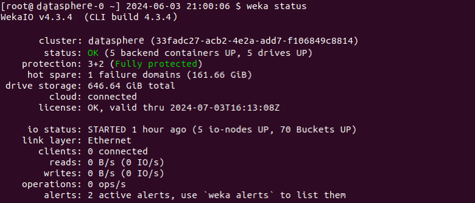
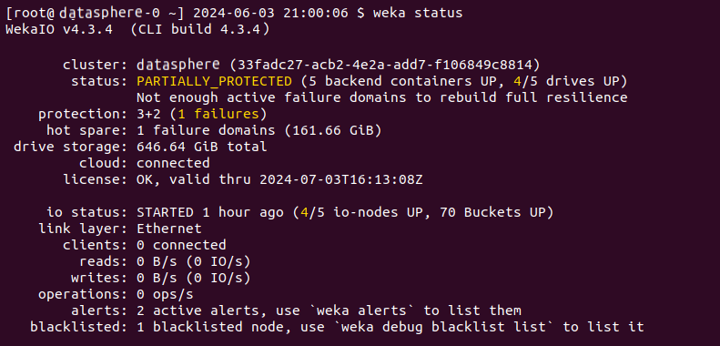
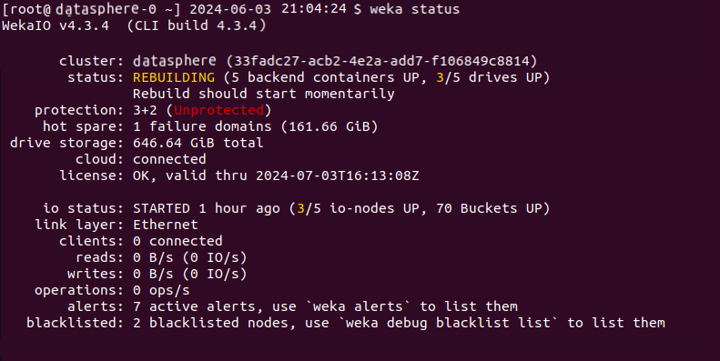
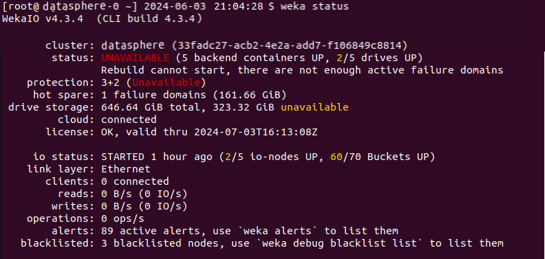

# Manage the system using the WEKA CLI

The WEKA CLI is installed on each WEKA server and is available through the `weka` command. It's possible to connect to any of the servers using `ssh` and running the `weka` command. The `weka` command displays a list of all top-level commands.

## Top-level commands

The WEKA CLI is installed on each WEKA server and is available through the `weka` command. Running this command displays a list of all top-level commands:

```
$ weka -h
Usage:
    weka [--color color] [--help] [--build] [--version] [--legal]

Description:
    The base command for all weka related CLIs

Subcommands:
   access-group      Commands that manage the cluster access-groups
   agent             Commands that control the weka agent (outside the weka containers)
   alerts            List alerts in the Weka cluster
   cloud             Cloud commands. List the cluster's cloud status if no subcommand is supplied.
   cluster           Commands that manage the cluster
   diags             Diagnostics commands to help understand the status of the cluster and its environment
   events            List all events that conform to the filter criteria
   fs                List filesystems defined in this Weka cluster
   interface-group   List interface groups
   local             Commands that control Weka and its containers on the local machine
   mount             Mounts a wekafs filesystem. This is the helper utility installed at /sbin/mount.wekafs.
   nfs               Commands that manage client groups, permissions, and interface groups
   org               List organizations defined in the Weka cluster
   s3                Commands that manage Weka's S3 container
   security          Security commands.
   smb               Commands that manage Weka's SMB container
   stats             List all statistics that conform to the filter criteria
   status            Get an overall status of the Weka cluster
   umount            Unmounts wekafs filesystems. This is the helper utility installed at /sbin/umount.wekafs.
   upgrade           Commands that control the upgrade procedure of Weka
   user              List users defined in the Weka cluster
   version           When run without arguments, lists the versions available on this machine. Subcommands allow for
                     downloading versions, setting the current version, and other actions to manage versions.

Options:
   --agent         Start the agent service
   --color         Specify whether to use color in output (format: 'auto', 'disabled' or 'enabled')
   -h, --help      Show help message
   --build         Prints the CLI build number and exits
   -v, --version   Prints the CLI version and exits
   --legal         Prints software license information and exits 

```

The options that are common to many commands include:

<table><thead><tr><th width="260.17695965807206">Option</th><th>Description</th></tr></thead><tbody><tr><td><code>-J|--json</code></td><td>Prints the raw JSON value returned by the cluster.</td></tr><tr><td><code>-H|--hostname</code></td><td>Directs the CLI to communicate with the cluster through the specified hostname or IP.</td></tr><tr><td><code>--raw-units</code></td><td>Sets the units such as capacity and bytes to be printed in their raw format, as returned by the cluster.</td></tr><tr><td><code>--UTC</code></td><td>Sets the timestamps to be printed in UTC timezone, instead of the local time of the server running the CLI command.</td></tr><tr><td><code>-f|--format</code></td><td>Specifies the format to output the result (view, csv, markdown, or JSON).</td></tr><tr><td><code>-o|--output</code></td><td>Specifies the columns to include in the output.</td></tr><tr><td><code>-s|--sort</code></td><td>Specifies the order to sort the output. May include a '+' or '-' before the column name to sort by ascending or descending order.</td></tr><tr><td><code>-F| --filter</code></td><td>Specifies the filter values for a member (without forcing it to be in the output).</td></tr><tr><td><code>--no-header</code></td><td>Indicates that the column header should not be shown when printing the output.</td></tr><tr><td><code>-C|--CONNECT-TIMEOUT</code></td><td>Modifies the default timeout used for connecting to the system via the JRPC protocol.</td></tr><tr><td><code>-T|--TIMEOUT</code></td><td>Modifies the default timeout for which the commands wait for a response before giving up.</td></tr><tr><td><code>--color</code></td><td><p>Controls the usage of color in the outputs. Possible values: <code>enabled</code>, <code>disabled</code>, or <code>auto</code><strong>.</strong></p><p><strong>Default:</strong> <code>auto</code>. It automatically determines whether to enable color based on the output destination. If the output is a terminal that supports color, it is enabled; otherwise, it is disabled.</p></td></tr></tbody></table>


Throughout the documentation, the CLI mandatory parameters are marked with an asterisk (\*).&#x20;


## Commands hierarchy

Most WEKA system top-level commands are the default list command for their own collection. Additional sub-commands may be available under them.

**Example:** The `weka fs` command displays a list of all filesystems and is also the top-level command for all filesystems, filesystem groups, and snapshot-related operations. It is possible to use the `-h`/`--help` flags or the `help` command to display a list of available commands at each level, as shown below:


```
$ weka fs
| FileSystem | Name    | Group   | SSD Bu | Total  | Is re | Is creat | Is remov 
|  ID        |         |         | dget   | Budget | ady   | ing      | ing      
+------------+---------+---------+--------+--------+-------+----------+----------
| FSId: 0    | default | default | 57 GiB | 57 GiB | True  | False    | False
```


```
$ weka fs -h
Usage:
    weka fs [--name name]
            [--HOST HOST]
            [--PORT PORT]
            [--CONNECT-TIMEOUT CONNECT-TIMEOUT]
            [--TIMEOUT TIMEOUT]
            [--format format]
            [--output output]...
            [--sort sort]...
            [--filter filter]...
            [--capacities]
            [--force-fresh]
            [--help]
            [--raw-units]
            [--UTC]
            [--no-header]
            [--verbose]

Description:
    List filesystems defined in this Weka cluster

Subcommands:
   create     Create a filesystem
   download   Download a filesystem from object store
   update     Update a filesystem
   delete     Delete a filesystem
   restore    Restore filesystem content from a snapshot
   quota      Commands used to control directory quotas
   group      List filesystem groups
   snapshot   List snapshots
   tier       Show object store connectivity for each node in the cluster
   reserve    Thin provisioning reserve for organizations

Options:
   --name                  Filesystem name
   -H, --HOST              Specify the host. Alternatively, use the WEKA_HOST env variable
   -P, --PORT              Specify the port. Alternatively, use the WEKA_PORT env variable
   -C, --CONNECT-TIMEOUT   Timeout for connecting to cluster, default: 10 secs (format: 3s, 2h, 4m, 1d, 1d5h, 1w,
                           infinite/unlimited)
   -T, --TIMEOUT           Timeout to wait for response, default: 1 minute (format: 3s, 2h, 4m, 1d, 1d5h, 1w,
                           infinite/unlimited)
   -f, --format            Specify in what format to output the result. Available options are:
                           view|csv|markdown|json|oldview (format: 'view', 'csv', 'markdown', 'json' or 'oldview')
   -o, --output            Specify which columns to output. May include any of the following:
                           uid, id, name, group, usedSSD, usedSSDD, usedSSDM, freeSSD, availableSSDM, availableSSD, usedTotal, usedTotalD, freeTotal, availableTotal, maxFiles, status, encrypted, stores, auth, thinProvisioned, thinProvisioningMinSSDBugdet, thinProvisioningMaxSSDBugdet, usedSSDWD, usedSSDRD
   -s, --sort              Specify which column(s) to consider when sorting the output. May include a '+' or
                           '-' before the column name to sort in ascending or descending order respectively. Usage:
                           [+|-]column1[,[+|-]column2[,..]]
   -F, --filter            Specify what values to filter by in a specific column. Usage:
                           column1=val1[,column2=val2[,..]]
   --capacities            Display all capacity columns
   --force-fresh           Refresh the capacities to make sure they are the most updated
   -h, --help              Show help message
   -R, --raw-units         Print values in raw units (bytes, seconds, etc.). When not set, sizes are printed in
                           human-readable format, e.g. 1KiB 234MiB 2GiB.
   -U, --UTC               Print times in UTC. When not set, times are converted to the local time of this host.
   --no-header             Don't show column headers when printing the output
   -v, --verbose           Show all columns in the output

```

## Connect to another server

Most WEKA system commands deliver the same result on all cluster servers. However, it is sometimes necessary to run a command on a specific server. To do this, use the `-H/--hostname` option and specify the hostname or IP address of the target server.

## CLI auto-completion

Using `bash` you can use auto-completion for CLI commands and parameters. The auto-completion script is automatically installed.

To disable the auto-completion script, run `weka agent autocomplete uninstall`

To (re-)install the script on a server, run `weka agent autocomplete install` and re-enter your shell session.

You can also use `weka agent autocomplete export` to get the bash completions script and write it to any desired location.

## WEKA CLI command output colors

The `weka status` command and various commands that return tables, such as `weka cluster buckets`, support colored output by default when executed in a terminal (tty). You can control the use of colors with the `--color` option or the `WEKA_CLI_COLOR` environment variable.

Colors are used sparingly and consistently to indicate status:

* Green: Indicates that the status is OK.
* Yellow: Represents a warning or a transient state, such as initializing or rebuilding.
* Red: Indicates an error or an issue that needs attention.


Colors are only used when formatting in "human" formats (such as plain text). They are not applied when the output is in machine-readable formats such as JSON, CSV, or Markdown.


### `--color` option usage

The `--color` option controls the usage of color in the outputs. It expects one of the following values:

* **enabled**: Forces color output to be enabled, regardless of the output destination.
* **disabled**: Disables color output entirely.
* **auto**: Automatically determines whether to enable color based on the output destination. If the output is a terminal that supports color, it is enabled; otherwise, it is disabled. The **Default:** `auto`

When the `auto` value is selected, the [`NO_COLOR`](#user-content-fn-1)[^1] environment variable is also respected. If `NO_COLOR` is set in the environment, color output is disabled, regardless of the output destination.

### `WEKA_CLI_COLOR` environment variable usage

This environment variable can set the color output with the same possible values as the `--color` parameter (`enabled`, `disabled`, `auto`). However, if the `--color` parameter is specified, it overrides the `WEKA_CLI_COLOR` environment variable.

## Cluster status

The `weka status` command displays the overall status of the WEKA cluster.

Examples:



<figure><figcaption></figcaption></figure>



<figure><figcaption></figcaption></figure>



<figure><figcaption></figcaption></figure>



<figure><figcaption></figcaption></figure>



[^1]: The `NO_COLO`R environment variable is a  indicates that command-line applications should not produce any colored output. This is useful for users who prefer or require plain text output, such as in scripts or when using terminal environments that do not support colored text.
