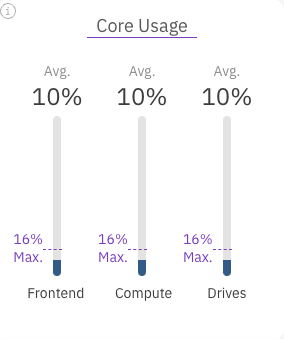
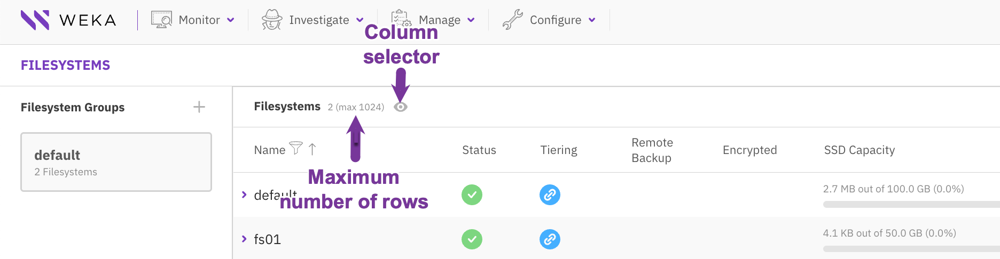

# Manage the system using the Weka GUI

## Weka GUI overview

Weka GUI application is the administration tool for your Weka system. Use this tool for system configuration, filesystems management, user management, and investigation of alarms, events, and statistics.

Weka GUI application supports the following functions:

* **Configuration**:
  * Configure the cluster, such as data availability, license, security, and central monitoring.
  * Configure the backend containers and expose the data in different protocols.
  * Manage local users and set up the user directory.
  * Create and manage organizations and their quotas.
* **Management**:
  * Manage the filesystems, including tiering, thin provisioning, and encryption.
  * Manage snapshots.
  * Manage the object store buckets.
  * Manage the filesystem protocols: SMB, S3, and NFS.
* **Investigation**:
  * Investigate events
  * Investigate overtime statistics, such as total operations, R/W throughput, CPU usage, and read or write latency.
* **Monitoring**:
  * View the cluster protection and availability.
  * View the R/W throughput
  * View the backend and client top consumers.
  * View alarms.
  * View the used, provisioned, and total capacity.
  * View the frontend, compute, and drive cores usage.
  * View the hardware components (active/total).

## Access the Weka GUI

Weka GUI is a web application that you can access using an already configured account and has the appropriate rights to configure, administer, or view.

You can access the Weka GUI with any standard browser using the address:\
`https://<weka system or server name>:14000`

For example: `https://WekaProd:14000` or `https://weka01:14000`.


On AWS installations, you can access the Weka GUI from the self-service portal. In the **Outputs** tab of the **CloudFormation** stack, click the **GUI** link.


**Before you begin**

Make sure that port 14000 is open in the firewall of your organization.

**Procedure**

1. In your browser, go to `https://<weka system or server name>:14000`.\
   \`\`The sign-in page opens.

.png>)

2\. Sign in with the username and password of an account with cluster administration or\
organization administration privileges. For details about the account types, see\
_User management_ in the related topics.

The system dashboard opens.


The initial default username and password are _admin_ and _admin_[.](../usage/user-management/) In the first sign-in, Weka GUI enforces changing the admin password.


**Related topics**

[user-management](../usage/user-management/ "mention")

## System Dashboard

The system dashboard contains widgets that provide an overview of the Weka system, including an overall status, R/W throughput, top consumers, alerts, capacity, core usage, and hardware.

The system dashboard opens by default when you sign in. If you select another menu and want to display the dashboard again, select **Monitor > System Dashboard**, or click the **WEKA** logo.

### Cluster Protection and Availability widget

This widget shows the overall status of the system's health and protection.

The overall status widget includes the following indications:

* **Service Uptime**: The elapsed time since the I/O services started.
* **Data Protection**: The number of data drives and protection parity drives. The color of the protection parity drives indicates their status.
* **Virtual (Hot) Spares**: The number of failure domains the system can lose and still complete the data rebuild while maintaining the same net capacity.

### R/W Throughput widget

This widget shows the current performance statistics aggregated across the cluster.

The R/W Throughput widget includes the following indications:

* **Throughput**: The total throughput.
* **Total Ops**: The number of cluster operations.
* **Latency**: The average latency of R/W operations.
* **Active clients**: The number of clients connected to the cluster.


Selecting one of the R/W Throughput, Latency, and Total Ops titles displays the statistics page.

Selecting the Active clients title displays the clients tab.


### Top Consumers widget

This widget shows the top 5 backend servers and clients in the system. You can sort the list of servers by total IO operations per second or total throughput.

### Alerts widget

This widget shows the alerts that are not muted.

### Capacity widget

This widget shows an overview of the managed capacity.

The top bar indicates the total capacity provisioned for all filesystems and the used capacity. For tiered filesystems, the total capacity also includes the Object Store part.

The bottom bar indicates the total SSD capacity available in the system, the provisioned capacity, and the used capacity.


Selecting the Capacity title displays the filesystems page.


### Core Usage widget

This widget shows the average usage and the maximum load level of the Frontend, Compute, and Drive cores.

<figure><figcaption>
Core Usage widget
</figcaption></figure>

<figure><figcaption>
Core Usage widget
</figcaption></figure>

### Hardware widget

This widget shows an overview of the hardware components (active/total).

The hardware components include:

* **Backends**: The number of backend servers.
* **Cores**: The number of cores configured for running processes in the backend servers.
* **Drives**: The number of drives.
* **OBS Buckets**: The number of the object store buckets.


Selecting one of the Backends, Cores, or Drives titles displays the **backend servers** page.

Selecting the OBS Buckets title displays the **object store buckets** page.


## Switch the display time

Timestamps in events and statistics are logged internally in UTC. Weka GUI displays the timestamps in local or system time. You can switch between the local and system time.

Switching the display time may be required when the customer, Weka support, and the Weka system are in different time zones. In this situation, the customer and Weka support can switch the display to system time instead of local time so both view the identical timestamps.

**Procedure**

1. On the top bar, point to the timestamp.
2. Depending on the displayed time, select **Switch to System Time** or **Switch to Local Time**.

## Switch the GUI between light and dark modes

You can switch the GUI between light and dark modes according to your preferences. The dark mode is a user interface for content that displays light text on a dark background. The dark mode is beneficial for viewing screens at night. The reduced brightness can reduce eye strain in low-light conditions.

**Procedure**

1. Depending on the current display mode, point to the sun or moon symbol on the top bar.
2. Select **Switch to the light mode** or **Switch to dark mode**.

## Display servers in 3D view

You can switch the view of the servers to 3D for the backend servers, NFS servers, S3 servers, and SMB servers.

The 3D view provides the server components' status at a glance, including the drives, cores, protocols, and load. The colors indicate, for example, if the drives or processes failed or the container is down.

<figure><figcaption>
Display servers in 3D view
</figcaption></figure>

## Display tables

When managing filesystems, snapshots, and object stores, the displayed tables listing the rows have two behaviors in common.

* The table title also specifies the table's number of rows and the maximum number of rows the table can display.
* You can customize the columns displayed on the table using the column selector.

<figure><figcaption>
Example: Display the filesystems table
</figcaption></figure>

**Related topics**

[statistics](../usage/statistics/ "mention")

[events](../usage/events/ "mention")

[alerts](../usage/alerts/ "mention")

[nfs-support](../additional-protocols/nfs-support/ "mention")

[smb-management-using-the-gui.md](../additional-protocols/smb-support/smb-management-using-the-gui.md "mention")

[external-monitoring.md](../appendix/external-monitoring.md "mention")
