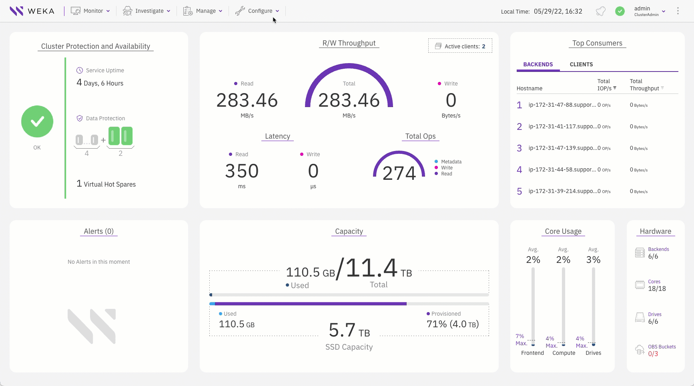
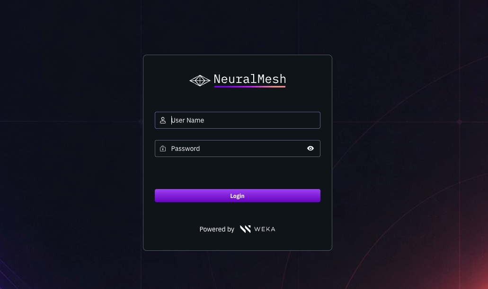
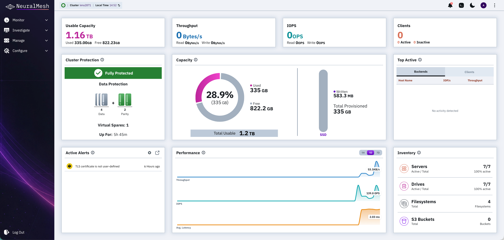
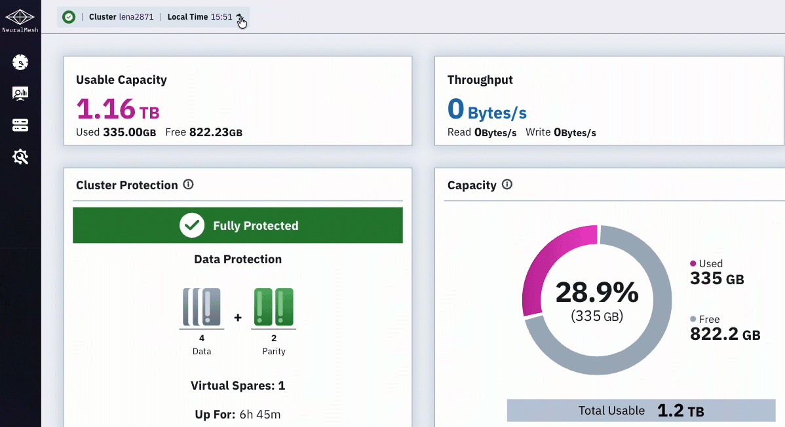
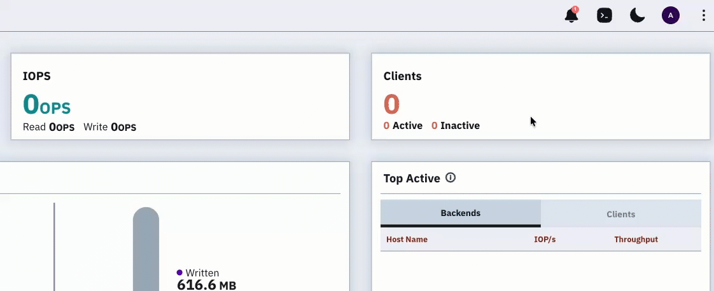
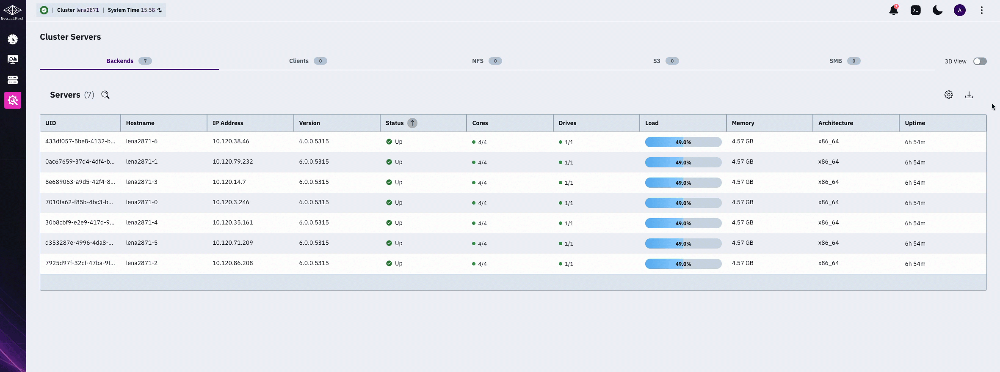
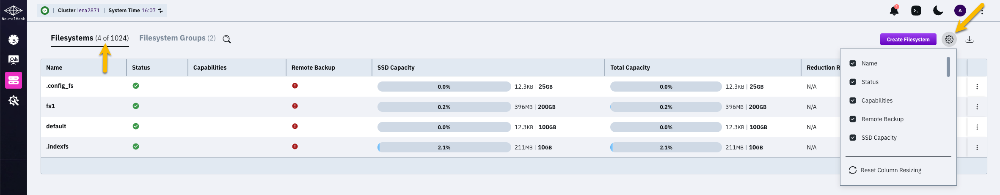
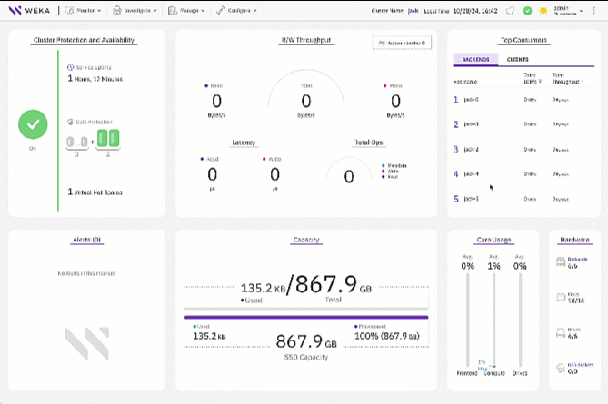

# Manage the system using the GUI

## WEKA GUI overview

The NeuralMesh GUI application is the administration tool for your NeuralMesh system. Use this tool for system configuration, filesystems management, user management, and investigation of alarms, events, and statistics.

The GUI application supports the following functions:

* **Configuration**:
  * Configure the cluster, such as data availability, license, security, and central monitoring.
  * Configure the backend containers and expose the data in different protocols.
  * Manage local users and set up the user directory.
  * Create and manage organizations and their quotas.
* **Management**:
  * Manage the filesystems, including tiering, thin provisioning, and encryption.
  * Manage snapshots.
  * Manage the object store buckets.
  * Manage the filesystem protocols: SMB, S3, and NFS.
  * Manage directory quotas.
* **Investigation**:
  * Investigate events.
  * Investigate overtime statistics, such as total operations, R/W throughput, CPU usage, and read or write latency.
* **Monitoring**:
  * View the cluster protection and availability.
  * View the R/W throughput.
  * View the backend and client top consumers.
  * View alarms.
  * View the used, provisioned, and total capacity.
  * View the frontend, compute, and drive cores usage.
  * View the hardware components (active/total).

## Access the GUI

The NeuralMesh GUI is a web application you can access using an already configured account and has the appropriate rights to configure, administer, or view.

**Before you begin**

Make sure that port 14000 is open in the firewall of your organization.

**Procedure**

1. In your browser, go to `https://<NeuralMesh system or server name>:14000`.\
   The sign-in page opens.

2. Sign in with the username and password of an account with cluster administration or\
   organization administration privileges. For details about the account types, see [user-management](../operation-guide/user-management/ "mention").\
   The system dashboard opens.


The initial default username and password are _admin_ and _admin_[.](../operation-guide/user-management/) In the first sign-in, NeuralMesh enforces changing the admin password.


**Related topics**

[user-management](../operation-guide/user-management/ "mention")

## System Dashboard

The system dashboard contains widgets that provide an overview of the WEKA system, including an overall status, R/W throughput, top consumers, alerts, capacity, core usage, and hardware.

The system dashboard opens by default when you sign in. If you select another menu and want to display the dashboard again, select the **NeuralMesh** logo.

### Cluster Protection and Availability widget

This widget shows the overall status of the system's health and protection state.

The overall status widget includes the following indications:

* **Protection state:** The possible protection states include:
  * OK: The system operates properly.
  * UNKNOWN: The protection state is unknown.
  * UNINITIALIZED: The system still needs to complete the cluster configuration and run the first IOs.
  * REBUILDING: When a failure occurs, the data rebuild process reads all the stripes where the failure occurred, rebuilds the data, and returns the system to full protection.
  * PARTIALLY\_PROTECTED: Some or all of the data is not fully protected. The reported number of protections indicates the cluster's failure resilience.
  * UNPROTECTED: The data is not protected against any failure.
  * UNAVAILABLE: Too many parallel failures occur in the system that can cause system unavailability.
  * REDISTRIBUTING: The system redistributes the data between servers and drives due to scale-up or scale-down.
* **Service Uptime**: The elapsed time since the I/O services started.
* **Data Protection**: The number of data drives and protection parity drives. The color of the protection parity drives indicates their status.
* **Virtual (Hot) Spares**: The number of failure domains the system can lose and still complete the data rebuild while maintaining the same net capacity.

### R/W Throughput widget

This widget shows the current performance statistics aggregated across the cluster.

The R/W Throughput widget includes the following indications:

* **Throughput**: The total throughput.
* **Total Ops**: The number of cluster operations.
* **Latency**: The average latency of R/W operations.
* **Active clients**: The number of clients connected to the cluster.


Selecting one of the R/W Throughput, Latency, and Total Ops titles displays the statistics page.

Selecting the Active clients title displays the clients tab.


### Top Consumers widget

This widget shows the top 5 backend servers and clients in the system. You can sort the list of servers by total IO operations per second or total throughput.

### Alerts widget

This widget shows the alerts that are not muted.

### Capacity widget

This widget shows an overview of the managed capacity.

The top bar indicates the total capacity provisioned for all filesystems and the used capacity. For tiered filesystems, the total capacity also includes the Object Store part.

The bottom bar indicates the total SSD capacity available in the system, the provisioned capacity, and the used capacity.


Selecting the Capacity title displays the filesystems page.


### Core Usage widget

This widget shows the average usage and the maximum load level of the Frontend, Compute, and Drive cores. Hovering the maximum value displays the most active server and the NodeID number.

### Hardware widget

This widget shows an overview of the hardware components (active/total).

The hardware components include:

* **Backends**: The number of backend servers.
* **Cores**: The number of cores configured for running processes in the backend servers.
* **Drives**: The number of drives.
* **OBS Buckets**: The number of the object store buckets.


Selecting one of the Backends, Cores, or Drives titles displays the **backend servers** page.

Selecting the OBS Buckets title displays the **object store buckets** page.


## Switch the display time

Timestamps in events and statistics are logged internally in UTC. The GUI displays the timestamps in local or system time. You can switch between the local and system time.

Switching the display time may be required when the customer, Customer Success Team, and NeuralMesh system are in different time zones. In this situation, the customer and Customer Success Team can switch the display to system time instead of local time so both view the identical timestamps.

**Procedure**

1. On the top bar, point to the timestamp.
2. Depending on the displayed time, select **Switch to System Time** or **Switch to Local Time**.

## Switch the GUI between light and dark modes

You can switch the GUI between light and dark modes according to your preferences. The dark mode is a user interface for content that displays light text on a dark background. The dark mode is beneficial for viewing screens at night. The reduced brightness can reduce eye strain in low-light conditions.

**Procedure**

1. Depending on the current display mode, point to the sun or moon symbol on the top bar.
2. Select **Switch to the light mode** or **Switch to dark mode**.

## Display servers in 3D view

You can switch the view of the servers to 3D for the backend servers, NFS servers, S3 servers, and SMB servers.

The 3D view provides the server components' status at a glance, including the drives, cores, protocols, and load. The colors indicate, for example, if the drives or processes failed or the container is down.

<figure><figcaption>
Display servers in 3D view
</figcaption></figure>

## Display tables

Manage rows and columns in tables such as **Filesystems**, **Snapshots**, and **Object stores**.

Open a page that displays a resource table.

1. Review the row count beside the table title.
2. Select the table settings icon.
3. Select or clear columns to change the table view.

<figure><figcaption>
Example: Display the filesystems table
</figcaption></figure>

## Switch display units between Base 2 and Base 10

Select the unit system used for capacity and performance values.

1. Open the user profile menu.
2.  Select **Base 2 units** for binary units.

    Select **Base 10 units** for decimal units.

The GUI updates capacity sizes and metrics to use your selected unit system.

<figure><figcaption></figcaption></figure>

