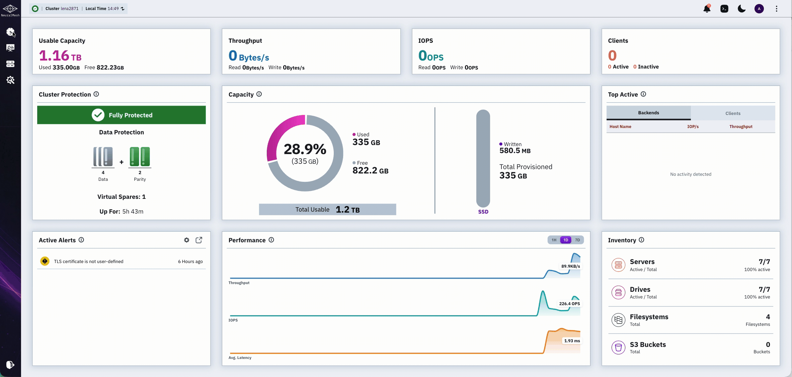

# Manage the system using the GUI

## NeuralMesh GUI overview

The NeuralMesh GUI application is the administration tool for your NeuralMesh system. Use this tool for system configuration, filesystems management, user management, and investigation of alerts, events, and statistics.

<figure><figcaption>
NeuralMesh GUI overview
</figcaption></figure>

### Navigation menu

The navigation menu on the left groups the GUI pages into four sections. Select the arrow next to the NeuralMesh logo to collapse or expand the menu. When the menu is collapsed, point to a section icon to display its pages.

Select **Monitor** or the NeuralMesh logo at any time to return to the system dashboard.

#### Monitor

Display the system dashboard with all its widgets. This is the default view when you sign in.

| Page | Description |
| --- | --- |
| **Background Tasks** | Follow long-running system operations, such as rebuild and redistribution. |

#### Investigate

Analyze the cluster behavior over time.

| Page | Description |
| --- | --- |
| **Events** | Review the system events. |
| **Statistics** | Review overtime statistics, such as total operations, throughput, CPU usage, and read or write latency. |
| **Insights** | Review the system recommendations and detected anomalies. |
| **Filesystem Analytics** | Review the capacity and file distribution across the filesystems. |

#### Manage

Manage the data services of the cluster.

| Page | Description |
| --- | --- |
| **Filesystems** | Manage the filesystems, including tiering, thin provisioning, and encryption. |
| **Snapshots** | Manage snapshots. |
| **Snapshot Policies** | Define schedules that create and delete snapshots automatically. |
| **Object Stores** | Manage the object store buckets. |
| **Protocols** | Manage the filesystem protocols: SMB, S3, and NFS. |
| **Directory Quotas** | Manage directory quotas. |
| **Tenants** | Create and manage tenants and their quotas. |

#### Configure

Set up the cluster and control access to it.

| Page | Description |
| --- | --- |
| **Cluster Settings** | Configure the cluster, such as data availability, license, security, and central monitoring. |
| **Cluster Servers** | Configure the backend containers and expose the data in different protocols. |
| **User Management** | Manage local users, set up the user directory, and assign roles. |

#### Top bar

The top bar displays the cluster status indicator, the cluster name, and the current timestamp. It also provides the following controls:

* **Alerts**: Displays the active alerts. The badge indicates the number of alerts.
* **CLI**: Opens a terminal session to the cluster.
* **Display mode**: Switches the GUI between light and dark modes.
* **User profile**: Displays the account details, the display units, and the sign-out option.
* **More options**: Displays additional GUI settings.

## Access the GUI

The NeuralMesh GUI is a web application you can access using an already configured account that has the appropriate rights to configure, administer, or view.

**Before you begin**

Make sure that port 14000 is open in the firewall of your organization.

**Procedure**

1. Go to `https://<NeuralMesh system or server name>:14000` in your browser.\
   The sign-in page opens.

2. Sign in with the username and password of an account with cluster administration or organization administration privileges. The system dashboard opens.

The initial default username and password are `admin` and `admin`. In the first sign-in, NeuralMesh enforces changing the admin password.

**Related topics**

[user-management](../operation-guide/user-management/ "mention")

## System dashboard

The system dashboard contains widgets that provide an overview of the NeuralMesh system, including capacity, performance, cluster protection, alerts, and inventory.

The system dashboard opens by default when you sign in. If you select another page and want to display the dashboard again, select **Monitor** or the NeuralMesh logo.

Widgets that include an information icon display an explanation of the presented data when you point to the icon.

#### Usable Capacity widget

This widget shows the total capacity available for data, and its split between the used and free capacity.

#### Throughput widget

This widget shows the current aggregated throughput of the cluster, and its split between read and write.

#### IOPS widget

This widget shows the current aggregated operations per second, and their split between read and write.

#### Clients widget

This widget shows the number of clients defined in the cluster, and their split between active and inactive.

#### Cluster Protection widget

This widget shows the health and protection state of the system.

The Cluster Protection widget includes the following indications:

* **Protection state**: The banner shows the current state, such as `Fully Protected`. The possible protection states include:
  * **Fully Protected**: The system operates properly.
  * **Unknown**: The protection state is unknown.
  * **Uninitialized**: The system still needs to complete the cluster configuration and run the first IOs.
  * **Rebuilding**: When a failure occurs, the data rebuild process reads all the stripes where the failure occurred, rebuilds the data, and returns the system to full protection.
  * **Partially Protected**: Some or all of the data is not fully protected. The reported number of protections indicates the cluster's failure resilience.
  * **Unprotected**: The data is not protected against any failure.
  * **Unavailable**: Too many parallel failures occur in the system that can cause system unavailability.
  * **Redistributing**: The system redistributes the data between servers and drives due to scale-up or scale-down.
* **Data Protection**: The number of data drives and protection parity drives. The color of the protection parity drives indicates their status.
* **Virtual Spares**: The number of failure domains the system can lose and still complete the data rebuild while maintaining the same net capacity.
* **Up For**: The elapsed time since the I/O services started.

#### Capacity widget

This widget shows an overview of the managed capacity.

The chart shows the used and free capacity out of the total usable capacity. For tiered filesystems, the total capacity also includes the object store part.

The SSD bar shows the written capacity out of the total provisioned capacity on the SSDs.

#### Top Active widget

This widget shows the most active backend servers and clients in the system. Select the **Backends** or **Clients** tab to switch between them. For each entry, the widget shows the host name, the operations per second, and the throughput.

#### Active Alerts widget

This widget shows the alerts that are not muted. Select the settings icon to configure which alerts appear, or select the open icon to display the alerts page.

#### Performance widget

This widget shows the throughput, IOPS, and average latency of the cluster over time. Select **1H**, **1D**, or **7D** to change the displayed time range.

#### Inventory widget

This widget shows an overview of the system resources.

| Resource        | Description                                                              |
| --------------- | ------------------------------------------------------------------------ |
| **Servers**     | The number of active backend servers out of the total number of servers. |
| **Drives**      | The number of active drives out of the total number of drives.           |
| **Filesystems** | The total number of filesystems.                                         |
| **S3 Buckets**  | The total number of S3 buckets.                                          |

### Switch the display time

Timestamps in events and statistics are logged internally in UTC. The GUI displays the timestamps in local or system time. You can switch between the local and system time.

Switching the display time may be required when the customer, Customer Success Team, and NeuralMesh system are in different time zones. In this situation, the customer and Customer Success Team can switch the display to system time instead of local time so both view the identical timestamps.

**Procedure**

1. Point to the timestamp on the top bar.
2. Select **Switch to System Time** or **Switch to Local Time**, depending on the displayed time.

### Switch the GUI between light and dark modes

You can switch the GUI between light and dark modes according to your preferences. The dark mode is a user interface for content that displays light text on a dark background. The dark mode is beneficial for viewing screens at night. The reduced brightness can reduce eye strain in low-light conditions.

#### Procedure

1. Point to the sun or moon symbol on the top bar, depending on the current display mode.
2. Select **Switch to the light mode** or **Switch to dark mode**.

## Display servers in 3D view

You can switch the view of the servers to 3D for the backend servers, NFS servers, S3 servers, and SMB servers.

The 3D view provides the server components' status at a glance, including the drives, cores, protocols, and load. The colors indicate, for example, if the drives or processes failed or the container is down.

<figure><figcaption>
Display servers in 3D view
</figcaption></figure>

## Display tables

Manage rows and columns in tables such as Filesystems, Snapshots, and Object Stores.

**Procedure**

1. Open a page that displays a resource table.
2. Review the row count beside the table title.
3. Select the table settings icon.
4. Select or clear columns to change the table view.

<figure><figcaption>
Example: Display the filesystems table
</figcaption></figure>

## Switch display units between Base 2 and Base 10

Select the unit system used for capacity and performance values.

**Procedure**

1. Open the user profile menu on the top bar.
2. Select **Base 2 units** for binary units, or **Base 10 units** for decimal units.

The GUI updates capacity sizes and metrics to use your selected unit system.

<figure><figcaption></figcaption></figure>

