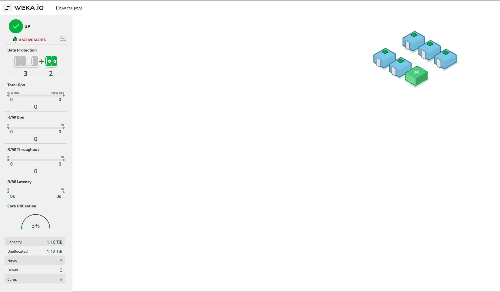
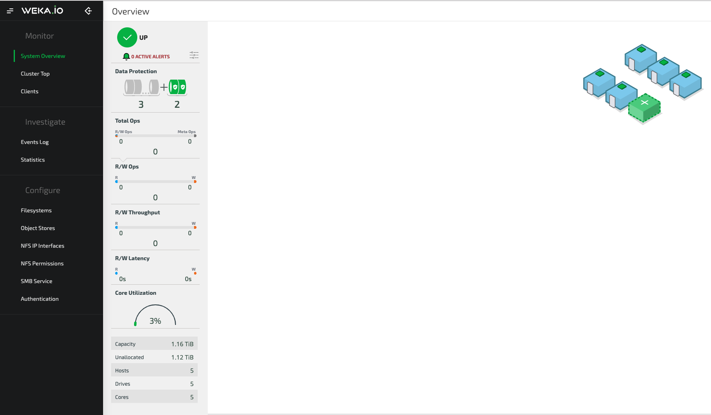

# GUI Overview

The WekaIO GUI is accessible through port 14000. After logging in, the WekaIO dashboard is displayed.

The dashboard enables the viewing of information on the backend host configuration and topology, system alerts and some important statistics.

Clicking the top left button next to the WEKA.IO logo opens a menu bar containing all possible system operations.

From the menu bar, it is possible to view [statistics](../usage/statistics.md) and [events](../usage/events.md), manage [filesystems](../fs/managing-filesystems.md), configure [NFS](../fs/nfs-support.md) and [SMB](../smb-support/smb-management-using-the-gui.md) services and manage system [security](../usage/user-management.md) aspects.

