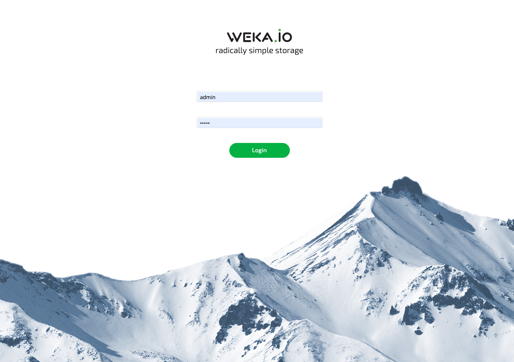

# Managing the WekaIO System

The WekaIO system is now installed. Now let's learn how to view, manage and operate it using either the [CLI](managing-wekaio-system.md#cli) or the [GUI](managing-wekaio-system.md#gui), and [perform the first IO](performing-the-first-io.md) to a WekaFS filesystem.

## CLI

The WekaIO CLI is installed on each WekaIO host and is available through the `weka` command. It's possible to`ssh` one of the hosts and run the `weka` command. This displays a list of all available top-level commands. You can go ahead and explore them.

```text
# weka
Usage:
    weka [<args>...] [options]
    weka --agent

Description:
    Base command for all the weka related CLIs

The available subcommands are:
    status      Weka cluster status
    alerts      List and manage active alerts
    events      Commands for reading events and managing events settings
    stats       Commands for reading system statistics
    cluster     Commands that manage the cluster
    fs          Commands that manage filesystems, snapshots and filesystem-groups
    nfs         Commands that manage client-groups, permissions and interface-groups
    cloud       Cloud commands
    user        Manage users and login
    local       Commands that control weka and its containers on the local machine
    version     Commands that manager the installed weka versions on the host
    agent       Commands that control the weka agent (outside the weka containers)
    smb         Commands for setting up and managing smb shares and users
    diags       Commands for collecting weka-related diagnostics for support
```

For more information about the CLI, refer to [Getting Started with WekaIO CLI](cli-overview.md).

## GUI

The WekaIO GUI is accessible at port 14000. It can be accessed from any host or by using the cluster name. For example: http://weka-host-0:14000 or http://weka-host:14000.


**Note:** If it's not possible to access the GUI, make sure that it has been opened in your firewall, as described in the [Prerequisites](../install/bare-metal/prerequisites-for-installation-of-weka-dedicated-hosts.md) page.




The initial default username/password is _admin/admin,_ as described in [User Management.](../usage/user-management.md) It is recommended to change this. 

For more information about the GUI, refer to [Getting Started with WekaIO GUI](gui.md).

