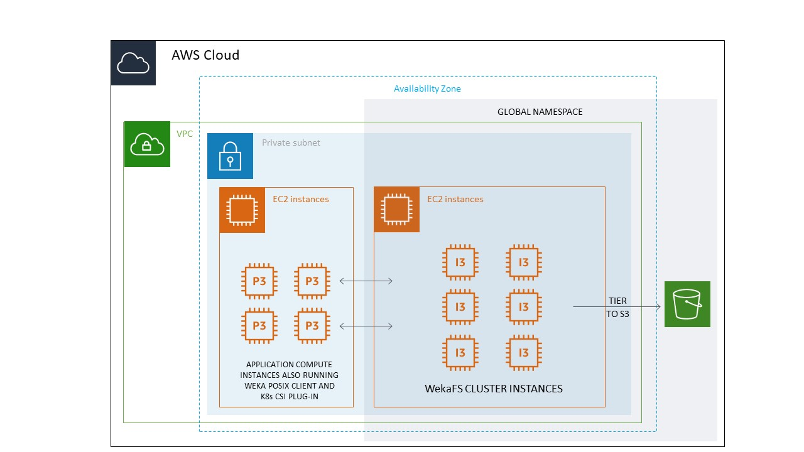

# AWS installation

## Before you begin

If you already have an AWS account and are familiar with AWS's basic concept and services you can skip this section.

To deploy a Weka cluster in AWS, you will need to [create an AWS account](https://aws.amazon.com/account/).  
By default, AWS accounts are not given enough vCPUs to deploy a WEKA cluster.  You can use the Limits calculator for your Region from the EC2 dashboard.  Select the Limits option from the left hand side menu.

You should be familiar with the following concepts and services that will be used as part of the Weka cluster deployment:

* [IAM](https://docs.aws.amazon.com/IAM/latest/UserGuide/introduction.html) - Identity and access management
* [VPCs](https://docs.aws.amazon.com/vpc/latest/userguide/what-is-amazon-vpc.html), [subnets](https://docs.aws.amazon.com/vpc/latest/userguide/VPC\_Subnets.html) and [security groups](https://docs.aws.amazon.com/vpc/latest/userguide/VPC\_SecurityGroups.html)
* [EC2](https://aws.amazon.com/documentation/ec2/) instances and [ssh keys](https://docs.aws.amazon.com/AWSEC2/latest/UserGuide/ec2-key-pairs.html)
* [S3](https://docs.aws.amazon.com/AmazonS3/latest/dev/Introduction.html) - Object storage (to be used for tiering data)&#x20;
* [Cloud Formation](https://aws.amazon.com/documentation/cloudformation/)

The following diagram illustrates the components of deployment in AWS:

## Best practices

### Backup and recovery

#### Resiliency

The Weka system is a distributed cluster protected from 2 or 4 failure domains failures, providing fast rebuild times as described in the [Weka system overview](../../overview/about.md#weka-functionality-features) section.

#### Instance failure

In case of an instance failure, the Weka system will [rebuild](../../overview/about.md#distributed-network-scheme) the data. To regain the reduced compute and storage due to the instance failure to the cluster, [add a new instance to the cluster](../../usage/expanding-and-shrinking-cluster-resources/stages-in-adding-a-backend-host.md).

#### Upload snapshots to S3

It is advisable to use periodic (incremental) snapshots to back up the data and protect it from multiple EC2 instances failures. The recovery point objective (RPO) would be determined by the cadence in which the snapshots are taken and uploaded to S3. The RPO changes between the type of data, regulations, and company policies, but it is advisable to upload at least daily snapshots ([Snap-To-Object](../../fs/snap-to-obj/#about-snap-to-object)) of the critical filesystems.

In case of a failure and a need to recover from a backup, it is just a matter of spinning up a cluster using the [Self-Service Portal](self-service-portal.md) or [CloudFormation](cloudformation.md) and creating filesystems from those snapshots. There is no need to wait for the data to reach the EC2 volumes. It is instantly accessible via S3. The recovery time objective (RTO) for this operation mainly depends on the time it takes to deploy the CloudFormation stack and will typically be below 30 min.

#### Cross AZ failure

Refer to [Protecting Data Against AWS Availability Zone Failures](../../fs/snap-to-obj/#protecting-data-against-aws-availability-zone-failures).

#### Region failure

The use of Weka snapshots uploaded to S3 combined with S3 cross-region replication enables the protection from an AWS region failure.

### SSH keys rotation

For security reasons, it is advisable to rotate the SSH keys used for the EC2 instances.&#x20;

To rotate the SSH keys, follow these steps as described in [Adding or replacing a key pair for your instance](https://docs.aws.amazon.com/AWSEC2/latest/UserGuide/ec2-key-pairs.html#replacing-key-pair) and [How to use AWS Secrets Manager to securely store and rotate SSH key pairs](https://aws.amazon.com/blogs/security/how-to-use-aws-secrets-manager-securely-store-rotate-ssh-key-pairs/).

