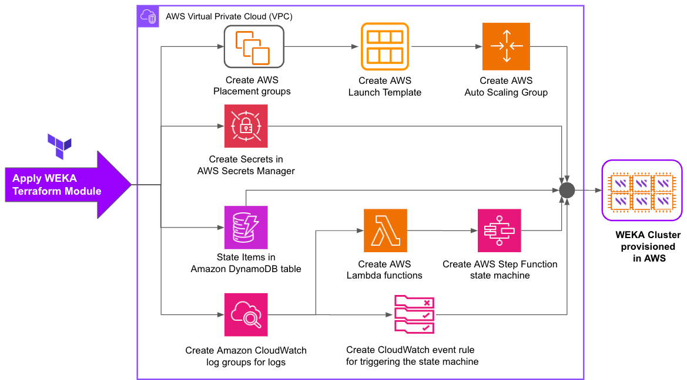

# WEKA installation on AWS using Terraform

WEKA provides a ready-to-deploy Terraform package for installing the WEKA cluster on AWS Virtual Private Cloud (VPC).

The following diagram provides an overview of the various steps automated with the Terraform-driven provisioning of the WEKA cluster backend servers on AWS EC2 instances.&#x20;

<figure><figcaption>
WEKA Terraform module deployment on AWS
</figcaption></figure>

### Workflow description

Create AWS Placement Groups

Create Placement Groups to enhance WEKA system resilience to hardware failures.

<strong>Create AWS Launch Template and Auto Scaling Group for WEKA cluster expansion</strong>

Create an AWS Launch Template and Auto Scaling Group to provision EC2 instances for the WEKA cluster.

The launch template automates the deployment script to install and configure WEKA software during initial cluster creation and expand the cluster with additional instances.

<strong>Configure AWS Secrets Manager for secure WEKA cluster operations</strong>

Create secrets in AWS Secrets Manager to facilitate secure communication between AWS Lambda functions and the WEKA cluster. This ensures smooth scale-out, scale-in, and auto-healing operations.

<strong>Configure DynamoDB for Terraform state</strong>

Create state items in an Amazon DynamoDB table to effectively manage Terraform's declarative state.

<strong>Create CloudWatch log groups for WEKA cluster logs</strong>

Create Amazon CloudWatch log groups to store logs generated by the WEKA cluster.

<strong>Deploy AWS Lambda functions for WEKA software configuration</strong>

Create AWS Lambda functions to run after CloudWatch log groups are created. These functions assist in installing and configuring WEKA software on EC2 instances.

Create <strong>AWS Step Function for WEKA cluster scaling</strong>

Create an AWS Step Function state machine to facilitate user-driven automated scale-out and scale-in operations for the WEKA cluster.

Create CloudWatch event rule for WEKA cluster monitoring

Create a CloudWatch event rule to periodically check the state of the WEKA cluster and trigger healing or scaling actions as necessary.

