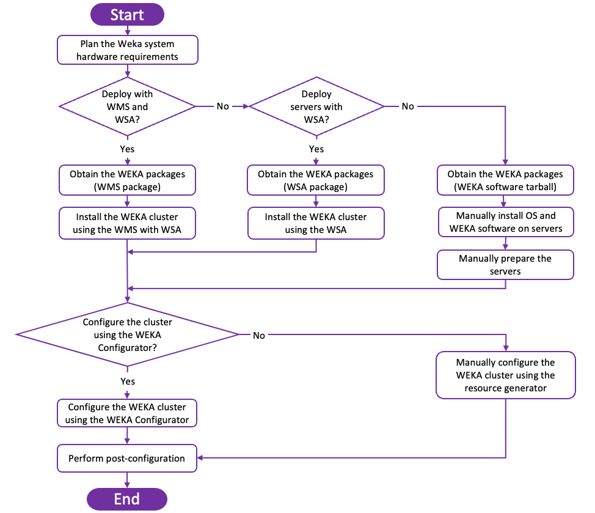
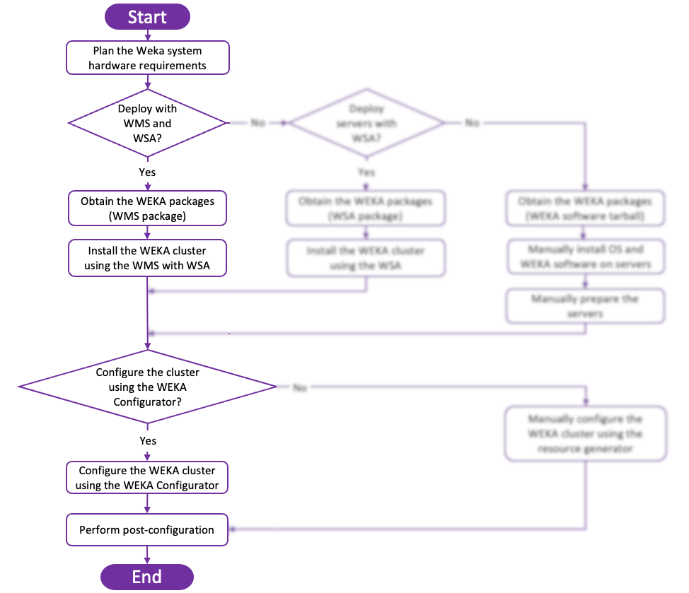
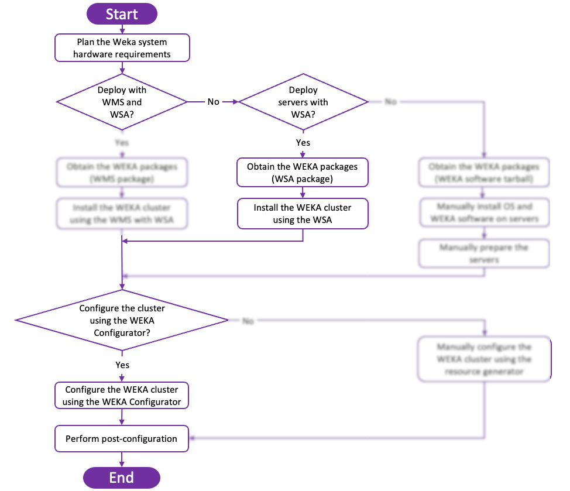
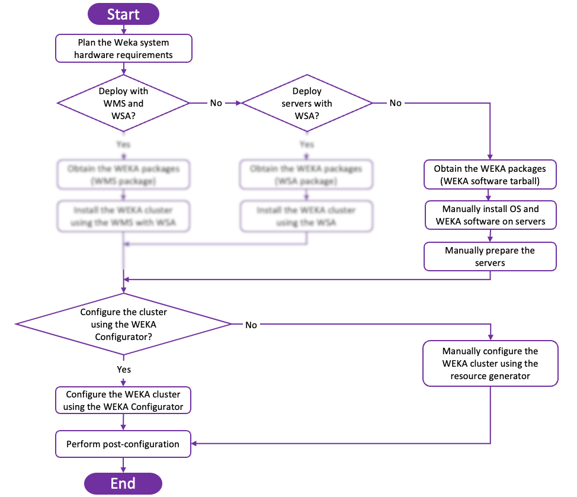

# WEKA cluster installation on bare metal servers

WEKA provides a variety of tools for automating the WEKA software installation process. These include:

* WEKA Management Station (WMS)
* WEKA Software Appliance (WSA)
* WEKA Configurator

### WEKA Management Station (WMS)

WMS can be used to speed the WEKA Software Appliance (WSA) deployment on the supported bare metal servers: HPe, Dell, and Supermicro.

This is the preferred installation method, the simplest and fastest method to get from bare metal to a working WEKA cluster. If you cannot meet the prerequisites for deploying WMS, use the WSA package.

### WEKA Software Appliance (WSA)

WSA is a WEKA server image deployed with a preconfigured operating system. This method significantly speeds up the OS and WEKA cluster installation and provides a WEKA-supported operating environment.

After installation, the server is in **STEM** mode, which is the initial state before the configuration.

If you cannot use the WSA for WEKA cluster installation, review the requirements and follow the instructions for deploying WEKA using the WEKA Configurator.

### WEKA Configurator

The WEKA Configurator automatically generates the WEKA Cluster configurations (`config.sh`) to apply on the cluster servers.

## High-level deployment workflow

The following illustrates a high-level deployment workflow on a group of bare metal servers.

<figure><figcaption>
High-level deployment workflow
</figcaption></figure>

### Deployment workflow paths summary

The following summarizes the three workflow paths to install and configure the WEKA cluster.

* **Path A:** Automated with WMS and WSA
* **Path B:** Automated with WSA only
* **Path C:** Manual installation and configuration

Select the path applicable to your needs.



This method is the most preferable option to install the WEKA cluster assuming the prerequisites are met. For example, the bare metal servers are HPe, Dell, or Supermicro, the OS (Rocky 8.6) meets your needs, and a physical server is available for installing the WMS.

<figure><figcaption>
Path A
</figcaption></figure>



If the OS (Rocky 8.6) meets your needs but the bare-metal servers are not HPe, Dell, or Supermicro, this is the second preferred option to install and configure the WEKA cluster.\

<figure><figcaption>
Path B
</figcaption></figure>



Manually install and configure the WEKA cluster if:

* The bare metal servers are not HPe, Dell, or Supermicro, or
* You want to use a different OS than Rocky 8.6, or
* You need special customization, where you cannot use the WEKA Configurator.


The manual installation workflow requires deep level of knowledge with WEKA architecture. Visit [WEKA U](https://learnweka.weka.io/learn/signin) for training materials (requires sign-in).


<figure><figcaption>
Path C
</figcaption></figure>



Frequently asked questions

1. What is the root password? Is this configurable, and can it be encrypted?
   * `WekaService`. It is encrypted in the kickstart file.
2. Can we choose the number of cores and containers to use?
   * Yes. During post-install configuration. See [Configure a WEKA cluster with the WEKA Configurator](./#2.-configure-a-weka-cluster-with-the-weka-configurator).
3. Will the ISO setup mirror RAID on the dual-boot SSDs?
   * Yes, automatically.
4. Can I set up WEKA with 8 SSD per node even though I have 12 installed?
   * Not automatically. Pull the drives or manually adjust the configuration before running it (edit the `config.sh` output from `wekaconfig`).
5. What must be done to direct the ISO to set up for High Availability (HA)? How about no HA?
   * That’s determined in `wekaconfig.`
6. If there are multiple NIC cards (for WEKA and Ceph), how to choose the NICs to use for the WEKA backend server?
   * The WSA is not intended for that configuration directly. However, if you make them different subnets or networks, you can select the subnet to use. one, the other, or both.
7. With the ISO, are there different processes for licensing? Or is it the standard get cluster GUID and storage size and input it into the Weka webpage to get a license key and then input that key on the command prompt?
   * Licensing has not changed.
8. Does the ISO set up the IP address for Admin or the high-speed WEKA backend network?
   * The WMS will do that when it deploys the WSA.
9. What needs to be passed in to configure Ethernet or Infiniband?
   * Select the network type from the list in WMS.
10. Can all the parameters the ISO needs be in the script?
    * No. We use Ansible after installation to make the settings.
11. How to use the kickstart file in the ISO?
    * Use the WMS. The kicksdstart file is written to work with WMS.
12. What additional settings must be configured on WEKA after the ISO installation?
    * There are no required settings that need to be manually set if you use the WMS.

## What do do next?

[planning-a-weka-system-installation.md](planning-a-weka-system-installation.md "mention") (all paths)
