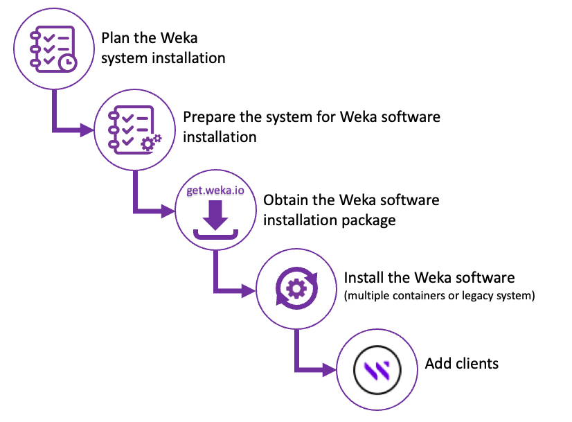

# Weka installation on bare metal

The following illustrates the weka system installation process in a bare metal environment. See the details in the following sections.

<figure><figcaption>
Weka installation process on the bare metal environment
</figcaption></figure>


**Note:** The following topics are related to the installation of a homogeneous Weka system configuration, which is highly recommended. For installation of a non-homogeneous configuration, contact the [Customer Success Team](../../support/getting-support-for-your-weka-system.md#contact-customer-success-team).

