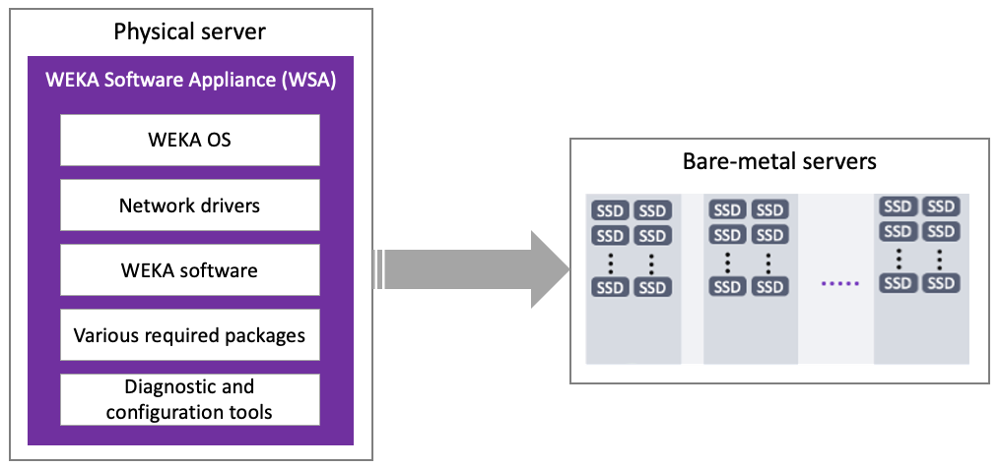
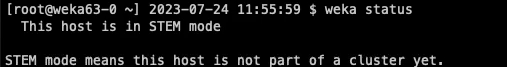

# Install the WEKA cluster using the WSA

WSA is a package consisting of a base version of Linux (based on Rocky 8.6), network drivers and other required packages, WEKA software, and various diagnostic and configuration tools. Using the WSA facilitates the post-installation administration, security, and other KB updates controlled and distributed by WEKA, following a Long Term Support (LTS) plan.

The WSA generally works like any OS install disk (Linux/Windows).

<figure><figcaption>
WEKA cluster installation using the WSA
</figcaption></figure>

## WSA deployment prerequisites

A physical server that meets the following requirements:

* **Boot drives:** One or two identical boot drives as an installation target.
  * A system with two identical boot drives has the OS installed on mirrored partitions (LVM).
  * A system with one drive has a simple partition.
* **Minimum boot drive capacity:** 125 GB (to support the pre-defined disk partition map).
* **Boot type:** UEFI.

## Before you begin

Before deploying the WSA, adhere to the following:

* Download the latest WSA package from [https://weka-repo.s3.amazonaws.com/weka-4.2.1-1.0.1.iso](https://weka-repo.s3.amazonaws.com/weka-4.2.1-1.0.1.iso).
* The root password is `WekaService`
* The WEKA user password is `weka.io123`
* If errors occur during installation and the installation halts (no error messages appear), use the system console to review the logs in `/tmp`. The primary log is `/tmp/ks-pre.log`.
* To get a command prompt from the Installation GUI, do one of the following:
  * On macOS, type **ctrl+option+f2**&#x20;
  * On Windows, type **ctrl+alt+f2**.

## WSA deployment workflow

1. [Install the WSA](install-the-weka-cluster-using-the-wsa.md#1.-install-the-wsa)
2. [Configure the WSA](install-the-weka-cluster-using-the-wsa.md#2.-configure-the-wsa)
3. [Test the environment](install-the-weka-cluster-using-the-wsa.md#3.-test-the-environment)
4. [Validate the WEKA software installation](install-the-weka-cluster-using-the-wsa.md#4.-validate-the-weka-software-installation)

### 1. Install the WSA

1. Boot the server from the WSA image. The following are some options to do that:



Copy the WSA image to an appropriate location so that the server’s BMC can mount it to a virtual CDROM/DVD.

Depending on the server manufacturer, consult the documentation for the server’s BMC (for example, iLO, iDRAC, and IPMI) for detailed instructions on mounting and booting from a bootable WSA image, such as:

* A workstation or laptop sent to the BMC through the web browser.
* Ann SMB share in a Windows server or a Samba server.
* An NFS share.&#x20;



Burn the WSA image to a DVD or USB stick and boot the server from this physical media.



Once you boot the server, the WSA installs the WEKA OS, drivers, WEKA software. and other packages automatically and unattended (no human interaction required).

Depending on network speed, this can take about 10-60 mins (or more) per server.

<figure><figcaption></figcaption></figure>

### 2. Configure the WSA

Once the WSA installation is complete and the server is rebooted, configure the WSA.


Normally, the WEKA Software Appliance is deployed with the help of the WEKA Management Station (WMS), which can be used to complete the configuration of the servers.

However, if not deployed with the WMS, configure the WEKA cluster manually according to the following steps.


1. Log-in to the server using one of the following methods:

* BMC's Console
* Cockpit web interface on port 9090

Username/password: `root`/`WekaService`.



Run the OS through the BMC’s Console. See the specific manufacturer’s BMC documentation.



Run the OS through the Cockpit Web Interface on port 9090 of the OS management network.

If you don’t know the WSA hostname or IP address, go to the console and press the **Return** key a couple of times until it prompts the URL of the WSA OS Web Console (Cockpit) on port 9090.



When the server boots for the first time, the WSA automatically installs the WEKA software on the bare metal servers unattended.

Then the server reboots, it runs with WEKA in STEM mode.

2. Set the following networking details:
   * Hostname
   * IP addresses for network interfaces, including:
     * Server management interface (typically a 1Gb interface on a management network) if not automatically set via DHCP.
     * Dataplane network interfaces (typically 1 or 2. Can be several up to 8).
   * DNS settings and/or an `/etc/hosts` file.
   * Network gateways and routing table adjustments as necessary.
   * Timeserver configuration.


For detailed instructions on setting the configuration options, see general Linux documentation for RedHat-based Linux Distributions.


### 3. Test the environment

Each server has the WEKA Tools pre-installed in `/opt/tools`, including:

* `wekanetperf`: This tool runs `iperf` between the servers to ensure line rate can be achieved.
* `wekachecker`: This tool checks a variety of network settings and more. For details, see [#validate-the-system-preparation](setting-up-the-hosts/#validate-the-system-preparation "mention").
* `bios_tool`: This tool helps you to set the required BIOS settings on the servers.

### 4. Validate the WEKA software installation

Verify that the WEKA software is installed and running on the server.

Log-in to the server and run the command `weka status`.

The server provides a status report indicating the system is in STEM mode, and is ready for the cluster configuration.

<figure><figcaption>
Example: weka status with STEM mode
</figcaption></figure>

## What to do next?

[configure-the-weka-cluster-using-the-weka-configurator.md](configure-the-weka-cluster-using-the-weka-configurator.md "mention")
