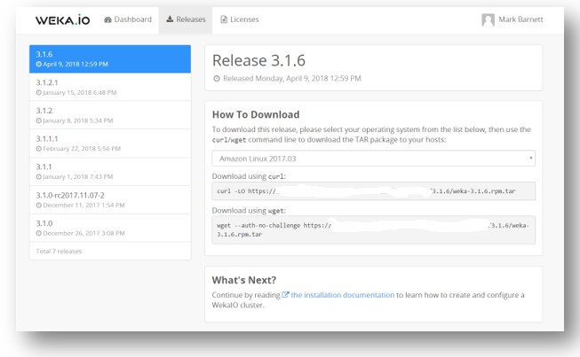
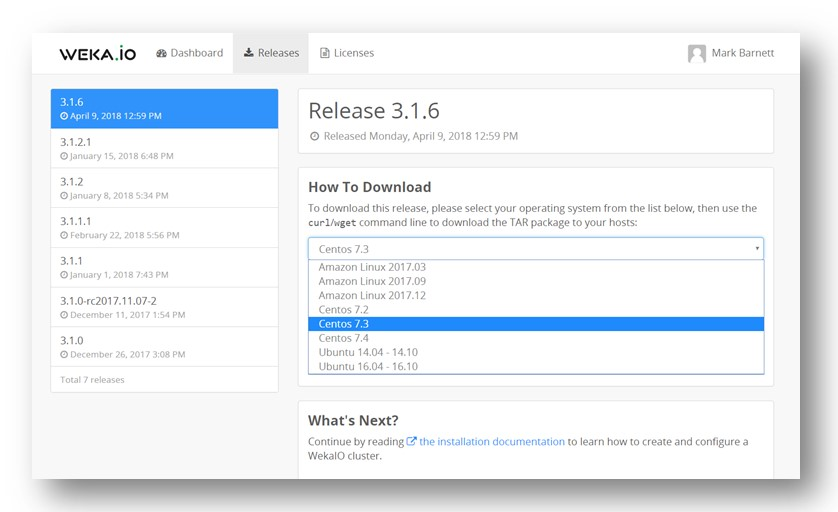

# Obtaining the WekaIO Install File


**Note:** The WekaIO software tar installation file can be obtained either by a direct online download or from offline media containing the file. The following description is of the online download. It is possible to either download the installation file directly to each host, or distribute manually from a single download or offline media to all hosts.



**Note:** The online download process is automatic and requires connection to the Internet.


## Step 1: Log In

Go to the [get.weka.io](https://get.weka.io/ui/dashboard) download site. Log in by entering your email address and password. Then click Continue.

If you do not have an account, click Create an account. The following screen is displayed:

Enter your email address, check the I’m not a robot box \(assuming you're not a robot!\), complete the questions and click Send Registration Email.

You will now receive a registration confirmation email. Click the link in the email. The following screen will be displayed:

Create your account by entering your full name and password. Then click Create Account. The WekaIO dashboard screen will be displayed.

## Step 2: Download the WekaIO Software

To download the latest release, click the Latest Release button.


**Note:** If a previously-released version is required, click the Releases tab and select the release required from the list of releases.


Follow the instructions for downloading the release appearing on the screen.

Select your operating system distribution, which is the operating system for the WekaIO system dedicated hosts, from the dropdown list of systems.

Once an operating system is selected, the details for the download and installation instructions for the selected operating system distribution are displayed. Download the file using the command provided.

