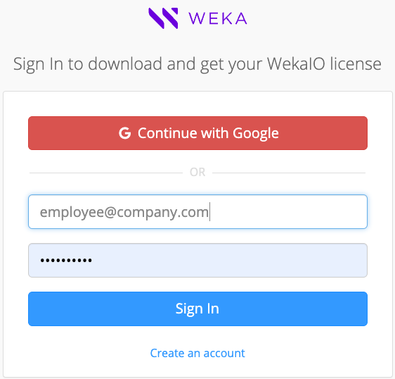

# Obtain the WEKA installation packages

## **Register to get.weka.io**

To sign in to [get.weka.io](http://get.weka.io), you first need to create an account and fill in your details. If you already have a registered account for get.weka.io, skip this procedure.

**Procedure**

1. Go to the [get.weka.io](https://get.weka.io/ui/dashboard) download site, and select **Create an account.**

The Send Registration Email page opens.

2\. Fill in your organization's email address (private mail is prohibited).\
    Select **I’m not a robot**, and then select **Send Registration Email.**

3\. Check your inbox for a registration email from Weka.io. \
    To confirm your registration, select the link.\
    The Create Your Account page opens.

4\. Fill in your email address, full name, and password. Then, select **Create Account**.

Your request for access to [get.weka.io](http://get.weka.io) is sent to WEKA for review. Wait for a validation email. Once your registration is approved, you can sign in to [get.weka.io](http://get.weka.io).

## **Download the** WEKA **installation packages**

Download the required WEKA installation packages according to the workflow path from the [get.weka.io](https://get.weka.io/ui/dashboard) site.

* Path A (automated with WMS and WSA): Download the WMS package.
* Path B (automated with WSA): Download the WSA package.
* Path C (manual installation and configuration): Download the WEKA software tarball.

You can only sign in and download the packages if you are a registered user.

**Procedure**

1. Go to the [get.weka.io](https://get.weka.io/ui/dashboard) download site, and sign in with your registered account.

[get.weka.io](http://get.weka.io) page opens.

2. Do one of the following:
   * Select the required package from the dashboard.
   * Select the **Releases** tab, select the required release, and follow the download instructions.\
     (The token in the download link is purposely blurred.)

## What to do next?

Depending on the workflow path you follow, go to one of the following:

[install-the-weka-cluster-using-the-wms-with-wsa.md](install-the-weka-cluster-using-the-wms-with-wsa.md "mention") (path A)

[install-the-weka-cluster-using-the-wsa.md](install-the-weka-cluster-using-the-wsa.md "mention") (path B)

[manually-install-os-and-weka-on-servers.md](manually-install-os-and-weka-on-servers.md "mention") (path C)
