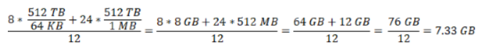

# Planning a WEKA System Installation

The planning of a WEKA system is essential prior to the actual installation process. It involves the planning of the following:

1. Total SSD net capacity and performance requirements
2. SSD resources
3. Memory resources
4. CPU resources
5. Network


**Note:** When implementing an AWS configuration, it is possible to go to the [Self-Service Portal in start.weka.io](../aws/self-service-portal.md) in order to automatically map capacity and performance requirements into various configurations.


## Total SSD Net Capacity and Performance Planning

A WEKA system cluster runs on a group of hosts with local SSDs. To plan these hosts, the following information must be clarified and defined:

1. **Capacity:** Plan your net SSD capacity. Note that data management to object stores can be added after the installation. In the context of the planning stage, only the SSD capacity is required.
2. **Redundancy Scheme:** Define the optimal redundancy scheme required for the WEKA system, as explained in [Selecting a Redundancy Scheme](../../overview/about.md#selecting-a-redundancy-scheme).
3. **Failure Domains:** Determine whether failure domains are going to be used \(this is optional\), and if yes determine the number of failure domains and potential number of hosts in each failure domain, as described in [Failure Domains](../../overview/ssd-capacity-management.md#failure-domains-optional), and plan accordingly.
4. **Hot Spare**: Define the required hot spare count, as described in [Hot Spare](../../overview/ssd-capacity-management.md#hot-spare).

Once all this data is clarified, you can plan the SSD net storage capacity accordingly, as defined in the [SSD Capacity Management formula](../../overview/ssd-capacity-management.md#formula-for-calculating-ssd-net-storage-capacity). You should also have the following information which will be used during the installation process:

1. Cluster size \(number of hosts\).
2. SSD capacity for each host, e.g., 12 hosts with a capacity of 6 TB each.
3. Planned protection scheme, e.g., 6+2.
4. Planned failure domains \(optional\).
5. Planned hot spare.


**Note:** This is an iterative process. Depending on the scenario, some options can be fixed constraints while others are flexible.


## SSD Resource Planning

SSD resource planning involves how the defined capacity is going to be implemented for the SSDs. For each host, the following has to be determined:

* Number of SSDs and capacity for each SSD \(where the multiplication of the two should satisfy the required capacity per host\).
* The technology to be used \(NVME, SAS or SATA\) and the specific SSD models, which have implications on SSD endurance and performance.


**Note:** For on-premises planning, it is possible to consult with the WEKA Support Team in order to map between performance requirements and the recommended WEKA system configuration.


## Memory Resource Planning

### Backend Hosts

The total per host memory requirements is the sum of the following requirements:

<table>
  <thead>
    <tr>
      <th style="text-align:left"><b>Type</b>
      </th>
      <th style="text-align:left"><b>Per Host Memory</b>
      </th>
    </tr>
  </thead>
  <tbody>
    <tr>
      <td style="text-align:left">Fixed</td>
      <td style="text-align:left">3.6 GB</td>
    </tr>
    <tr>
      <td style="text-align:left">Core-based</td>
      <td style="text-align:left">
        
5.3 GB for each compute core

        
2.5 GB for each Drive/SSD core

      </td>
    </tr>
    <tr>
      <td style="text-align:left">Capacity requirement</td>
      <td style="text-align:left">See below</td>
    </tr>
    <tr>
      <td style="text-align:left">Reserved for Operating System</td>
      <td style="text-align:left">15 GB</td>
    </tr>
    <tr>
      <td style="text-align:left">Reserved for SMB/NFS services</td>
      <td style="text-align:left">8 GB</td>
    </tr>
  </tbody>
</table>#### Capacity Requirement Memory

On a dedicated host, all memory left after the reductions above is used for capacity. Otherwise, by default, `weka host memory` is set to 1.4 GB per compute-core, out of which 0.4 GB is used for the capacity requirement memory. If the capacity requirement memory is not big enough to satisfy the total size of the filesystems, the [memory allocation command](using-cli.md#stage-9-configuration-of-memory-optional) must be performed in the install process. Having sufficient system memory is not enough.

The per host capacity requirement is calculated with the following formula:


**Note:** System capacity/average file size is the number of files that can be used accordingly.



**For Example:** 12 hosts, 10 WEKA system cores per host \(6 for compute, 4 for SSDs\), 100 TB SSD system with 512 TB total system capacity \(with object store\), average file size 64 KB.


The capacity requirement for the host will be calculated according to the following formula:

Consequently, the overall requirement per host is: 3.6 + 6 \* 5.3 + 4\*2.5 + 7.3 +15 +8 = 75.7 GB


**Note:** The capacity requirement is according to the total size of all filesystems, including both SSDs and object stores.



**Note:** These capacity requirements are conservative and can be reduced in some situations, such as in systems with mostly large files or a system with files 4 KB in size. Contact the WEKA Support Team to receive an estimate for your specific configuration.


### Client Hosts

The WEKA software on a client host requires 4 GB of additional memory.

## CPU  Resource Planning

### CPU Allocation strategy

The WEKA system implements a Non-Uniform Memory Access \(NUMA\) aware CPU allocation strategy to maximize the overall performance of the system. It takes into account the NUMA region of data plane network interface\(s\).

In non-HA deployments, the strategy tries to allocate as many CPU cores as possible on the same NUMA node where the data plane interface is connected. If the WEKA configuration requires more CPU cores than are available in the same NUMA region, cores from another region will be allocated.

In HA deployments, there are two possible scenarios:

* When all data plane network interfaces are in the same NUMA region, the strategy is similar to the non-HA deployment: allocate as many cores from the same NUMA region where the ports are connected, before moving to the next
* When data plane network interfaces are divided between two or more regions, the strategy allocates as many cores as possible in the lowest numbered NUMA region where a data interface\(s\) is connected \(usually NUMA region 0\), before moving to the next one. 

The following should be noted with regards to the CPU allocation strategy:

* The code allocates CPU resources by assigning individual cores to tasks in a cgroup
* Cores in a WEKA cgroup won't be available to run any other user processes
* On systems with Intel hyperthreading enabled, the corresponding sibling cores will be placed into a cgroup along with the physical ones.

### Backend Hosts

The number of physical cores dedicated to the WEKA software should be planned according to the following guidelines:

* At least one physical core should be dedicated to the operating system; the rest can be allocated to the WEKA software.
* Enough cores should be allocated to support the performance targets. For help on planning this, contact the WEKA Support Team.
* Enough memory should be allocated to match core allocation, as discussed above.

In general, it is recommended to allocate as many cores as possible to the WEKA system, with the following limitations:

* There has to be one core for the operation system.
* The running of other applications on the same host \(converged WEKA system deployment\) is supported. However, this is not covered in this documentation. For further information, contact the WEKA Support Team.
* There has to be sufficient memory, as described above.
* No more than 20 physical cores can be assigned to WEKA system processes.

### Client Hosts

On a client host, by default the WEKA software consumes a single physical core. If the client host is configured with hyper-threading, the WEKA software will consume two logical cores.

If the client networking is defined as based on UDP, there is no allocation of core resources and the CPU resources are allocated to the WEKA processes by the operating system as any other process.

## Network Planning

### Backend Hosts

It is mandatory to determine which one of the two networking technologies - InfiniBand or Ethernet - is to be used in order to proceed to the WEKA system initialization/installation process.


**Note:** A network port can either be dedicated to the WEKA system or run the WEKA system with other applications.


### Client Hosts

Client hosts can be configured with networking as above, which provides the highest performance and lowest latency, but requires compatible hardware and dedicated core resources. If a compatible hardware is not available, or if allocating a physical core to the WEKA system is problematic, the client networking can be configured to use the kernel UDP service. In such cases, performance is reduced and latency increases.

