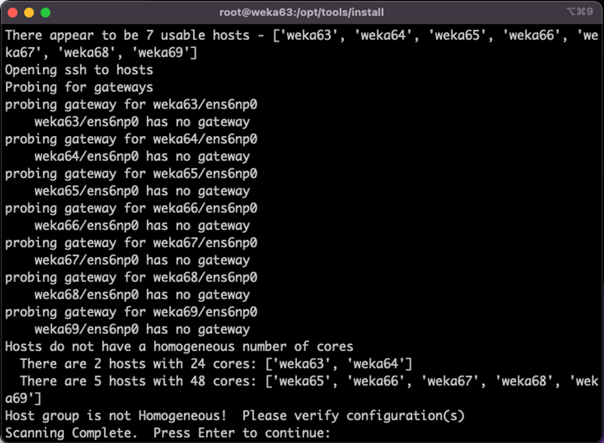
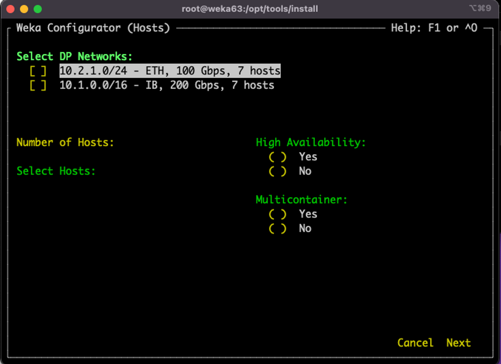
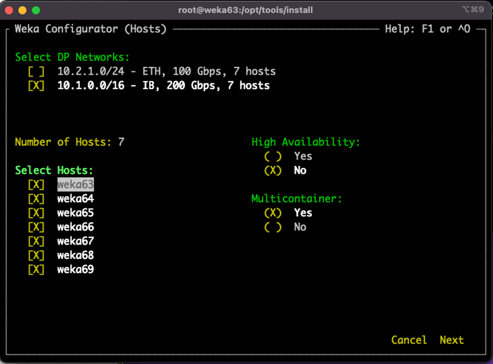
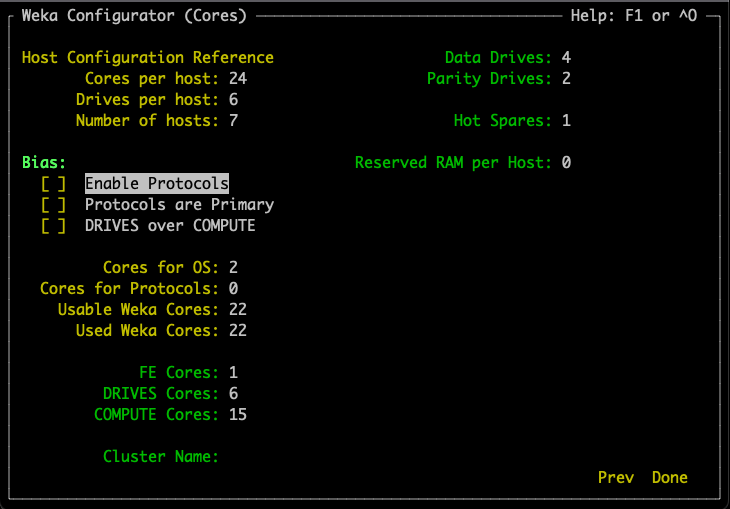
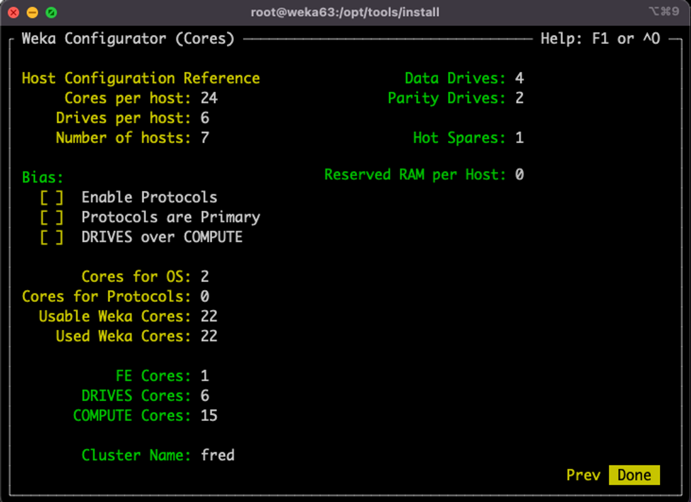
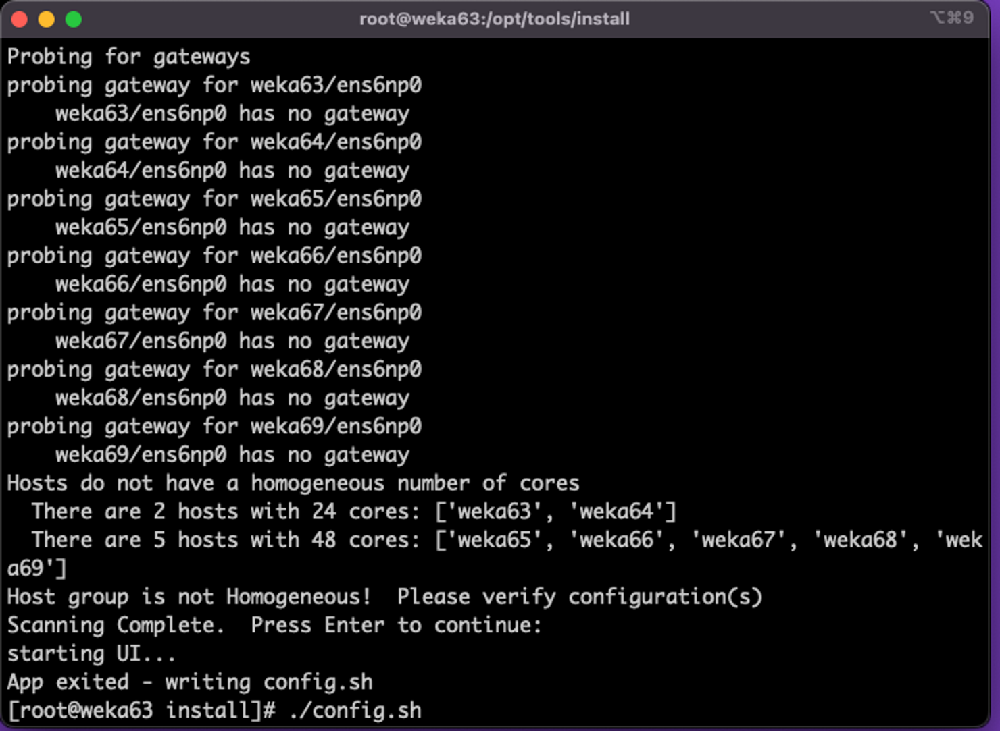
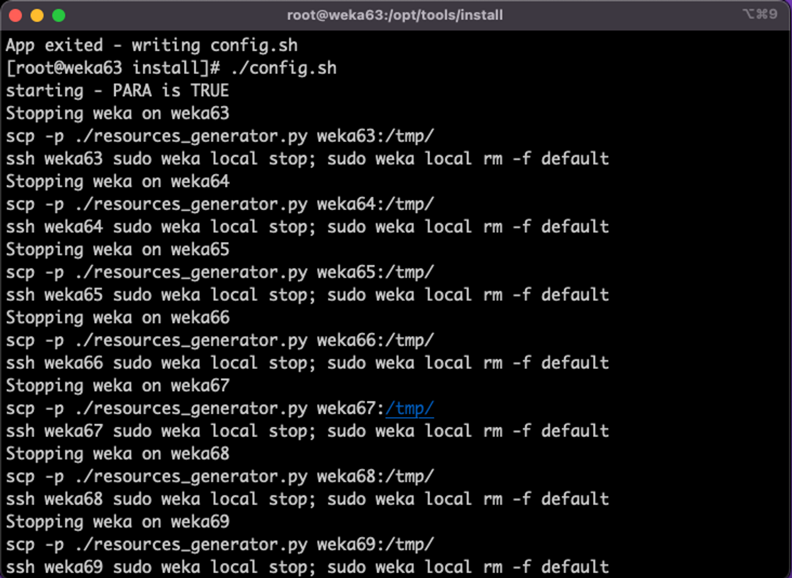
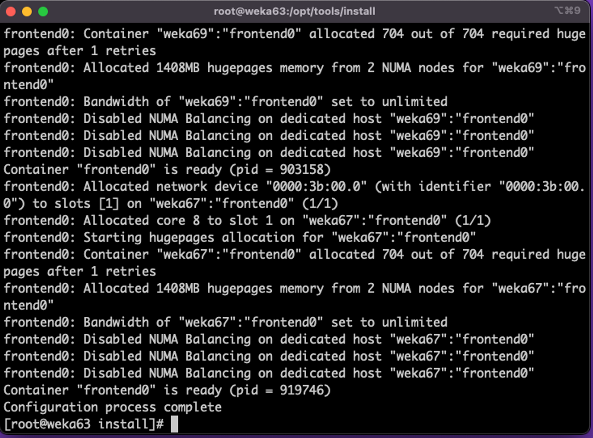
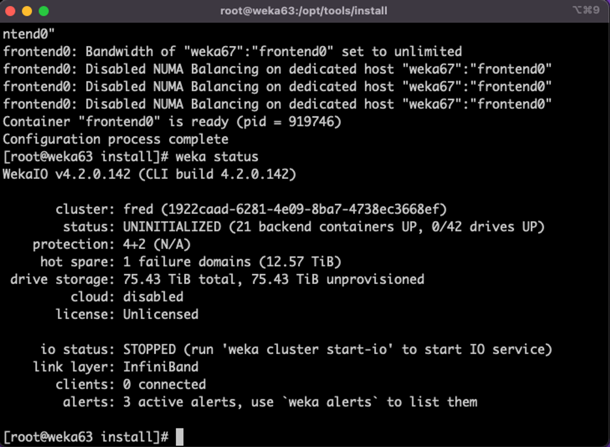
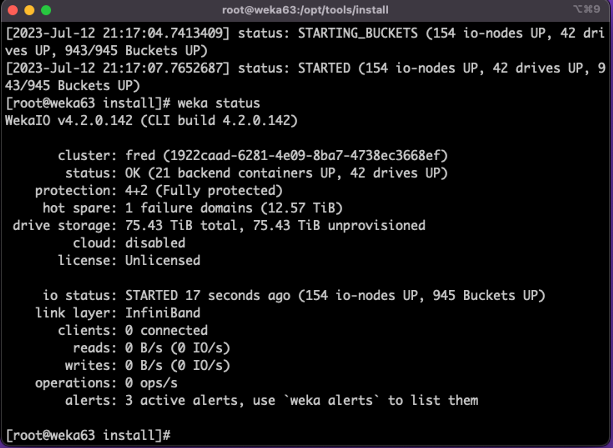

# WEKA cluster installation

The WEKA cluster installation workflow consists of the Weka Configurator tool, which facilitates the cluster installation and configuration.

The Weka Configurator performs the following:

1. Scans your environment to detect the network, verifies various attributes such as hostnames, and discovers components such as gateway routers.
2. Selects the servers that can be included in the cluster and verifies that all servers run the same WEKA version.
3. Guides you through the configuration options.
4. Generates a valid configuration file that you can apply to form a WEKA cluster from a group of servers.

<details>

<summary>Before you begin: concepts and prerequisites</summary>

&#x20;Adhere to the following concepts and prerequisites before working with the Weka Configurator:

* **STEM mode:** STEM mode is the initial state before configuration. The term STEM comes from the concept of stem cells in biology, which are undifferentiated. In WEKA clusters, STEM mode carries the same connotation of being an undifferentiated state.
* **Reference host:** The `wekaconfig` normally runs on one of the servers designated as part of the final cluster. The server that `wekaconfig` runs on is called the reference host. When `wekaconfig` runs, it expects to find a group of servers in STEM mode. If the reference host is not in STEM mode, an error message is issued, and the program terminates.
* **Same networks:** It is assumed that all other servers forming the cluster are connected to the same networks as the `reference host` and have the same configuration (all servers have a homogeneous hardware configuration).
* **Homogeneous configuration:** Two or more servers with the same core count, RAM size, number and size of drives, and network configurations are considered homogeneous.
  * It is best practice to create the WEKA cluster from a group of homogeneous servers (it is typically the case because the hardware is typically purchased all at the same time). `wekaconfig` checks if the servers are homogeneous; if they are not, it points out the discrepancies (such as varying numbers of drives, RAM, or cores).
  * `wekaconfig` allows the configuration of heterogeneous clusters. However, because most times, the servers are supposed to be homogeneous, it can be an error that they are not. For example, if one of the drives is defective (DOA) from the factory or a memory stick is defective. These hardware issues are uncommon and can be difficult to discover in large clusters.

<!---->

* **Passwordless ssh connection:** Enabling passwordless ssh between all the servers is very convenient and makes most tools work more smoothly. At a minimum, a regular user with passwordless `sudo` privileges and passwordless ssh is required for configuration. However, it is most convenient to have the `root` user has passwordless ssh, even if only temporarily during configuration.\
  Ensure you can ssh without a password by doing an ssh to each server.
* **Stripe width:** A RAID-like concept refers to the total width of the data stripe for data protection mechanisms. Typically, the DATA and PARITY combined are the stripe width. In WEKA terms, the stripe width must be less than the total number of servers in the cluster. For example, in a 10-server cluster, the stripe width can be 9 (7 data + 2 parity) plus 1 spare.
* **System preparation is validated:** Ensure the system preparation is validated using the `wekachecker`. See [Validate the system preparation](../setting-up-the-hosts/#validate-the-system-preparation).&#x20;

</details>

## Workflow

1. [Install the WEKA software](./#1.-install-the-weka-software)
2. [Configure a WEKA cluster with the WEKA Configurator](./#2.-configure-a-weka-cluster-with-the-weka-configurator)
3. [Apply the configuration (`config.sh`)](./#3.-apply-the-configuration-config.sh)
4. [Enable event notifications to the cloud (optional)](./#4.-enable-event-notifications-to-the-cloud-optional)
5. [Set the license](./#10.-set-the-license)
6. [Start the cluster IO service](./#11.-start-the-cluster-io-service)
7. [Check the cluster configuration](./#13.-check-the-cluster-configuration)
8. [Bypass the proxy server (optional)](./#8.-bypass-the-proxy-server)

### 1. Install the WEKA software <a href="#1.-install-the-weka-software" id="1.-install-the-weka-software"></a>

Once the WEKA software is downloaded from [get.weka.io](https://get.weka.io), run the untar command and `install.sh` command on each server, according to the instructions in the **Install** tab.

Once completed, the WEKA software is installed on all the allocated servers and runs in stem mode (no cluster is attached).


If a failure occurs during the WEKA software installation process, an error message prompts detailing the source of the failure. Review the details and try to resolve the failure. If required, contact the [Customer Success Team](../../../support/getting-support-for-your-weka-system.md#contact-customer-success-team).


### 2. Configure a WEKA cluster with the WEKA Configurator

1. Download the WEKA’s tools repository to one of the servers by running the following:\
   `git clone https://github.com/weka/tools`
2. Connect to the server using `ssh`, change the directory to `tools/install`, and run `./wekaconfig`.

The `wekaconfig` scans the environment, detects the servers, and determines if the group of servers is homogeneous. The following example shows the servers do not have a homogeneous number of cores.

<figure><figcaption><p>Example: <code>wekaconfig</code> detection results</p></figcaption></figure>

3. Review the detection results. If the configuration meets your requirements, press **Enter**. \
   Select each of the following tabs to set the WEKA configuration.



The `wekaconfig` displays the data plane networks (DP Networks) detected previously.  The list under **Select DP Networks** reflects the high-speed (100Gb+) networks used for the WEKA storage traffic.

Verify that the list of networks, speed, and number of detected hosts are correct.

If the values are not as expected, such as an incorrect number of servers, incorrect or missing networks, investigate it and check the messages. Typically, network configuration issues are the source of the problem.

Select the required networks to configure WEKA POSIX protocol to run on.

Use the arrow and Tab keys to move between the fields and sections, and the space-bar to select the value.

**Note:** The green labels have entry fields. The yellow labels have read-only fields.&#x20;

<figure><figcaption></figcaption></figure>



Press Tab to move to the **Hosts** section.

`wekaconfig` pre-populated the hostnames of the servers that are on this network and running the same version of WEKA and are in STEM mode.

Use the arrow keys to move between the servers, and space bar to select or deselect specific servers. Press Tab to accept values and move to the next field: High Availability.

High Availability (HA) is used for networks with more than one network interface.

In this example, only one network is selected, so the HA default is No. When there are two or more networks selected, you can change the the HA option to suit your needs. Consult the WEKA Customer Success Team before changing this default value.

Press Tab to accept value and move to the next field: Multicontainer. The default is Yes and it is mandatory from WEKA version 4.1.

Press Tab to move to the lower-right. Use the arrow to move to **Next**. Then, press the space-bar.

<figure><figcaption></figcaption></figure>



This page shows the following sections:

* Host Configuration Reference
* Bias
* Cores details
* Data and parity drives and hotspares

#### Host Configuration Reference

This section shows the `reference host` cores and drives configuration, and the total number of hosts (servers).

#### Bias

The Bias options determine the optimal CPU core and memory allocation scheme.

* **Enable Protocols:** If you intend to use the cluster for NFS, SMB, or S3 protocols, select this option. This option reserves some CPU and memory for the protocols.
* **Protocols are Primary:** If you intend to use the cluster primarily or heavily with NFS, SMB, or S3 protocols, select this option. It reserves more CPU and memory (then in the first option) for the protocols .
* **DRIVES over COMPUTE:** In high-core-count configurations (48+ cores), the standard algorithm for determining optimal core allocations may reduce the drive:core ratio in favor of additional COMPUTE cores. This bias setting favors a DRIVE core allocation of 1:1 (if possible) over additional COMPUTE cores. For advice on core allocations, consult with the Customer Success Team if you are configuring high-core-count systems.

#### **Core details**

`wekaconfig` suggests a reasonable set of core allocations (FE/COMPUTE/DRIVES) depending on your selections. You may override these values as needed.

* **Cores for OS:** The number of cores reserved for the OS (fixed at 2).
* **Cores for Protocols:** The number of cores reserved for protocols. It depends on the selected Bias option.
* **Usable Weka Cores:** The number of cores can be used for FE, COMPTE, and DRIVES processes.
* **Used Weka Cores:** The number of cores selected for use as FE, COMPUTE, or DRIVES cores.

The **Usable Weka Cores** and **Available Weka Cores** read-only fields are updated as you make changes so you can ensure you are not exceeding the number of available cores as you change any values. This is an advanced feature, and core allocation must not be changed without consulting the Customer Success Team.

<figure><figcaption></figcaption></figure>



Move to the Cluster Name field and set a unique name for your WEKA cluster.

<figure><figcaption></figcaption></figure>



The stripe settings include:

* **Data Drives:** The number of data members in the Stripe Width.
* **Parity Drives:** The number of parity members.
* **Hot Spares:** The number of Hot Spare members.

These settings are in terms of servers, not SSDs. WEKA stripes over the entire servers, not over individual drives. For more details, see [WEKA cluster installation using the resource generator (for advanced users)](weka-system-installation-with-multiple-containers-using-the-cli.md).

The following example shows a stripe width of 6 (4+2) on 7 servers, and one hot spare.

<figure><figcaption></figcaption></figure>



Once you have set the WEKA configuration, using the arrows, select **Done** and press **Enter**. The wekaconfig creates the **config.sh** file.

<details>

<summary><code>config.sh</code> output example</summary>

```bash
#!/bin/bash

usage() {
	echo "Usage: $0 [--no-parallel]"
	echo "  Use --no-parallel to prevent parallel execution"
	exit 1
}

para() {
	TF=$1; shift
	echo $*
	$* &
	#[ !$TF ] && { echo para waiting; wait; }
	[ $TF == "FALSE" ] && { echo para waiting; wait; }
}

PARA="TRUE"

# parse args
if [ $# != 0 ]; then
	if [ $# != 1 ]; then
		usage
	elif [ $1 == "--no-parallel" ]; then
		PARA="FALSE"
	else
		echo "Error: unknown command line switch - $1"
		usage
	fi
fi

echo starting - PARA is $PARA

# ------------------ custom script below --------------

echo Stopping weka on weka63
para ${PARA} scp -p ./resources_generator.py weka63:/tmp/
para ${PARA} ssh weka63 "sudo weka local stop; sudo weka local rm -f default"
echo Stopping weka on weka64
para ${PARA} scp -p ./resources_generator.py weka64:/tmp/
para ${PARA} ssh weka64 "sudo weka local stop; sudo weka local rm -f default"
echo Stopping weka on weka65
para ${PARA} scp -p ./resources_generator.py weka65:/tmp/
para ${PARA} ssh weka65 "sudo weka local stop; sudo weka local rm -f default"
echo Stopping weka on weka66
para ${PARA} scp -p ./resources_generator.py weka66:/tmp/
para ${PARA} ssh weka66 "sudo weka local stop; sudo weka local rm -f default"
echo Stopping weka on weka67
para ${PARA} scp -p ./resources_generator.py weka67:/tmp/
para ${PARA} ssh weka67 "sudo weka local stop; sudo weka local rm -f default"
echo Stopping weka on weka68
para ${PARA} scp -p ./resources_generator.py weka68:/tmp/
para ${PARA} ssh weka68 "sudo weka local stop; sudo weka local rm -f default"
echo Stopping weka on weka69
para ${PARA} scp -p ./resources_generator.py weka69:/tmp/
para ${PARA} ssh weka69 "sudo weka local stop; sudo weka local rm -f default"

wait
echo Running Resources generator on host weka63
para ${PARA} ssh weka63 sudo /tmp/resources_generator.py -f --path /tmp --net ib0/10.1.1.63/16 --compute-dedicated-cores 15 --drive-dedicated-cores 6 --frontend-dedicated-cores 1
echo Running Resources generator on host weka64
para ${PARA} ssh weka64 sudo /tmp/resources_generator.py -f --path /tmp --net ib0/10.1.1.64/16 --compute-dedicated-cores 15 --drive-dedicated-cores 6 --frontend-dedicated-cores 1
echo Running Resources generator on host weka65
para ${PARA} ssh weka65 sudo /tmp/resources_generator.py -f --path /tmp --net ib0/10.1.1.65/16 --compute-dedicated-cores 15 --drive-dedicated-cores 6 --frontend-dedicated-cores 1
echo Running Resources generator on host weka66
para ${PARA} ssh weka66 sudo /tmp/resources_generator.py -f --path /tmp --net ib0/10.1.1.66/16 --compute-dedicated-cores 15 --drive-dedicated-cores 6 --frontend-dedicated-cores 1
echo Running Resources generator on host weka67
para ${PARA} ssh weka67 sudo /tmp/resources_generator.py -f --path /tmp --net ib0/10.1.1.67/16 --compute-dedicated-cores 15 --drive-dedicated-cores 6 --frontend-dedicated-cores 1
echo Running Resources generator on host weka68
para ${PARA} ssh weka68 sudo /tmp/resources_generator.py -f --path /tmp --net ib0/10.1.1.68/16 --compute-dedicated-cores 15 --drive-dedicated-cores 6 --frontend-dedicated-cores 1
echo Running Resources generator on host weka69
para ${PARA} ssh weka69 sudo /tmp/resources_generator.py -f --path /tmp --net ib0/10.1.1.69/16 --compute-dedicated-cores 15 --drive-dedicated-cores 6 --frontend-dedicated-cores 1
wait
echo Starting Drives container on server weka63
para ${PARA} ssh weka63 "sudo weka local setup container --name drives0 --resources-path /tmp/drives0.json"
echo Starting Drives container on server weka64
para ${PARA} ssh weka64 "sudo weka local setup container --name drives0 --resources-path /tmp/drives0.json"
echo Starting Drives container on server weka65
para ${PARA} ssh weka65 "sudo weka local setup container --name drives0 --resources-path /tmp/drives0.json"
echo Starting Drives container on server weka66
para ${PARA} ssh weka66 "sudo weka local setup container --name drives0 --resources-path /tmp/drives0.json"
echo Starting Drives container on server weka67
para ${PARA} ssh weka67 "sudo weka local setup container --name drives0 --resources-path /tmp/drives0.json"
echo Starting Drives container on server weka68
para ${PARA} ssh weka68 "sudo weka local setup container --name drives0 --resources-path /tmp/drives0.json"
echo Starting Drives container on server weka69
para ${PARA} ssh weka69 "sudo weka local setup container --name drives0 --resources-path /tmp/drives0.json"

wait

sudo weka cluster create weka63 weka64 weka65 weka66 weka67 weka68 weka69 --host-ips=10.1.1.63,10.1.1.64,10.1.1.65,10.1.1.66,10.1.1.67,10.1.1.68,10.1.1.69 -T infinite
echo Starting Compute container 0 on host weka63
para ${PARA} ssh weka63 sudo weka local setup container --name compute0 --resources-path /tmp/compute0.json --join-ips=10.1.1.63,10.1.1.64,10.1.1.65,10.1.1.66,10.1.1.67,10.1.1.68,10.1.1.69 --management-ips=10.1.1.63
echo Starting Compute container 0 on host weka64
para ${PARA} ssh weka64 sudo weka local setup container --name compute0 --resources-path /tmp/compute0.json --join-ips=10.1.1.63,10.1.1.64,10.1.1.65,10.1.1.66,10.1.1.67,10.1.1.68,10.1.1.69 --management-ips=10.1.1.64
echo Starting Compute container 0 on host weka65
para ${PARA} ssh weka65 sudo weka local setup container --name compute0 --resources-path /tmp/compute0.json --join-ips=10.1.1.63,10.1.1.64,10.1.1.65,10.1.1.66,10.1.1.67,10.1.1.68,10.1.1.69 --management-ips=10.1.1.65
echo Starting Compute container 0 on host weka66
para ${PARA} ssh weka66 sudo weka local setup container --name compute0 --resources-path /tmp/compute0.json --join-ips=10.1.1.63,10.1.1.64,10.1.1.65,10.1.1.66,10.1.1.67,10.1.1.68,10.1.1.69 --management-ips=10.1.1.66
echo Starting Compute container 0 on host weka67
para ${PARA} ssh weka67 sudo weka local setup container --name compute0 --resources-path /tmp/compute0.json --join-ips=10.1.1.63,10.1.1.64,10.1.1.65,10.1.1.66,10.1.1.67,10.1.1.68,10.1.1.69 --management-ips=10.1.1.67
echo Starting Compute container 0 on host weka68
para ${PARA} ssh weka68 sudo weka local setup container --name compute0 --resources-path /tmp/compute0.json --join-ips=10.1.1.63,10.1.1.64,10.1.1.65,10.1.1.66,10.1.1.67,10.1.1.68,10.1.1.69 --management-ips=10.1.1.68
echo Starting Compute container 0 on host weka69
para ${PARA} ssh weka69 sudo weka local setup container --name compute0 --resources-path /tmp/compute0.json --join-ips=10.1.1.63,10.1.1.64,10.1.1.65,10.1.1.66,10.1.1.67,10.1.1.68,10.1.1.69 --management-ips=10.1.1.69
wait

para ${PARA} sudo weka cluster drive add 0 /dev/nvme0n1 /dev/nvme1n1 /dev/nvme2n1 /dev/nvme3n1 /dev/nvme4n1 /dev/nvme5n1 
para ${PARA} sudo weka cluster drive add 1 /dev/nvme0n1 /dev/nvme1n1 /dev/nvme2n1 /dev/nvme3n1 /dev/nvme4n1 /dev/nvme5n1 
para ${PARA} sudo weka cluster drive add 2 /dev/nvme0n1 /dev/nvme1n1 /dev/nvme2n1 /dev/nvme3n1 /dev/nvme4n1 /dev/nvme5n1 
para ${PARA} sudo weka cluster drive add 3 /dev/nvme0n1 /dev/nvme1n1 /dev/nvme2n1 /dev/nvme3n1 /dev/nvme4n1 /dev/nvme5n1 
para ${PARA} sudo weka cluster drive add 4 /dev/nvme0n1 /dev/nvme1n1 /dev/nvme2n1 /dev/nvme3n1 /dev/nvme4n1 /dev/nvme5n1 
para ${PARA} sudo weka cluster drive add 5 /dev/nvme0n1 /dev/nvme1n1 /dev/nvme2n1 /dev/nvme3n1 /dev/nvme4n1 /dev/nvme5n1 
para ${PARA} sudo weka cluster drive add 6 /dev/nvme0n1 /dev/nvme1n1 /dev/nvme2n1 /dev/nvme3n1 /dev/nvme4n1 /dev/nvme5n1 


wait
sudo weka cluster update --data-drives=4 --parity-drives=2
sudo weka cluster hot-spare 1
sudo weka cluster update --cluster-name=fred

echo Starting Front container on host weka63
para ${PARA} ssh weka63 sudo weka local setup container --name frontend0 --resources-path /tmp/frontend0.json --join-ips=10.1.1.63,10.1.1.64,10.1.1.65,10.1.1.66,10.1.1.67,10.1.1.68,10.1.1.69 --management-ips=10.1.1.63
echo Starting Front container on host weka64
para ${PARA} ssh weka64 sudo weka local setup container --name frontend0 --resources-path /tmp/frontend0.json --join-ips=10.1.1.63,10.1.1.64,10.1.1.65,10.1.1.66,10.1.1.67,10.1.1.68,10.1.1.69 --management-ips=10.1.1.64
echo Starting Front container on host weka65
para ${PARA} ssh weka65 sudo weka local setup container --name frontend0 --resources-path /tmp/frontend0.json --join-ips=10.1.1.63,10.1.1.64,10.1.1.65,10.1.1.66,10.1.1.67,10.1.1.68,10.1.1.69 --management-ips=10.1.1.65
echo Starting Front container on host weka66
para ${PARA} ssh weka66 sudo weka local setup container --name frontend0 --resources-path /tmp/frontend0.json --join-ips=10.1.1.63,10.1.1.64,10.1.1.65,10.1.1.66,10.1.1.67,10.1.1.68,10.1.1.69 --management-ips=10.1.1.66
echo Starting Front container on host weka67
para ${PARA} ssh weka67 sudo weka local setup container --name frontend0 --resources-path /tmp/frontend0.json --join-ips=10.1.1.63,10.1.1.64,10.1.1.65,10.1.1.66,10.1.1.67,10.1.1.68,10.1.1.69 --management-ips=10.1.1.67
echo Starting Front container on host weka68
para ${PARA} ssh weka68 sudo weka local setup container --name frontend0 --resources-path /tmp/frontend0.json --join-ips=10.1.1.63,10.1.1.64,10.1.1.65,10.1.1.66,10.1.1.67,10.1.1.68,10.1.1.69 --management-ips=10.1.1.68
echo Starting Front container on host weka69
para ${PARA} ssh weka69 sudo weka local setup container --name frontend0 --resources-path /tmp/frontend0.json --join-ips=10.1.1.63,10.1.1.64,10.1.1.65,10.1.1.66,10.1.1.67,10.1.1.68,10.1.1.69 --management-ips=10.1.1.69

wait
echo Configuration process complete

```

</details>


Advanced users can edit the config.sh using `vim` or `nano` (or any text editor) to further customize the configuration. If editing is necessary, consult the Customer Success Team.

Regarding the drive selection, it is not possible to select the data drives (NVMe SSD) to include in the configuration. As WEKA clusters are typically dedicated to running WEKA services and homogeneous, the `wekaconfig` includes all NVMe drives that are over about 1.5 GB in size, (typical). To change the drives used in the cluster, edit the `config.sh` (see the`config.sh`output example above).


### 3. Apply the configuration

From the install directory, run `./config.sh`.

<figure><figcaption><p>Apply the configuration </p></figcaption></figure>

The configuration takes a few minutes and possibly longer for large clusters. See some examples of the configuration process and WEKA status.



<figure><figcaption></figcaption></figure>



<figure><figcaption></figcaption></figure>



<figure><figcaption></figcaption></figure>



<figure><figcaption></figcaption></figure>



### 4. Enable event notifications to the cloud (optional)

Enable event notifications to the cloud for support purposes using one of the following options:

* Enable support through Weka Home
* Enable support through a private instance of Weka Home

#### **Enable support through Weka Home**

**Command:** `weka cloud enable`

This command enables cloud event notification (via Weka Home), which increases the ability of the Weka Support Team to resolve any issues that may occur.

To learn more about this and how to enable cloud event notification, refer to [Weka Support Cloud](../../../support/the-wekaio-support-cloud/).

#### **Enable support through a** private instance of Weka Home

In closed environments, such as dark sites and private VPCs, it is possible to install a private instance of Weka Home.

**Command:** `weka cloud enable --cloud-url=http://<weka-home-ip>:<weka-home-port>`

This command enables the use of a private instance of Weka Home.


For more information, refer to the [Private Instance of Weka Home](../../../support/the-wekaio-support-cloud/#private-instance-of-weka-home) and contact the [Customer Success Team](../../../support/getting-support-for-your-weka-system.md).


### 5. Set the license

**Command:** `weka cluster license set / payg`

To run IOs against the cluster, a valid license must be set. Obtain a valid license, classic or PAYG, and set it to the Weka cluster. For details, see [License overview](../../../licensing/overview.md).&#x20;

### 6. Start the cluster IO service

**Command:** `weka cluster start-io`

To start the system IO and exit from the initialization state, use the following command line:

`weka cluster start-io`

### &#x20;7. Check the cluster configuration

#### Check the cluster container

**Command:** `weka cluster container`

Use this command to display the list of containers and their details.

```
$ weka cluster container
HOST ID  HOSTNAME  CONTAINER  IPS             STATUS  RELEASE                                      FAILURE DOMAIN  CORES  MEMORY    LAST FAILURE  UPTIME
0        av299-0   drives0    10.108.79.121   UP      4.2.0.8076-9e87a37af8169f32fb3c81c73d6844a1  DOM-000         7      10.45 GB                1:08:30h
1        av299-1   drives0    10.108.115.194  UP      4.2.0.8076-9e87a37af8169f32fb3c81c73d6844a1  DOM-001         7      10.45 GB                1:08:30h
2        av299-2   drives0    10.108.2.136    UP      4.2.0.8076-9e87a37af8169f32fb3c81c73d6844a1  DOM-002         7      10.45 GB                1:08:29h
3        av299-3   drives0    10.108.165.185  UP      4.2.0.8076-9e87a37af8169f32fb3c81c73d6844a1  DOM-003         7      10.45 GB                1:08:30h
4        av299-4   drives0    10.108.116.49   UP      4.2.0.8076-9e87a37af8169f32fb3c81c73d6844a1  DOM-004         7      10.45 GB                1:08:29h
5        av299-5   drives0    10.108.7.63     UP      4.2.0.8076-9e87a37af8169f32fb3c81c73d6844a1  DOM-005         7      10.45 GB                1:08:30h
6        av299-6   drives0    10.108.80.75    UP      4.2.0.8076-9e87a37af8169f32fb3c81c73d6844a1  DOM-006         7      10.45 GB                1:08:29h
7        av299-7   drives0    10.108.173.56   UP      4.2.0.8076-9e87a37af8169f32fb3c81c73d6844a1  DOM-007         7      10.45 GB                1:08:30h
8        av299-8   drives0    10.108.253.194  UP      4.2.0.8076-9e87a37af8169f32fb3c81c73d6844a1  DOM-008         7      10.45 GB                1:08:29h
9        av299-9   drives0    10.108.220.115  UP      4.2.0.8076-9e87a37af8169f32fb3c81c73d6844a1  DOM-009         7      10.45 GB                1:08:29h
10       av299-0   compute0   10.108.79.121   UP      4.2.0.8076-9e87a37af8169f32fb3c81c73d6844a1  DOM-000         6      20.22 GB                1:08:08h
11       av299-1   compute0   10.108.115.194  UP      4.2.0.8076-9e87a37af8169f32fb3c81c73d6844a1  DOM-001         6      20.22 GB                1:08:08h
12       av299-2   compute0   10.108.2.136    UP      4.2.0.8076-9e87a37af8169f32fb3c81c73d6844a1  DOM-002         6      20.22 GB                1:08:09h
13       av299-3   compute0   10.108.165.185  UP      4.2.0.8076-9e87a37af8169f32fb3c81c73d6844a1  DOM-003         6      20.22 GB                1:08:09h
14       av299-4   compute0   10.108.116.49   UP      4.2.0.8076-9e87a37af8169f32fb3c81c73d6844a1  DOM-004         6      20.22 GB                1:08:09h
15       av299-5   compute0   10.108.7.63     UP      4.2.0.8076-9e87a37af8169f32fb3c81c73d6844a1  DOM-005         6      20.22 GB                1:08:08h
16       av299-6   compute0   10.108.80.75    UP      4.2.0.8076-9e87a37af8169f32fb3c81c73d6844a1  DOM-006         6      20.22 GB                1:08:09h
17       av299-7   compute0   10.108.173.56   UP      4.2.0.8076-9e87a37af8169f32fb3c81c73d6844a1  DOM-007         6      20.22 GB                1:08:08h
18       av299-8   compute0   10.108.253.194  UP      4.2.0.8076-9e87a37af8169f32fb3c81c73d6844a1  DOM-008         6      20.22 GB                1:08:09h
19       av299-9   compute0   10.108.220.115  UP      4.2.0.8076-9e87a37af8169f32fb3c81c73d6844a1  DOM-009         6      20.22 GB                1:08:08h
20       av299-0   frontend0  10.108.79.121   UP      4.2.0.8076-9e87a37af8169f32fb3c81c73d6844a1  DOM-000         1      1.47 GB                 1:06:57h
21       av299-1   frontend0  10.108.115.194  UP      4.2.0.8076-9e87a37af8169f32fb3c81c73d6844a1  DOM-001         1      1.47 GB                 1:06:57h
22       av299-2   frontend0  10.108.2.136    UP      4.2.0.8076-9e87a37af8169f32fb3c81c73d6844a1  DOM-002         1      1.47 GB                 1:06:57h
23       av299-3   frontend0  10.108.165.185  UP      4.2.0.8076-9e87a37af8169f32fb3c81c73d6844a1  DOM-003         1      1.47 GB                 1:06:56h
24       av299-4   frontend0  10.108.116.49   UP      4.2.0.8076-9e87a37af8169f32fb3c81c73d6844a1  DOM-004         1      1.47 GB                 1:06:57h
25       av299-5   frontend0  10.108.7.63     UP      4.2.0.8076-9e87a37af8169f32fb3c81c73d6844a1  DOM-005         1      1.47 GB                 1:06:56h
26       av299-6   frontend0  10.108.80.75    UP      4.2.0.8076-9e87a37af8169f32fb3c81c73d6844a1  DOM-006         1      1.47 GB                 1:06:57h
27       av299-7   frontend0  10.108.173.56   UP      4.2.0.8076-9e87a37af8169f32fb3c81c73d6844a1  DOM-007         1      1.47 GB                 1:06:56h
28       av299-8   frontend0  10.108.253.194  UP      4.2.0.8076-9e87a37af8169f32fb3c81c73d6844a1  DOM-008         1      1.47 GB                 1:06:57h
29       av299-9   frontend0  10.108.220.115  UP      4.2.0.8076-9e87a37af8169f32fb3c81c73d6844a1  DOM-009         1      1.47 GB                 1:06:56h

```

#### Check cluster container resources

**Command:** `weka cluster container resources`

Use this command to check the resources of each container in the cluster.

`weka cluster container resources <container-id>`

Example for a drive container resources output:

```
$ weka cluster container resources 0
ROLES       NODE ID  CORE ID
MANAGEMENT  0        <auto>
DRIVES      1        12
DRIVES      2        14
DRIVES      3        2
DRIVES      4        20
DRIVES      5        6
DRIVES      6        8
DRIVES      7        22

NET DEVICE    IDENTIFIER    DEFAULT GATEWAY  IPS             NETMASK  NETWORK LABEL
0000:00:0a.0  0000:00:0a.0  10.108.0.1       10.108.34.80    16
0000:00:0b.0  0000:00:0b.0  10.108.0.1       10.108.190.166  16
0000:00:0c.0  0000:00:0c.0  10.108.0.1       10.108.125.213  16
0000:00:0f.0  0000:00:0f.0  10.108.0.1       10.108.61.111   16
0000:00:10.0  0000:00:10.0  10.108.0.1       10.108.26.149   16
0000:00:11.0  0000:00:11.0  10.108.0.1       10.108.30.216   16
0000:00:12.0  0000:00:12.0  10.108.0.1       10.108.217.129  16

Allow Protocols         false
Bandwidth               <auto>
Base Port               14000
Dedicate Memory         true
Disable NUMA Balancing  true
Failure Domain          DOM-000
Hardware Watchdog       false
Management IPs          10.108.79.121
Mask Interrupts         true
Memory                  <dedicated>
Mode                    BACKEND
Set CPU Governors       PERFORMANCE
```

Example of a compute container resources output:

```
$ weka cluster container resources 10
ROLES       NODE ID  CORE ID
MANAGEMENT  0        <auto>
COMPUTE     1        16
COMPUTE     2        4
COMPUTE     3        18
COMPUTE     4        26
COMPUTE     5        28
COMPUTE     6        10

NET DEVICE    IDENTIFIER    DEFAULT GATEWAY  IPS             NETMASK  NETWORK LABEL
0000:00:04.0  0000:00:04.0  10.108.0.1       10.108.145.137  16
0000:00:05.0  0000:00:05.0  10.108.0.1       10.108.212.87   16
0000:00:06.0  0000:00:06.0  10.108.0.1       10.108.199.231  16
0000:00:07.0  0000:00:07.0  10.108.0.1       10.108.86.172   16
0000:00:08.0  0000:00:08.0  10.108.0.1       10.108.190.88   16
0000:00:09.0  0000:00:09.0  10.108.0.1       10.108.77.31    16

Allow Protocols         false
Bandwidth               <auto>
Base Port               14300
Dedicate Memory         true
Disable NUMA Balancing  true
Failure Domain          DOM-000
Hardware Watchdog       false
Management IPs          10.108.79.121
Mask Interrupts         true
Memory                  20224982280
Mode                    BACKEND
Set CPU Governors       PERFORMANCE
```

Example of a frontend container resources output:

```
$ weka cluster container resources 20
ROLES       NODE ID  CORE ID
MANAGEMENT  0        <auto>
FRONTEND    1        24

NET DEVICE    IDENTIFIER    DEFAULT GATEWAY  IPS             NETMASK  NETWORK LABEL
0000:00:13.0  0000:00:13.0  10.108.0.1       10.108.217.249  16

Allow Protocols         true
Bandwidth               <auto>
Base Port               14200
Dedicate Memory         true
Disable NUMA Balancing  true
Failure Domain          DOM-000
Hardware Watchdog       false
Management IPs          10.108.79.121
Mask Interrupts         true
Memory                  <dedicated>
Mode                    BACKEND
Set CPU Governors       PERFORMANCE
```

#### Check cluster drives

**Command:** `weka cluster drive`

Use this command to check all drives in the cluster.

Example:

```
$ weka cluster drive
DISK ID  UUID                                  HOSTNAME  NODE ID  SIZE        STATUS  LIFETIME % USED  ATTACHMENT  DRIVE STATUS
0        d3d000d4-a76b-405d-a226-c40dcd8d622c  av299-4   87       399.99 GiB  ACTIVE  0                OK          OK
1        c68cf47a-f91d-499f-83c8-69aa06ed37d4  av299-7   143      399.99 GiB  ACTIVE  0                OK          OK
2        c97f83b5-b9e3-4ccd-bfb8-d78537fa8a6f  av299-1   23       399.99 GiB  ACTIVE  0                OK          OK
3        908dadc5-740c-4e08-9cc2-290b4b311f81  av299-0   7        399.99 GiB  ACTIVE  0                OK          OK
.
.
.
68       1c4c4d54-6553-44b2-bc61-0f0e946919fb  av299-4   84       399.99 GiB  ACTIVE  0                OK          OK
69       969d3521-9057-4db9-8304-157f50719683  av299-3   62       399.99 GiB  ACTIVE  0                OK          OK
```

#### Check Weka cluster status

**Command:** `weka status`

The `weka status` command displays the overall status of the Weka cluster.

For details, see [Cluster status](../../../getting-started-with-weka/manage-the-system-using-weka-cli.md#cluster-status).

### 8. Bypass the proxy server

If the WEKA cluster is deployed in an environment with a proxy server, a WEKA client trying to mount or download the client installation from the WEKA cluster may be blocked by the proxy server. You can disable the proxy for specific URLs using the shell `no_proxy` environment variable.

#### Procedure

1. Connect to one of the WEKA backend servers.
2. Open the `/etc/wekaio/service.conf` file.
3. In the `[downloads_proxy]` section, add to the `no_proxy` parameter a comma-separated list of IP addresses or qualified domain names of your WEKA clients and cluster backend servers. Do not use wildcards (\*).

```
[downloads_proxy]
force_no_proxy=true
proxy=
no_proxy=<comma-separated list of IPs or domains>
```

4. Restart the agent service.
