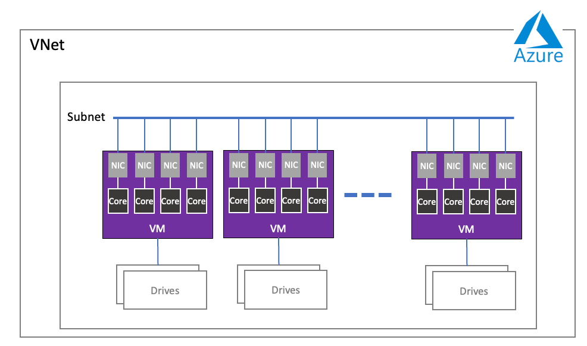

# WEKA installation on Azure

The WEKA® Data Platform on Microsoft Azure provides a fast and scalable platform to run, for example, performance-intensive applications and hybrid cloud workflows. It can also be used for object stores, tiering, and snapshots using the Azure Blob service, for example, to create backups and DR copies.

WEKA provides a ready-to-deploy Terraform package that you can customize for installing the WEKA cluster on Azure. The WEKA cluster is deployed with a multiple containers architecture, in which each container serves a single process type: Compute, Drives, or Frontend.

The WEKA cluster is deployed in a single virtual network (VNet, similar to VPC in other clouds), where peering is not required. Each VNet has a subnet, routes, firewalls, and an internal DNS. The networking supports MTU 3900. The VM includes 4 or 8 NICs, each NIC is mapped to a dedicated core to support DPDK.

Depending on the required security level, you can deploy the WEKA cluster using the Terraform package on one of the following subnet types:

* **Public subnets:** Use a single public subnet within your VNet with an internet gateway, and allow public IP addresses for your virtual machines.&#x20;
* **Private subnets:** Use a single private subnet within your VNet with access to an APT repository containing the required deployment packages.

<figure><figcaption>
WEKA cluster on Azure deployment
</figcaption></figure>

Introduction to Azure fundamentals

Azure is a cloud computing platform with an ever-expanding set of services to help you build solutions to meet your business goals. Azure services range from simple web services for hosting your business presence in the cloud to running fully virtualized computers for you to run your custom software solutions.

Azure provides a wealth of cloud-based services like remote storage, database hosting, and centralized account management. Azure also offers new capabilities like AI and the Internet of Things (IoT).

To learn about Azure fundamentals, Microsoft provides learning modules at [https://learn.microsoft.com/en-us/training/](https://learn.microsoft.com/en-us/training/). You can start with the [Introduction to Azure fundamentals](https://learn.microsoft.com/en-us/training/modules/intro-to-azure-fundamentals/).

Terraform overview

Terraform is an open-source project from Hashicorp. It creates and manages resources on cloud platforms and on-premises clouds. Unlike AWS CloudFormation, it works with many APIs from multiple platforms and services.

Terraform is the primary tool for deploying WEKA on Azure.

### How does Terraform work?

A deployment with Terraform involves three phases:

* **Write:** Define the infrastructure in configuration files and customize the project variables provided in the Terraform package.
* **Plan**: Review the changes Terraform will make to your infrastructure.
* **Apply:** Terraform provisions the infrastructure, including the VMs and instances, installs the WEKA software, and creates the cluster. Once completed, the WEKA cluster runs on Azure.

**Related information**

[Terraform Tutorials](https://learn.hashicorp.com/terraform?track=gcp)

[Terraform Installation](https://learn.hashicorp.com/tutorials/terraform/install-cli)

**Related topics**

[weka-containers-architecture-overview.md](../../overview/weka-containers-architecture-overview.md "mention")

**Related information**

[Weka® Data Platform on Microsoft Azure Marketplace](https://azuremarketplace.microsoft.com/en-us/marketplace/apps/weka1652213882079.weka\_data\_platform?exp=ubp8\&tab=Overview)
