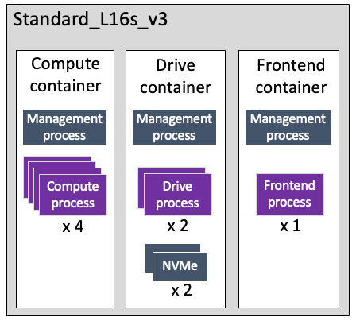

# Supported virtual machine types

On Azure, WEKA is deployed in a multiple containers architecture using two virtual machine types, _Standard\_L8s\_v3_ and _Standard\_L16s\_v3_ (applied by the Terraform package).


**Note:** Using the Azure Console, the client instances can have different virtual machine types provisioned separately from the WEKA cluster.


## Standard\_L8s\_v3

Standard\_L8s\_v3 is a storage-optimized virtual machine with premium storage capability for light-use workloads for mixed IO patterns.

* Resources:
  * 8 vCPUs (4 are physical)
  * 64GB RAM
  * 1 x 1.92 TB NVME
* Network:
  * Up to 4 network interfaces (NICs) of 12.5Gbps bandwidth. Only one NIC is used for UDP mode connection for all traffic through the management interface.

The cores are mapped to the following processes:

* Compute cores: 1
* Drive cores: 1
* Frontend cores: 1

<figure><figcaption>
Mapped WEKA processes for a standard_L8s_v3
</figcaption></figure>

## Standard\_L16s\_v3

Standard\_L16s\_v3 is a storage-optimized virtual machine with premium storage capability for the highest performance.

* Resources:
  * 16 vCPUs (8 are physical)
  * 128GB RAM
  * 2 x 1.92 TB NVME
* Network:
  * Up to 8 NICs of 12.5Gbps bandwidth. Only one NIC is used for UDP mode connection for all traffic through the management interface.

The cores are mapped to the following processes:

* Compute cores: 4
* Drive cores: 2
* Frontend cores: 1

<figure><figcaption>
Mapped WEKA processes for a standard_L16s_v3
</figcaption></figure>
