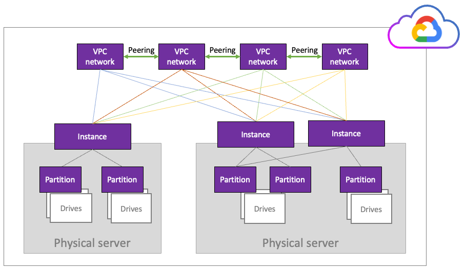
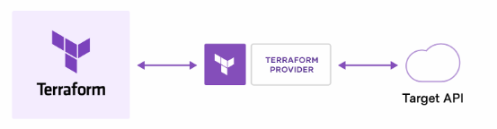
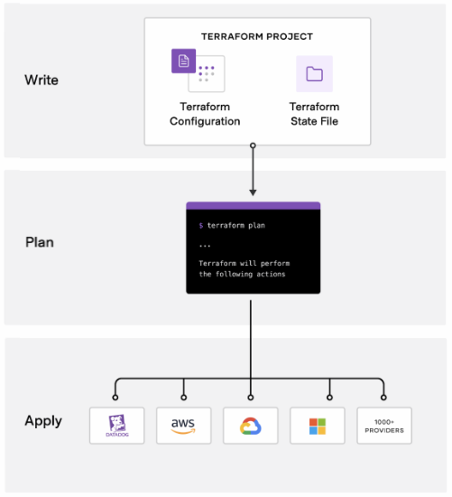

# WEKA installation on GCP

## WEKA on GCP overview

Leveraging GCP's advantages, WEKA offers a customizable GCP-Terraform package for deploying the WEKA cluster on GCP. In GCP, WEKA operates on instances, each capable of using up to eight partitions of drives on the connected physical server (without direct drive usage). These drives can be shared among partitions for other clients on the same server.

WEKA requires a minimum of four VPC networks, each associated with one of the instances. This configuration aligns with the four key WEKA processes: Compute, Drive, Frontend, and Management, with each process requiring a dedicated network interface as follows:

* eth0: Management VPC
* eth1: Compute VPC
* eth2: Frontend VPC
* eth3: Drive VPC

VPC peering facilitates communication between the WEKA processes, each using its NIC. The maximum allowable number of peers within a VPC is limited to 25 by GCP (you can try to increase the quota, but it depends on the GCP resources availability).

<figure><figcaption>
Server infrastructure in GCP
</figcaption></figure>

Terraform overview

Terraform is an open-source project from Hashicorp. It creates and manages resources on cloud platforms and on-premises clouds. Unlike AWS CloudFormation, it works with many APIs from multiple platforms and services.

The GCP Console is already installed with Terraform by default. It is the primary tool for deploying WEKA on GCP. Terraform can be used outside of GCP or independent of GCP Console.

### How does Terraform work?

A deployment with Terraform involves three phases:

* **Write:** Define the infrastructure in configuration files and customize the project variables provided in the Terraform package.
* **Plan**: Review the changes Terraform will make to your infrastructure.
* **Apply:** Terraform provisions the infrastructure, including the VMs and instances, installs the WEKA software, and creates the cluster. Once completed, the WEKA cluster runs on GCP.

**Related information**

[Terraform Tutorials](https://learn.hashicorp.com/terraform?track=gcp)

[Terraform Installation](https://learn.hashicorp.com/tutorials/terraform/install-cli)

