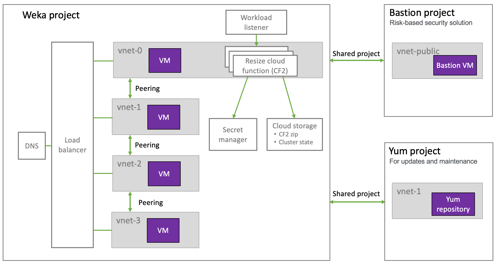

# Weka GCP-Terraform package description

Weka provides a ready-to-deploy GCP-Terraform package that you can customize for installing the Weka cluster on GCP. The package is available by demand. Contact the [Customer Success Team](../../support/getting-support-for-your-weka-system.md#contact-customer-success-team) to obtain the GCP-Terraform package.

The GCP-Terraform package contains the following modules:

* **setup\_network**: includes vpcs, subnets, peering, firewall, and health check.
* **service\_account**: includes the service account used for deployment with all necessary permissions.
* **deploy\_weka**: includes the actual Weka deployment, instance template, cloud functions, workflows, job schedulers, secret manager, buckets, and health check.
* **shared\_vpcs** (_optional_): includes VPC sharing the Weka deployment network with another hosting project. For example, when deploying a private network.

See the README files in the GCP-Terraform package for more details about the modules and their properties.

## Cloud deployment types

The GCP-Terraform package supports the following deployment types:

* **Public cloud deployments:** Require passing the `get.weka.io` token to Terraform for downloading the Weka release from the public [get.weka.io](https://get.weka.io) service. The following examples include are provided:
  * Public VPC.
  * Public VPC with multiple clusters.
  * Public VPC with shared peering.
  * Use the existing public network.
* **Private cloud deployments:** Require uploading the Weka software tarfile into the bucket (instances can download the Weka software from this bucket). The following examples include are provided:
  * Private VPC with multiple clusters.
  * Private VPC with additional shared peering.
  * Use the existing private network.

### Weka deployment on the GCP public network and private network

The Weka project ultimately uses the internal GCP resources. On the first network (vnet-0), Weka uses the resize cloud function (CF2). The peering between all the networks enables running the resize cloud function across all the networks.

The Weka project is the same in the public and private networks. However, in a private network, to enable a secured connection and updates from outside the Weka project, shared projects are provided (shared\_vpcs) for connection to the following projects:

* **Bastion project**_:_ a risk-based security solution.
* **Yum project**: for updates and maintenance of the Weka project.

#### Resize cloud function operation

A resize cloud function and a workload listener are deployed for auto-scale instances in GCP. Once a user sends a [request for resizing](auto-scale-instances-in-gcp.md) the number of instances in the cluster, the workload listener checks the _cluster state_ file in the cloud storage and triggers the resize cloud function if a resize is required.

The _cluster state_ file is an essential part of the resizing decision. It indicates states such as:

* Readiness of the cluster.
* The number of existing instances.
* The number of requested instances.

The secret manager retains the user name (usually _admin_) and the Terraform-generated password. The resize cloud function uses the user name and password to operate on the cluster instances.

<figure><figcaption><p>Weka deployment on the GCP public network</p></figcaption></figure>

<figure><figcaption><p>Weka deployment on the GCP private network</p></figcaption></figure>

## Terraform variable files

Each deployment type includes a variables file `tf.tfvars` that contains only the variables required for the relevant deployment type. The following is an example of the public VPC variables file. See the README files in the GCP-Terraform package for the other variable files.

### `tf.tfvars` example: Public VPC

The following is the content of the `tf.tfvars` file for the public VPC example. As part of the **write** phase, you customize the values according to your deployment.

```
project                  = "wekaio-rnd"
region                   = "europe-west1"
zone                     = "europe-west1-b"
prefix                   = "weka"
subnets_cidr_range       = ["10.0.0.0/24", "10.1.0.0/24", "10.2.0.0/24", "10.3.0.0/24"]
nics_number              = 4
cluster_size             = 7
machine_type             = "c2-standard-8"
nvmes_number             = 2
weka_version             = "4.0.1.37-gcp"
internal_bucket_location = "EU"
vpc_connector_range      = "10.8.0.0/28"
sa_name                  = "deploy-sa"
cluster_name             = "poc"
sg_public_ssh_cidr_range = ["0.0.0.0/0"]
private_network          = false
```

**Variable descriptions**

| Variable                   | Description                                                                                                                                                                         |
| -------------------------- | ----------------------------------------------------------------------------------------------------------------------------------------------------------------------------------- |
| `project`                  | Your GCP project name.                                                                                                                                                              |
| `region`                   | Wide geographic region.                                                                                                                                                             |
| `zone`                     | Specific region. Use a map to ensure that the services are available.                                                                                                               |
| `prefix`                   | The prefix for your system name as you choose. It must be in lowercase and without special characters.                                                                              |
| `subnets_cidr_range`       | IP addresses within your range. Provide one IP address per NIC.                                                                                                                     |
| `nics_number`              | <p><code>4</code> for c2-standard-8, or<br><code>7</code> for c2-standard-16</p>                                                                                                    |
| `cluster_size`             | The number of instances to create. The minimum cluster size is 7.                                                                                                                   |
| `machine_type`             | <p><code>c2-standard-8</code>, or<br><code>c2-standard-16</code>.</p>                                                                                                               |
| `nvmes_number`             | <p><code>1</code>, <code>2</code>, <code>4</code>, or <code>8</code>.<br>Each NVME size is 375 GB.</p>                                                                              |
| `weka_version`             | <p>The Weka version from V4.1.x.</p><p><strong>Note:</strong> The current internal minimum version is 4.0.0.70.  Only the branches within get.weka.io under GCP are available. </p> |
| `internal_bucket_location` | The internal bucket location must be local to your region.                                                                                                                          |
| `vpc_connector_range`      | It must be within your IP space.                                                                                                                                                    |
| `sa_name`                  | Leave it as is unless the environment requires a service account naming convention.                                                                                                 |
| `cluster_name`             | The name for the cluster as you choose. It must be in lowercase and without special characters.                                                                                     |
| `sg_public_ssh_cidr_range` | If the cluster is public, leave the default.                                                                                                                                        |
| `private_network`          | <p><code>false</code> for a public network.<br><code>true</code> for an isolated network.</p>                                                                                       |

## Private network considerations

To deploy a private network, the parameter `private_network = true` on the `setup_network` and `deploy_weka` modules level.

Depending on the required network topology, the following parameters are optional for private networking:

* To download the Weka software from a local bucket, set the local bucket location in the  `install_url` parameter on the `deploy_weka` module level.&#x20;
* For Centos7 only, a distributive repository is required to download kernel headers and additional build software. To auto-configure yum to use a distributive repository, run `yum_repo_server`.&#x20;
* If a custom image is required, use `weka_image_id`.
