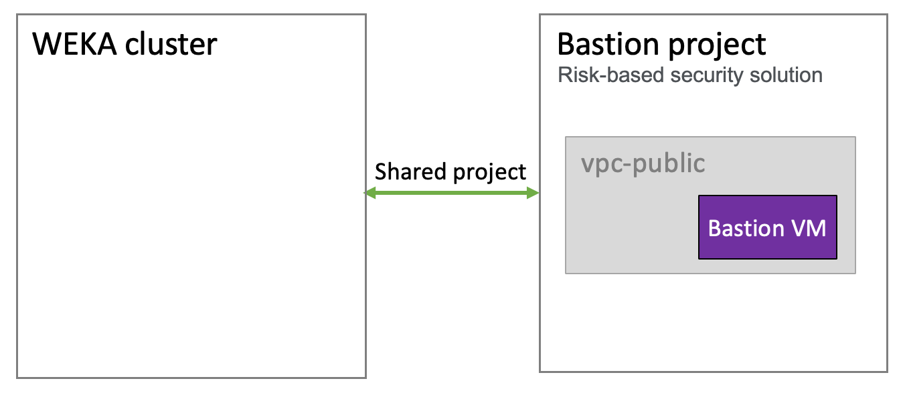

# WEKA project description

The WEKA project ultimately uses the internal GCP resources. A basic WEKA project includes a cluster with a few virtual networks (vnet), VMs (instances), a load balancer, DNS, cloud storage, a secret manager, and a few more elements that manage the resize of the cluster. The peering between all the virtual networks enables running the functions across all the networks.

<figure><figcaption>
Weka project on the GCP
</figcaption></figure>

### Resize cloud function operation

A resize cloud function in vnet-0 and a workload listener are deployed for auto-scale instances in GCP. Once a user sends a [request for resizing](auto-scale-instances-in-gcp.md) the number of instances in the cluster, the workload listener checks the _cluster state_ file in the cloud storage and triggers the resize cloud function if a resize is required. The cluster state __ file is an essential part of the resizing decision. It indicates states such as:

* Readiness of the cluster.
* The number of existing instances.
* The number of requested instances.

The secret manager retains the user name (usually _admin_) and the Terraform-generated password. The resize cloud function uses the user name and password to operate on the cluster instances.

## GCP subnet types

Depending on the required security level, you can deploy the WEKA project on one of the following subnet types:

* **Public subnet:** Use a public subnet within your VPC with an internet gateway, and allow public IP addresses for your instances.
* **Private subnet shared with a Bastion project:** Create a private subnet with a shared project with a Bastion project, a risk-based security solution used for authenticating communication with a public network, such as downloading the WEKA software from get.weka.io. The Bastion project includes a Bastion VM (host) acting as a network gateway. The relevant ports are open (by the Terraform files).&#x20;
* **Private subnet shared with a yum project:** If a connection to get.weka.io for downloading the WEKA software is impossible, create a private subnet with a yum repository containing the WEKA software. The relevant ports are open (by the Terraform files).

<figure><figcaption>
Private subnet shared with a Bastion project 
</figcaption></figure>

<figure><figcaption>
Private subnet shared with a yum project 
</figcaption></figure>
