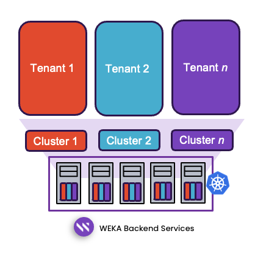
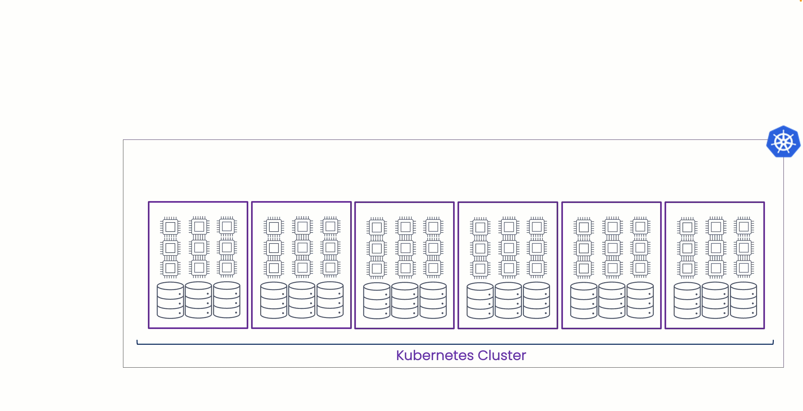

# Composable clusters for multi-tenancy in Kubernetes

## Overview

WEKA enables multi-tenancy by allowing multiple cluster deployments to share the same hardware while maintaining full resource isolation. This is achieved through a Kubernetes Operator that facilitates the composition of resource sets—including hosts, drives, cores, and memory—into independent clusters.

The process of creating these composable clusters is efficient, taking only a few minutes. Each cluster is allocated dedicated resources, ensuring consistent performance without interference from other tenants.

<figure><figcaption>
WEKA composable clusters for multi-tenancy concept
</figcaption></figure>

### Key benefits

* **Full resource isolation:** WEKA’s composable cluster model ensures complete isolation across drives, processors, and memory, providing a higher level of security than traditional multi-tenant models that rely on process isolation while sharing hardware resources. This architecture strengthens security boundaries, mitigates risks associated with legacy designs, and ensures both isolation and performance requirements are met.
* **Scalability and performance:** WEKA’s multi-tenant architecture is aligned with [NCP guidelines](#user-content-fn-1)[^1], including the common network reference architecture. Service providers can benefit from all of WEKA's scalability and performance in a multi-tenant deployment without compromise, while also simplifying network management and optimizing hardware utilization.
* **Enhanced security:** WEKA clusters leverage multiple layers of security. It employs a comprehensive encryption model, with both cluster-wide and per-filesystem customizations, which are fully supported in multi-tenant environments. Tenant management uses least-privileges role definitions to integrate with modernities like Kubernetes and CSI. Multi-tenancy encryption protect file and object data, and sensitive metadata such as file names and timestamps, with only the file size remaining unencrypted. Features such as Organizations add additional delegations within tenant clusters and help protect end user data from administrators while clients maintain full control over encryption management. This approach provides a higher level of protection than traditional models, ensuring data security and compliance.
* **Simplified management:** The WEKA Operator simplifies deployment and management of the WEKA Data Platform. It automates routine storage operations and enhances cluster resilience using custom resources. Real-time monitoring tools provide insights into usage and performance, enabling proactive management and seamless resource expansion.
* **Cost optimization and efficiency:** WEKA maximizes hardware utilization, reduces infrastructure costs, and streamlines configuration to minimize administrative overhead. This approach optimizes resource efficiency while lowering operational expenses.

## Composable clusters for multi-tenancy deployment at a glance

1. The WEKA Operator monitors the current state of the Kubernetes cluster.
2. When there are changes to WEKA custom resource definitions, the Operator applies the changes to the running Kubernetes cluster.
3. The changes are composed sets of resources, which bring about the creation of a new cluster, perform an expansion or contraction of an existing cluster, decommission a cluster, or perform an upgrade.

<figure><figcaption>
Composable clusters for multi-tenancy deployment at a glance
</figcaption></figure>

## Summary

WEKA’s multi-tenant architecture delivers a highly secure, scalable, and cost-efficient solution for service providers and enterprises. Composable clusters deliver full resource isolation and automated management to meet the ever-evolving demands of modern AI, ML, and high-performance computing environments.

For detailed deployment procedures and day-2 operations see:

* [weka-operator-deployments](weka-operator-deployments/ "mention")
* [weka-operator-day-2-operationsweka-operator-cli.md](weka-operator-day-2-operationsweka-operator-cli.md "mention")

[^1]: **NCP (NVIDIA Cloud Platform)**: A framework or set of guidelines for designing scalable, high-performance, and multi-tenant network architectures. It includes a common network reference architecture to ensure interoperability, optimize resource utilization, and simplify network management.
