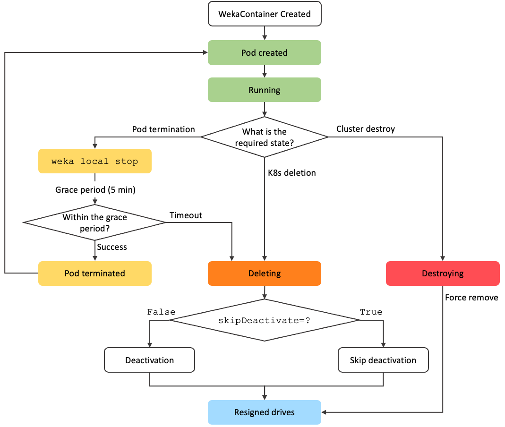

# WEKA Operator day-2 operations

0WEKA Operator day-2 operations maintain and optimize WEKA environments in Kubernetes clusters through three core operational areas:

* **Hardware maintenance**
  * Component replacement and node management
  * Hardware failure remediation
* **Cluster scaling**
  * Resource allocation optimization
  * Controlled cluster expansion
* **Cluster maintenance**
  * Configuration updates
  * Pod rotation
* **WekaContainer lifecycle management**

Administrators execute both planned maintenance and emergency responses while following standardized procedures to ensure high availability and minimize service disruption.

***

## **Hardware maintenance**

Hardware maintenance operations ensure cluster reliability and performance through systematic component management and failure response procedures. These operations span from routine preventive maintenance to critical component replacements.

**Key operations:**

* **Node management**
  * Graceful and forced node reboots.
  * Node replacement and removal.
  * Complete rack decommissioning procedures.
* **Container operations**
  * Container migration from failed nodes.
  * Container replacement on active nodes.
  * Container management on denylisted nodes.
* **Storage management**
  * Drive replacement in converged setups.
  * Storage integrity verification.
  * Component failure recovery.

Each procedure follows established protocols to maintain system stability and minimize service disruption during maintenance activities. The documented procedures enable administrators to execute both planned maintenance and emergency responses while preserving data integrity and system performance.

### **Before you begin**

Before performing any hardware maintenance or replacement tasks, ensure you have:

* Administrative access to your Kubernetes cluster.
* SSH access to the cluster nodes.
* `kubectl` command-line tool installed and configured.
* Proper backup of any critical data on the affected components.
* Required replacement hardware (if applicable).
* Maintenance window scheduled (if required).

***

### Perform standard verification steps

This procedure describes the standard verification steps for checking WEKA cluster health. Multiple procedures in this documentation refer to these verification steps to confirm successful completion of their respective tasks.

**Procedure**

1. Log in to the wekacontainer:

```
kubectl exec -it <container-pod-name> -n weka-operator-system -- /bin/bash
```

2. Check the WEKA cluster status:

```
weka status
```

<details>

<summary>Example</summary>

```bash
WekaIO v4.4.1 (CLI build 4.4.1)

       cluster: cluster-dev (f2dca61b-f7ca-4b41-8cc3-89dd475e9ff2)
        status: OK (14 backend containers UP, 6 drives UP)
    protection: 3+2 (Fully protected)
     hot spare: 0 failure domains
 drive storage: 22.09 TiB total, 21.86 TiB unprovisioned
         cloud: connected
       license: Unlicensed

     io status: STARTED 2 hours ago (14 io-nodes UP, 138 Buckets UP)
    link layer: Ethernet
       clients: 6 connected
         reads: 10.38 MiB/s (2659 IO/s)
        writes: 3.48 MiB/s (892 IO/s)
    operations: 3551 ops/s
        alerts: 35 active alerts, use `weka alerts` to list them
```

</details>

3. Check cluster containers.

```
weka cluster container
```

<details>

<summary>Example</summary>

```
root@ip-10-0-78-157:/# weka cluster container
HOST ID  HOSTNAME        CONTAINER                                     IPS          STATUS  REQUESTED ACTION  RELEASE  FAILURE DOMAIN  CORES  MEMORY   UPTIME    LAST FAILURE                   REQUESTED ACTION FAILURE
0        ip-10-0-64-189  drivex8d9a7bcex5994x4566x975fx3c3fbc7bf017    10.0.64.189  UP      NONE              4.4.1    AUTO            1      1.54 GB  1:50:17h  Action requested (1 hour ago)
1        ip-10-0-119-18  drivexffc61f84x840ax4b4cx9944xabdf5d50ffac    10.0.119.18  UP      NONE              4.4.1    AUTO            1      1.54 GB  2:03:14h
2        ip-10-0-96-125  drivexddded148xa18cx4d31xa785xfd19e87ae858    10.0.96.125  UP      NONE              4.4.1    AUTO            1      1.54 GB  1:48:09h  Action requested (1 hour ago)
3        ip-10-0-119-18  computex62e21720xd6efx4797xa1cbx2c134c316c95  10.0.119.18  UP      NONE              4.4.1    AUTO            1      2.94 GB  2:03:16h
4        ip-10-0-68-19   drivex89230786x4d11x4364x9eb8x9d061baad12b    10.0.68.19   UP      NONE              4.4.1    AUTO            1      1.54 GB  2:03:14h
5        ip-10-0-64-189  computexcc3cb8d2x4a7dx4f38x9087xa99c021dc51b  10.0.64.189  UP      NONE              4.4.1    AUTO            1      2.94 GB  1:50:17h  Action requested (1 hour ago)
6        ip-10-0-78-157  s3x86193fa8xd55ax4bb1xb8c7xc77f2841c76b       10.0.78.157  UP      NONE              4.4.1    AUTO            1      1.26 GB  2:03:13h
7        ip-10-0-96-125  s3x1783ddc3x91a5x4fa9xa7aax83a88515418d       10.0.96.125  UP      NONE              4.4.1    AUTO            1      1.26 GB  1:53:18h  Action requested (1 hour ago)
8        ip-10-0-85-230  computexe4edde12xf27dx4745xafacx907dd046d202  10.0.85.230  UP      NONE              4.4.1    AUTO            1      2.94 GB  2:03:17h
9        ip-10-0-68-19   computexb1c3fad3xe566x4cd0xa7e9xe1cd885e4f43  10.0.68.19   UP      NONE              4.4.1    AUTO            1      2.94 GB  2:03:17h
10       ip-10-0-78-157  drivex34be6929x2711x42e9xa4afx532411fe3290    10.0.78.157  UP      NONE              4.4.1    AUTO            1      1.54 GB  2:03:15h
11       ip-10-0-85-230  drivexa994b565x00c7x4d12x887ax611926a9f6cc    10.0.85.230  UP      NONE              4.4.1    AUTO            1      1.54 GB  2:03:16h
12       ip-10-0-78-157  computex27909856x161ax4d29x9b86x233d94ff5c21  10.0.78.157  UP      NONE              4.4.1    AUTO            1      2.94 GB  2:03:15h
13       ip-10-0-96-125  computex4769a665x1c29x4fcax899axc8f55b7207f8  10.0.96.125  UP      NONE              4.4.1    AUTO            1      2.94 GB  1:49:37h  Action requested (1 hour ago)
14       ip-10-0-74-235  22b88fbd24c8client                            10.0.74.235  UP      NONE              4.4.1                    1      1.36 GB  1:18:27h
15       ip-10-0-94-134  22b88fbd24c8client                            10.0.94.134  UP      NONE              4.4.1                    1      1.36 GB  0:37:55h
16       ip-10-0-85-177  22b88fbd24c8client                            10.0.85.177  UP      NONE              4.4.1                    1      1.36 GB  1:18:24h
17       ip-10-0-71-46   22b88fbd24c8client                            10.0.71.46   UP      NONE              4.4.1                    1      1.36 GB  1:18:17h
18       ip-10-0-71-140  22b88fbd24c8client                            10.0.71.140  UP      NONE              4.4.1                    1      1.36 GB  0:37:22h
19       ip-10-0-92-127  22b88fbd24c8client                            10.0.92.127  UP      NONE              4.4.1                    1      1.36 GB  1:18:09h
```

</details>

4. Check the WEKA filesystem status.

```
weka fs
```

<details>

<summary>Example</summary>

```objectivec
root@ip-10-0-78-157:/# weka fs
FILESYSTEM ID  FILESYSTEM NAME  USED SSD   AVAILABLE SSD  USED TOTAL  AVAILABLE TOTAL  THIN PROVISIONED  THIN PROVISIONED MINIMUM SSD  THIN PROVISIONED MAXIMUM SSD
0              .config_fs       172.03 KB  107.37 GB      172.03 KB   107.37 GB        True              10.73 GB                      107.37 GB
1              default          2.72 GB    2.42 TB        2.72 GB     2.42 TB          True              242.94 GB                     2.42 TB
```

</details>

5. Verify the status of the WEKA cluster processes is UP.

```
weka cluster process
```

<details>

<summary>Example</summary>

```
PROCESS ID  CONTAINER ID  SLOT IN HOST  HOSTNAME         CONTAINER           IPS           STATUS  RELEASE  ROLES       NETWORK  CPU  MEMORY   UPTIME    LAST FAILURE
0           0             0             ip-10-0-78-96    computexxxxx        10.0.78.96    UP      4.4.1    MANAGEMENT  UDP           N/A      0:08:11h  Host joined a new cluster (8 minutes ago)
1           0             1             ip-10-0-78-96    computexxxxx        10.0.78.96    UP      4.4.1    COMPUTE     UDP      3    2.94 GB  0:08:04h
20          1             0             ip-10-0-107-120  computexxxxx        10.0.107.120  UP      4.4.1    MANAGEMENT  UDP           N/A      0:08:11h  Host joined a new cluster (8 minutes ago)
21          1             1             ip-10-0-107-120  computexxxxx        10.0.107.120  UP      4.4.1    COMPUTE     UDP      3    2.94 GB  0:08:03h
40          2             0             ip-10-0-78-96    drivexxxxx          10.0.78.96    UP      4.4.1    MANAGEMENT  UDP           N/A      0:08:12h
41          2             1             ip-10-0-78-96    drivexxxxx          10.0.78.96    UP      4.4.1    DRIVES      UDP      1    1.54 GB  0:08:05h
60          3             0             ip-10-0-126-172  drivexxxxx          10.0.126.172  UP      4.4.1    MANAGEMENT  UDP           N/A      0:08:11h  Host joined a new cluster (8 minutes ago)
61          3             1             ip-10-0-126-172  drivexxxxx          10.0.126.172  UP      4.4.1    DRIVES      UDP      1    1.54 GB  0:08:06h
80          4             0             ip-10-0-76-148   drivexxxxx          10.0.76.148   UP      4.4.1    MANAGEMENT  UDP           N/A      0:08:11h  Host joined a new cluster (8 minutes ago)
81          4             1             ip-10-0-76-148   drivexxxxx          10.0.76.148   UP      4.4.1    DRIVES      UDP      1    1.54 GB  0:08:06h
100         5             0             ip-10-0-66-46    computexxxxx        10.0.66.46    UP      4.4.1    MANAGEMENT  UDP           N/A      0:08:11h  Host joined a new cluster (8 minutes ago)
101         5             1             ip-10-0-66-46    computexxxxx        10.0.66.46    UP      4.4.1    COMPUTE     UDP      1    2.94 GB  0:08:06h
120         6             0             ip-10-0-64-105   computexxxxx        10.0.64.105   UP      4.4.1    MANAGEMENT  UDP           N/A      0:08:11h  Host joined a new cluster (8 minutes ago)
121         6             1             ip-10-0-64-105   computexxxxx        10.0.64.105   UP      4.4.1    COMPUTE     UDP      3    2.94 GB  0:08:04h
140         7             0             ip-10-0-126-172  computexxxxx        10.0.126.172  UP      4.4.1    MANAGEMENT  UDP           N/A      0:08:11h  Host joined a new cluster (8 minutes ago)
141         7             1             ip-10-0-126-172  computexxxxx        10.0.126.172  UP      4.4.1    COMPUTE     UDP      3    2.94 GB  0:08:04h
160         8             0             ip-10-0-107-120  drivexxxxx          10.0.107.120  UP      4.4.1    MANAGEMENT  UDP           N/A      0:08:11h  Host joined a new cluster (8 minutes ago)
161         8             1             ip-10-0-107-120  drivexxxxx          10.0.107.120  UP      4.4.1    DRIVES      UDP      1    1.54 GB  0:08:05h
180         9             0             ip-10-0-64-105   drivexxxxx          10.0.64.105   UP      4.4.1    MANAGEMENT  UDP           N/A      0:08:11h  Host joined a new cluster (8 minutes ago)
181         9             1             ip-10-0-64-105   drivexxxxx          10.0.64.105   UP      4.4.1    DRIVES      UDP      1    1.54 GB  0:08:05h
200         10            0             ip-10-0-82-61    drivexxxxx          10.0.82.61    UP      4.4.1    MANAGEMENT  UDP           N/A      0:08:11h  Host joined a new cluster (8 minutes ago)
201         10            1             ip-10-0-82-61    drivexxxxx          10.0.82.61    UP      4.4.1    DRIVES      UDP      1    1.54 GB  0:08:05h
220         11            0             ip-10-0-82-61    computexxxxx        10.0.82.61    UP      4.4.1    MANAGEMENT  UDP           N/A      0:08:11h  Host joined a new cluster (8 minutes ago)
221         11            1             ip-10-0-82-61    computexxxxx        10.0.82.61    UP      4.4.1    COMPUTE     UDP      3    2.94 GB  0:08:03h
240         12            0             ip-10-0-76-148   computexxxxx        10.0.76.148   UP      4.4.1    MANAGEMENT  UDP           N/A      0:03:36h  Configuration snapshot pulled (3 minutes ago)
241         12            1             ip-10-0-76-148   computexxxxx        10.0.76.148   UP      4.4.1    COMPUTE     UDP      3    2.94 GB  0:03:32h
260         13            0             ip-10-0-66-46    drivexxxxx          10.0.66.46    UP      4.4.1    MANAGEMENT  UDP           N/A      0:03:36h  Configuration snapshot pulled (3 minutes ago)
261         13            1             ip-10-0-66-46    drivexxxxx          10.0.66.46    UP      4.4.1    DRIVES      UDP      3    1.54 GB  0:03:32h
```

</details>

6. Check all pods are up and running.

```
kubectl get pods --all-namespaces -o wide
```

<details>

<summary>Example</summary>

```
$ kubectl get pods --all-namespaces -o wide
NAMESPACE              NAME                                               READY   STATUS    RESTARTS         AGE     IP            NODE             NOMINATED NODE   READINESS GATES
csi-wekafs             csi-wekafs-controller-5b7cd75846-csrch             6/6     Running   26 (3m38s ago)   14m     10.42.2.17    3.252.130.226    <none>           <none>
csi-wekafs             csi-wekafs-controller-5b7cd75846-hb6z2             6/6     Running   26 (3m37s ago)   14m     10.42.2.15    3.252.130.226    <none>           <none>
csi-wekafs             csi-wekafs-node-2tfjs                              3/3     Running   8 (3m15s ago)    82m     10.42.4.6     54.194.172.141   <none>           <none>
csi-wekafs             csi-wekafs-node-5dgcf                              3/3     Running   15 (3m41s ago)   82m     10.42.5.8     3.253.198.136    <none>           <none>
csi-wekafs             csi-wekafs-node-h562s                              3/3     Running   8 (3m4s ago)     82m     10.42.0.15    54.229.216.116   <none>           <none>
csi-wekafs             csi-wekafs-node-jsh8h                              3/3     Running   14 (4m10s ago)   82m     10.42.2.10    3.252.130.226    <none>           <none>
csi-wekafs             csi-wekafs-node-qsjrv                              3/3     Running   8 (3m39s ago)    82m     10.42.1.6     52.214.4.90      <none>           <none>
csi-wekafs             csi-wekafs-node-sd9tb                              3/3     Running   8 (3m16s ago)    82m     10.42.3.7     54.229.178.93    <none>           <none>
kube-system            coredns-7b98449c4-29ph6                            1/1     Running   0                14m     10.42.2.14    3.252.130.226    <none>           <none>
kube-system            local-path-provisioner-595dcfc56f-ffsxr            1/1     Running   0                14m     10.42.2.12    3.252.130.226    <none>           <none>
kube-system            metrics-server-cdcc87586-xzkt8                     1/1     Running   0                14m     10.42.2.11    3.252.130.226    <none>           <none>
kube-system            node-shell-605368a3-dcc4-4680-9063-2c9a8e7635ed    0/1     Unknown   0                7m5s    10.0.71.46    54.229.216.116   <none>           <none>
kube-system            traefik-d7c9c5778-jx7q5                            1/1     Running   0                14m     10.42.2.13    3.252.130.226    <none>           <none>
weka-operator-system   cluster-dev-clientsnew-3.252.130.226               1/1     Running   0                14m     10.0.94.134   3.252.130.226    <none>           <none>
weka-operator-system   cluster-dev-clientsnew-3.253.198.136               1/1     Running   0                14m     10.0.71.140   3.253.198.136    <none>           <none>
weka-operator-system   cluster-dev-clientsnew-52.214.4.90                 1/1     Running   0                4m52s   10.0.74.235   52.214.4.90      <none>           <none>
weka-operator-system   cluster-dev-clientsnew-54.194.172.141              1/1     Running   0                5m38s   10.0.85.177   54.194.172.141   <none>           <none>
weka-operator-system   cluster-dev-clientsnew-54.229.178.93               1/1     Running   0                4m43s   10.0.92.127   54.229.178.93    <none>           <none>
weka-operator-system   cluster-dev-clientsnew-54.229.216.116              1/1     Running   0                4m40s   10.0.71.46    54.229.216.116   <none>           <none>
weka-operator-system   weka-driver-builder                                1/1     Running   0                5m40s   10.42.2.19    3.252.130.226    <none>           <none>
weka-operator-system   weka-operator-controller-manager-bcf48df44-lk6cx   2/2     Running   0                14m     10.42.2.16    3.252.130.226    <none>           <none>
```

</details>

***


### Force reboot a machine

A force reboot may be necessary when a machine becomes unresponsive or encounters a critical error that cannot be resolved through standard troubleshooting. This task ensures the machine restarts and resumes normal operation.

#### **Procedure**

**Phase 1:** [#perform-standard-verification-steps](weka-operator-day-2-operations.md#perform-standard-verification-steps "mention").

**Phase 2:** [**Cordon**](#user-content-fn-1)[^1] **and evict backend k8s nodes.**

To cordon and evict a node, run the following commands. Replace `<k8s_node_IP>` with the target k8s node's IP address.

1. Cordon the backend k8s node:

```
kubectl cordon <k8s_node_ip>
```

Example:

```
kubectl cordon 18.201.176.181
node/18.201.176.181 cordoned
```

2. Evict the running pods ensuring data is removed. For example, drain[^2] the backend k8s node:

```
kubectl drain <k8s_node_ip> --delete-emptydir-data --ignore-daemonsets --force
```

<details>

<summary>Example</summary>

```bash
$kubectl drain 18.201.176.181 --delete-local-data --ignore-daemonsets --force
Flag --delete-local-data has been deprecated, This option is deprecated and will be deleted. Use --delete-emptydir-data.
node/18.201.176.181 already cordoned
evicting pod weka-operator-system/cluster-dev-drive-8d9a7bce-5994-4566-975f-3c3fbc7bf017
evicting pod weka-operator-system/cluster-dev-compute-cc3cb8d2-4a7d-4f38-9087-a99c021dc51b
pod/cluster-dev-compute-cc3cb8d2-4a7d-4f38-9087-a99c021dc51b evicted
pod/cluster-dev-drive-8d9a7bce-5994-4566-975f-3c3fbc7bf017 evicted
node/18.201.176.181 drained
```

</details>

3. Validate node status:

```
kubectl get nodes
```

<details>

<summary>Example</summary>

```
NAME             STATUS                     ROLES                       AGE     VERSION
18.201.138.175   Ready                      control-plane,etcd,master   3h24m   v1.30.6+k3s1
18.201.176.181   Ready,SchedulingDisabled   control-plane,etcd,master   3h24m   v1.30.6+k3s1
34.240.186.72    Ready                      control-plane,etcd,master   3h25m   v1.30.6+k3s1
34.243.146.18    Ready                      control-plane,etcd,master   3h24m   v1.30.6+k3s1
34.245.228.117   Ready                      control-plane,etcd,master   3h25m   v1.30.6+k3s1
34.255.190.208   Ready                      control-plane,etcd,master   3h24m   v1.30.6+k3s1
```

</details>

4. Verify pod statuses across namespaces:

```
kubectl get pods --all-namespaces -o wide
```

<details>

<summary>Example</summary>

```
NAMESPACE              NAME                                                       READY   STATUS      RESTARTS   AGE
kube-system            coredns-7b98449c4-stzbf                                    1/1     Running     0          3h19m
kube-system            helm-install-traefik-65gnb                                 0/1     Completed   1          3h19m
kube-system            helm-install-traefik-crd-nnstz                             0/1     Completed   0          3h19m
kube-system            local-path-provisioner-595dcfc56f-ln82j                    1/1     Running     0          3h19m
kube-system            metrics-server-cdcc87586-ll9lf                             1/1     Running     0          3h19m
kube-system            traefik-d7c9c5778-qtbgz                                    1/1     Running     0          3h19m
weka-operator-system   cluster-dev-compute-27909856-161a-4d29-9b86-233d94ff5c21   1/1     Running     0          122m
weka-operator-system   cluster-dev-compute-4769a665-1c29-4fca-899a-c8f55b7207f8   1/1     Running     0          108m
weka-operator-system   cluster-dev-compute-62e21720-d6ef-4797-a1cb-2c134c316c95   1/1     Running     0          121m
weka-operator-system   cluster-dev-compute-b1c3fad3-e566-4cd0-a7e9-e1cd885e4f43   1/1     Running     0          121m
weka-operator-system   cluster-dev-compute-cc3cb8d2-4a7d-4f38-9087-a99c021dc51b   1/1     Running     0          113m
weka-operator-system   cluster-dev-compute-e4edde12-f27d-4745-afac-907dd046d202   1/1     Running     0          121m
weka-operator-system   cluster-dev-drive-34be6929-2711-42e9-a4af-532411fe3290     1/1     Running     0          122m
weka-operator-system   cluster-dev-drive-89230786-4d11-4364-9eb8-9d061baad12b     1/1     Running     0          122m
weka-operator-system   cluster-dev-drive-8d9a7bce-5994-4566-975f-3c3fbc7bf017     1/1     Running     0          113m
weka-operator-system   cluster-dev-drive-a994b565-00c7-4d12-887a-611926a9f6cc     1/1     Running     0          122m
weka-operator-system   cluster-dev-drive-ddded148-a18c-4d31-a785-fd19e87ae858     1/1     Running     0          106m
weka-operator-system   cluster-dev-drive-ffc61f84-840a-4b4c-9944-abdf5d50ffac     1/1     Running     0          122m
weka-operator-system   cluster-dev-envoy-d8942922-b183-4392-bf9d-92e6a3c32a1e     1/1     Running     0          112m
weka-operator-system   cluster-dev-envoy-ed3f917a-f4e5-42a7-93b2-b2a933f45c7c     1/1     Running     0          121m
weka-operator-system   cluster-dev-s3-1783ddc3-91a5-4fa9-a7aa-83a88515418d        1/1     Running     0          112m
weka-operator-system   cluster-dev-s3-86193fa8-d55a-4bb1-b8c7-c77f2841c76b        1/1     Running     0          121m
weka-operator-system   weka-driver-dist                                           1/1     Running     0          178m
weka-operator-system   weka-operator-controller-manager-bcf48df44-phb75           2/2     Running     0          3h17m
```

</details>

**Phase 3: Ensure the WEKA containers are marked as drained.**

1.  List the cluster backend containers.\
    Run the following command to display the current status of all WEKA containers in the k8s nodes:

    <pre><code><strong>weka cluster container
    </strong></code></pre>
2. Check the status of the WEKA containers.\
   In the command output, locate the `STATUS` column for the relevant containers. Verify that it displays `DRAINED` for the host and backend container.&#x20;

<details>

<summary>Example</summary>

```
HOST ID  HOSTNAME        CONTAINER                                     IPS          STATUS          REQUESTED ACTION  RELEASE  FAILURE DOMAIN  CORES  MEMORY   UPTIME    LAST FAILURE                   REQUESTED ACTION FAILURE
0        ip-10-0-64-189  drivex8d9a7bcex5994x4566x975fx3c3fbc7bf017    10.0.64.189  DRAINED (DOWN)  STOP              4.4.1    AUTO            1      1.54 GB            Action requested (1 hour ago)
1        ip-10-0-119-18  drivexffc61f84x840ax4b4cx9944xabdf5d50ffac    10.0.119.18  UP              NONE              4.4.1    AUTO            1      1.54 GB  2:06:45h
2        ip-10-0-96-125  drivexddded148xa18cx4d31xa785xfd19e87ae858    10.0.96.125  UP              NONE              4.4.1    AUTO            1      1.54 GB  1:51:40h  Action requested (1 hour ago)
3        ip-10-0-119-18  computex62e21720xd6efx4797xa1cbx2c134c316c95  10.0.119.18  UP              NONE              4.4.1    AUTO            1      2.94 GB  2:06:47h
4        ip-10-0-68-19   drivex89230786x4d11x4364x9eb8x9d061baad12b    10.0.68.19   UP              NONE              4.4.1    AUTO            1      1.54 GB  2:06:45h
5        ip-10-0-64-189  computexcc3cb8d2x4a7dx4f38x9087xa99c021dc51b  10.0.64.189  DRAINED (DOWN)  STOP              4.4.1    AUTO            1      2.94 GB            Action requested (1 hour ago)
6        ip-10-0-78-157  s3x86193fa8xd55ax4bb1xb8c7xc77f2841c76b       10.0.78.157  UP              NONE              4.4.1    AUTO            1      1.26 GB  2:06:44h
7        ip-10-0-96-125  s3x1783ddc3x91a5x4fa9xa7aax83a88515418d       10.0.96.125  UP              NONE              4.4.1    AUTO            1      1.26 GB  1:56:49h  Action requested (1 hour ago)
8        ip-10-0-85-230  computexe4edde12xf27dx4745xafacx907dd046d202  10.0.85.230  UP              NONE              4.4.1    AUTO            1      2.94 GB  2:06:48h
9        ip-10-0-68-19   computexb1c3fad3xe566x4cd0xa7e9xe1cd885e4f43  10.0.68.19   UP              NONE              4.4.1    AUTO            1      2.94 GB  2:06:48h
10       ip-10-0-78-157  drivex34be6929x2711x42e9xa4afx532411fe3290    10.0.78.157  UP              NONE              4.4.1    AUTO            1      1.54 GB  2:06:46h
11       ip-10-0-85-230  drivexa994b565x00c7x4d12x887ax611926a9f6cc    10.0.85.230  UP              NONE              4.4.1    AUTO            1      1.54 GB  2:06:47h
12       ip-10-0-78-157  computex27909856x161ax4d29x9b86x233d94ff5c21  10.0.78.157  UP              NONE              4.4.1    AUTO            1      2.94 GB  2:06:46h
13       ip-10-0-96-125  computex4769a665x1c29x4fcax899axc8f55b7207f8  10.0.96.125  UP              NONE              4.4.1    AUTO            1      2.94 GB  1:53:08h  Action requested (1 hour ago)
14       ip-10-0-74-235  22b88fbd24c8client                            10.0.74.235  UP              NONE              4.4.1                    1      1.36 GB  1:21:58h
15       ip-10-0-94-134  22b88fbd24c8client                            10.0.94.134  UP              NONE              4.4.1                    1      1.36 GB  0:41:26h
16       ip-10-0-85-177  22b88fbd24c8client                            10.0.85.177  UP              NONE              4.4.1                    1      1.36 GB  1:21:55h
17       ip-10-0-71-46   22b88fbd24c8client                            10.0.71.46   UP              NONE              4.4.1                    1      1.36 GB  1:21:48h
18       ip-10-0-71-140  22b88fbd24c8client                            10.0.71.140  UP              NONE              4.4.1                    1      1.36 GB  0:40:53h
19       ip-10-0-92-127  22b88fbd24c8client                            10.0.92.127  UP              NONE              4.4.1                    1      1.36 GB  1:21:40h
```

</details>

**Phase 4: Force a reboot on all backend k8s nodes.**\
Use the `reboot -f` command to force a reboot on each backend k8s node.

Example:

```
sudo reboot -f
Rebooting.
```

After running this command, the container restarts immediately. Repeat for all k8's nodes one by one in your environment.

**Phase 5: Uncordon the backend k8s node and verify WEKA cluster status.**

1. Uncordon the backend k8s node:

```
kubectl uncordon <k8s_node_ip>
```

Example:

```
kubectl uncordon 18.201.176.181
node/18.201.176.181 uncordoned
```

2. Access the WEKA Operator in the backend k8s node:

```
kubectl exec -it <weka_container_pod_name> -n weka-operator-system -- /bin/bash
```

3. Verify the weka drives status:

```
weka cluster drive
```

<details>

<summary>Example</summary>

```
DISK ID  UUID                                  HOSTNAME        NODE ID  SIZE      STATUS      LIFETIME % USED  ATTACHMENT  DRIVE STATUS
0        8406a082-cc8d-40a1-87b4-90f7053dc3f2  ip-10-0-119-18  21       6.82 TiB  ACTIVE      0                OK          OK
1        01738d49-f2eb-49aa-8e39-6b5ac7f12727  ip-10-0-68-19   81       6.82 TiB  ACTIVE      0                OK          OK
2        8684695a-9a7f-4a39-801c-7019bd5fd4ea  ip-10-0-64-189  1        6.82 TiB  PHASING_IN  0                OK          OK
3        ca4cacf6-4355-420d-a790-e0e58670e0ec  ip-10-0-96-125  41       6.82 TiB  ACTIVE      0                OK          OK
4        b410544f-9fef-42a9-a24d-c73ffd33cefc  ip-10-0-78-157  201      6.82 TiB  ACTIVE      0                OK          OK
5        16c55940-cf2c-4bf9-8d4b-d05f61be7264  ip-10-0-85-230  221      6.82 TiB  ACTIVE      0                OK          OK
```

</details>

4. [#perform-the-standard-verification-steps](weka-operator-day-2-operations.md#perform-the-standard-verification-steps "mention").

Ensure all the pods, weka containers and the cluster is in a healthy state (`Fully Protected`) and IO operations are running (`STARTED`). Monitor the redistribution progress and alerts.

**Phase 6: Cordon and drain all client k8s nodes.**

To cordon and drain a node, run the following commands. Replace `<k8s_node_IP>` with the target k8s node's IP address.

1. Cordon the client k8s node to mark it as unschedulable:

```
kubectl cordon <k8s_node_ip>
```

Example:

```
kubectl cordon 3.252.130.226
node/3.252.130.226 cordoned
```

2. Evict the the workload.\
   For example:  Drain the client k8s node to evict running pods, ensuring data is removed:

```
kubectl drain <k8s_node_ip> --delete-emptydir-data --ignore-daemonsets --force
```

<details>

<summary>Example </summary>

```
$kubectl drain 3.252.130.226 --delete-local-data --ignore-daemonsets --force
Flag --delete-local-data has been deprecated, This option is deprecated and will be deleted. Use --delete-emptydir-data.
node/3.252.130.226 already cordoned
Warning: ignoring DaemonSet-managed Pods: csi-wekafs/csi-wekafs-node-jsh8h; deleting Pods that declare no controller: default/csi-app-on-dir-api2
evicting pod weka-operator-system/cluster-dev-clientsnew-3.252.130.226
evicting pod default/csi-app-on-dir-api2
pod/csi-app-on-dir-api2 evicted
pod/cluster-dev-clientsnew-3.252.130.226 evicted
node/3.252.130.226 drainedTBD

$ kubectl get nodes
NAME             STATUS                     ROLES                       AGE     VERSION
3.252.130.226    Ready,SchedulingDisabled   control-plane,etcd,master   3h13m   v1.30.6+k3s1
3.253.198.136    Ready,SchedulingDisabled   control-plane,etcd,master   3h13m   v1.30.6+k3s1
52.214.4.90      Ready,SchedulingDisabled   control-plane,etcd,master   3h14m   v1.30.6+k3s1
54.194.172.141   Ready,SchedulingDisabled   control-plane,etcd,master   3h13m   v1.30.6+k3s1
54.229.178.93    Ready,SchedulingDisabled   control-plane,etcd,master   3h13m   v1.30.6+k3s1
54.229.216.116   Ready,SchedulingDisabled   control-plane,etcd,master   3h14m   v1.30.6+k3s1

$ kubectl get pods --all-namespaces -o wide
NAMESPACE              NAME                                               READY   STATUS    RESTARTS      AGE     IP           NODE             NOMINATED NODE   READINESS GATES
csi-wekafs             csi-wekafs-controller-5b7cd75846-csrch             0/6     Pending   0             2m41s   <none>       <none>           <none>           <none>
csi-wekafs             csi-wekafs-controller-5b7cd75846-hb6z2             0/6     Pending   0             2m41s   <none>       <none>           <none>           <none>
csi-wekafs             csi-wekafs-node-2tfjs                              3/3     Running   0             71m     10.42.4.5    54.194.172.141   <none>           <none>
csi-wekafs             csi-wekafs-node-5dgcf                              3/3     Running   7 (55m ago)   71m     10.42.5.5    3.253.198.136    <none>           <none>
csi-wekafs             csi-wekafs-node-h562s                              3/3     Running   0             71m     10.42.0.11   54.229.216.116   <none>           <none>
csi-wekafs             csi-wekafs-node-jsh8h                              3/3     Running   6 (56m ago)   71m     10.42.2.6    3.252.130.226    <none>           <none>
csi-wekafs             csi-wekafs-node-qsjrv                              3/3     Running   0             71m     10.42.1.4    52.214.4.90      <none>           <none>
csi-wekafs             csi-wekafs-node-sd9tb                              3/3     Running   0             71m     10.42.3.4    54.229.178.93    <none>           <none>
kube-system            coredns-7b98449c4-29ph6                            0/1     Pending   0             2m41s   <none>       <none>           <none>           <none>
kube-system            local-path-provisioner-595dcfc56f-ffsxr            0/1     Pending   0             2m41s   <none>       <none>           <none>           <none>
kube-system            metrics-server-cdcc87586-xzkt8                     0/1     Pending   0             2m41s   <none>       <none>           <none>           <none>
kube-system            traefik-d7c9c5778-jx7q5                            0/1     Pending   0             2m41s   <none>       <none>           <none>           <none>
weka-operator-system   cluster-dev-clientsnew-3.252.130.226               0/1     Pending   0             2m51s   <none>       <none>           <none>           <none>
weka-operator-system   cluster-dev-clientsnew-3.253.198.136               0/1     Pending   0             2m50s   <none>       <none>           <none>           <none>
weka-operator-system   weka-operator-controller-manager-bcf48df44-lk6cx   0/2     Pending   0             2m41s   <none>       <none>           <none>           <none>
```

</details>

3. Force reboot all client nodes. \
   Example for one client k8s node:

```
sudo reboot -f
Rebooting.
```

2. After the client k8s nodes are up, uncordon the client k8s node.\
   Example for one client k8s node:

```
kubectl uncordon <k8s_node_ip>
```

Example:

```
kubectl uncordon 3.252.130.226
node/3.252.130.226 uncordoned
```

3. Verify that after uncordoning all client Kubernetes nodes:
   * All regular pods remain scheduled and running on those nodes.
   * All client containers within the cluster are joined and operational.
   * Only pods designated for data I/O operations are evicted.

```bash
kubectl get pods --all-namespaces -o wide
```

<details>

<summary>Example</summary>

```
$ kubectl get pods --all-namespaces -o wide
NAMESPACE              NAME                                               READY   STATUS    RESTARTS         AGE     IP            NODE             NOMINATED NODE   READINESS GATES
csi-wekafs             csi-wekafs-controller-5b7cd75846-csrch             6/6     Running   26 (3m38s ago)   14m     10.42.2.17    3.252.130.226    <none>           <none>
csi-wekafs             csi-wekafs-controller-5b7cd75846-hb6z2             6/6     Running   26 (3m37s ago)   14m     10.42.2.15    3.252.130.226    <none>           <none>
csi-wekafs             csi-wekafs-node-2tfjs                              3/3     Running   8 (3m15s ago)    82m     10.42.4.6     54.194.172.141   <none>           <none>
csi-wekafs             csi-wekafs-node-5dgcf                              3/3     Running   15 (3m41s ago)   82m     10.42.5.8     3.253.198.136    <none>           <none>
csi-wekafs             csi-wekafs-node-h562s                              3/3     Running   8 (3m4s ago)     82m     10.42.0.15    54.229.216.116   <none>           <none>
csi-wekafs             csi-wekafs-node-jsh8h                              3/3     Running   14 (4m10s ago)   82m     10.42.2.10    3.252.130.226    <none>           <none>
csi-wekafs             csi-wekafs-node-qsjrv                              3/3     Running   8 (3m39s ago)    82m     10.42.1.6     52.214.4.90      <none>           <none>
csi-wekafs             csi-wekafs-node-sd9tb                              3/3     Running   8 (3m16s ago)    82m     10.42.3.7     54.229.178.93    <none>           <none>
kube-system            coredns-7b98449c4-29ph6                            1/1     Running   0                14m     10.42.2.14    3.252.130.226    <none>           <none>
kube-system            local-path-provisioner-595dcfc56f-ffsxr            1/1     Running   0                14m     10.42.2.12    3.252.130.226    <none>           <none>
kube-system            metrics-server-cdcc87586-xzkt8                     1/1     Running   0                14m     10.42.2.11    3.252.130.226    <none>           <none>
kube-system            node-shell-605368a3-dcc4-4680-9063-2c9a8e7635ed    0/1     Unknown   0                7m5s    10.0.71.46    54.229.216.116   <none>           <none>
kube-system            traefik-d7c9c5778-jx7q5                            1/1     Running   0                14m     10.42.2.13    3.252.130.226    <none>           <none>
weka-operator-system   cluster-dev-clientsnew-3.252.130.226               1/1     Running   0                14m     10.0.94.134   3.252.130.226    <none>           <none>
weka-operator-system   cluster-dev-clientsnew-3.253.198.136               1/1     Running   0                14m     10.0.71.140   3.253.198.136    <none>           <none>
weka-operator-system   cluster-dev-clientsnew-52.214.4.90                 1/1     Running   0                4m52s   10.0.74.235   52.214.4.90      <none>           <none>
weka-operator-system   cluster-dev-clientsnew-54.194.172.141              1/1     Running   0                5m38s   10.0.85.177   54.194.172.141   <none>           <none>
weka-operator-system   cluster-dev-clientsnew-54.229.178.93               1/1     Running   0                4m43s   10.0.92.127   54.229.178.93    <none>           <none>
weka-operator-system   cluster-dev-clientsnew-54.229.216.116              1/1     Running   0                4m40s   10.0.71.46    54.229.216.116   <none>           <none>
weka-operator-system   weka-driver-builder                                1/1     Running   0                5m40s   10.42.2.19    3.252.130.226    <none>           <none>
weka-operator-system   weka-operator-controller-manager-bcf48df44-lk6cx   2/2     Running   0                14m     10.42.2.16    3.252.130.226    <none>           <none>
```

</details>

**Phase 7: Force a reboot on all client k8s nodes.**\
Use the `reboot -f` command to force a reboot on each client k8s node.

Example for one client k8s node:

```
sudo reboot -f
Rebooting.
```

After running this command, the client node restarts immediately. Repeat for all client nodes in your environment.

**Phase 8: Uncordon all client k8s nodes.**

1. Once the client k8s nodes are back online, uncordon them to restore their availability for scheduling workloads. Example command for uncordoning a single client k8s node:

```
kubectl uncordon <k8s_node_ip>
```

<details>

<summary>Example</summary>

```
$ kubectl uncordon 3.252.130.226  
node/3.252.130.226 uncordoned
```

</details>

2. Verify pod status across all k8s nodes to confirm that all pods are running as expected:

```bash
kubectl get pods --all-namespaces -o wide
```

3. Validate WEKA cluster status to ensure all containers are operational:

```
weka cluster container
```

See examples in [#perform-standard-verification-steps](weka-operator-day-2-operations.md#perform-standard-verification-steps "mention").

***


### Remove a rack or Kubernetes node

Removing a rack or Kubernetes (k8s) node is necessary when you need to decommission hardware, replace failed components, or reconfigure your cluster. This procedure guides you through safely removing nodes without disrupting your system operations.

#### Procedure

1. Create failure domain labels for your nodes:&#x20;
   1.  Label nodes with two machines per failure domain:

       ```bash
       kubectl label nodes 18.201.172.13 34.240.124.21 weka.io/failure-domain=x1
       kubectl label nodes 18.202.166.64 3.255.93.171 weka.io/failure-domain=x2
       kubectl label nodes 18.203.137.243 34.254.151.249 weka.io/failure-domain=x3
       kubectl label nodes 3.254.112.77 54.247.13.91 weka.io/failure-domain=x4
       kubectl label nodes 34.245.203.245 63.35.225.98 weka.io/failure-domain=x5
       kubectl label nodes 52.215.56.158 54.247.20.174 weka.io/failure-domain=x6
       ```

       b. Label nodes with one machine per failure domain:

       ```bash
       kubectl label nodes 3.255.150.131 weka.io/failure-domain=x7
       kubectl label nodes 52.210.49.97 weka.io/failure-domain=x8
       ```
2.  Apply the NoSchedule taint to nodes in failure domains:

    ```bash
    for node in 18.201.172.13 34.240.124.21 18.202.166.64 3.255.93.171 18.203.137.243 34.254.151.249 3.254.112.77 54.247.13.91 34.245.203.245 63.35.225.98 52.215.56.158 54.247.20.174 3.255.150.131 52.210.49.97; do
      kubectl taint nodes $node weka.io/dedicated=weka-backend:NoSchedule
    done
    ```
3.  Remove WEKA labels from the untainted node:

    ```bash
    kubectl label nodes 54.78.16.52 weka.io/supports-clients-
    kubectl label nodes 54.78.16.52 weka.io/supports-backends-
    ```
4. Configure the WekaCluster:
   1.  Create a configuration file named `cluster.yaml` with the following content:

       ```yaml
       failureDomainLabel: "weka.io/failure-domain"
       ```
   2.  Apply the configuration:

       ```bash
       kubectl apply -f cluster.yaml
       ```
5. Verify failure domain configuration:
   1. Check container distribution across failure domains using the WEKA cluster container.
   2.  Test failure domain behavior by draining nodes which have same FD :

       ```bash
       kubectl drain 18.201.172.13 34.240.124.21 --ignore-daemonsets --delete-local-data
       ```
   3.  Reboot the drained nodes:

       ```bash
       ssh <node-ip>
       sudo reboot
       ```
   4.  Monitor workload redistribution:\
       Check that workloads are redistributed to other failure domains while nodes in one FD are down

       ```bash
       kubectl get pods -o wide
       ```

#### Expected results

After completing this procedure:

* Your nodes are properly configured with failure domains.
* Workloads are distributed according to the failure domain configuration.
* The system is ready for node removal with minimal disruption.

#### Troubleshooting

If workloads do not redistribute as expected after node drain:

1. Check node labels and taints.
2. Verify the WekaCluster configuration.
3. Review the Kubernetes scheduler logs for any errors.

***


### Perform a graceful node reboot on client nodes

A graceful node reboot ensures minimal service disruption when you need to restart a node for maintenance, updates, or configuration changes. The procedure involves cordoning the node, draining workloads, performing the reboot, and then returning the node to service.

#### **Procedure**

1. Cordon the Kubernetes node to prevent new workloads from being scheduled:

```bash
kubectl cordon <node-ip>
```

2. Drain the node to safely evict all pods:

```
kubectl drain <node-ip> --delete-emptydir-data --ignore-daemonsets --force
```


The system displays warnings about DaemonSet-managed pods being ignored. This is expected behavior.


3. Verify the node status shows as `SchedulingDisabled`:

```bash
kubectl get nodes
```

4. Reboot the target node:

```bash
sudo reboot
```

5. Wait for the node to complete its reboot cycle and return to a `Ready` state:

```bash
kubectl get nodes
```

6. Uncordon the node to allow new workloads to be scheduled:

```bash
kubectl uncordon <node-ip>
```

7. Verify that pods are running correctly on the node:

```
kubectl get pods --all-namespaces
```

See examples in [#perform-standard-verification-steps](weka-operator-day-2-operations.md#perform-standard-verification-steps "mention").

#### Expected results

After completing this procedure:

* The node has completed a clean reboot cycle.
* All pods is rescheduled and running.
* The node is available for new workload scheduling.

#### Troubleshooting

If pods fail to start after the reboot:

1. Check pod status and events using `kubectl describe pod <pod-name>.`
2. Review node conditions using `kubectl describe node <node-ip>.`
3. Examine system logs for any errors or warnings.

***


### Replace a drive in a converged setup

Drive replacement is necessary when hardware failures occur or system upgrades are required. Following this procedure ensures minimal system disruption while maintaining data integrity.

#### Before you begin

* Ensure a replacement drive ready for installation.
* Identify the node and drive that needs replacement.
* Ensure you have the necessary permissions to execute Kubernetes commands
* Back up any critical data if necessary.

#### Procedure

1. **List and record drive information**:
   1.  List the available drives on the target node:

       ```
       lsblk
       ```
   2.  Identify the serial ID of the drives:

       ```
       ls -l /dev/disk/by-id | grep nvme
       ```
   3.  Record the current drive configuration:

       ```
       weka cluster drive --verbose
       ```
   4. Save the serial ID of the drive being replaced for later use.

<details>

<summary>Example</summary>

```
$ lsblk

$ ls -l /dev/disk/by-id | grep nvme
lrwxrwxrwx 1 root root 13 Jan 21 06:22 nvme-Amazon_EC2_NVMe_Instance_Storage_AWS22956E1E147546CE0 -> ../../nvme1n1
lrwxrwxrwx 1 root root 13 Jan 21 06:22 nvme-Amazon_EC2_NVMe_Instance_Storage_AWS22956E1E147546CE0_1 -> ../../nvme1n1
lrwxrwxrwx 1 root root 13 Jan 21 06:22 nvme-Amazon_EC2_NVMe_Instance_Storage_AWS22B489297A8BDAE28 -> ../../nvme2n1
lrwxrwxrwx 1 root root 13 Jan 21 06:22 nvme-Amazon_EC2_NVMe_Instance_Storage_AWS22B489297A8BDAE28_1 -> ../../nvme2n1

root@ip-10-0-86-72:/# weka cluster drive --verbose
UID                                   DISK ID  UUID                                  HOST ID  HOSTNAME         NODE ID  DEVICE PATH   SIZE      STATUS  STATUS TIME  FAILURE DOMAIN  FAILURE DOMAIN ID  WRITABLE  LIFETIME % USED  NVKV % USED  ATTACHMENT  VENDOR  FIRMWARE  SERIAL NUMBER         MODEL                             ADDED     REMOVED  BLOCK SIZE  SPARES REMAINING  SPARES THRESHOLD  DRIVE STATUS
cee03321-4874-c49d-d33b-ab3286e9e5e9  0        cc29f627-d90b-4ffc-9cb6-bd00c0859ba6  1        ip-10-0-86-72    21       0000:00:1e.0  6.82 TiB  ACTIVE  0:16:12h     AUTO            1                  Writable  0                1            OK          AMAZON  0         AWS1B0D53508C5F4ADC7  Amazon EC2 NVMe Instance Storage  0:16:46h           512         100               0                 OK
c7590021-e14a-1469-2dc6-fa23e3b458b0  1        98e66c84-1b2f-4c9c-98e6-175bc693daf8  2        ip-10-0-108-188  41       0000:00:1e.0  6.82 TiB  ACTIVE  0:16:12h     AUTO            4                  Writable  0                1            OK          AMAZON  0         AWS19912EA78EC9334FC  Amazon EC2 NVMe Instance Storage  0:16:46h           512         100               0                 OK
af29dd72-47f2-1ba5-49a3-cf5bb6de8bdd  2        a00537e5-128d-4a8f-9ce4-4a410c5dedb7  3        ip-10-0-107-76   61       0000:00:1e.0  6.82 TiB  ACTIVE  0:16:12h     AUTO            2                  Writable  0                1            OK          AMAZON  0         AWS2283053DCF0B24EB8  Amazon EC2 NVMe Instance Storage  0:16:46h           512         100               0                 OK
6b97cc0e-4a9a-6dae-cc16-b55e63105c9a  3        58fd7006-6727-46cd-b408-95693c70b525  0        ip-10-0-115-154  1        0000:00:1e.0  6.82 TiB  ACTIVE  0:16:12h     AUTO            0                  Writable  0                1            OK          AMAZON  0         AWS11FCE0C874C4432A2  Amazon EC2 NVMe Instance Storage  0:16:46h           512         100               0                 OK
17c58212-351b-88e2-bc2e-ead01ab4b525  4        92197281-8d39-43aa-86c2-bb8901ac2f2f  7        ip-10-0-106-169  141      0000:00:1e.0  6.82 TiB  ACTIVE  0:16:12h     AUTO            3                  Writable  0                1            OK          AMAZON  0         AWS228BDF37DD8C9F561  Amazon EC2 NVMe Instance Storage  0:16:45h           512         100               0                 OK
34fc77be-1041-02a8-f491-43ef142ced47  5        5b87de1e-1cf6-4c95-9ba8-03381e206384  6        ip-10-0-97-8     121      0000:00:1e.0  6.82 TiB  ACTIVE  0:16:12h     AUTO            5                  Writable  0                1            OK          AMAZON  0         AWS22956E1E147546CE0  Amazon EC2 NVMe Instance Storage  0:16:44h           512         100               0                 OK

```

</details>

2. **Remove node label**: Remove the WEKA backend support label from the target node:

```
kubectl label nodes <node-ip> weka.io/supports-backends-
```

<details>

<summary>Example</summary>

```
kubectl label nodes 3.250.187.202 weka.io/supports-backends-
node/3.250.187.202 unlabeled
```

</details>

3. **Delete drive container**: Delete the WEKA container object associated with the drive. Then, verify that the container pod enters a pending state and the drive is removed from the cluster.

```
kubectl delete wekacontainer <drive-container-name> -n weka-operator-system
```

<details>

<summary>Example</summary>

```
pod status
weka-operator-system   cluster-dev-drive-653b08c0-2a12-41ce-8b6d-f2bc3af9eb16                                           0/1     Pending     0          61s     <none>         <none>           <none>           <none>

wekacontainer
weka-operator-system   cluster-dev-drive-653b08c0-2a12-41ce-8b6d-f2bc3af9eb16                                           PodNotRunning   drive                                                      23s
```

</details>

3. **Sign the new drive**:
   1.  Create a YAML configuration file for drive signing:

       ```yaml
       apiVersion: weka.weka.io/v1alpha1
       kind: WekaManualOperation
       metadata:
         name: sign-specific-drives
         namespace: weka-operator-system
       spec:
         action: "sign-drives"
         image: quay.io/weka.io/weka-in-container:4.4.2.144-k8s
         imagePullSecret: "quay-io-robot-secret"
         payload:
           signDrivesPayload:
             type: device-paths
             nodeSelector:
               weka.io/supports-backends: "true"
             devicePaths:
               - /dev/nvme2n1
       ```
   2.  Apply the configuration:

       ```
       kubectl apply -f sign_devicepath_drive.yaml
       ```

<details>

<summary>Example</summary>

```
$ kubectl apply -f sign_devicepath_drive.yaml
wekamanualoperation.weka.weka.io/sign-specific-drives created

$ kubectl get wekamanualoperation --all-namespaces
NAMESPACE              NAME                   ACTION        STATUS   AGE
weka-operator-system   sign-specific-drives   sign-drives            30s                                                   23s
```

</details>

4. **Block the old drive**:
   1.  Create a YAML configuration file for blocking the old drive:

       ```yaml
       apiVersion: weka.weka.io/v1alpha1
       kind: WekaManualOperation
       metadata:
         name: block-drive
         namespace: weka-operator-system
       spec:
         action: "block-drives"
         image: quay.io/weka.io/weka-in-container:4.4.2.144-k8s
         imagePullSecret: "quay-io-robot-secret"
         payload:
           blockDrivesPayload:
             serialIDs:
               - "<old-drive-serial-id>"
             node: "<node-ip>"
       ```
   2.  Apply the configuration:

       ```bash
       kubectl apply -f blockdrive.yaml
       ```

<details>

<summary>Example</summary>

```
$ kubectl apply -f blockdrive.yaml
wekamanualoperation.weka.weka.io/block-drive created
$ kubectl get wekamanualoperation --all-namespaces
NAMESPACE              NAME                   ACTION         STATUS   AGE
weka-operator-system   block-drive            block-drives   Done     26s
weka-operator-system   sign-specific-drives   sign-drives             13m
```

</details>

5. **Restore node label**: Re-add the WEKA backend support label to the node:

```
kubectl label nodes <node-ip> weka.io/supports-backends=true
```

<details>

<summary>Example</summary>

```
$ kubectl label nodes 3.250.187.202 weka.io/supports-backends=true
node/3.250.187.202 labeled
```

</details>

5. **Verify the replacement**:
   1.  Check the cluster drive status:

       ```bash
       weka cluster drive --verbose
       ```
   2. Verify that:
      * The new drive appears in the cluster.
      * The drive status is ACTIVE.
      * The serial ID matches the replacement drive.

#### Troubleshooting

* If the container pod remains in a pending state, check the pod events and logs.
* If drive signing fails, verify the device path and node selector.
* If the old drive remains visible, ensure the block operation completed successfully.


- Maintain system stability by replacing one drive at a time.
- Keep track of all serial IDs involved in the replacement process.
- Monitor system health throughout the procedure.


***


### Replace a Kubernetes node

This procedure enables systematic node replacement while maintaining cluster functionality and minimizing service interruption, addressing performance issues, hardware failures, or routine maintenance needs.

#### Prerequisites

* Identification of the node to be replaced.
* A new node prepared for integration into the cluster.

#### Procedure

1. **Remove node deployment label**: Remove the existing label used to deploy the cluster from the node:

```
kubectl label nodes <old-node-ip> weka.io/supports-backends-
```

<details>

<summary>Example</summary>

```
$ kubectl label nodes 54.247.143.85 weka.io/supports-backends-
node/54.247.143.85 unlabeled
```

</details>

2. **List existing WEKA containers to identify containers on the node**:

```
kubectl get wekacontainers --all-namespaces -o wide
```

<details>

<summary>Example</summary>

```
$ kubectl get wekacontainers --all-namespaces -o wide
NAMESPACE              NAME                                                       STATUS      MODE              MANAGEMENT IP   NODE             PROCESSES   DRIVES   MOUNTS   CPU   AGE   WEKA CID   MESSAGE
weka-operator-system   cluster-dev-compute-16ab60f0-5386-4366-97c3-b1e1e674969a   Running     compute           10.0.85.156     52.211.177.232                                       54m   3          
weka-operator-system   cluster-dev-compute-6c61590e-84a6-40c4-8f4b-f225232336ac   Running     compute           10.0.64.153     3.255.86.119                                         54m   5          
weka-operator-system   cluster-dev-compute-85da88e2-a554-4bea-b2c6-55cab244f0b8   Running     compute           10.0.102.49     34.242.209.110                                       54m   1          
weka-operator-system   cluster-dev-compute-c92918d4-55fb-4cfe-b79f-db7341df4654   Running     compute           10.0.65.129     18.201.119.122                                       54m   8          
weka-operator-system   cluster-dev-compute-ca3b9771-0ddc-4237-9e75-3af1fe5dc1ee   Running     compute           10.0.102.67     54.247.143.85                                        28m   2          
weka-operator-system   cluster-dev-compute-d4fc062a-aa22-4c47-a81e-67e8ec7e5f44   Running     compute           10.0.79.86      34.243.254.47                                        54m   0          
weka-operator-system   cluster-dev-drive-1d000410-af7f-4984-8e89-7718bc8f4963     Running     drive             10.0.65.129     18.201.119.122                                       54m   6          
weka-operator-system   cluster-dev-drive-333de17c-be86-4601-bbca-6140cab8e98b     Running     drive             10.0.102.67     54.247.143.85                                        27m   4          
weka-operator-system   cluster-dev-drive-3cebf172-89a3-44f5-b0ef-7734027dab62     Running     drive             10.0.85.156     52.211.177.232                                       54m   10         
weka-operator-system   cluster-dev-drive-5274dd78-449c-4e2a-8063-5bde4bed4823     Running     drive             10.0.79.86      34.243.254.47                                        54m   7          
weka-operator-system   cluster-dev-drive-6ce82377-e934-48ca-8dea-4678708b04cd     Running     drive             10.0.64.153     3.255.86.119                                         54m   11         
weka-operator-system   cluster-dev-drive-d3eac8b6-505d-4e9e-90c8-c7e360e0bf3e     Running     drive             10.0.102.49     34.242.209.110                                       54m   9          
weka-operator-system   weka-driver-dist                                           Running     drivers-dist                                                                           54m              
weka-operator-system   weka-drivers-builder                                       Completed   drivers-builder                                                                        54m              
```

</details>

3. **Delete the compute and drive containers specific to the node**:

```
kubectl delete wekacontainer <compute-container-name> -n weka-operator-system
kubectl delete wekacontainer <drive-container-name> -n weka-operator-system
```

<details>

<summary>Example</summary>

```
$ kubectl delete wekacontainer cluster-dev-compute-ca3b9771-0ddc-4237-9e75-3af1fe5dc1ee -n weka-operator-system
wekacontainer.weka.weka.io "cluster-dev-compute-ca3b9771-0ddc-4237-9e75-3af1fe5dc1ee" deleted

$ kubectl delete wekacontainer cluster-dev-drive-333de17c-be86-4601-bbca-6140cab8e98b -n weka-operator-system
wekacontainer.weka.weka.io "cluster-dev-drive-333de17c-be86-4601-bbca-6140cab8e98b" deleted

```

</details>

4. **Verify container deletion:**
   1. Verify containers are in `PodNotRunning` status.
   2.  Confirm no containers are running on the old node.&#x20;

       Look for:

       * `STATUS` column showing `PodNotRunning`.
       * No containers associated with the old node.

```bash
kubectl get wekacontainers --all-namespaces -o wide
```

<details>

<summary>Example</summary>

```
$ kubectl get wekacontainers --all-namespaces -o wide
NAMESPACE              NAME                                                       STATUS          MODE              MANAGEMENT IP   NODE             PROCESSES   DRIVES   MOUNTS   CPU   AGE     WEKA CID   MESSAGE
weka-operator-system   cluster-dev-compute-16ab60f0-5386-4366-97c3-b1e1e674969a   Running         compute           10.0.85.156     52.211.177.232                                       59m     3          
weka-operator-system   cluster-dev-compute-484d6228-e833-4337-a2dd-be8755063ef1   PodNotRunning   compute                                                                                2m47s              
weka-operator-system   cluster-dev-compute-6c61590e-84a6-40c4-8f4b-f225232336ac   Running         compute           10.0.64.153     3.255.86.119                                         59m     5          
weka-operator-system   cluster-dev-compute-85da88e2-a554-4bea-b2c6-55cab244f0b8   Running         compute           10.0.102.49     34.242.209.110                                       59m     1          
weka-operator-system   cluster-dev-compute-c92918d4-55fb-4cfe-b79f-db7341df4654   Running         compute           10.0.65.129     18.201.119.122                                       59m     8          
weka-operator-system   cluster-dev-compute-d4fc062a-aa22-4c47-a81e-67e8ec7e5f44   Running         compute           10.0.79.86      34.243.254.47                                        59m     0          
weka-operator-system   cluster-dev-drive-1d000410-af7f-4984-8e89-7718bc8f4963     Running         drive             10.0.65.129     18.201.119.122                                       59m     6          
weka-operator-system   cluster-dev-drive-3cebf172-89a3-44f5-b0ef-7734027dab62     Running         drive             10.0.85.156     52.211.177.232                                       59m     10         
weka-operator-system   cluster-dev-drive-5274dd78-449c-4e2a-8063-5bde4bed4823     Running         drive             10.0.79.86      34.243.254.47                                        59m     7          
weka-operator-system   cluster-dev-drive-6ce82377-e934-48ca-8dea-4678708b04cd     Running         drive             10.0.64.153     3.255.86.119                                         59m     11         
weka-operator-system   cluster-dev-drive-b9204e9c-31f0-4eae-9a93-aed4aecc9555     PodNotRunning   drive                                                                                  16s                
weka-operator-system   cluster-dev-drive-d3eac8b6-505d-4e9e-90c8-c7e360e0bf3e     Running         drive             10.0.102.49     34.242.209.110                                       59m     9          
weka-operator-system   weka-driver-dist                                           Running         drivers-dist                                                                           59m                
weka-operator-system   weka-drivers-builder                                       Completed       drivers-builder                   

```

</details>

5. **Add backend label to new node**: Label the new node to support backends:

```
kubectl label nodes <new-node-ip> weka.io/supports-backends=true
```

<details>

<summary>Example</summary>

```
$ kubectl label nodes 54.73.54.127 weka.io/supports-backends=true
node/54.73.54.127 labeled
```

</details>

6. **Sign drives on new node**:&#x20;
   1.  Create a WekaManualOperation configuration to sign drives:

       ```yaml
       apiVersion: weka.weka.io/v1alpha1
       kind: WekaManualOperation
       metadata:
         name: sign-specific-drives
         namespace: weka-operator-system
       spec:
         action: "sign-drives"
         image: quay.io/weka.io/weka-in-container:4.4.2.144-k8s
         imagePullSecret: "quay-io-robot-secret"
         payload:
           signDrivesPayload:
             type: device-paths
             nodeSelector:
               weka.io/supports-backends: "true"
             devicePaths:
               - /dev/nvme0n1
               - /dev/nvme1n1
       ```
   2.  Apply the configuration:

       ```bash
       kubectl apply -f sign_devicepath_drive.yaml
       ```

<details>

<summary>Example</summary>

```
apiVersion: weka.weka.io/v1alpha1
kind: WekaManualOperation
metadata:
  name: sign-specific-drives
  namespace: weka-operator-system
spec:
  action: "sign-drives"
  image: quay.io/weka.io/weka-in-container:4.4.2.144-k8s
  imagePullSecret: "quay-io-robot-secret"
  payload:
    signDrivesPayload:
      type: device-paths
      nodeSelector:
        weka.io/supports-backends: "true"
      devicePaths:
        - /dev/nvme0n1
        - /dev/nvme1n1

$ kubectl apply -f sign_devicepath_drive.yaml 
wekamanualoperation.weka.weka.io/sign-specific-drives created
```

</details>

7.  **Verification steps**:&#x20;

    1. Verify WEKA containers are rescheduled.
    2. Check that new containers are running on the new node's IP.
    3. Validate cluster status using WEKA CLI.

    For details, see [#verification-steps](weka-operator-day-2-operations.md#verification-steps "mention").


**Non-functional node replacement**:\
When a node becomes unresponsive or faulty, delete the non-functional node:\
`kubectl delete node <node-name>`

Kubernetes automatically handles the following:

* Detects node failure.
* Removes affected containers.
* Reschedules containers to available nodes.


#### Troubleshooting

If containers fail to reschedule, check:

* Node labels
* Drive signing process
* Cluster resource availability
* Network connectivity

***


### Remove WEKA container from a failed node

Removing a WEKA container from a failed node is necessary to maintain cluster health and prevent any negative impact on system performance. This procedure ensures that the container is removed safely and the cluster remains operational.

#### Procedure: Remove WEKA container from an active node

Follow these steps to remove a WEKA container when the node is responsive:

1.  Request WEKA container deletion by setting the deletion timestamp:

    ```bash
    kubectl delete wekacontainer <container-name> -n weka-operator-system
    ```
2.  If this is a drive container, deactivate the drives:

    ```bash
    weka cluster drive deactivate
    ```
3.  Deactivate the container:

    ```bash
    weka cluster container deactivate
    ```
4.  For drive containers, remove the drives:

    ```bash
    weka cluster drive remove
    ```
5.  Remove the WEKA container:

    ```bash
    weka cluster container remove
    ```
6.  For drive containers, force resign the drives:

    ```bash
    kubectl apply -f resign-drives.yaml
    ```

#### Procedure: Remove WEKA container from a failed node

When the node is unresponsive, follow these steps:

1. Follow steps 1-5 from the active node procedure above.
2.  If the resign drives operation fails with the error "container node is not ready, cannot perform resign drives operation", set the skip flag:

    ```bash
    kubectl patch WekaContainer <container-name> -n weka-operator-system \
      --type='merge' \
      -p='{"status":{"skipDrivesForceResign": true}}' \
      --subresource=status
    ```
3. Wait for the pod to enter the `Terminating` state.


If the dead node is removed from the Kubernetes cluster, the WEKA Container and corresponding stuck pod are automatically removed.


#### Resign drives manually

If you need to manually resign specific drives, create and apply the following YAML configuration:

```yaml
apiVersion: weka.weka.io/v1alpha1
kind: WekaManualOperation
metadata:
  name: sign-specific-drives-paths
  namespace: weka-operator-system
spec:
  action: "force-resign-drives"
  image: quay.io/weka.io/weka-in-container:4.3.5.105-dist-drivers.5
  imagePullSecret: "quay-io-robot-secret"
  payload:
    forceResignDrivesPayload:
      node_name: "<node-name>"
      device_serials:
        - <device-serial>
      # Alternative: use device_paths instead of device_serials
      # device_paths:
      #   - /dev/nmve1
```

<details>

<summary>Example: wekacontainer conditions added on deletion</summary>

```yaml
apiVersion: weka.weka.io/v1alpha1
kind: WekaContainer
metadata:
  creationTimestamp: "2024-11-27T08:43:45Z"
  deletionGracePeriodSeconds: 0
  deletionTimestamp: "2024-11-27T08:56:47Z"
  finalizers:
  - weka.weka.io/finalizer
  generation: 3
  labels:
    weka.io/cluster-id: 2bf91f1c-8a71-4b62-b177-78d3ba7eb4b0
    weka.io/mode: drive
  name: cluster-dev-drive-0d107d15-52b1-488e-ac66-0805ff178f19
  namespace: weka-operator-system
  ownerReferences:
  - apiVersion: weka.weka.io/v1alpha1
    blockOwnerDeletion: true
    controller: true
    kind: WekaCluster
    name: cluster-dev
    uid: 2bf91f1c-8a71-4b62-b177-78d3ba7eb4b0
  resourceVersion: "12129"
  uid: 120deca7-a15f-4700-ad2a-26c79612f85b
spec:
  cpuPolicy: auto
  driversDistService: https://weka-driver-dist.weka-operator-system.svc.cluster.local:60002
  hugepages: 1800
  hugepagesOffset: 400
  hugepagesSize: 2Mi
  image: quay.io/weka.io/weka-in-container:4.3.5.105-dist-drivers.5
  imagePullSecret: quay-io-robot-secret
  joinIpPorts:
  - 10.0.23.55:15000
  - 10.0.18.232:15000
  - 10.0.31.156:15000
  - 10.0.16.81:15000
  - 10.0.23.55:15100
  mode: drive
  name: drivex0d107d15x52b1x488exac66x0805ff178f19
  network:
    aws: {}
  nodeSelector:
    weka.io/supports-backends: "true"
  numCores: 1
  numDrives: 2
  state: active
  upgradePolicyType: manual
  wekaSecretRef:
    secretKeyRef:
      key: weka-operator-2bf91f1c-8a71-4b62-b177-78d3ba7eb4b0
      name: ""
status:
  allocations:
    agentPort: 15303
    drives:
    - AWS1BB731F74767CF580
    - AWS1833047864CE22C1B
    wekaPort: 15000
  clusterID: 73aa92d1-23a5-48eb-ad90-6a998df4652e
  conditions:
  - lastTransitionTime: "2024-11-27T08:43:46Z"
    message: Completed successfully
    reason: Init
    status: "True"
    type: ContainerAffinitySet
  - lastTransitionTime: "2024-11-27T08:43:53Z"
    message: Completed successfully
    reason: Init
    status: "True"
    type: ContainerResourcesWritten
  - lastTransitionTime: "2024-11-27T08:46:59Z"
    message: Completed successfully
    reason: Init
    status: "True"
    type: EnsuredDrivers
  - lastTransitionTime: "2024-11-27T08:47:21Z"
    message: Container joined cluster
    reason: Init
    status: "True"
    type: JoinedCluster
  - lastTransitionTime: "2024-11-27T08:47:29Z"
    message: ""
    reason: PeriodicUpdate
    status: "True"
    type: JoinIpsSet
  - lastTransitionTime: "2024-11-27T08:47:32Z"
    message: Added 2 drives
    reason: Init
    status: "True"
    type: DrivesAdded
  - lastTransitionTime: "2024-11-27T08:56:50Z"
    message: Completed successfully
    reason: Deletion
    status: "True"
    type: ContainerDrivesDeactivated
  - lastTransitionTime: "2024-11-27T08:56:51Z"
    message: Completed successfully
    reason: Deletion
    status: "True"
    type: ContainerDeactivated
  - lastTransitionTime: "2024-11-27T08:57:05Z"
    message: Completed successfully
    reason: Deletion
    status: "True"
    type: ContainerDrivesRemoved
  - lastTransitionTime: "2024-11-27T08:57:07Z"
    message: Completed successfully
    reason: Deletion
    status: "True"
    type: ContainerRemoved
  - lastTransitionTime: "2024-11-27T08:57:23Z"
    message: Completed successfully
    reason: Deletion
    status: "True"
    type: ContainerDrivesResigned
  containerID: 6
  lastAppliedImage: quay.io/weka.io/weka-in-container:4.3.5.105-dist-drivers.5
  managementIP: 10.0.27.215
  nodeAffinity: 3.254.77.121
  status: Running
```

</details>

#### Verification

You can verify the removal process by checking the WEKA container conditions. A successful removal shows the following conditions in order:

1. ContainerDrivesDeactivated
2. ContainerDeactivated
3. ContainerDrivesRemoved
4. ContainerRemoved
5. ContainerDrivesResigned

***


### Replace a container on an active node

Replacing a container on an active node allows for system upgrades or failure recovery without shutting down services. This procedure ensures that the replacement is performed smoothly, keeping the cluster operational while the container is swapped out.

#### Procedure

**Phase 1: Delete the existing container**

1.  Identify the container to be replaced:

    ```bash
    kubectl get pods -n weka-operator-system
    ```
2.  Delete the selected container:

    ```bash
    kubectl delete pod <container-name> -n weka-operator-system
    ```

<details>

<summary>Example</summary>

```
$ kubectl delete pod cluster-dev-drive-05ddc629-b7f5-4090-8736-b9fc3b48ad82 -n weka-operator-system
pod "cluster-dev-drive-05ddc629-b7f5-4090-8736-b9fc3b48ad82" deleted
```

</details>

**Phase 2: Monitor deactivation process**

1.  Verify that the container and its drives are being deactivated:

    ```
    weka cluster container
    ```

    Expected status: The container shows DRAINED (DOWN) under the STATUS column.
2.  Check the process status:

    ```
    weka cluster process
    ```

    Expected status: The processes associated with the container show DOWN status.
3.  For drive containers, verify drive status:

    ```
    weka cluster drive
    ```

    Look for:

    * Drive status changes from ACTIVE to FAILED for the affected container.
    * All other drives remain ACTIVE.

<details>

<summary>Example</summary>

```
root@ip-10-0-79-159:/# weka cluster container
HOST ID  HOSTNAME         CONTAINER                                     IPS           STATUS          REQUESTED ACTION  RELEASE            FAILURE DOMAIN  CORES  MEMORY   UPTIME    LAST FAILURE  REQUESTED ACTION FAILURE
0        ip-10-0-116-144  drivexcbc24786xdce1x4f0dx93ecx174a06206c6e    10.0.116.144  UP              NONE              4.4.1.89-k8s-beta  x5              1      1.54 GB  0:10:03h
1        ip-10-0-118-174  drivex49d0f816x2a9bx45f2x844ax05ddd6182f3e    10.0.118.174  UP              NONE              4.4.1.89-k8s-beta  x2              1      1.54 GB  0:10:04h
2        ip-10-0-81-44    computex45f8ef2bx2b74x4d7fxa01bx096c857b6740  10.0.81.44    UP              NONE              4.4.1.89-k8s-beta  x8              1      2.94 GB  0:10:04h
3        ip-10-0-116-144  computexe207f94ax6b5ex4217xb963x5573c0f5201d  10.0.116.144  UP              NONE              4.4.1.89-k8s-beta  x5              1      2.94 GB  0:10:02h
4        ip-10-0-100-147  computex3f265472x00bfx4172xbaaex5e5f20364aa8  10.0.100.147  UP              NONE              4.4.1.89-k8s-beta  x6              1      2.94 GB  0:07:15h
5        ip-10-0-117-96   drivex69ffc965x6cd5x489cxb44bx9abacbce7a98    10.0.117.96   UP              NONE              4.4.1.89-k8s-beta  x2              1      1.54 GB  0:07:22h
6        ip-10-0-79-159   drivexd012285ex65a9x4dc9xa2d6x32a4c834f02f    10.0.79.159   UP              NONE              4.4.1.89-k8s-beta  x1              1      1.54 GB  0:10:00h
7        ip-10-0-81-44    drivex0657c388xd04cx4c0bx8633x445671d86657    10.0.81.44    UP              NONE              4.4.1.89-k8s-beta  x8              1      1.54 GB  0:09:56h
8        ip-10-0-82-71    drivexaac103bexbbfbx48e0x8c49x7d4c57bc1730    10.0.82.71    UP              NONE              4.4.1.89-k8s-beta  x1              1      1.54 GB  0:09:56h
9        ip-10-0-99-7     computex0a01896fx1436x4314x9bcdx59d59da50257  10.0.99.7     UP              NONE              4.4.1.89-k8s-beta  x6              1      2.94 GB  0:09:59h
10       ip-10-0-121-214  computex09541214x6d47x49e3xabfbx2410ee6c1e2b  10.0.121.214  UP              NONE              4.4.1.89-k8s-beta  x5              1      2.94 GB  0:09:50h
11       ip-10-0-117-96   computex13e5e78cx9600x4c33x98b3x7d5fc16420b7  10.0.117.96   UP              NONE              4.4.1.89-k8s-beta  x2              1      2.94 GB  0:09:58h
12       ip-10-0-82-208   drivex9d266897x9dfbx4714xa5d9xc2db327dbee0    10.0.82.208   UP              NONE              4.4.1.89-k8s-beta  x3              1      1.54 GB  0:09:57h
13       ip-10-0-79-159   s3x1770abeaxba16x46aex9f4ax91aefb70cf1e       10.0.79.159   UP              NONE              4.4.1.89-k8s-beta  x1              1      1.26 GB  0:07:23h
14       ip-10-0-100-147  drivexd8f97316x1c7cx4610xa892xd66d900e6cbe    10.0.100.147  UP              NONE              4.4.1.89-k8s-beta  x6              1      1.54 GB  0:10:09h
15       ip-10-0-99-7     s3x9cd9970fxfaf9x46fcxb9c7xb5a53a5a0ccc       10.0.99.7     UP              NONE              4.4.1.89-k8s-beta  x6              1      1.26 GB  0:09:53h
16       ip-10-0-93-213   drivex6ca2fb06xf38ax4335x9861x22b43fe4f8a6    10.0.93.213   UP              NONE              4.4.1.89-k8s-beta  x3              1      1.54 GB  0:10:09h
17       ip-10-0-93-213   computexc25efa58x2120x490cxb5c1x09fe57e45cdc  10.0.93.213   UP              NONE              4.4.1.89-k8s-beta  x3              1      2.94 GB  0:10:08h
18       ip-10-0-121-214  drivex05ddc629xb7f5x4090x8736xb9fc3b48ad82    10.0.121.214  DRAINED (DOWN)  STOP              4.4.1.89-k8s-beta  x5              1      1.54 GB
19       ip-10-0-66-157   drivexb5168f94x8cd4x4b6dx843cx65cd6919d55f    10.0.66.157   UP              NONE              4.4.1.89-k8s-beta  x7              1      1.54 GB  0:10:06h
20       ip-10-0-88-165   drivex816a0286xe173x44b4xb528x9cbde1f698c7    10.0.88.165   UP              NONE              4.4.1.89-k8s-beta  x4              1      1.54 GB  0:10:05h
21       ip-10-0-118-174  computex8ddb4d56x338fx483fxaac2x9064bccbce17  10.0.118.174  UP              NONE              4.4.1.89-k8s-beta  x2              1      2.94 GB  0:10:06h
22       ip-10-0-88-165   computex310353c8xa349x479axb34cxa172531d3927  10.0.88.165   UP              NONE              4.4.1.89-k8s-beta  x4              1      2.94 GB  0:09:55h
23       ip-10-0-66-157   computex334e89efx1230x43e1xa4c2x7c4774c5383e  10.0.66.157   UP              NONE              4.4.1.89-k8s-beta  x7              1      2.94 GB  0:09:50h
24       ip-10-0-70-16    computexfc0fd513xf1ccx49eexa228xd209579a22cb  10.0.70.16    UP              NONE              4.4.1.89-k8s-beta  x4              1      2.94 GB  0:10:04h
25       ip-10-0-82-71    computexcc79625ax5291x44bdx850ax92320ea1a791  10.0.82.71    UP              NONE              4.4.1.89-k8s-beta  x1              1      2.94 GB  0:10:03h

root@ip-10-0-79-159:/# weka cluster process
PROCESS ID  CONTAINER ID  SLOT IN HOST  HOSTNAME         CONTAINER                                     IPS           STATUS  RELEASE            ROLES       NETWORK  CPU  MEMORY   UPTIME    LAST FAILURE
0           0             0             ip-10-0-116-144  drivexcbc24786xdce1x4f0dx93ecx174a06206c6e    10.0.116.144  UP      4.4.1.89-k8s-beta  MANAGEMENT  UDP           N/A      0:06:57h  Host joined a new cluster (7 minutes ago)
1           0             1             ip-10-0-116-144  drivexcbc24786xdce1x4f0dx93ecx174a06206c6e    10.0.116.144  UP      4.4.1.89-k8s-beta  DRIVES      UDP      1    1.54 GB  0:06:52h
20          1             0             ip-10-0-118-174  drivex49d0f816x2a9bx45f2x844ax05ddd6182f3e    10.0.118.174  UP      4.4.1.89-k8s-beta  MANAGEMENT  UDP           N/A      0:06:57h  Host joined a new cluster (7 minutes ago)
21          1             1             ip-10-0-118-174  drivex49d0f816x2a9bx45f2x844ax05ddd6182f3e    10.0.118.174  UP      4.4.1.89-k8s-beta  DRIVES      UDP      1    1.54 GB  0:06:53h
40          2             0             ip-10-0-81-44    computex45f8ef2bx2b74x4d7fxa01bx096c857b6740  10.0.81.44    UP      4.4.1.89-k8s-beta  MANAGEMENT  UDP           N/A      0:06:57h  Host joined a new cluster (7 minutes ago)
41          2             1             ip-10-0-81-44    computex45f8ef2bx2b74x4d7fxa01bx096c857b6740  10.0.81.44    UP      4.4.1.89-k8s-beta  COMPUTE     UDP      2    2.94 GB  0:06:52h
60          3             0             ip-10-0-116-144  computexe207f94ax6b5ex4217xb963x5573c0f5201d  10.0.116.144  UP      4.4.1.89-k8s-beta  MANAGEMENT  UDP           N/A      0:06:57h  Host joined a new cluster (7 minutes ago)
61          3             1             ip-10-0-116-144  computexe207f94ax6b5ex4217xb963x5573c0f5201d  10.0.116.144  UP      4.4.1.89-k8s-beta  COMPUTE     UDP      2    2.94 GB  0:06:52h
80          4             0             ip-10-0-100-147  computex3f265472x00bfx4172xbaaex5e5f20364aa8  10.0.100.147  UP      4.4.1.89-k8s-beta  MANAGEMENT  UDP           N/A      0:06:59h
81          4             1             ip-10-0-100-147  computex3f265472x00bfx4172xbaaex5e5f20364aa8  10.0.100.147  UP      4.4.1.89-k8s-beta  COMPUTE     UDP      2    2.94 GB  0:06:52h
100         5             0             ip-10-0-117-96   drivex69ffc965x6cd5x489cxb44bx9abacbce7a98    10.0.117.96   UP      4.4.1.89-k8s-beta  MANAGEMENT  UDP           N/A      0:06:58h  Host joined a new cluster (7 minutes ago)
101         5             1             ip-10-0-117-96   drivex69ffc965x6cd5x489cxb44bx9abacbce7a98    10.0.117.96   UP      4.4.1.89-k8s-beta  DRIVES      UDP      1    1.54 GB  0:06:53h
120         6             0             ip-10-0-79-159   drivexd012285ex65a9x4dc9xa2d6x32a4c834f02f    10.0.79.159   UP      4.4.1.89-k8s-beta  MANAGEMENT  UDP           N/A      0:06:57h  Host joined a new cluster (7 minutes ago)
121         6             1             ip-10-0-79-159   drivexd012285ex65a9x4dc9xa2d6x32a4c834f02f    10.0.79.159   UP      4.4.1.89-k8s-beta  DRIVES      UDP      1    1.54 GB  0:06:52h
140         7             0             ip-10-0-81-44    drivex0657c388xd04cx4c0bx8633x445671d86657    10.0.81.44    UP      4.4.1.89-k8s-beta  MANAGEMENT  UDP           N/A      0:06:57h  Host joined a new cluster (7 minutes ago)
141         7             1             ip-10-0-81-44    drivex0657c388xd04cx4c0bx8633x445671d86657    10.0.81.44    UP      4.4.1.89-k8s-beta  DRIVES      UDP      1    1.54 GB  0:06:52h
160         8             0             ip-10-0-82-71    drivexaac103bexbbfbx48e0x8c49x7d4c57bc1730    10.0.82.71    UP      4.4.1.89-k8s-beta  MANAGEMENT  UDP           N/A      0:06:57h  Host joined a new cluster (7 minutes ago)
161         8             1             ip-10-0-82-71    drivexaac103bexbbfbx48e0x8c49x7d4c57bc1730    10.0.82.71    UP      4.4.1.89-k8s-beta  DRIVES      UDP      1    1.54 GB  0:06:53h
180         9             0             ip-10-0-99-7     computex0a01896fx1436x4314x9bcdx59d59da50257  10.0.99.7     UP      4.4.1.89-k8s-beta  MANAGEMENT  UDP           N/A      0:06:57h  Host joined a new cluster (7 minutes ago)
181         9             1             ip-10-0-99-7     computex0a01896fx1436x4314x9bcdx59d59da50257  10.0.99.7     UP      4.4.1.89-k8s-beta  COMPUTE     UDP      1    2.94 GB  0:06:52h
200         10            0             ip-10-0-121-214  computex09541214x6d47x49e3xabfbx2410ee6c1e2b  10.0.121.214  UP      4.4.1.89-k8s-beta  MANAGEMENT  UDP           N/A      0:06:57h  Host joined a new cluster (7 minutes ago)
201         10            1             ip-10-0-121-214  computex09541214x6d47x49e3xabfbx2410ee6c1e2b  10.0.121.214  UP      4.4.1.89-k8s-beta  COMPUTE     UDP      2    2.94 GB  0:06:52h
220         11            0             ip-10-0-117-96   computex13e5e78cx9600x4c33x98b3x7d5fc16420b7  10.0.117.96   UP      4.4.1.89-k8s-beta  MANAGEMENT  UDP           N/A      0:06:57h  Host joined a new cluster (7 minutes ago)
221         11            1             ip-10-0-117-96   computex13e5e78cx9600x4c33x98b3x7d5fc16420b7  10.0.117.96   UP      4.4.1.89-k8s-beta  COMPUTE     UDP      2    2.94 GB  0:06:52h
240         12            0             ip-10-0-82-208   drivex9d266897x9dfbx4714xa5d9xc2db327dbee0    10.0.82.208   UP      4.4.1.89-k8s-beta  MANAGEMENT  UDP           N/A      0:06:48h  Host joined a new cluster (7 minutes ago)
241         12            1             ip-10-0-82-208   drivex9d266897x9dfbx4714xa5d9xc2db327dbee0    10.0.82.208   UP      4.4.1.89-k8s-beta  DRIVES      UDP      1    1.54 GB  0:06:52h
260         13            0             ip-10-0-79-159   s3x1770abeaxba16x46aex9f4ax91aefb70cf1e       10.0.79.159   UP      4.4.1.89-k8s-beta  MANAGEMENT  UDP           N/A      0:06:57h  Host joined a new cluster (7 minutes ago)
261         13            1             ip-10-0-79-159   s3x1770abeaxba16x46aex9f4ax91aefb70cf1e       10.0.79.159   UP      4.4.1.89-k8s-beta  FRONTEND    UDP      2    1.26 GB  0:06:52h
280         14            0             ip-10-0-100-147  drivexd8f97316x1c7cx4610xa892xd66d900e6cbe    10.0.100.147  UP      4.4.1.89-k8s-beta  MANAGEMENT  UDP           N/A      0:06:58h  Host joined a new cluster (7 minutes ago)
281         14            1             ip-10-0-100-147  drivexd8f97316x1c7cx4610xa892xd66d900e6cbe    10.0.100.147  UP      4.4.1.89-k8s-beta  DRIVES      UDP      1    1.54 GB  0:06:53h
300         15            0             ip-10-0-99-7     s3x9cd9970fxfaf9x46fcxb9c7xb5a53a5a0ccc       10.0.99.7     UP      4.4.1.89-k8s-beta  MANAGEMENT  UDP           N/A      0:06:57h  Host joined a new cluster (7 minutes ago)
301         15            1             ip-10-0-99-7     s3x9cd9970fxfaf9x46fcxb9c7xb5a53a5a0ccc       10.0.99.7     UP      4.4.1.89-k8s-beta  FRONTEND    UDP      2    1.26 GB  0:06:52h
320         16            0             ip-10-0-93-213   drivex6ca2fb06xf38ax4335x9861x22b43fe4f8a6    10.0.93.213   UP      4.4.1.89-k8s-beta  MANAGEMENT  UDP           N/A      0:06:58h  Host joined a new cluster (7 minutes ago)
321         16            1             ip-10-0-93-213   drivex6ca2fb06xf38ax4335x9861x22b43fe4f8a6    10.0.93.213   UP      4.4.1.89-k8s-beta  DRIVES      UDP      1    1.54 GB  0:06:47h
340         17            0             ip-10-0-93-213   computexc25efa58x2120x490cxb5c1x09fe57e45cdc  10.0.93.213   UP      4.4.1.89-k8s-beta  MANAGEMENT  UDP           N/A      0:06:57h  Host joined a new cluster (7 minutes ago)
341         17            1             ip-10-0-93-213   computexc25efa58x2120x490cxb5c1x09fe57e45cdc  10.0.93.213   UP      4.4.1.89-k8s-beta  COMPUTE     UDP      2    2.94 GB  0:06:50h
360         18            0             ip-10-0-121-214  drivex05ddc629xb7f5x4090x8736xb9fc3b48ad82    10.0.121.214  DOWN    4.4.1.89-k8s-beta  MANAGEMENT  UDP           N/A                Host joined a new cluster (7 minutes ago)
361         18            1             ip-10-0-121-214  drivex05ddc629xb7f5x4090x8736xb9fc3b48ad82    10.0.121.214  DOWN    4.4.1.89-k8s-beta  DRIVES      UDP      1    1.54 GB
380         19            0             ip-10-0-66-157   drivexb5168f94x8cd4x4b6dx843cx65cd6919d55f    10.0.66.157   UP      4.4.1.89-k8s-beta  MANAGEMENT  UDP           N/A      0:06:57h  Host joined a new cluster (7 minutes ago)
381         19            1             ip-10-0-66-157   drivexb5168f94x8cd4x4b6dx843cx65cd6919d55f    10.0.66.157   UP      4.4.1.89-k8s-beta  DRIVES      UDP      1    1.54 GB  0:06:53h
400         20            0             ip-10-0-88-165   drivex816a0286xe173x44b4xb528x9cbde1f698c7    10.0.88.165   UP      4.4.1.89-k8s-beta  MANAGEMENT  UDP           N/A      0:06:57h  Host joined a new cluster (7 minutes ago)
401         20            1             ip-10-0-88-165   drivex816a0286xe173x44b4xb528x9cbde1f698c7    10.0.88.165   UP      4.4.1.89-k8s-beta  DRIVES      UDP      1    1.54 GB  0:06:53h
420         21            0             ip-10-0-118-174  computex8ddb4d56x338fx483fxaac2x9064bccbce17  10.0.118.174  UP      4.4.1.89-k8s-beta  MANAGEMENT  UDP           N/A      0:06:57h  Host joined a new cluster (7 minutes ago)
421         21            1             ip-10-0-118-174  computex8ddb4d56x338fx483fxaac2x9064bccbce17  10.0.118.174  UP      4.4.1.89-k8s-beta  COMPUTE     UDP      2    2.94 GB  0:06:52h
440         22            0             ip-10-0-88-165   computex310353c8xa349x479axb34cxa172531d3927  10.0.88.165   UP      4.4.1.89-k8s-beta  MANAGEMENT  UDP           N/A      0:06:57h  Host joined a new cluster (7 minutes ago)
441         22            1             ip-10-0-88-165   computex310353c8xa349x479axb34cxa172531d3927  10.0.88.165   UP      4.4.1.89-k8s-beta  COMPUTE     UDP      2    2.94 GB  0:06:52h
460         23            0             ip-10-0-66-157   computex334e89efx1230x43e1xa4c2x7c4774c5383e  10.0.66.157   UP      4.4.1.89-k8s-beta  MANAGEMENT  UDP           N/A      0:06:57h  Host joined a new cluster (7 minutes ago)
461         23            1             ip-10-0-66-157   computex334e89efx1230x43e1xa4c2x7c4774c5383e  10.0.66.157   UP      4.4.1.89-k8s-beta  COMPUTE     UDP      2    2.94 GB  0:06:52h
480         24            0             ip-10-0-70-16    computexfc0fd513xf1ccx49eexa228xd209579a22cb  10.0.70.16    UP      4.4.1.89-k8s-beta  MANAGEMENT  UDP           N/A      0:06:57h  Host joined a new cluster (7 minutes ago)
481         24            1             ip-10-0-70-16    computexfc0fd513xf1ccx49eexa228xd209579a22cb  10.0.70.16    UP      4.4.1.89-k8s-beta  COMPUTE     UDP      1    2.94 GB  0:06:52h
500         25            0             ip-10-0-82-71    computexcc79625ax5291x44bdx850ax92320ea1a791  10.0.82.71    UP      4.4.1.89-k8s-beta  MANAGEMENT  UDP           N/A      0:06:57h  Host joined a new cluster (7 minutes ago)
501         25            1             ip-10-0-82-71    computexcc79625ax5291x44bdx850ax92320ea1a791  10.0.82.71    UP      4.4.1.89-k8s-beta  COMPUTE     UDP      2    2.94 GB  0:06:52h
root@ip-10-0-79-159:/# weka cluster drive
DISK ID  UUID                                  HOSTNAME         NODE ID  SIZE      STATUS  LIFETIME % USED  ATTACHMENT  DRIVE STATUS
0        2c5a2e45-72dd-481a-ae58-9672ab52fe86  ip-10-0-118-174  21       6.82 TiB  ACTIVE  0                OK          OK
1        12d86b77-24fa-4c08-9b25-b91758e17e99  ip-10-0-121-214  361      6.82 TiB  FAILED  0                OK          OK
2        0123005a-aa60-4d74-95da-dda248d41f6a  ip-10-0-93-213   321      6.82 TiB  ACTIVE  0                OK          OK
3        a6b749a7-6f7d-4099-a750-d8368bbc6174  ip-10-0-82-208   241      6.82 TiB  ACTIVE  0                OK          OK
4        8f9be465-c5e0-4a92-8c1f-c9b963a8a596  ip-10-0-79-159   121      6.82 TiB  ACTIVE  0                OK          OK
5        1850a4bb-9cbd-4e83-8428-ac2fee28ec7f  ip-10-0-116-144  1        6.82 TiB  ACTIVE  0                OK          OK
6        f45d8354-a294-4176-9d00-7ab61bc19225  ip-10-0-66-157   381      6.82 TiB  ACTIVE  0                OK          OK
7        7950caad-628e-48bf-b224-3571af78fc38  ip-10-0-81-44    141      6.82 TiB  ACTIVE  0                OK          OK
8        3270402b-794a-403d-a8ab-595afa60bb35  ip-10-0-117-96   101      6.82 TiB  ACTIVE  0                OK          OK
9        7dc6657d-3038-4b87-a4b6-c36d2fa2a08a  ip-10-0-100-147  281      6.82 TiB  ACTIVE  0                OK          OK
10       f310387c-16b7-4252-92ff-a1475b5bbbf6  ip-10-0-82-71    161      6.82 TiB  ACTIVE  0                OK          OK
11       6e3e1c8b-da59-4106-9e65-e27b586a0c71  ip-10-0-88-165   401      6.82 TiB  ACTIVE  0                OK          OK

```


</details>

**Phase 3: Monitor container recreation**

1.  Watch for the new container creation:

    ```bash
    kubectl get pods -o wide -n weka-operator-system -w
    ```
2.  Verify the new container's integration with the cluster:

    ```bash
    weka cluster container
    ```

    Expected result: A new container appears with UP status.
3.  Verify the new container's running status:

    ```bash
    kubectl get pods -n weka-operator-system
    ```

    Expected status: Running.
4.  Confirm the container's integration with the WEKA cluster:

    ```bash
    weka cluster host
    ```

    Expected status: UP.
5.  For drive containers, verify drive activity:

    ```bash
    weka cluster drive
    ```

    Expected status: All drives display ACTIVE status.

See examples in [#perform-standard-verification-steps](weka-operator-day-2-operations.md#perform-standard-verification-steps "mention").

#### Troubleshooting

If the container remains in erminating state:

1.  Check the container events:

    ```bash
    kubectl describe pod <container-name> -n weka-operator-system
    ```
2. Review the operator logs for error messages.
3. Verify resource availability for the new container.

For failed container starts, check:

* Node resource availability
* Network connectivity
* Service status

***


### Replace a container on a denylisted node

Replacing a container on a denylisted node is necessary when the node is flagged as problematic and impacts cluster performance. This procedure ensures safe container replacement, restoring system stability.

#### Procedure

1. Remove the backend label from the node that is hosting the WEKA container (for example, weka.io/supports-backends) to prevent it from being chosen for the new container

<pre class="language-bash"><code class="lang-bash"><strong>kubectl label nodes &#x3C;k8s-node-IP> weka.io/supports-backends-
</strong></code></pre>

<details>

<summary>Example</summary>

<pre><code><strong>$ kubectl get nodes 18.201.172.13 --show-labels
</strong>NAME            STATUS   ROLES                       AGE    VERSION        LABELS
18.201.172.13   Ready    control-plane,etcd,master   161m   v1.30.6+k3s1   beta.kubernetes.io/arch=amd64,beta.kubernetes.io/instance-type=k3s,beta.kubernetes.io/os=linux,kubernetes.io/arch=amd64,kubernetes.io/hostname=18.201.172.13,kubernetes.io/os=linux,node-role.kubernetes.io/control-plane=true,node-role.kubernetes.io/etcd=true,node-role.kubernetes.io/master=true,node.kubernetes.io/instance-type=k3s,p2p.k3s.cattle.io/enabled=true,weka.io/failure-domain=x1,weka.io/supports-backends=true,weka.io/supports-builds=true,weka.io/supports-clients=true

$ kubectl label nodes 18.201.172.13 weka.io/supports-backends-
node/18.201.172.13 unlabeled

$ kubectl get nodes 18.201.172.13 --show-labels
NAME            STATUS   ROLES                       AGE    VERSION        LABELS
18.201.172.13   Ready    control-plane,etcd,master   162m   v1.30.6+k3s1   beta.kubernetes.io/arch=amd64,beta.kubernetes.io/instance-type=k3s,beta.kubernetes.io/os=linux,kubernetes.io/arch=amd64,kubernetes.io/hostname=18.201.172.13,kubernetes.io/os=linux,node-role.kubernetes.io/control-plane=true,node-role.kubernetes.io/etcd=true,node-role.kubernetes.io/master=true,node.kubernetes.io/instance-type=k3s,p2p.k3s.cattle.io/enabled=true,weka.io/failure-domain=x1,weka.io/supports-builds=true,weka.io/supports-clients=true
</code></pre>

</details>

2. Delete the pod containing the WEKA container.\
   This action prompts the WEKA cluster to recreate the container, ensuring it is not placed on the labeled node.

```bash
kubectl delete pod <pod-name> -n weka-operator-system
```

3. Monitor the container recreation and pod scheduling status.\
   The container remains in a pending state due to the label being removed.

```bash
kubectl get pods --all-namespaces -o wide
kubectl describe pod <pod-name> -n weka-operator-system
```

<details>

<summary>Example</summary>

```
$ kubectl get pods --all-namespaces -o wide
NAMESPACE              NAME                                                                     READY   STATUS      RESTARTS   AGE    IP             NODE             NOMINATED NODE   READINESS GATES
kube-system            coredns-7b98449c4-kntm6                                                  1/1     Running     0          177m   10.42.0.3      3.254.112.77     <none>           <none>
kube-system            helm-install-traefik-7jvnv                                               0/1     Completed   1          177m   10.42.0.5      3.254.112.77     <none>           <none>
kube-system            helm-install-traefik-crd-crxnx                                           0/1     Completed   0          177m   10.42.0.2      3.254.112.77     <none>           <none>
kube-system            local-path-provisioner-595dcfc56f-7lgzq                                  1/1     Running     0          177m   10.42.0.6      3.254.112.77     <none>           <none>
kube-system            metrics-server-cdcc87586-5jl4x                                           1/1     Running     0          177m   10.42.0.4      3.254.112.77     <none>           <none>
kube-system            traefik-d7c9c5778-vrwtc                                                  1/1     Running     0          177m   10.42.0.7      3.254.112.77     <none>           <none>
weka-operator-system   cluster-dev-compute-09541214-6d47-49e3-abfb-2410ee6c1e2b                 1/1     Running     0          64m    10.0.121.214   63.35.225.98     <none>           <none>
weka-operator-system   cluster-dev-compute-0a01896f-1436-4314-9bcd-59d59da50257                 1/1     Running     0          64m    10.0.99.7      54.247.20.174    <none>           <none>
weka-operator-system   cluster-dev-compute-13e5e78c-9600-4c33-98b3-7d5fc16420b7                 1/1     Running     0          64m    10.0.117.96    3.255.93.171     <none>           <none>
weka-operator-system   cluster-dev-compute-310353c8-a349-479a-b34c-a172531d3927                 1/1     Running     0          64m    10.0.88.165    54.247.13.91     <none>           <none>
weka-operator-system   cluster-dev-compute-334e89ef-1230-43e1-a4c2-7c4774c5383e                 1/1     Running     0          64m    10.0.66.157    3.255.150.131    <none>           <none>
weka-operator-system   cluster-dev-compute-3f265472-00bf-4172-baae-5e5f20364aa8                 1/1     Running     0          64m    10.0.100.147   52.215.56.158    <none>           <none>
weka-operator-system   cluster-dev-compute-45f8ef2b-2b74-4d7f-a01b-096c857b6740                 1/1     Running     0          64m    10.0.81.44     52.210.49.97     <none>           <none>
weka-operator-system   cluster-dev-compute-8ddb4d56-338f-483f-aac2-9064bccbce17                 1/1     Running     0          64m    10.0.118.174   18.202.166.64    <none>           <none>
weka-operator-system   cluster-dev-compute-c25efa58-2120-490c-b5c1-09fe57e45cdc                 1/1     Running     0          64m    10.0.93.213    34.254.151.249   <none>           <none>
weka-operator-system   cluster-dev-compute-cc79625a-5291-44bd-850a-92320ea1a791                 1/1     Running     0          64m    10.0.82.71     18.201.172.13    <none>           <none>
weka-operator-system   cluster-dev-compute-e207f94a-6b5e-4217-b963-5573c0f5201d                 1/1     Running     0          64m    10.0.116.144   34.245.203.245   <none>           <none>
weka-operator-system   cluster-dev-compute-fc0fd513-f1cc-49ee-a228-d209579a22cb                 1/1     Running     0          64m    10.0.70.16     3.254.112.77     <none>           <none>
weka-operator-system   cluster-dev-drive-05ddc629-b7f5-4090-8736-b9fc3b48ad82                   1/1     Running     0          53m    10.0.121.214   63.35.225.98     <none>           <none>
weka-operator-system   cluster-dev-drive-0657c388-d04c-4c0b-8633-445671d86657                   1/1     Running     0          64m    10.0.81.44     52.210.49.97     <none>           <none>
weka-operator-system   cluster-dev-drive-49d0f816-2a9b-45f2-844a-05ddd6182f3e                   1/1     Running     0          50m    10.0.118.174   18.202.166.64    <none>           <none>
weka-operator-system   cluster-dev-drive-69ffc965-6cd5-489c-b44b-9abacbce7a98                   1/1     Running     0          64m    10.0.117.96    3.255.93.171     <none>           <none>
weka-operator-system   cluster-dev-drive-6ca2fb06-f38a-4335-9861-22b43fe4f8a6                   1/1     Running     0          64m    10.0.93.213    34.254.151.249   <none>           <none>
weka-operator-system   cluster-dev-drive-816a0286-e173-44b4-b528-9cbde1f698c7                   1/1     Running     0          64m    10.0.88.165    54.247.13.91     <none>           <none>
weka-operator-system   cluster-dev-drive-9d266897-9dfb-4714-a5d9-c2db327dbee0                   1/1     Running     0          64m    10.0.82.208    18.203.137.243   <none>           <none>
weka-operator-system   cluster-dev-drive-aac103be-bbfb-48e0-8c49-7d4c57bc1730                   0/1     Pending     0          38s    <none>         <none>           <none>           <none>
weka-operator-system   cluster-dev-drive-b5168f94-8cd4-4b6d-843c-65cd6919d55f                   1/1     Running     0          64m    10.0.66.157    3.255.150.131    <none>           <none>
weka-operator-system   cluster-dev-drive-cbc24786-dce1-4f0d-93ec-174a06206c6e                   1/1     Running     0          64m    10.0.116.144   34.245.203.245   <none>           <none>
weka-operator-system   cluster-dev-drive-d012285e-65a9-4dc9-a2d6-32a4c834f02f                   1/1     Running     0          64m    10.0.79.159    34.240.124.21    <none>           <none>
weka-operator-system   cluster-dev-drive-d8f97316-1c7c-4610-a892-d66d900e6cbe                   1/1     Running     0          64m    10.0.100.147   52.215.56.158    <none>           <none>
weka-operator-system   cluster-dev-envoy-5169557b-bc85-487e-84a1-dbbbecf15cc6                   1/1     Running     0          64m    10.0.79.159    34.240.124.21    <none>           <none>
weka-operator-system   cluster-dev-envoy-576a8e47-d21e-4d57-9790-40f6e0b0cf63                   1/1     Running     0          64m    10.0.99.7      54.247.20.174    <none>           <none>
weka-operator-system   cluster-dev-s3-1770abea-ba16-46ae-9f4a-91aefb70cf1e                      1/1     Running     0          64m    10.0.79.159    34.240.124.21    <none>           <none>
weka-operator-system   cluster-dev-s3-9cd9970f-faf9-46fc-b9c7-b5a53a5a0ccc                      1/1     Running     0          64m    10.0.99.7      54.247.20.174    <none>           <none>
weka-operator-system   weka-adhoc-sign-aws-drives-policy-05d6d1a6-5665-4126-99d4-86b57fb178f3   1/1     Running     0          29m    10.42.4.97     34.254.151.249   <none>           <none>
weka-operator-system   weka-adhoc-sign-aws-drives-policy-139ff869-42e9-4093-93c0-39fe4539f602   1/1     Running     0          29m    10.42.2.98     54.247.13.91     <none>           <none>
weka-operator-system   weka-adhoc-sign-aws-drives-policy-14d50df6-6263-4efc-805b-6606a1ea8f73   1/1     Running     0          29m    10.42.12.98    52.215.56.158    <none>           <none>
weka-operator-system   weka-adhoc-sign-aws-drives-policy-2aa3c37a-f4ca-4d2b-8567-96f25c8a939e   1/1     Running     0          29m    10.42.7.99     63.35.225.98     <none>           <none>
weka-operator-system   weka-adhoc-sign-aws-drives-policy-4180ad3d-0eae-460d-8e39-a9ed62293cf8   1/1     Running     0          29m    10.42.6.98     18.202.166.64    <none>           <none>
weka-operator-system   weka-adhoc-sign-aws-drives-policy-6508f280-794f-4582-b48c-28f4fd54220d   1/1     Running     0          29m    10.42.13.97    54.247.20.174    <none>           <none>
weka-operator-system   weka-adhoc-sign-aws-drives-policy-8073c837-6e1c-45f1-819c-684f753796a8   1/1     Running     0          29m    10.42.14.98    3.255.93.171     <none>           <none>
weka-operator-system   weka-adhoc-sign-aws-drives-policy-a410c3be-5033-4985-ad6f-485a6ab541e8   1/1     Running     0          29m    10.42.9.101    34.240.124.21    <none>           <none>
weka-operator-system   weka-adhoc-sign-aws-drives-policy-a8d8d53f-201e-4112-8fe2-d5eaf9aeed1a   1/1     Running     0          29m    10.42.10.101   18.201.172.13    <none>           <none>
weka-operator-system   weka-adhoc-sign-aws-drives-policy-d0fee8f9-78c1-464a-9144-280648f3ad54   1/1     Running     0          29m    10.42.1.98     52.210.49.97     <none>           <none>
weka-operator-system   weka-adhoc-sign-aws-drives-policy-d5a49ce7-773f-4df0-ae97-b33d40ffb0b7   1/1     Running     0          29m    10.42.8.97     34.245.203.245   <none>           <none>
weka-operator-system   weka-adhoc-sign-aws-drives-policy-d7653ca8-52b1-4564-9494-09caf326fecb   1/1     Running     0          29m    10.42.3.98     18.203.137.243   <none>           <none>
weka-operator-system   weka-adhoc-sign-aws-drives-policy-f06b4061-0c81-4be4-9932-dbba22e5953f   1/1     Running     0          29m    10.42.0.104    3.254.112.77     <none>           <none>
weka-operator-system   weka-adhoc-sign-aws-drives-policy-fd6d8644-8129-4cab-8024-dbdf331cd719   1/1     Running     0          29m    10.42.11.101   3.255.150.131    <none>           <none>
weka-operator-system   weka-driver-dist                                                         1/1     Running     0          138m   10.42.5.3      54.78.16.52      <none>           <none>
weka-operator-system   weka-operator-controller-manager-fb957ff86-68q2l                         2/2     Running     0          140m   10.42.5.2      54.78.16.52      <none>           <none>
$ kubectl describe pod cluster-dev-drive-aac103be-bbfb-48e0-8c49-7d4c57bc1730 -n weka-operator-system
Name:             cluster-dev-drive-aac103be-bbfb-48e0-8c49-7d4c57bc1730
Namespace:        weka-operator-system
Priority:         0
Service Account:  default
Node:             <none>
Labels:           app.kubernetes.io/create-by=controller-manager
                  app.kubernetes.io/name=WekaContainer
                  app.kubernetes.io/part-of=weka-operator
                  weka.io/cluster-id=34724ab7-4bf2-4765-b270-796ff63c517e
                  weka.io/mode=drive
Annotations:      <none>
Status:           Pending
IP:               
IPs:              <none>
Controlled By:    WekaContainer/cluster-dev-drive-aac103be-bbfb-48e0-8c49-7d4c57bc1730
Containers:
  weka-container:
    Image:      quay.io/weka.io/weka-in-container:4.4.1.89-k8s-beta
    Port:       <none>
    Host Port:  <none>
    Command:
      python3
      /opt/weka_runtime.py
    Limits:
      cpu:             3
      hugepages-2Mi:   1600Mi
      memory:          11700Mi
      weka.io/drives:  1
    Requests:
      cpu:                3
      ephemeral-storage:  8M
      hugepages-2Mi:      1600Mi
      memory:             11700Mi
      weka.io/drives:     1
    Environment:
      AGENT_PORT:                 15406
      NAME:                       drivexaac103bexbbfbx48e0x8c49x7d4c57bc1730
      MODE:                       drive
      PORT:                       15306
      MEMORY:                     1400MiB
      NETWORK_DEVICE:             udp
      UDP_MODE:                   false
      WEKA_PORT:                  15306
      WEKA_CLI_DEBUG:             0
      DIST_SERVICE:               https://weka-driver-dist.weka-operator-system.svc.cluster.local:60002
      MAX_TRACE_CAPACITY_GB:      20
      ENSURE_FREE_SPACE_GB:       20
      IMAGE_NAME:                 quay.io/weka.io/weka-in-container:4.4.1.89-k8s-beta
      WEKA_OPERATOR_DEBUG_SLEEP:  3
      NODE_NAME:                   (v1:spec.nodeName)
      FAILURE_DOMAIN_LABEL:       weka.io/failure-domain
      WEKA_PERSISTENCE_DIR:       /opt/weka-persistence
      CORES:                      1
      CORE_IDS:                   auto
      JOIN_IPS:                   10.0.116.144:15200,10.0.118.174:15306,10.0.81.44:15200,10.0.116.144:15306,10.0.99.7:15200
    Mounts:
      /dev from dev (rw)
      /dev/hugepages from hugepages (rw)
      /etc/syslog-ng/syslog-ng.conf from weka-boot-scripts (rw,path="syslog-ng.conf")
      /host/run from run (rw)
      /hostside/etc/os-release from osrelease (rw)
      /opt/k8s-weka/boot-level from weka-container-persistence-dir (rw,path="tmpfss/boot-level")
      /opt/k8s-weka/node-cluster from weka-cluster-persistence-dir (rw,path="shared-configs")
      /opt/weka-persistence from weka-container-persistence-dir (rw)
      /opt/weka_runtime.py from weka-boot-scripts (rw,path="weka_runtime.py")
      /sys from sys (rw)
      /usr/local/bin/weka from weka-boot-scripts (rw,path="run-weka-cli.sh")
      /usr/local/bin/wekaauthcli from weka-boot-scripts (rw,path="run-weka-cli.sh")
      /var/log from weka-container-persistence-dir (rw,path="var/log")
      /var/run/secrets/kubernetes.io/serviceaccount from kube-api-access-bqvd8 (ro)
      /var/run/secrets/weka-operator/operator-user from weka-credentials (rw)
Conditions:
  Type           Status
  PodScheduled   False 
Volumes:
  hugepages:
    Type:       EmptyDir (a temporary directory that shares a pod's lifetime)
    Medium:     HugePages-2Mi
    SizeLimit:  <unset>
  osrelease:
    Type:          HostPath (bare host directory volume)
    Path:          /etc/os-release
    HostPathType:  File
  dev:
    Type:          HostPath (bare host directory volume)
    Path:          /dev
    HostPathType:  
  run:
    Type:          HostPath (bare host directory volume)
    Path:          /run
    HostPathType:  
  sys:
    Type:          HostPath (bare host directory volume)
    Path:          /sys
    HostPathType:  
  weka-boot-scripts:
    Type:      ConfigMap (a volume populated by a ConfigMap)
    Name:      weka-boot-scripts
    Optional:  false
  weka-container-persistence-dir:
    Type:          HostPath (bare host directory volume)
    Path:          /opt/k8s-weka/containers/f28bbecf-92ae-4ca7-86a9-77b3479caa68
    HostPathType:  DirectoryOrCreate
  weka-cluster-persistence-dir:
    Type:          HostPath (bare host directory volume)
    Path:          /opt/k8s-weka/clusters/34724ab7-4bf2-4765-b270-796ff63c517e
    HostPathType:  DirectoryOrCreate
  weka-credentials:
    Type:        Secret (a volume populated by a Secret)
    SecretName:  weka-operator-34724ab7-4bf2-4765-b270-796ff63c517e
    Optional:    false
  kube-api-access-bqvd8:
    Type:                     Projected (a volume that contains injected data from multiple sources)
    TokenExpirationSeconds:   3607
    ConfigMapName:            kube-root-ca.crt
    ConfigMapOptional:        <nil>
    DownwardAPI:              true
QoS Class:                    Guaranteed
Node-Selectors:               <none>
Tolerations:                  another-one:NoSchedule op=Exists
                              another-one:NoExecute op=Exists
                              node.kubernetes.io/cpu-pressure:NoSchedule op=Exists
                              node.kubernetes.io/cpu-pressure:NoExecute op=Exists
                              node.kubernetes.io/disk-pressure:NoSchedule op=Exists
                              node.kubernetes.io/disk-pressure:NoExecute op=Exists
                              node.kubernetes.io/memory-pressure:NoSchedule op=Exists
                              node.kubernetes.io/memory-pressure:NoExecute op=Exists
                              node.kubernetes.io/network-unavailable:NoExecute op=Exists
                              node.kubernetes.io/not-ready:NoExecute op=Exists
                              node.kubernetes.io/unreachable:NoExecute op=Exists
                              node.kubernetes.io/unschedulable:NoExecute op=Exists
                              simple-toleration:NoExecute op=Exists
                              simple-toleration:NoSchedule op=Exists
                              weka.io/dedicated=weka-backend:NoSchedule
                              weka.io/shutdown-node:NoExecute op=Exists
Topology Spread Constraints:  weka.io/failure-domain:DoNotSchedule when max skew 1 is exceeded for selector weka.io/cluster-id=34724ab7-4bf2-4765-b270-796ff63c517e,weka.io/mode=drive
Events:
  Type     Reason            Age   From               Message
  ----     ------            ----  ----               -------
  Warning  FailedScheduling  2m    default-scheduler  0/15 nodes are available: 15 node(s) didn't match Pod's node affinity/selector. preemption: 0/15 nodes are available: 15 Preemption is not helpful for scheduling.
```

</details>

#### Expected results

* The container pod enters Pending state.
* Pod scheduling fails with message: "nodes are available: x node(s) didn't match Pod's node affinity/selector".
* The container is prevented from running on the denied node.

#### Troubleshooting

If the pod schedules successfully on the denied node:

* Verify the backend support label was removed successfully.
* Check node taints and tolerations.
* Review pod scheduling policies and constraints.

***


## Cluster scaling

Adjusting the size of a WEKA cluster ensures optimal performance and cost efficiency. Expand to meet growing workloads or shrink to reduce resources as demand decreases.

### Expand a cluster

Cluster expansion enhances system resources and storage capacity while maintaining cluster stability. This procedure describes how to expand a WEKA cluster by increasing the number of compute and drive containers.&#x20;


This procedure exemplifies an expansion of a cluster with 6 compute and 6 drive containers to a cluster with 7 compute and 7 drive containers. Each driveContainer has one driveCore.


#### Before you begin

Verify the following:

* Ensure sufficient resources are available.
* Ensure valid Quay.io credentials for WEKA container images.
* Ensure access to the WEKA operator namespace.
* Check the number of available Kubernetes nodes using `kubectl get nodes`.
* Ensure all existing WEKA containers are in Running state.
* Confirm your cluster is healthy with `weka status`.

#### Procedure

1. Update the cluster configuration by increasing container value from previous value in your YAML file:


```yaml
spec:
  template: dynamic
  dynamicTemplate:
    computeContainers: 7  # Increase from previous value
    driveContainers: 7    # Increase from previous value
    computeCores: 1
    driveCores: 1
    numDrives: 1
```


2. Apply the updated configuration:

```bash
kubectl apply -f cluster.yaml
```

<details>

<summary>Example</summary>

```
wekacontainer.weka.weka.io/weka-driver-dist unchanged
service/weka-driver-dist unchanged
wekacluster.weka.weka.io/cluster-dev configured
wekacontainer.weka.weka.io/weka-drivers-builder unchanged
```

</details>

3. [#perform-the-standard-verification-steps](weka-operator-day-2-operations.md#perform-the-standard-verification-steps "mention").

#### Expected results

* Total of 14 backend containers (7 compute + 7 drive).
* All new containers show status as UP.
* Weka status shows increased storage capacity.
* Protection status remains Fully protected.

#### Troubleshooting

* If containers remain in Pending state, verify available node capacity.
* Check for sufficient resources across Kubernetes nodes.
* Review WEKA operator logs for expansion-related issues.

#### Considerations

* The number of containers cannot exceed available Kubernetes nodes.
* Pending containers indicate resource constraints or node availability issues.
* Each expansion requires sufficient system resources across the cluster.


If your cluster has resource constraints or insufficient nodes, container creation may remain in a pending state until additional nodes become available.


***


### Expand an S3 cluster

Expanding an S3 cluster is necessary when additional storage or improved performance is required. Follow the steps below to expand the cluster while maintaining data availability and integrity.

#### Procedure

1.  **Update cluster YAML:** Increase the number of S3 containers in the cluster YAML file and re-deploy the configuration.\
    Example YAML update:

    ```yaml
    spec:
      template: dynamic
      dynamicTemplate:
        computeContainers: 6 
        driveContainers: 6
        computeCores: 1
        driveCores: 1
        numDrives: 1
        s3Containers: 4  #  Icrease from previous value 
    ```

    Apply the changes:

    ```bash
    kubectl apply -f cluster.yaml
    ```

<details>

<summary>Example</summary>

```
$ kubectl apply -f cluster3.yaml 
wekacontainer.weka.weka.io/weka-driver-dist unchanged
service/weka-driver-dist unchanged
wekacluster.weka.weka.io/cluster-dev configured
wekacontainer.weka.weka.io/weka-drivers-builder unchanged
```

</details>

2. **Verify new pods:** Confirm that additional S3 and Envoy pods are created and running. Use the following command to list all pods:

```bash
kubectl get pods --all-namespaces
```

Ensure two new S3 and Envoy pods appear in the output and are in the `Running` state.

<details>

<summary>Example</summary>

```
$ kubectl get pods --all-namespaces
NAMESPACE              NAME                                                       READY   STATUS      RESTARTS   AGE
kube-system            coredns-7b98449c4-l2dlt                                    1/1     Running     0          26m
kube-system            helm-install-traefik-8p668                                 0/1     Completed   1          26m
kube-system            helm-install-traefik-crd-hz9dx                             0/1     Completed   0          26m
kube-system            local-path-provisioner-595dcfc56f-55vmx                    1/1     Running     0          26m
kube-system            metrics-server-cdcc87586-2wmfd                             1/1     Running     0          26m
kube-system            traefik-d7c9c5778-pf2k7                                    1/1     Running     0          25m
weka-operator-system   cluster-dev-compute-05a6a09a-432d-42fe-9df4-c129780aa410   1/1     Running     0          9m41s
weka-operator-system   cluster-dev-compute-6d9f3d37-b8e7-4db6-9df1-5aa2a82e423e   1/1     Running     0          9m23s
weka-operator-system   cluster-dev-compute-723230f4-6ed1-4ff3-94df-e8c7ebcede75   1/1     Running     0          9m33s
weka-operator-system   cluster-dev-compute-e6269c4e-b392-4951-b41b-a401a59fb11a   1/1     Running     0          9m34s
weka-operator-system   cluster-dev-compute-f25ee328-7ea6-4d83-9e53-113996c91a78   1/1     Running     0          9m31s
weka-operator-system   cluster-dev-compute-f3df3e56-aad6-4d29-b303-fdc60132f870   1/1     Running     0          9m34s
weka-operator-system   cluster-dev-drive-65376aa9-24f0-4eb2-9dfe-d72e408916e0     1/1     Running     0          9m23s
weka-operator-system   cluster-dev-drive-79df7254-cee6-4411-b78a-1e503e331e9f     1/1     Running     0          9m33s
weka-operator-system   cluster-dev-drive-ac3824ee-cb66-469e-bca9-f2c7274db4ec     1/1     Running     0          9m33s
weka-operator-system   cluster-dev-drive-af464a29-7180-445a-869d-64e274b47993     1/1     Running     0          9m23s
weka-operator-system   cluster-dev-drive-d7414597-3a96-459e-99a0-7965345c3fa0     1/1     Running     0          9m12s
weka-operator-system   cluster-dev-drive-dad14164-f118-4cfd-9401-6e061f44209d     1/1     Running     0          9m34s
weka-operator-system   cluster-dev-envoy-05de77da-8399-45bc-b904-cb62f8e9ff35     1/1     Running     0          65s
weka-operator-system   cluster-dev-envoy-a22e14cc-7fb7-488c-a7cd-3ef8ee3afc86     1/1     Running     0          65s
weka-operator-system   cluster-dev-envoy-d0249bce-f506-409a-9b54-bc5596900884     1/1     Running     0          9m30s
weka-operator-system   cluster-dev-envoy-e05fe514-e2cb-4f6b-b9c6-8e0c3784f938     1/1     Running     0          9m29s
weka-operator-system   cluster-dev-s3-1ffc8818-e647-4e5c-bbb3-95dcd8ca96f8        1/1     Running     0          65s
weka-operator-system   cluster-dev-s3-75aaeac7-da47-44bb-82d3-c3c273575bd3        1/1     Running     0          65s
weka-operator-system   cluster-dev-s3-78a7332f-1a54-429c-a34e-aa96fbbff216        1/1     Running     0          9m31s
weka-operator-system   cluster-dev-s3-ce450ceb-58c9-4049-986a-75327fa0d76a        1/1     Running     0     
```

</details>

3. **Validate expansion:** Verify the S3 cluster has expanded to include the updated number of containers. Check the cluster status and ensure no errors are present.\
   Use these commands for validation:

```bash
kubectl describe wekacluster -n weka-operator-system
```

Confirm the updated configuration reflects four S3 containers and all components are operational.

<details>

<summary>Example</summary>

```
$ kubectl describe wekacluster -n weka-operator-system
Name:         cluster-dev
Namespace:    weka-operator-system
Labels:       <none>
Annotations:  <none>
API Version:  weka.weka.io/v1alpha1
Kind:         WekaCluster
Metadata:
  Creation Timestamp:  2024-11-16T11:13:19Z
  Finalizers:
    weka.weka.io/finalizer
  Generation:        3
  Resource Version:  10445
  UID:               844cec7a-f41d-45cd-9c59-9810bbd199fe
Spec:
  Additional Memory:
    Compute:             500
    Drive:               1000
    s3:                  200
  Cpu Policy:            auto
  Drivers Dist Service:  https://weka-driver-dist.weka-operator-system.svc.cluster.local:60002
  Dynamic Template:
    Compute Containers:       6
    Compute Cores:            1
    Drive Containers:         6
    Drive Cores:              1
    Num Drives:               1
    s3Containers:             4
  Graceful Destroy Duration:  24h0m0s
  Hot Spare:                  0
  Image:                      quay.io/weka.io/weka-in-container:4.4.1
  Image Pull Secret:          quay-io-robot-secret
  Network:
  Node Selector:
    weka.io/supports-backends:  true
  Ports:
  Role Node Selector:
  Template:  dynamic
Status:
  Cluster ID:  cd596d28-be9a-4864-b34b-dbe45e8914cc
  Conditions:
    Last Transition Time:  2024-11-16T11:13:19Z
    Message:               Cluster secrets are created
    Reason:                Init
    Status:                True
    Type:                  ClusterSecretsCreated
    Last Transition Time:  2024-11-16T11:13:21Z
    Message:               Completed successfully
    Reason:                Init
    Status:                True
    Type:                  PodsCreated
    Last Transition Time:  2024-11-16T11:22:41Z
    Message:               Completed successfully
    Reason:                Init
    Status:                True
    Type:                  ContainerResourcesAllocated
    Last Transition Time:  2024-11-16T11:19:06Z
    Message:               Completed successfully
    Reason:                Init
    Status:                True
    Type:                  PodsReady
    Last Transition Time:  2024-11-16T11:19:29Z
    Message:               Completed successfully
    Reason:                Init
    Status:                True
    Type:                  ClusterCreated
    Last Transition Time:  2024-11-16T11:19:29Z
    Message:               Completed successfully
    Reason:                Init
    Status:                True
    Type:                  JoinedCluster
    Last Transition Time:  2024-11-16T11:19:30Z
    Message:               Completed successfully
    Reason:                Init
    Status:                True
    Type:                  DrivesAdded
    Last Transition Time:  2024-11-16T11:20:11Z
    Message:               Completed successfully
    Reason:                Init
    Status:                True
    Type:                  IoStarted
    Last Transition Time:  2024-11-16T11:20:12Z
    Message:               Completed successfully
    Reason:                Init
    Status:                True
    Type:                  ClusterSecretsApplied
    Last Transition Time:  2024-11-16T11:20:14Z
    Message:               Completed successfully
    Reason:                Init
    Status:                True
    Type:                  CondDefaultFsCreated
    Last Transition Time:  2024-11-16T11:20:14Z
    Message:               Completed successfully
    Reason:                Init
    Status:                True
    Type:                  CondS3ClusterCreated
    Last Transition Time:  2024-11-16T11:20:15Z
    Message:               Completed successfully
    Reason:                Init
    Status:                True
    Type:                  ClusterClientsSecretsCreated
    Last Transition Time:  2024-11-16T11:20:15Z
    Message:               Completed successfully
    Reason:                Init
    Status:                True
    Type:                  ClusterClientsSecretsApplied
    Last Transition Time:  2024-11-16T11:20:15Z
    Message:               Completed successfully
    Reason:                Init
    Status:                True
    Type:                  ClusterCSIsSecretsCreated
    Last Transition Time:  2024-11-16T11:20:16Z
    Message:               Completed successfully
    Reason:                Init
    Status:                True
    Type:                  ClusterCSIsSecretsApplied
    Last Transition Time:  2024-11-16T11:20:16Z
    Message:               Completed successfully
    Reason:                Init
    Status:                True
    Type:                  WekaHomeConfigured
    Last Transition Time:  2024-11-16T11:20:16Z
    Message:               Completed successfully
    Reason:                Init
    Status:                True
    Type:                  ClusterIsReady
  Last Applied Image:      quay.io/weka.io/weka-in-container:4.4.1
  Last Applied Spec:       571bbabc250fb7cfb19ed709bc40b8cb752931a7b3080e300e1b58db8c9559ee
  Ports:
    Base Port:      15000
    Lb Admin Port:  15301
    Lb Port:        15300
    Port Range:     500
    s3Port:         15302
  Status:           Ready
  Throughput:       
Events:             <none>
kavya.kv@U-1L2T6ZMZJ23X9:~/Downloads/Archive/manualoperations$ kubectl exec -it cluster-dev-compute-05a6a09a-432d-42fe-9df4-c129780aa410 -n weka-operator-system -- /bin/bash
root@ip-10-0-93-212:/# weka status
WekaIO v4.4.1 (CLI build 4.4.1)

       cluster: cluster-dev (cd596d28-be9a-4864-b34b-dbe45e8914cc)
        status: OK (16 backend containers UP, 6 drives UP)
    protection: 3+2 (Fully protected)
     hot spare: 0 failure domains
 drive storage: 22.09 TiB total, 21.86 TiB unprovisioned
         cloud: connected
       license: Unlicensed

     io status: STARTED 5 minutes ago (16 io-nodes UP, 138 Buckets UP)
    link layer: Ethernet
       clients: 0 connected
         reads: 0 B/s (0 IO/s)
        writes: 0 B/s (0 IO/s)
    operations: 12 ops/s
        alerts: 31 active alerts, use `weka alerts` to list them

root@ip-10-0-93-212:/# weka cluster host
HOST ID  HOSTNAME        CONTAINER                                     IPS          STATUS  REQUESTED ACTION  RELEASE  FAILURE DOMAIN  CORES  MEMORY   UPTIME    LAST FAILURE  REQUESTED ACTION FAILURE
0        ip-10-0-124-65  drivexac3824eexcb66x469exbca9xf2c7274db4ec    10.0.124.65  UP      NONE              4.4.1    AUTO            1      1.54 GB  0:06:42h
1        ip-10-0-102-61  computex723230f4x6ed1x4ff3x94dfxe8c7ebcede75  10.0.102.61  UP      NONE              4.4.1    AUTO            1      2.94 GB  0:06:40h
2        ip-10-0-93-212  computex05a6a09ax432dx42fex9df4xc129780aa410  10.0.93.212  UP      NONE              4.4.1    AUTO            1      2.94 GB  0:06:26h
3        ip-10-0-79-87   s3xce450cebx58c9x4049x986ax75327fa0d76a       10.0.79.87   UP      NONE              4.4.1    AUTO            1      1.26 GB  0:06:36h
4        ip-10-0-113-26  drivex65376aa9x24f0x4eb2x9dfexd72e408916e0    10.0.113.26  UP      NONE              4.4.1    AUTO            1      1.54 GB  0:06:33h
5        ip-10-0-64-53   computexf3df3e56xaad6x4d29xb303xfdc60132f870  10.0.64.53   UP      NONE              4.4.1    AUTO            1      2.94 GB  0:06:35h
6        ip-10-0-107-12  s3x78a7332fx1a54x429cxa34exaa96fbbff216       10.0.107.12  UP      NONE              4.4.1    AUTO            1      1.26 GB  0:06:43h
7        ip-10-0-93-212  drivexd7414597x3a96x459ex99a0x7965345c3fa0    10.0.93.212  UP      NONE              4.4.1    AUTO            1      1.54 GB  0:06:26h
8        ip-10-0-124-65  computexe6269c4exb392x4951xb41bxa401a59fb11a  10.0.124.65  UP      NONE              4.4.1    AUTO            1      2.94 GB  0:06:42h
9        ip-10-0-113-26  computexf25ee328x7ea6x4d83x9e53x113996c91a78  10.0.113.26  UP      NONE              4.4.1    AUTO            1      2.94 GB  0:06:33h
10       ip-10-0-64-53   drivexdad14164xf118x4cfdx9401x6e061f44209d    10.0.64.53   UP      NONE              4.4.1    AUTO            1      1.54 GB  0:06:35h
11       ip-10-0-79-87   drivexaf464a29x7180x445ax869dx64e274b47993    10.0.79.87   UP      NONE              4.4.1    AUTO            1      1.54 GB  0:06:36h
12       ip-10-0-102-61  drivex79df7254xcee6x4411xb78ax1e503e331e9f    10.0.102.61  UP      NONE              4.4.1    AUTO            1      1.54 GB  0:06:39h
13       ip-10-0-107-12  computex6d9f3d37xb8e7x4db6x9df1x5aa2a82e423e  10.0.107.12  UP      NONE              4.4.1    AUTO            1      2.94 GB  0:06:43h
14       ip-10-0-124-65  s3x75aaeac7xda47x44bbx82d3xc3c273575bd3       10.0.124.65  UP      NONE              4.4.1    AUTO            1      1.26 GB  0:02:34h
15       ip-10-0-102-61  s3x1ffc8818xe647x4e5cxbbb3x95dcd8ca96f8       10.0.102.61  UP      NONE              4.4.1    AUTO            1      1.26 GB  0:02:34h

The command 'weka cluster host' is deprecated. Please use 'weka cluster container' instead.
root@ip-10-0-93-212:/# weka s3 cluster
S3 Cluster Info
        Status: Online
     All Hosts: off
          Port: 15300
    Filesystem: default
      S3 Hosts: HostId<14>, HostId<3>, HostId<6>, HostId<15>

root@ip-10-0-93-212:/# weka s3 cluster -v
S3 Cluster Info
        Status: Online
     All Hosts: off
          Port: 15300
    Filesystem: default
     Config FS: .config_fs
      S3 Hosts: HostId<14>, HostId<3>, HostId<6>, HostId<15>
 Mount Options: rw,relatime,readcache,readahead_kb=32768,dentry_max_age_positive=1000,dentry_max_age_negative=0,container_name=s3xce450cebx58c9x4049x986ax75327fa0d76a
           TLS: on
           ILM: on
 Creator Owner: off
Max Buckets Limit: 10000
MPU Background: on
     ILM Hosts: HostId<3>
Anonymous Posix UID/GID: 65534/65534
 Internal Port: 15302
SLB Admin Port: 15301
SLB Max Connections: 1024
SLB Max Pending Requests: 1024
SLB Max Requests: 1024

root@ip-10-0-93-212:/# weka s3 cluster status
ID  HOSTNAME        S3 STATUS  IP           PORT   VERSION  UPTIME    ACTIVE REQUESTS  LAST FAILURE
14  ip-10-0-124-65  Ready      10.0.124.65  15300  4.4.1    0:02:33h  0
15  ip-10-0-102-61  Ready      10.0.102.61  15300  4.4.1    0:02:31h  0
3   ip-10-0-79-87   Ready      10.0.79.87   15300  4.4.1    0:05:26h  0
6   ip-10-0-107-12  Ready      10.0.107.12  15300  4.4.1    0:05:26h  0
```

</details>

***


### Shrink a cluster

A WEKA cluster shrink operation reduces compute and drive containers to optimize resources and system footprint. Shrinking may free resources, lower costs, align capacity with demand, or decommission infrastructure. Perform carefully to ensure data integrity and service availability.

#### Before you begin

Verify the following:

* Cluster is in a healthy state before beginning.
* The WEKA cluster is operational and with sufficient redundancy.
* At least one hot spare configured for safe container removal.

#### Procedure

1. Modify the cluster configuration:


```yaml
spec:
  template: dynamic
  dynamicTemplate:
    computeContainers: 6    # Reduce from previous value
    driveContainers: 6      # Reduce from previous value
    computeCores: 1
    driveCores: 1
    numDrives: 1
```


2. Apply the updated configuration:

```bash
kubectl apply -f cluster.yaml
```

<details>

<summary>Example</summary>

```
wekacontainer.weka.weka.io/weka-driver-dist unchanged
service/weka-driver-dist unchanged
wekacluster.weka.weka.io/cluster-dev configured
wekacontainer.weka.weka.io/weka-drivers-builder unchanged
```

</details>

3. Verify the desired state change:

```bash
kubectl describe wekacluster <cluster-name> -n weka-operator-system
```

Replace `<cluster-name>` with your specific value.

<details>

<summary>Example</summary>

```
Name:         cluster-dev
Namespace:    weka-operator-system
Labels:       <none>
Annotations:  <none>
API Version:  weka.weka.io/v1alpha1
Kind:         WekaCluster
Metadata:
  Creation Timestamp:  2024-12-09T07:29:45Z
  Finalizers:
    weka.weka.io/finalizer
  Generation:        3
  Resource Version:  49974
  UID:               2406dc3d-05bb-4b96-b4b9-b72bd1f9f993
Spec:
  Additional Memory:
  Cpu Policy:            auto
  Drivers Dist Service:  https://weka-driver-dist.weka-operator-system.svc.cluster.local:60002
  Dynamic Template:
    Compute Containers:       6
    Compute Cores:            1
    Drive Containers:         6
    Drive Cores:              1
    Num Drives:               1
    s3Containers:             2
  Graceful Destroy Duration:  24h0m0s
  Hot Spare:                  1
  Image:                      quay.io/weka.io/weka-in-container:4.4.1.92-k8s
  Image Pull Secret:          quay-io-robot-secret
  Network:
  Node Selector:
    weka.io/supports-backends:  true
  Ports:
  Role Node Selector:
  Template:  dynamic
Status:
  Cluster ID:  665ebdea-96b6-4556-bba4-a38dcbff44b6
  Conditions:
    Last Transition Time:  2024-12-09T07:29:45Z
    Message:               Cluster secrets are created
    Reason:                Init
    Status:                True
    Type:                  ClusterSecretsCreated
    Last Transition Time:  2024-12-09T07:29:50Z
    Message:               Completed successfully
    Reason:                Init
    Status:                True
    Type:                  PodsCreated
    Last Transition Time:  2024-12-09T07:29:56Z
    Message:               Completed successfully
    Reason:                Init
    Status:                True
    Type:                  ContainerResourcesAllocated
    Last Transition Time:  2024-12-09T07:33:29Z
    Message:               Completed successfully
    Reason:                Init
    Status:                True
    Type:                  PodsReady
    Last Transition Time:  2024-12-09T07:33:40Z
    Message:               Completed successfully
    Reason:                Init
    Status:                True
    Type:                  ClusterCreated
    Last Transition Time:  2024-12-09T07:33:42Z
    Message:               Completed successfully
    Reason:                Init
    Status:                True
    Type:                  JoinedCluster
    Last Transition Time:  2024-12-09T07:33:43Z
    Message:               Completed successfully
    Reason:                Init
    Status:                True
    Type:                  DrivesAdded
    Last Transition Time:  2024-12-09T07:34:25Z
    Message:               Completed successfully
    Reason:                Init
    Status:                True
    Type:                  IoStarted
    Last Transition Time:  2024-12-09T07:34:26Z
    Message:               Completed successfully
    Reason:                Init
    Status:                True
    Type:                  ClusterSecretsApplied
    Last Transition Time:  2024-12-09T07:34:28Z
    Message:               Completed successfully
    Reason:                Init
    Status:                True
    Type:                  CondDefaultFsCreated
    Last Transition Time:  2024-12-09T07:34:28Z
    Message:               Completed successfully
    Reason:                Init
    Status:                True
    Type:                  CondS3ClusterCreated
    Last Transition Time:  2024-12-09T07:34:29Z
    Message:               Completed successfully
    Reason:                Init
    Status:                True
    Type:                  ClusterClientsSecretsCreated
    Last Transition Time:  2024-12-09T07:34:29Z
    Message:               Completed successfully
    Reason:                Init
    Status:                True
    Type:                  ClusterClientsSecretsApplied
    Last Transition Time:  2024-12-09T07:34:29Z
    Message:               Completed successfully
    Reason:                Init
    Status:                True
    Type:                  ClusterCSIsSecretsCreated
    Last Transition Time:  2024-12-09T07:34:30Z
    Message:               Completed successfully
    Reason:                Init
    Status:                True
    Type:                  ClusterCSIsSecretsApplied
    Last Transition Time:  2024-12-09T07:34:37Z
    Message:               Completed successfully
    Reason:                Init
    Status:                True
    Type:                  WekaHomeConfigured
    Last Transition Time:  2024-12-09T07:34:37Z
    Message:               Completed successfully
    Reason:                Init
    Status:                True
    Type:                  ClusterIsReady
    Last Transition Time:  2024-12-09T07:39:27Z
    Message:               Completed successfully
    Reason:                Init
    Status:                True
    Type:                  CondAdminUserDeleted
  Last Applied Image:      quay.io/weka.io/weka-in-container:4.4.1.92-k8s
  Last Applied Spec:       002d59c371c0f3b820a4936d88449d5ec102acdbcb306b981089c5c472f513dc
  Ports:
    Base Port:      15000
    Lb Admin Port:  15301
    Lb Port:        15300
    Port Range:     500
    s3Port:         15302
  Printer:
    Compute Containers:  7/7/6
    Drive Containers:    7/7/6
    Drives:              7/7/6
    Iops:                --/--/--
    Throughput:          --/--
  Stats:
    Containers:
      Compute:
        Cpu Utilization:  14.29
        Num Containers:
          Active:   7
          Created:  7
          Desired:  6
        Processes:
          Active:   7
          Created:  7
          Desired:  6
      Drive:
        Cpu Utilization:  10.55
        Num Containers:
          Active:   7
          Created:  7
          Desired:  6
        Processes:
          Active:   7
          Created:  7
          Desired:  6
      s3:
        Cpu Utilization:  0.27
        Num Containers:
          Active:   2
          Desired:  2
        Processes:
    Drives:
      Counters:
        Active:   7
        Created:  7
        Desired:  6
    Io Stats:
      Iops:
        Metadata:  0
        Read:      0
        Total:     0
        Write:     0
      Throughput:
        Read:     0
        Write:    0
    Last Update:  2024-12-09T09:06:23Z
  Status:         Ready
Events:           <none>
```

</details>

4.  Remove specific containers:

    * Identify containers to remove
    * Delete the compute container:

    ```bash
    kubectl delete wekacontainer <compute-container-name> -n weka-operator-system
    ```

    * Delete the drive container:

    ```bash
    kubectl delete wekacontainer <drive-container-name> -n weka-operator-system
    ```
5. Verify cluster stability:
   * Check container status.
   * Monitor cluster health.
   * Verify data protection status.

#### Expected results

* Reduced number of active containers and related pod.
* Cluster status shows Running.
* All remaining containers running properly.
* Data protection maintained.
* No service disruption.

#### Troubleshooting

* If cluster shows degraded status, verify hot spare availability.
* Check operator logs for potential issues.
* Ensure proper container termination.
* Verify resource redistribution.

#### Limitations

* Manual container removal required.
* Must maintain minimum required containers for protection level.
* Hot spare needed for safe removal.
* Cannot remove containers below protection requirement.

#### Related topics&#x20;

[expanding-and-shrinking-cluster-resources](../operation-guide/expanding-and-shrinking-cluster-resources/ "mention")

***


### Increase client cores

When system demands increase, you may need to add more processing power by increasing the number of client cores. This procedure shows how to increase client cores from 1 to 2 cores to improve system performance while maintaining stability.

#### Prerequisites

Sufficient hugepage memory (1500MiB per core).

#### Procedure

1. Update the WekaClient object configuration in your client YAML file:

```yaml
coresNum: 2 #increase num of cores
```


AWS DPDK on EKS is not supported for this configuration.


2. Apply the updated client configuration:

```
kubectl apply -f client.yaml
```

<details>

<summary>Example</summary>

```
$ kubectl apply -f exclient.yaml 
wekaclient.weka.weka.io/cluster-dev-clientsnew configured
wekacontainer.weka.weka.io/weka-driver-builder unchanged
service/weka-driver-builder unchanged
```

</details>

3. Verify the new client core is added:

```
kubectl get wekaclient -n weka-operator-system
kubectl describe wekaclient <cluster-name> -n weka-operator-system
```

Replace `<cluster-name>` with your specific value.

<details>

<summary>Example</summary>

```
$ kubectl get wekaclient -n weka-operator-system
NAME                     STATUS   TARGET CLUSTER   CORES
cluster-dev-clientsnew                             2

$ kubectl describe wekaclient cluster-dev-clientsnew -n weka-operator-system
Name:         cluster-dev-clientsnew
Namespace:    weka-operator-system
Labels:       <none>
Annotations:  <none>
API Version:  weka.weka.io/v1alpha1
Kind:         WekaClient
Metadata:
  Creation Timestamp:  2025-01-20T17:07:07Z
  Finalizers:
    weka.weka.io/finalizer
  Generation:        3
  Resource Version:  100867
  UID:               155dfaa0-b72c-428f-a6f7-c138a41e8d33
Spec:
  Agent Port:            45000
  Cores Num:             2
  Cpu Policy:            auto
  Drivers Dist Service:  https://weka-driver-builder.weka-operator-system.svc.cluster.local:60002
  Image:                 quay.io/weka.io/weka-in-container:4.4.2.144-k8s
  Image Pull Secret:     quay-io-robot-secret
  Join Ip Ports:
    10.0.98.109:15100
  Network:
  Node Selector:
    weka.io/supports-clients:  true
  Port:                        45001
  Target Cluster:
    Name:       
    Namespace:  
  Upgrade Policy:
    Type:  all-at-once
  Weka Home Config:
  Weka Secret Ref:  weka-client-cluster-dev1
Status:
  Last Applied Spec:  a76d4c891dad0036de6d099ec587808c07c3304d4fd6407a324b155c80f31c17
Events:               <none>
```

</details>

3. Delete all client container pods to trigger the reconfiguration:

```
kubectl delete wekacontainer <client-name>-<ip-address> -n weka-operator-system --force --grace-period=0
```

Replace `<client-name>` and `<ip-address>` with your specific values.

<details>

<summary>Example for one node</summary>


```
kubectl delete wekacontainer cluster-dev-clientsnew-18.201.248.101 -n weka-operator-system --force --grace-period=0
```


</details>

4. Verify the client containers have restarted and rejoined the cluster:

```
kubectl get pods --all-namespaces
```

Look for pods with your client name prefix to confirm they are in Running state.

<details>

<summary>Example</summary>

```
$ kubectl get pods --all-namespaces
NAMESPACE              NAME                                                READY   STATUS      RESTARTS   AGE
kube-system            coredns-ccb96694c-864p2                             1/1     Running     0          5h43m
kube-system            helm-install-traefik-89stn                          0/1     Completed   1          5h43m
kube-system            helm-install-traefik-crd-gth7z                      0/1     Completed   0          5h43m
kube-system            local-path-provisioner-5cf85fd84d-fsqv5             1/1     Running     0          5h43m
kube-system            metrics-server-5985cbc9d7-p9tbb                     1/1     Running     0          5h43m
kube-system            traefik-57b79cf995-2xf9g                            1/1     Running     0          5h43m
weka-operator-system   cluster-dev-clientsnew-18.201.248.101               1/1     Running     0          7m26s
weka-operator-system   cluster-dev-clientsnew-3.250.62.27                  1/1     Running     0          7m23s
weka-operator-system   cluster-dev-clientsnew-3.253.126.106                1/1     Running     0          7m25s
weka-operator-system   cluster-dev-clientsnew-3.253.243.104                1/1     Running     0          7m28s
weka-operator-system   cluster-dev-clientsnew-3.254.188.51                 1/1     Running     0          7m32s
weka-operator-system   cluster-dev-clientsnew-54.220.104.9                 1/1     Running     0          7m23s
weka-operator-system   weka-driver-builder                                 1/1     Running     0          10m
weka-operator-system   weka-operator-controller-manager-7468644bc9-4hz7w   2/2     Running     0          5h41m
weka-operator-system   weka-operator-node-agent-cmd7l                      1/1     Running     0          5h41m
weka-operator-system   weka-operator-node-agent-n48jq                      1/1     Running     0          5h41m
weka-operator-system   weka-operator-node-agent-sdbph                      1/1     Running     0          5h41m
weka-operator-system   weka-operator-node-agent-tlvbh                      1/1     Running     0          5h41m
weka-operator-system   weka-operator-node-agent-w8xlh                      1/1     Running     0          5h41m
weka-operator-system   weka-operator-node-agent-zgz5w                      1/1     Running     0          5h41m
```

</details>

5. Confirm the core increase in the WEKA cluster using the following commands :

```
weka cluster container
weka cluster process
weka status
```

<details>

<summary>Example</summary>

```
root@ip-10-0-98-109:/# weka cluster container
HOST ID  HOSTNAME         CONTAINER                                     IPS           STATUS  REQUESTED ACTION  RELEASE        FAILURE DOMAIN  CORES  MEMORY   UPTIME    LAST FAILURE  REQUESTED ACTION FAILURE
0        ip-10-0-83-118   drivex92d620e9xffc0x4d14x823ex6444a0d2a823    10.0.83.118   UP      NONE              4.4.2.144-k8s  AUTO            1      1.54 GB  2:17:27h
1        ip-10-0-83-118   s3x58e05049x0c4ex44b8x9b99xccff4dc364db       10.0.83.118   UP      NONE              4.4.2.144-k8s  AUTO            1      1.26 GB  2:17:25h
2        ip-10-0-125-187  drivex3cc5580dx303ex4c15xba6cx82ccc04a898d    10.0.125.187  UP      NONE              4.4.2.144-k8s  AUTO            1      1.54 GB  2:17:25h
3        ip-10-0-65-133   drivex4cca8165xfcaax438dx9a75xf372efc7a497    10.0.65.133   UP      NONE              4.4.2.144-k8s  AUTO            1      1.54 GB  2:17:28h
4        ip-10-0-65-133   computex133b97bcx5bf6x4612x8f2axd09fc42bb573  10.0.65.133   UP      NONE              4.4.2.144-k8s  AUTO            1      2.94 GB  2:17:25h
5        ip-10-0-110-144  computexc0ac9647xf6a5x4d77x909ax07e865469af1  10.0.110.144  UP      NONE              4.4.2.144-k8s  AUTO            1      2.94 GB  2:17:24h
6        ip-10-0-107-84   computex1b0db083x8986x45e0x96e3xe739b58808ee  10.0.107.84   UP      NONE              4.4.2.144-k8s  AUTO            1      2.94 GB  2:17:27h
7        ip-10-0-98-109   computex1d5f9c03x5b35x401exa71ex3786135e7a66  10.0.98.109   UP      NONE              4.4.2.144-k8s  AUTO            1      2.94 GB  2:17:23h
8        ip-10-0-110-144  drivex3cdd7cd0xecbbx4240x9f85xb5881b2f276c    10.0.110.144  UP      NONE              4.4.2.144-k8s  AUTO            1      1.54 GB  2:17:24h
9        ip-10-0-125-187  computexcc4c114exb720x49a7xa964xb050041220d1  10.0.125.187  UP      NONE              4.4.2.144-k8s  AUTO            1      2.94 GB  2:17:26h
10       ip-10-0-83-118   computexac9ca615x9425x48eexaafex756ee3e8e8aa  10.0.83.118   UP      NONE              4.4.2.144-k8s  AUTO            1      2.94 GB  2:17:24h
11       ip-10-0-65-133   s3xea3f0926x5063x4a8dx956cx9d8828f31232       10.0.65.133   UP      NONE              4.4.2.144-k8s  AUTO            1      1.26 GB  2:17:28h
12       ip-10-0-107-84   drivexfbc81c00xa6dex442fxb5b3x3ed4dd433741    10.0.107.84   UP      NONE              4.4.2.144-k8s  AUTO            1      1.54 GB  2:17:24h
13       ip-10-0-98-109   drivex07ddd04bx85cdx43acxbea0xb0f2c339f335    10.0.98.109   UP      NONE              4.4.2.144-k8s  AUTO            1      1.54 GB  2:17:23h
14       ip-10-0-103-75   c138a41e8d33client                            10.0.103.75   UP      NONE              4.4.2.144-k8s                  2      2.94 GB  0:01:13h
15       ip-10-0-113-108  c138a41e8d33client                            10.0.113.108  UP      NONE              4.4.2.144-k8s                  2      2.94 GB  0:01:19h
16       ip-10-0-96-250   c138a41e8d33client                            10.0.96.250   UP      NONE              4.4.2.144-k8s                  2      2.94 GB  0:01:20h
17       ip-10-0-66-16    c138a41e8d33client                            10.0.66.16    UP      NONE              4.4.2.144-k8s                  2      2.94 GB  0:01:28h
18       ip-10-0-94-223   c138a41e8d33client                            10.0.94.223   UP      NONE              4.4.2.144-k8s                  2      2.94 GB  0:01:03h
19       ip-10-0-79-235   c138a41e8d33client                            10.0.79.235   UP      NONE              4.4.2.144-k8s                  2      2.94 GB  0:01:23h

root@ip-10-0-98-109:/# weka cluster process
PROCESS ID  CONTAINER ID  SLOT IN HOST  HOSTNAME         CONTAINER                                     IPS           STATUS  RELEASE        ROLES       NETWORK  CPU  MEMORY   UPTIME    LAST FAILURE
0           0             0             ip-10-0-83-118   drivex92d620e9xffc0x4d14x823ex6444a0d2a823    10.0.83.118   UP      4.4.2.144-k8s  MANAGEMENT  UDP           N/A      2:17:15h
1           0             1             ip-10-0-83-118   drivex92d620e9xffc0x4d14x823ex6444a0d2a823    10.0.83.118   UP      4.4.2.144-k8s  DRIVES      UDP      6    1.54 GB  2:17:09h
20          1             0             ip-10-0-83-118   s3x58e05049x0c4ex44b8x9b99xccff4dc364db       10.0.83.118   UP      4.4.2.144-k8s  MANAGEMENT  UDP           N/A      2:17:14h  Host joined a new cluster (2 hours ago)
21          1             1             ip-10-0-83-118   s3x58e05049x0c4ex44b8x9b99xccff4dc364db       10.0.83.118   UP      4.4.2.144-k8s  FRONTEND    UDP      3    1.26 GB  2:17:09h
40          2             0             ip-10-0-125-187  drivex3cc5580dx303ex4c15xba6cx82ccc04a898d    10.0.125.187  UP      4.4.2.144-k8s  MANAGEMENT  UDP           N/A      2:17:14h  Host joined a new cluster (2 hours ago)
41          2             1             ip-10-0-125-187  drivex3cc5580dx303ex4c15xba6cx82ccc04a898d    10.0.125.187  UP      4.4.2.144-k8s  DRIVES      UDP      3    1.54 GB  2:17:08h
60          3             0             ip-10-0-65-133   drivex4cca8165xfcaax438dx9a75xf372efc7a497    10.0.65.133   UP      4.4.2.144-k8s  MANAGEMENT  UDP           N/A      2:17:14h  Host joined a new cluster (2 hours ago)
61          3             1             ip-10-0-65-133   drivex4cca8165xfcaax438dx9a75xf372efc7a497    10.0.65.133   UP      4.4.2.144-k8s  DRIVES      UDP      6    1.54 GB  2:17:09h
80          4             0             ip-10-0-65-133   computex133b97bcx5bf6x4612x8f2axd09fc42bb573  10.0.65.133   UP      4.4.2.144-k8s  MANAGEMENT  UDP           N/A      2:17:14h  Host joined a new cluster (2 hours ago)
81          4             1             ip-10-0-65-133   computex133b97bcx5bf6x4612x8f2axd09fc42bb573  10.0.65.133   UP      4.4.2.144-k8s  COMPUTE     UDP      2    2.94 GB  2:17:07h
100         5             0             ip-10-0-110-144  computexc0ac9647xf6a5x4d77x909ax07e865469af1  10.0.110.144  UP      4.4.2.144-k8s  MANAGEMENT  UDP           N/A      2:17:13h  Host joined a new cluster (2 hours ago)
101         5             1             ip-10-0-110-144  computexc0ac9647xf6a5x4d77x909ax07e865469af1  10.0.110.144  UP      4.4.2.144-k8s  COMPUTE     UDP      1    2.94 GB  2:17:07h
120         6             0             ip-10-0-107-84   computex1b0db083x8986x45e0x96e3xe739b58808ee  10.0.107.84   UP      4.4.2.144-k8s  MANAGEMENT  UDP           N/A      2:17:13h  Host joined a new cluster (2 hours ago)
121         6             1             ip-10-0-107-84   computex1b0db083x8986x45e0x96e3xe739b58808ee  10.0.107.84   UP      4.4.2.144-k8s  COMPUTE     UDP      1    2.94 GB  2:17:07h
140         7             0             ip-10-0-98-109   computex1d5f9c03x5b35x401exa71ex3786135e7a66  10.0.98.109   UP      4.4.2.144-k8s  MANAGEMENT  UDP           N/A      2:17:13h  Host joined a new cluster (2 hours ago)
141         7             1             ip-10-0-98-109   computex1d5f9c03x5b35x401exa71ex3786135e7a66  10.0.98.109   UP      4.4.2.144-k8s  COMPUTE     UDP      1    2.94 GB  2:17:07h
160         8             0             ip-10-0-110-144  drivex3cdd7cd0xecbbx4240x9f85xb5881b2f276c    10.0.110.144  UP      4.4.2.144-k8s  MANAGEMENT  UDP           N/A      2:17:13h  Host joined a new cluster (2 hours ago)
161         8             1             ip-10-0-110-144  drivex3cdd7cd0xecbbx4240x9f85xb5881b2f276c    10.0.110.144  UP      4.4.2.144-k8s  DRIVES      UDP      3    1.54 GB  2:17:07h
180         9             0             ip-10-0-125-187  computexcc4c114exb720x49a7xa964xb050041220d1  10.0.125.187  UP      4.4.2.144-k8s  MANAGEMENT  UDP           N/A      2:17:14h  Host joined a new cluster (2 hours ago)
181         9             1             ip-10-0-125-187  computexcc4c114exb720x49a7xa964xb050041220d1  10.0.125.187  UP      4.4.2.144-k8s  COMPUTE     UDP      1    2.94 GB  2:17:07h
200         10            0             ip-10-0-83-118   computexac9ca615x9425x48eexaafex756ee3e8e8aa  10.0.83.118   UP      4.4.2.144-k8s  MANAGEMENT  UDP           N/A      2:17:14h  Host joined a new cluster (2 hours ago)
201         10            1             ip-10-0-83-118   computexac9ca615x9425x48eexaafex756ee3e8e8aa  10.0.83.118   UP      4.4.2.144-k8s  COMPUTE     UDP      2    2.94 GB  2:17:08h
220         11            0             ip-10-0-65-133   s3xea3f0926x5063x4a8dx956cx9d8828f31232       10.0.65.133   UP      4.4.2.144-k8s  MANAGEMENT  UDP           N/A      2:17:13h  Host joined a new cluster (2 hours ago)
221         11            1             ip-10-0-65-133   s3xea3f0926x5063x4a8dx956cx9d8828f31232       10.0.65.133   UP      4.4.2.144-k8s  FRONTEND    UDP      3    1.26 GB  2:17:09h
240         12            0             ip-10-0-107-84   drivexfbc81c00xa6dex442fxb5b3x3ed4dd433741    10.0.107.84   UP      4.4.2.144-k8s  MANAGEMENT  UDP           N/A      2:17:13h  Host joined a new cluster (2 hours ago)
241         12            1             ip-10-0-107-84   drivexfbc81c00xa6dex442fxb5b3x3ed4dd433741    10.0.107.84   UP      4.4.2.144-k8s  DRIVES      UDP      3    1.54 GB  2:17:07h
260         13            0             ip-10-0-98-109   drivex07ddd04bx85cdx43acxbea0xb0f2c339f335    10.0.98.109   UP      4.4.2.144-k8s  MANAGEMENT  UDP           N/A      2:17:14h  Host joined a new cluster (2 hours ago)
261         13            1             ip-10-0-98-109   drivex07ddd04bx85cdx43acxbea0xb0f2c339f335    10.0.98.109   UP      4.4.2.144-k8s  DRIVES      UDP      3    1.54 GB  2:17:08h
280         14            0             ip-10-0-103-75   c138a41e8d33client                            10.0.103.75   UP      4.4.2.144-k8s  MANAGEMENT  UDP           N/A      0:01:09h  Configuration snapshot pulled (1 minute ago)
281         14            1             ip-10-0-103-75   c138a41e8d33client                            10.0.103.75   UP      4.4.2.144-k8s  FRONTEND    UDP      1    1.47 GB  0:01:03h
282         14            2             ip-10-0-103-75   c138a41e8d33client                            10.0.103.75   UP      4.4.2.144-k8s  FRONTEND    UDP      2    1.47 GB  0:01:03h
300         15            0             ip-10-0-113-108  c138a41e8d33client                            10.0.113.108  UP      4.4.2.144-k8s  MANAGEMENT  UDP           N/A      0:01:14h  Configuration snapshot pulled (1 minute ago)
301         15            1             ip-10-0-113-108  c138a41e8d33client                            10.0.113.108  UP      4.4.2.144-k8s  FRONTEND    UDP      1    1.47 GB  0:01:10h
302         15            2             ip-10-0-113-108  c138a41e8d33client                            10.0.113.108  UP      4.4.2.144-k8s  FRONTEND    UDP      2    1.47 GB  0:01:10h
320         16            0             ip-10-0-96-250   c138a41e8d33client                            10.0.96.250   UP      4.4.2.144-k8s  MANAGEMENT  UDP           N/A      0:01:18h  Configuration snapshot pulled (1 minute ago)
321         16            1             ip-10-0-96-250   c138a41e8d33client                            10.0.96.250   UP      4.4.2.144-k8s  FRONTEND    UDP      1    1.47 GB  0:01:13h
322         16            2             ip-10-0-96-250   c138a41e8d33client                            10.0.96.250   UP      4.4.2.144-k8s  FRONTEND    UDP      2    1.47 GB  0:01:13h
340         17            0             ip-10-0-66-16    c138a41e8d33client                            10.0.66.16    UP      4.4.2.144-k8s  MANAGEMENT  UDP           N/A      0:01:22h  Configuration snapshot pulled (1 minute ago)
341         17            1             ip-10-0-66-16    c138a41e8d33client                            10.0.66.16    UP      4.4.2.144-k8s  FRONTEND    UDP      1    1.47 GB  0:01:19h
342         17            2             ip-10-0-66-16    c138a41e8d33client                            10.0.66.16    UP      4.4.2.144-k8s  FRONTEND    UDP      2    1.47 GB  0:01:19h
360         18            0             ip-10-0-94-223   c138a41e8d33client                            10.0.94.223   UP      4.4.2.144-k8s  MANAGEMENT  UDP           N/A      57.13s    Configuration snapshot pulled (1 minute ago)
361         18            1             ip-10-0-94-223   c138a41e8d33client                            10.0.94.223   UP      4.4.2.144-k8s  FRONTEND    UDP      1    1.47 GB  54.63s
362         18            2             ip-10-0-94-223   c138a41e8d33client                            10.0.94.223   UP      4.4.2.144-k8s  FRONTEND    UDP      2    1.47 GB  54.13s
380         19            0             ip-10-0-79-235   c138a41e8d33client                            10.0.79.235   UP      4.4.2.144-k8s  MANAGEMENT  UDP           N/A      0:01:18h  Configuration snapshot pulled (1 minute ago)
381         19            1             ip-10-0-79-235   c138a41e8d33client                            10.0.79.235   UP      4.4.2.144-k8s  FRONTEND    UDP      1    1.47 GB  0:01:13h
382         19            2             ip-10-0-79-235   c138a41e8d33client                            10.0.79.235   UP      4.4.2.144-k8s  FRONTEND    UDP      2    1.47 GB  0:01:13h

root@ip-10-0-98-109:/# weka status
WekaIO v4.4.2.144-k8s (CLI build 4.4.2.144-k8s)

       cluster: cluster-dev (10d5d634-0aa2-4858-8fef-409254bdf74f)
        status: OK (14 backend containers UP, 6 drives UP)
    protection: 3+2 (Fully protected)
     hot spare: 0 failure domains
 drive storage: 22.09 TiB total, 21.86 TiB unprovisioned
         cloud: connected
       license: Unlicensed

     io status: STARTED 2 hours ago (14 io-nodes UP, 78 Buckets UP)
    link layer: Ethernet
       clients: 6 connected
         reads: 0 B/s (0 IO/s)
        writes: 0 B/s (0 IO/s)
    operations: 0 ops/s
        alerts: 35 active alerts, use `weka alerts` to list them
```

</details>

#### Verification

After completing these steps, verify that:

* All client pods are in Running state.
* The CORES value shows 2 for client containers.
* The clients have successfully rejoined the cluster.
* The system status shows no errors using `weka status`.

#### Troubleshooting

If clients fail to restart:

* Ensure sufficient hugepage memory is available.
* Check pod events for specific error messages.
* Verify the client configuration in the YAML file is correct.

***


### Increase backend cores

Increase the number of cores allocated to compute and drive containers to improve processing capacity for intensive workloads.

The following procedure exemplifies increase of the computeCores and driveCores from 1 to 2 cores.

#### **Procedure**

1. Modify the cluster YAML configuration to update core allocation:

```yaml
yamlCopytemplate: dynamic
dynamicTemplate:
  computeContainers: 6
  driveContainers: 6
  computeCores: 2    # Increased from 1
  driveCores: 2      # Increased from 1
  numDrives: 1
  s3Containers: 2
  s3Cores: 1
  envoyCores: 1
```

2. Apply the updated configuration:

```bash
kubectl apply -f <cluster-yaml-file>
```

<details>

<summary>Example</summary>

```
$ kubectl apply -f cluster3.yaml
wekacontainer.weka.weka.io/weka-driver-dist unchanged
service/weka-driver-dist unchanged
wekacluster.weka.weka.io/cluster-dev configured
wekacontainer.weka.weka.io/weka-drivers-builder unchanged
```

</details>

3. Verify the changes are applied to the cluster configuration:

```bash
kubectl get wekacluster cluster-dev -n weka-operator-system -o yaml
```

<details>

<summary>Example</summary>

```
$ kubectl get wekacluster cluster-dev -n weka-operator-system -o yaml
apiVersion: weka.weka.io/v1alpha1
kind: WekaCluster
metadata:
  annotations:
    kubectl.kubernetes.io/last-applied-configuration: |
      {"apiVersion":"weka.weka.io/v1alpha1","kind":"WekaCluster","metadata":{"annotations":{},"name":"cluster-dev","namespace":"weka-operator-system"},"spec":{"driversDistService":"https://weka-driver-dist.weka-operator-system.svc.cluster.local:60002","dynamicTemplate":{"computeContainers":6,"computeCores":2,"driveContainers":6,"driveCores":2,"envoyCores":1,"numDrives":1,"s3Containers":2,"s3Cores":1},"image":"quay.io/weka.io/weka-in-container:4.4.1","imagePullSecret":"quay-io-robot-secret","nodeSelector":{"weka.io/supports-backends":"true"},"template":"dynamic"}}
  creationTimestamp: "2024-11-12T08:56:37Z"
  finalizers:
  - weka.weka.io/finalizer
  generation: 3
  name: cluster-dev
  namespace: weka-operator-system
  resourceVersion: "47005"
  uid: 7817f6ca-7c38-4582-b5d7-fcf837d246e9
spec:
  additionalMemory: {}
  cpuPolicy: auto
  driversDistService:https://weka-driver-dist.weka-operator-system.svc.cluster.local:60002
  dynamicTemplate:
    computeContainers: 6
    computeCores: 2
    driveContainers: 6
    driveCores: 2
    envoyCores: 1
    numDrives: 1
    s3Containers: 2
    s3Cores: 1
  gracefulDestroyDuration: 24h0m0s
  hotSpare: 0
  image: quay.io/weka.io/weka-in-container:4.4.1
  imagePullSecret: quay-io-robot-secret
  network: {}
  nodeSelector:
    weka.io/supports-backends: "true"
  ports: {}
  roleNodeSelector: {}
  template: dynamic
status:
  clusterID: b74532a1-bf80-4857-b187-187dd322b25a
  conditions:
  - lastTransitionTime: "2024-11-12T08:56:38Z"
    message: Cluster secrets are created
    reason: Init
    status: "True"
    type: ClusterSecretsCreated
  - lastTransitionTime: "2024-11-12T08:56:41Z"
    message: Completed successfully
    reason: Init
    status: "True"
    type: PodsCreated
  - lastTransitionTime: "2024-11-12T08:56:53Z"
    message: Completed successfully
    reason: Init
    status: "True"
    type: ContainerResourcesAllocated
  - lastTransitionTime: "2024-11-12T08:57:14Z"
    message: Completed successfully
    reason: Init
    status: "True"
    type: PodsReady
  - lastTransitionTime: "2024-11-12T08:57:28Z"
    message: Completed successfully
    reason: Init
    status: "True"
    type: ClusterCreated
  - lastTransitionTime: "2024-11-12T08:57:28Z"
    message: Completed successfully
    reason: Init
    status: "True"
    type: JoinedCluster
  - lastTransitionTime: "2024-11-12T08:57:36Z"
    message: Completed successfully
    reason: Init
    status: "True"
    type: DrivesAdded
  - lastTransitionTime: "2024-11-12T08:58:41Z"
    message: Completed successfully
    reason: Init
    status: "True"
    type: IoStarted
  - lastTransitionTime: "2024-11-12T08:58:42Z"
    message: Completed successfully
    reason: Init
    status: "True"
    type: ClusterSecretsApplied
  - lastTransitionTime: "2024-11-12T08:58:43Z"
    message: Completed successfully
    reason: Init
    status: "True"
    type: CondDefaultFsCreated
  - lastTransitionTime: "2024-11-12T08:58:44Z"
    message: Completed successfully
    reason: Init
    status: "True"
    type: CondS3ClusterCreated
  - lastTransitionTime: "2024-11-12T08:58:44Z"
    message: Completed successfully
    reason: Init
    status: "True"
    type: ClusterClientsSecretsCreated
  - lastTransitionTime: "2024-11-12T08:58:44Z"
    message: Completed successfully
    reason: Init
    status: "True"
    type: ClusterClientsSecretsApplied
  - lastTransitionTime: "2024-11-12T08:58:44Z"
    message: Completed successfully
    reason: Init
    status: "True"
    type: ClusterCSIsSecretsCreated
  - lastTransitionTime: "2024-11-12T08:58:45Z"
    message: Completed successfully
    reason: Init
    status: "True"
    type: ClusterCSIsSecretsApplied
  - lastTransitionTime: "2024-11-12T08:58:45Z"
    message: Completed successfully
    reason: Init
    status: "True"
    type: WekaHomeConfigured
  - lastTransitionTime: "2024-11-12T08:58:45Z"
    message: Completed successfully
    reason: Init
    status: "True"
    type: ClusterIsReady
  - lastTransitionTime: "2024-11-12T09:03:46Z"
    message: Completed successfully
    reason: Init
    status: "True"
    type: CondAdminUserDeleted
  lastAppliedImage: quay.io/weka.io/weka-in-container:4.4.1
  lastAppliedSpec: ceab3ec15455912eab20aa62b4457f7ad4c4a626f0313633feff02dfddcda03a
  ports:
    basePort: 15000
    lbAdminPort: 15301
    lbPort: 15300
    portRange: 500
    s3Port: 15302
  status: Ready
  throughput: ""
```

</details>

#### Troubleshooting

If core values are not updated after applying changes:

1. Verify the YAML syntax is correct.
2. Ensure the cluster configuration was successfully applied.
3. Check for any error messages in the cluster events:

```bash
kubectl describe wekacluster cluster-dev -n weka-operator-system
```


* Core allocation changes may require additional steps for full implementation.
* Monitor cluster performance after making changes.
* Consider testing in a non-production environment first.
* Contact support if core values persist at previous settings after applying changes.


***


## **Cluster maintenance**

Cluster maintenance ensures optimal performance, security, and reliability through regular updates. Key tasks include updating WekaCluster and WekaClient configurations and rotating pods to apply changes.

### Update WekaCluster configuration

This topic explains how to update WekaCluster configuration parameters to enhance cluster performance or resolve issues.

You can update the following WekaCluster parameters:

* AdditionalMemory (spec.AdditionalMemory)
* Tolerations (spec.Tolerations)
* RawTolerations (spec.RawTolerations)
* DriversDistService (spec.DriversDistService)
* ImagePullSecret (spec.ImagePullSecret)

After completing each of the following procedures, all pods restart within a few minutes to apply the new configuration.

#### Procedure: Update AdditionalMemory

1.  Open your cluster.yaml file and update the additional memory values:

    ```yaml
    additionalMemory:
      compute: 100
      s3: 200
      drive: 300
    ```
2.  Apply the updated configuration:

    ```bash
    kubectl apply -f cluster.yaml
    ```
3.  Delete the WekaContainer pods:

    ```bash
    kubectl delete pod <wekacontainer-pod-name>
    ```
4. Verify that the memory values have been updated to the new settings.

#### Procedure: Update Tolerations

1.  Open your cluster.yaml file and update the toleration values:

    ```yaml
    tolerations:
      - simple-toleration
      - another-one
    rawTolerations:
      - key: "weka.io/dedicated"
        operator: "Equal"
        value: "weka-backend"
        effect: "NoSchedule"
    ```
2.  Apply the updated configuration:

    ```bash
    kubectl apply -f cluster.yaml
    ```
3.  Delete all WekaContainer pods:

    ```bash
    kubectl delete pod <wekacontainer-pod-name>
    ```

#### Procedure: Update DriversDistService

1.  Open your cluster.yaml file and update the DriversDistService value:

    
    ```yaml
    driversDistService: "https://weka-driver-dist.namespace.svc.cluster.local:60002"
    ```
    
2.  Apply the updated configuration:

    ```bash
    kubectl apply -f cluster.yaml
    ```
3.  Delete the WEKA driver distribution pods:

    ```bash
    kubectl delete pod <driver-dist-pod-name>
    ```

#### Procedure: Update ImagePullSecret

1.  Open your cluster.yaml file and update the ImagePullSecret value:

    ```yaml
    imagePullSecret: "your-new-secret-name"
    ```
2.  Apply the updated configuration:

    ```bash
    kubectl apply -f cluster.yaml
    ```
3.  Delete all WekaContainer pods:

    ```bash
    kubectl delete pod <wekacontainer-pod-name>
    ```

#### Troubleshooting

If pods do not restart automatically or the new configuration is not applied, verify:

* The syntax in your cluster.yaml file is correct.
* You have the necessary permissions to modify the cluster configuration.
* The cluster is in a healthy state.

***


### Update WekaClient configuration

This topic explains how to update WekaClient configuration parameters to ensure optimal client interactions with the cluster.

You can update the following WekaClient parameters:

* DriversDistService (spec.DriversDistService)
* ImagePullSecret (spec.ImagePullSecret)
* WekaSecretRef (spec.WekaSecretRef)
* AdditionalMemory (spec.AdditionalMemory)
* UpgradePolicy (spec.UpgradePolicy)
* DriversLoaderImage (spec.DriversLoaderImage)
* Port (spec.Port)
* AgentPort (spec.AgentPort)
* PortRange (spec.PortRange)
* CoresNumber (spec.CoresNumber)
* Tolerations (spec.Tolerations)
* RawTolerations (spec.RawTolerations)

After completing each of the following procedures, all pods restart within a few minutes to apply the new configuration.

#### Before you begin

Before updating any WekaClient configuration:

* Ensure you have access to the **client.yaml** configuration file or **client CRD**.
* Verify you have the necessary permissions to modify client configurations.
* Back up your current configuration.
* Ensure the cluster is in a healthy state and accessible to clients.

#### Procedure: Update DriversDistService

1.  Open your client.yaml file and update the DriversDistService value:

    ```yaml
    driversDistService: "https://weka-driver-dist.namespace.svc.cluster.local:60002"
    ```
2.  Apply the updated configuration:

    ```bash
    kubectl apply -f client.yaml
    ```
3.  Delete the client pods:

    ```bash
    kubectl delete pod <client-pod-name>
    ```

#### Procedure: Update ImagePullSecret

1.  Open your client.yaml file and update the ImagePullSecret value:

    ```yaml
    imagePullSecret: "your-new-secret-name"
    ```
2.  Apply the updated configuration:

    ```bash
    kubectl apply -f client.yaml
    ```
3.  Delete the client pods:

    ```bash
    kubectl delete pod <client-pod-name>
    ```

#### Procedure: Update Additional Memory

1.  Open your client.yaml file and update the additional memory values:

    ```yaml
    additionalMemory: 1000
    ```
2.  Apply the updated configuration:

    ```bash
    kubectl apply -f client.yaml
    ```
3.  Delete the client pods:

    ```bash
    kubectl delete pod <client-pod-name>
    ```

#### Procedure:Update Tolerations

1.  Open your client.yaml file and update the toleration values:

    ```yaml
    tolerations:
      - simple-toleration
      - another-one
    rawTolerations:
      - key: "weka.io/dedicated"
        operator: "Equal"
        value: "weka-client"
        effect: "NoSchedule"
    ```
2.  Apply the updated configuration:

    ```bash
    kubectl apply -f client.yaml
    ```
3.  Delete the client pods:

    ```bash
    kubectl delete pod <client-pod-name>
    ```

#### Procedure: Update WekaSecretRef

1.  Open your client.yaml file and update the WekaSecretRef value:

    ```yaml
    wekaSecretRef: "your-new-secret-ref"
    ```
2.  Apply the updated configuration:

    ```bash
    kubectl apply -f client.yaml
    ```
3.  Delete the client pods:

    ```bash
    kubectl delete pod <client-pod-name>
    ```

#### Procedure: Update Port Configuration

This procedure demonstrates how to migrate from specific port and agentPort configurations to a portRange configuration for Weka clients.

1.  Deploy the initial client configuration with specific ports:

    ```yaml
    spec:
      port: 45001
      agentPort: 45000
    ```
2.  Apply the initial configuration:

    ```bash
    kubectl apply -f client.yaml
    ```
3.  Verify the clients are running with the initial port configuration:

    ```bash
    kubectl get pods --all-namespaces
    ```
4.  Update the client YAML by removing the port and agentPort specifications and adding portRange:

    ```yaml
    spec:
      portRange:
        basePort: 45000
    ```
5.  Apply the updated configuration:

    ```bash
    kubectl apply -f client.yaml
    ```
6.  Delete the existing client container pods to trigger reconfiguration:

    ```bash
    kubectl delete pod <client-container-pod-name> -n weka-operator-system --force --grace-period=0
    ```

    Replace `<client-name>` and `<ip-address>` with your specific values.
7.  Verify that the pods have restarted and rejoined the cluster:

    ```bash
    kubectl get pods --all-namespaces
    ```

#### Procedure: Update CoresNumber

1.  Open your client.yaml file and update the CoresNumber value:

    ```yaml
    coresNumber: <new-core-number>
    ```
2.  Apply the updated configuration:

    ```bash
    kubectl apply -f client.yaml
    ```
3.  Delete the client pods:

    ```bash
    kubectl delete pod <client-pod-name>
    ```

#### Troubleshooting

If pods do not restart automatically or the new configuration is not applied, verify:

* The syntax in your client.yaml file is correct.
* You have the necessary permissions to modify the client configuration.
* The cluster is in a healthy state and accessible to clients.
* The specified ports are available and not blocked by network policies.

***


### Rotate all pods when applying changes

Rotating pods after updating cluster configuration ensures changes are properly applied across all containers.

#### Procedure

1. Apply the updated cluster configuration:

```bash
kubectl apply -f <cluster.yaml>
```

<details>

<summary>Example: update cluster.yaml and apply</summary>

```
$ cat cluster.yaml 
apiVersion: weka.weka.io/v1alpha1
kind: WekaContainer
metadata:
  name: weka-driver-dist
  namespace: weka-operator-system
  labels:
    app: weka-driver-dist
spec:
  agentPort: 60001
  image: quay.io/weka.io/weka-in-container:4.4.1
  imagePullSecret: "quay-io-robot-secret"
  mode: "drivers-dist"
  name: dist
  numCores: 1
  port: 60002
---
apiVersion: v1
kind: Service
metadata:
  name: weka-driver-dist
  namespace: weka-operator-system
spec:
  type: ClusterIP
  ports:
    - name: weka-driver-dist
      port: 60002
      targetPort: 60002
  selector:
    app: weka-driver-dist
---
apiVersion: weka.weka.io/v1alpha1
kind: WekaCluster
metadata:
  name: cluster-dev
  namespace: weka-operator-system
  template: dynamic
  dynamicTemplate:
    computeContainers: 6
    driveContainers: 6
    computeCores: 1
    driveCores: 1
    numDrives: 1
    s3Containers: 2
    
  image: quay.io/weka.io/weka-in-container:4.4.1
  nodeSelector:
    weka.io/supports-backends: "true"
  driversDistService: "https://weka-driver-dist.weka-operator-system.svc.cluster.local:60002"
  imagePullSecret: "quay-io-robot-secret"
  additionalMemory:
    compute: 500
    drive: 1000
    s3: 200
---
apiVersion: weka.weka.io/v1alpha1
kind: WekaContainer
metadata:
  name: weka-drivers-builder
  namespace: weka-operator-system
spec:
  agentPort: 60001
  image: quay.io/weka.io/weka-in-container:4.4.1
  nodeSelector:
    weka.io/supports-backends: "true"
  imagePullSecret: "quay-io-robot-secret"
  mode: "drivers-builder"
  name: dist
  numCores: 1
  uploadResultsTo: "weka-driver-dist"
  port: 60002

$ kubectl apply -f cluster.yaml 
wekacontainer.weka.weka.io/weka-driver-dist unchanged
service/weka-driver-dist unchanged
wekacluster.weka.weka.io/cluster-dev configured
wekacontainer.weka.weka.io/weka-drivers-builder unchanged
```

</details>

2. Delete all container pods and verify that all pods restart and reach the Running state within a few minutes. \
   In the following commands replace the \* with the actual container names.

```bash
kubectl delete pod -n weka-operator-system cluster-dev-compute-*
```

<details>

<summary>Example</summary>

```
$ kubectl delete pod -n weka-operator-system \
    cluster-dev-compute-0e6fe33b-16ac-4608-8fe5-742bf5a0b5a4 \
    cluster-dev-compute-1d8ea81a-6694-47d4-9a67-8946592423fa \
    cluster-dev-compute-3ed60c56-a97d-4160-b4b2-209c4ce508ff \
    cluster-dev-compute-45eb6107-6879-4356-a675-8ca7e4a61856 \
    cluster-dev-compute-48cb2fd4-c59a-4872-89a9-afe5b518514b \
    cluster-dev-compute-9ca0dad4-994c-4b36-a291-400c3a4c46a7
pod "cluster-dev-compute-0e6fe33b-16ac-4608-8fe5-742bf5a0b5a4" deleted
pod "cluster-dev-compute-1d8ea81a-6694-47d4-9a67-8946592423fa" deleted
pod "cluster-dev-compute-3ed60c56-a97d-4160-b4b2-209c4ce508ff" deleted
pod "cluster-dev-compute-45eb6107-6879-4356-a675-8ca7e4a61856" deleted
pod "cluster-dev-compute-48cb2fd4-c59a-4872-89a9-afe5b518514b" deleted
pod "cluster-dev-compute-9ca0dad4-994c-4b36-a291-400c3a4c46a7" deleted
```

</details>

3. Delete the drive pods:

```bash
kubectl delete pod -n weka-operator-system cluster-dev-drive-*
```

<details>

<summary>Example</summary>

```
$ kubectl delete pod -n weka-operator-system \ \
    cluster-dev-drive-494be7a2-aa98-444a-90de-84a3ce45eecd \
    cluster-dev-drive-89ccb57a-dc14-4e07-ac5e-d3a94b7f8eaa \
    cluster-dev-drive-9135ee7c-5f9d-4396-8e24-a89307d93d2f \
    cluster-dev-drive-91c0771f-d6da-4399-aed0-2e4e2741ab3b \
    cluster-dev-drive-f4ca28a5-9039-4213-ace8-bda61b8b7b3d \
    cluster-dev-drive-f9d3d087-b950-46a5-8efb-aa80b523bbf0
pod "cluster-dev-drive-494be7a2-aa98-444a-90de-84a3ce45eecd" deleted
pod "cluster-dev-drive-89ccb57a-dc14-4e07-ac5e-d3a94b7f8eaa" deleted
pod "cluster-dev-drive-9135ee7c-5f9d-4396-8e24-a89307d93d2f" deleted
pod "cluster-dev-drive-91c0771f-d6da-4399-aed0-2e4e2741ab3b" deleted
pod "cluster-dev-drive-f4ca28a5-9039-4213-ace8-bda61b8b7b3d" deleted
pod "cluster-dev-drive-f9d3d087-b950-46a5-8efb-aa80b523bbf0" deleted
```

</details>

4. Delete the S3 pods:

```bash
kubectl delete pod -n weka-operator-system cluster-dev-s3-*
```

<details>

<summary>Example</summary>

```
$ kubectl delete pod -n weka-operator-system \ \
    cluster-dev-s3-159a097d-a0f9-4faf-a00e-e79be6d5f342 \
    cluster-dev-s3-3745e1f6-afc1-4668-b535-9a4315def8f2
pod "cluster-dev-s3-159a097d-a0f9-4faf-a00e-e79be6d5f342" deleted
pod "cluster-dev-s3-3745e1f6-afc1-4668-b535-9a4315def8f2" deleted
```

</details>

5. Delete the envoy pods:

```bash
kubectl delete pod -n weka-operator-system cluster-dev-envoy-*
```

<details>

<summary>Example</summary>

```
$ kubectl delete pod -n weka-operator-system \
    cluster-dev-envoy-30e3ec65-8f06-4ab6-8f97-84f06253b415 \
    cluster-dev-envoy-d20eda4f-bc91-4e77-bd39-de1740b4ab9a
pod "cluster-dev-envoy-30e3ec65-8f06-4ab6-8f97-84f06253b415" deleted
pod "cluster-dev-envoy-d20eda4f-bc91-4e77-bd39-de1740b4ab9a" deleted
```

</details>

#### Verification

1. Monitor pod status until all pods return to Running state:

```bash
kubectl get pods --all-namespaces -o wide
```

<details>

<summary>Example</summary>

```
$ kubectl get pods --all-namespaces -o wide
NAMESPACE              NAME                                                       READY   STATUS      RESTARTS   AGE     IP             NODE            NOMINATED NODE   READINESS GATES
kube-system            coredns-7b98449c4-hxrz8                                    1/1     Running     0          14h     10.42.0.6      34.245.52.65    <none>           <none>
kube-system            helm-install-traefik-crd-nhg9k                             0/1     Completed   0          14h     10.42.0.3      34.245.52.65    <none>           <none>
kube-system            helm-install-traefik-xnsgm                                 0/1     Completed   1          14h     10.42.0.2      34.245.52.65    <none>           <none>
kube-system            local-path-provisioner-595dcfc56f-gw56n                    1/1     Running     0          14h     10.42.0.4      34.245.52.65    <none>           <none>
kube-system            metrics-server-cdcc87586-kmgnd                             1/1     Running     0          14h     10.42.0.5      34.245.52.65    <none>           <none>
kube-system            traefik-d7c9c5778-4gqv7                                    1/1     Running     0          14h     10.42.0.7      34.245.52.65    <none>           <none>
weka-operator-system   cluster-dev-compute-0e6fe33b-16ac-4608-8fe5-742bf5a0b5a4   1/1     Running     0          4m48s   10.0.68.116    34.245.25.64    <none>           <none>
weka-operator-system   cluster-dev-compute-1d8ea81a-6694-47d4-9a67-8946592423fa   1/1     Running     0          3m3s    10.0.103.104   34.245.52.65    <none>           <none>
weka-operator-system   cluster-dev-compute-3ed60c56-a97d-4160-b4b2-209c4ce508ff   1/1     Running     0          109s    10.0.118.28    34.245.126.85   <none>           <none>
weka-operator-system   cluster-dev-compute-45eb6107-6879-4356-a675-8ca7e4a61856   1/1     Running     0          4m16s   10.0.120.103   3.249.18.205    <none>           <none>
weka-operator-system   cluster-dev-compute-48cb2fd4-c59a-4872-89a9-afe5b518514b   1/1     Running     0          2m23s   10.0.127.24    3.250.111.147   <none>           <none>
weka-operator-system   cluster-dev-compute-9ca0dad4-994c-4b36-a291-400c3a4c46a7   1/1     Running     0          3m43s   10.0.108.100   34.241.105.15   <none>           <none>
weka-operator-system   cluster-dev-drive-494be7a2-aa98-444a-90de-84a3ce45eecd     1/1     Running     0          3m17s   10.0.118.28    34.245.126.85   <none>           <none>
weka-operator-system   cluster-dev-drive-89ccb57a-dc14-4e07-ac5e-d3a94b7f8eaa     1/1     Running     0          68s     10.0.108.100   34.241.105.15   <none>           <none>
weka-operator-system   cluster-dev-drive-9135ee7c-5f9d-4396-8e24-a89307d93d2f     1/1     Running     0          3m58s   10.0.120.103   3.249.18.205    <none>           <none>
weka-operator-system   cluster-dev-drive-91c0771f-d6da-4399-aed0-2e4e2741ab3b     1/1     Running     0          103s    10.0.127.24    3.250.111.147   <none>           <none>
weka-operator-system   cluster-dev-drive-f4ca28a5-9039-4213-ace8-bda61b8b7b3d     1/1     Running     0          22s     10.0.103.104   34.245.52.65    <none>           <none>
weka-operator-system   cluster-dev-drive-f9d3d087-b950-46a5-8efb-aa80b523bbf0     1/1     Running     0          2m22s   10.0.68.116    34.245.25.64    <none>           <none>
weka-operator-system   cluster-dev-envoy-30e3ec65-8f06-4ab6-8f97-84f06253b415     1/1     Running     0          3m20s   10.0.127.24    3.250.111.147   <none>           <none>
weka-operator-system   cluster-dev-envoy-d20eda4f-bc91-4e77-bd39-de1740b4ab9a     1/1     Running     0          3m18s   10.0.68.116    34.245.25.64    <none>           <none>
weka-operator-system   cluster-dev-s3-159a097d-a0f9-4faf-a00e-e79be6d5f342        1/1     Running     0          2m43s   10.0.127.24    3.250.111.147   <none>           <none>
weka-operator-system   cluster-dev-s3-3745e1f6-afc1-4668-b535-9a4315def8f2        1/1     Running     0          3m24s   10.0.68.116    34.245.25.64    <none>           <none>
weka-operator-system   weka-driver-dist                                           1/1     Running     0          14h     10.42.3.5      3.250.111.147   <none>           <none>
weka-operator-system   weka-operator-controller-manager-569444c54c-48kkj          2/2     Running     0          14h     10.42.2.2      3.249.18.205    <none>           <none>
```

</details>

2. Verify the configuration changes are applied by checking pod resources:


```bash
kubectl get pods -A -o=jsonpath="{range .items[*]}{.metadata.namespace}{' '}{.metadata.name}{':\n'}{'  Requests: '}{.spec.containers[*].resources.requests.memory}{'\n'}{'  Limits: '}{.spec.containers[*].resources.limits.memory}{'\n\n'}{end}"
```


<details>

<summary>Example</summary>

```
$ kubectl get pods -A -o=jsonpath="{range .items[*]}{.metadata.namespace}{' '}{.metadata.name}{':\n'}{'  Requests: '}{.spec.containers[*].resources.requests.memory}{'\n'}{'  Limits: '}{.spec.containers[*].resources.limits.memory}{'\n\n'}{end}"
kube-system coredns-7b98449c4-hxrz8:
  Requests: 70Mi
  Limits: 170Mi

kube-system helm-install-traefik-crd-nhg9k:
  Requests: 
  Limits: 

kube-system helm-install-traefik-xnsgm:
  Requests: 
  Limits: 

kube-system local-path-provisioner-595dcfc56f-gw56n:
  Requests: 
  Limits: 

kube-system metrics-server-cdcc87586-kmgnd:
  Requests: 70Mi
  Limits: 

kube-system traefik-d7c9c5778-4gqv7:
  Requests: 
  Limits: 

weka-operator-system cluster-dev-compute-0e6fe33b-16ac-4608-8fe5-742bf5a0b5a4:
  Requests: 12400Mi
  Limits: 12400Mi

weka-operator-system cluster-dev-compute-1d8ea81a-6694-47d4-9a67-8946592423fa:
  Requests: 12400Mi
  Limits: 12400Mi

weka-operator-system cluster-dev-compute-3ed60c56-a97d-4160-b4b2-209c4ce508ff:
  Requests: 12400Mi
  Limits: 12400Mi

weka-operator-system cluster-dev-compute-45eb6107-6879-4356-a675-8ca7e4a61856:
  Requests: 12400Mi
  Limits: 12400Mi

weka-operator-system cluster-dev-compute-48cb2fd4-c59a-4872-89a9-afe5b518514b:
  Requests: 12400Mi
  Limits: 12400Mi

weka-operator-system cluster-dev-compute-9ca0dad4-994c-4b36-a291-400c3a4c46a7:
  Requests: 12400Mi
  Limits: 12400Mi

weka-operator-system cluster-dev-drive-494be7a2-aa98-444a-90de-84a3ce45eecd:
  Requests: 12700Mi
  Limits: 12700Mi

weka-operator-system cluster-dev-drive-89ccb57a-dc14-4e07-ac5e-d3a94b7f8eaa:
  Requests: 12700Mi
  Limits: 12700Mi

weka-operator-system cluster-dev-drive-9135ee7c-5f9d-4396-8e24-a89307d93d2f:
  Requests: 12700Mi
  Limits: 12700Mi

weka-operator-system cluster-dev-drive-91c0771f-d6da-4399-aed0-2e4e2741ab3b:
  Requests: 12700Mi
  Limits: 12700Mi

weka-operator-system cluster-dev-drive-f4ca28a5-9039-4213-ace8-bda61b8b7b3d:
  Requests: 12700Mi
  Limits: 12700Mi

weka-operator-system cluster-dev-drive-f9d3d087-b950-46a5-8efb-aa80b523bbf0:
  Requests: 12700Mi
  Limits: 12700Mi

weka-operator-system cluster-dev-envoy-30e3ec65-8f06-4ab6-8f97-84f06253b415:
  Requests: 1Gi
  Limits: 1Gi

weka-operator-system cluster-dev-envoy-d20eda4f-bc91-4e77-bd39-de1740b4ab9a:
  Requests: 1Gi
  Limits: 1Gi

weka-operator-system cluster-dev-s3-159a097d-a0f9-4faf-a00e-e79be6d5f342:
  Requests: 20665Mi
  Limits: 20665Mi

weka-operator-system cluster-dev-s3-3745e1f6-afc1-4668-b535-9a4315def8f2:
  Requests: 20665Mi
  Limits: 20665Mi

weka-operator-system weka-driver-dist:
  Requests: 3G
  Limits: 3G

weka-operator-system weka-operator-controller-manager-569444c54c-48kkj:
  Requests: 64Mi 64Mi
  Limits: 128Mi 1Gi
```

</details>

#### Expected results

* All pods return to Running state within a few minutes.
* Resource configurations match the updated values in the cluster configuration.
* No service disruption during the rotation process.


- Pods automatically restart after deletion.
- The system maintains availability during pod rotation.
- Wait for each set of pods to begin restarting before proceeding to the next set.


## WekaContainer lifecycle management

The WekaContainer serves as a critical persistence layer within a Kubernetes environment. Understanding its lifecycle is crucial because deleting a WekaContainer, whether gracefully or forcefully, results in the permanent loss of all associated data.

The following diagram provides a visual overview of the WekaContainer's lifecycle in Kubernetes, illustrating the flow from creation through running states and the various paths taken during deletion. The subsequent sections elaborate on the specific states, processes, and decision points shown.

<figure><figcaption><p>WekaContainer lifecycle in Kubernetes</p></figcaption></figure>

**Key deletion states**

The deletion process involves two primary states the container can enter:

* **`Deleting`**: This state signifies a graceful shutdown process triggered by standard Kubernetes deletion or pod deletion timeouts. It involves the controlled _Deactivation_ sequence shown in the diagram before the container is removed.
* **`Destroying`**: This state represents a forced, immediate removal, bypassing the deactivation steps. As the diagram shows, this is typically triggered by a _Cluster destroy_ event.

&#x20;**Deletion triggers and paths**

The specific path taken upon deletion depends on the trigger:

* **Kubernetes resource deletion:** When a user deletes the WekaContainer custom resource directly (for example, `kubectl delete wekacontainer...`), Kubernetes initiates the process leading to the `Deleting` state, starting the graceful deactivation cycle.
* **Pod termination (user-initiated or node drain):** As shown in the _Pod termination_ path, if the specific Pod hosting the WekaContainer is terminated, while the `WekaContainer` Custom Resource (CR) still exists (for example, due to node failure, eviction, or direct `kubectl delete pod`):
  * Kubernetes first attempts to gracefully stop the Weka process within that pod using `weka local stop`, allowing a 5-minute grace period.
  * If successful, the process stops cleanly. If `weka local stop` times out or fails, the specific Weka container _instance_ tied to that terminating pod may transition to the `Deleting` state (as per the diagram) to ensure proper deactivation and removal from the Weka cluster's perspective (leading to data loss for that instance).
  * **Important:** Because the `WekaContainer` CR itself has _not_ been deleted and still defines the desired state, the WEKA Operator detects that the required pod is missing. Consequently, the Operator automatically attempts to create a **new pod** to replace the terminated one, aiming to bring the system back to the _Running_ state defined by the CR. This new pod starts fresh.
* **Cluster destruction:** A cluster destroy operation does not immediately transition containers to the Destroying state. By default, WekaCluster uses a graceful termination period (`spec.gracefulDestroyDuration`, set to 24 hours). When the WekaCluster custom resource is deleted, WekaContainers first enter a _Paused_ state (pods are terminated), but the containers and their data remain intact. After the graceful period ends, containers transition to the _Destroying_ state for forced removal, bypassing any graceful shutdown attempts.

**The deactivation process (graceful deletion)**

When a WekaContainer follows the path into the `Deleting` state, it undergoes the multi-step _Deactivation_ process shown before drives are resigned. This sequence ensures safe removal from the WEKA cluster and includes:

* Cluster deactivation.
* Removal from the S3 cluster (if applicable).
* Removal from the main WEKA cluster.
* Skipping deactivation: By setting `overrides.skipDeactivate=true`, you can bypass the deactivation steps and route the flow directly to _Resigned drives_. However, this is considered unsafe.

**Drive management**

Regardless of whether the path taken was `Deleting` (with or without deactivation) or `Destroying`, the process ends with the storage drives being **resigned**. This makes them available for reuse.

**Health state and replacement**

In this flow diagram, it's crucial to understand that WekaContainers in the `Deleting` or `Destroying` states are deemed unhealthy. This informs Kubernetes and the WEKA operator that the container is non-functional, typically prompting replacement attempts based on the deployment configuration. However, that data from the deleted container is permanently lost.

[^1]: Kubernetes cordon is an operation that marks or taints a node in your existing node pool as unschedulable. By using it on a node, you can be sure that no new pods will be scheduled for this node.

[^2]: **Drain** evicts all workloads from a container, safely terminating or migrating them to other available containers before maintenance or shutdown.
