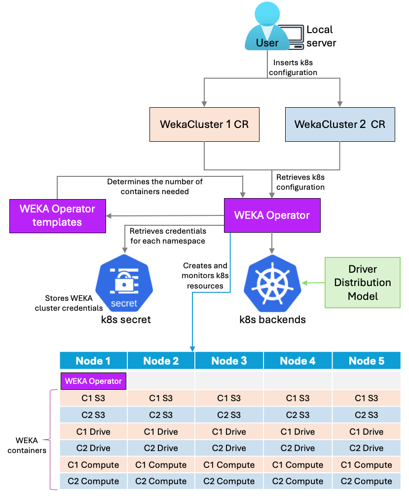
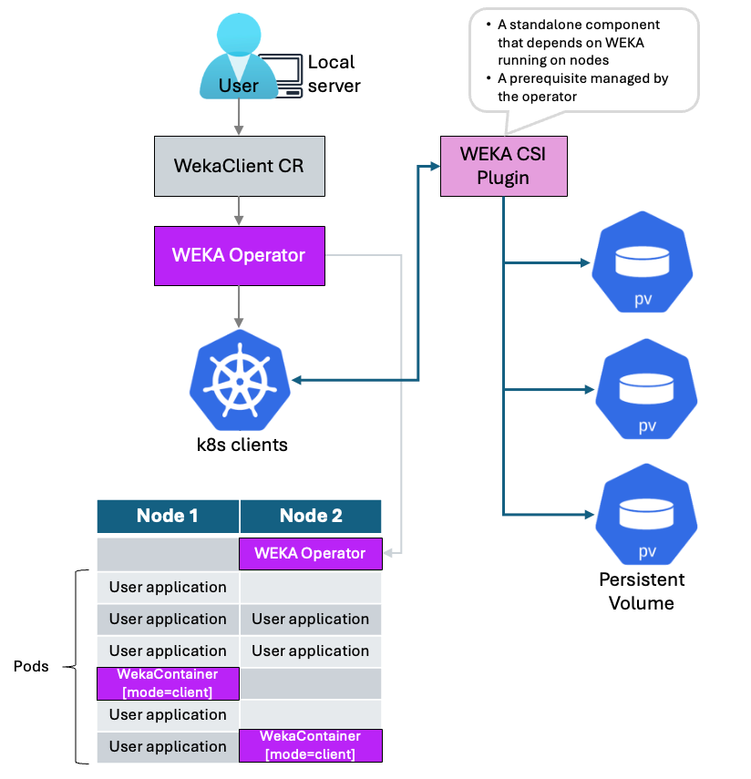

# WEKA Operator deployments

## Overview

The WEKA Operator simplifies deploying, managing, and scaling the WEKA Data Platform within a Kubernetes cluster. It provides custom Kubernetes resources that define and manage WEKA components effectively.

By integrating WEKA's high-performance storage into Kubernetes, the Operator supports compute-intensive applications like AI, ML, and HPC. This enhances data access speed and boosts overall performance.

The WEKA Operator automates tasks, enables periodic maintenance, and ensures robust cluster management. This setup provides resilience and scalability across the cluster. With its persistent, high-performance data layer, the WEKA Operator enables efficient management of large datasets, ensuring scalability and efficiency.


**Target audience:** This guide is intended exclusively for experienced Kubernetes cluster administrators. It provides detailed procedures for deploying the WEKA Operator on a Kubernetes cluster that meets the specified requirements in the [#id-2.-prepare-kubernetes-environment](./#id-2.-prepare-kubernetes-environment "mention") section.


### Versions compatibility

The following matrix outlines the minimum version requirements for specific features when managed through the WEKA Kubernetes Operator. To ensure stability, always verify that your WEKA cluster and Operator versions are aligned.

<table><thead><tr><th width="150">Feature</th><th width="201">Operator (min. version)</th><th width="230">WEKA Cluster (min. version)</th><th>Status</th></tr></thead><tbody><tr><td>S3</td><td>v1.7</td><td>4.4</td><td>Supported</td></tr><tr><td>NFS</td><td>v1.10</td><td>5.1.0</td><td>Supported</td></tr><tr><td>Audit</td><td>v1.10</td><td>5.1.0</td><td>Supported</td></tr><tr><td>SMB-W</td><td>—</td><td>—</td><td>Not supported</td></tr><tr><td>Data Services</td><td>—</td><td>—</td><td>Not supported</td></tr></tbody></table>

### WEKA Operator backend deployment overview

The WEKA Operator backend deployment integrates various components within a Kubernetes cluster to deploy, manage, and scale the WEKA Data Platform effectively.

#### How it works

* **Local Server Setup**: This setup integrates Kubernetes with the WekaCluster custom resources (CRDs) and facilitates WEKA Operator installation through Helm. Configuring Helm registry authentication provides access to the necessary CRDs and initiates the operator installation.
* **WekaCluster CR**: The WekaCluster CR defines the WEKA cluster’s configuration, including storage, memory, and resource limits, while optimizing memory and CPU settings to prevent out-of-memory errors. Cluster and container management also support operational tasks through on-demand executions (through WekaManualOperation) and scheduled tasks (through WekaPolicy).
* **WEKA Operator**:
  * The WEKA Operator retrieves Kubernetes configurations from WekaCluster CRs, grouping multiple WEKA containers to organize WEKA nodes into a single unified cluster.
  * To enable access to WEKA container images, the Operator retrieves credentials from Kubernetes secrets in each namespace that requires WEKA resources.
  * Using templates, it calculates the required number of containers and deploys the WEKA cluster on Kubernetes backends through a CRD.
  * Each node requires specific Kubelet configurations—such as kernel headers, storage allocations, and huge page settings—to optimize memory management for the WEKA containers. Data is stored in the `/opt/k8s-weka` directory on each node, with CPU and memory allocations determined by the number of WEKA containers and available CPU cores per node.
* **Driver Distribution Model**: This model ensures efficient kernel module loading and compatibility across nodes, supporting scalable deployment for both clients and backends. It operates through three primary roles:
  * **Distribution Service**: A central repository storing and serving WEKA drivers for seamless access across nodes.
  * **Drivers Builder**: Compiles drivers for specific WEKA versions and kernel targets, uploading them to the Distribution Service. Multiple builders can run concurrently to support the same repository.
  * **Drivers Loader**: Automatically detects missing drivers, retrieves them from the Distribution Service, and loads them using `modprobe`.

<div data-with-frame="true"><figure><figcaption><p>WEKA Operator backend deployment</p></figcaption></figure></div>

### WEKA Operator client deployment overview

The WEKA Operator client deployment uses the WekaClient custom resource to manage WEKA containers across a set of designated nodes, similar to a DaemonSet. Each WekaClient instance provisions WEKA containers as individual pods, creating a persistent layer that supports high availability by allowing safe pod recreation when necessary.

#### How it works

* **Deployment initiation**: The user starts the deployment from a local server, which triggers the process.
* **Custom resource retrieval**: The WEKA Operator retrieves the WekaClient custom resource (CR) configuration. This CR defines which nodes in the Kubernetes cluster run WEKA containers.
* **WEKA containers deployment**: Based on the WekaClient CR, the Operator deploys WEKA containers across the specified Kubernetes client nodes. Each WEKA container instance runs as a single pod, similar to a DaemonSet.
*   **Persistent storage setup**: The WEKA Operator automates the deployment of the WEKA Container Storage Interface (CSI) plugin, which is the standard way to provide persistent storage for applications within Kubernetes. This plugin enables pods (clients) to dynamically provision and mount Persistent Volumes (PVs) from the WEKA system.

    Starting with Operator version 1.7.0, the deployment process has been streamlined:

    * **Embedded CSI plugin:** The CSI plugin is now embedded directly within the WekaClient CR, simplifying its management.
    * **Co-located cluster requirement:** This integrated CSI deployment is only supported when the WEKA cluster and the WEKA clients reside within the same Kubernetes cluster. This is configured by referencing the WEKA cluster in the `targetCluster` field of the WekaClient CR.
* **High availability**: The WEKA containers act as a persistent layer, enabling each pod to be safely recreated as needed. This supports high availability by ensuring continuous service even if individual pods are restarted or moved.

<div data-with-frame="true"><figure><figcaption><p>WEKA Operator client deployment</p></figcaption></figure></div>

#### WEKA Operator client-only deployment

If the WEKA cluster is outside the Kubernetes cluster but you have workloads inside Kubernetes, you can deploy a WEKA client within the Kubernetes cluster to connect to the external WEKA cluster.

#### Client Pod CLI restrictions

Cluster-level WEKA CLI commands are supported only from the Compute or Drives pods.

The WEKA Operator client and application client pods operate with restricted permissions intended for data-path access only. Running cluster CLI commands, such as `weka status`, from these contexts is not supported and results in authorization errors.

## Deployment workflow

1. Obtain setup information.
2. Prepare Kubernetes environment.
3. Set up driver distribution.
4. Discover drives for WEKA cluster provisioning.
5. Install the WEKA Operator.
6. Install the WekaCluster and WekaClient custom resources.


WEKA Operator currently supports only x86 architecture.


### 1. Obtain setup information

Before deploying the WEKA Operator in your Kubernetes environment, contact the WEKA Customer Success Team to obtain the necessary setup information.

You need the following credentials to proceed with the deployment:

* Container repository (quay.io)
  * Image pull secrets and Docker:
    * `QUAY_USERNAME`: `example_user`
    * `QUAY_PASSWORD`: `example_password`
    * `QUAY_SECRET_KEY`: `quay-io-robot-secret`
* WEKA Operator version and image version tag
  * For the most current operator and image versions, refer to the WEKA Operator page at [https://get.weka.io/ui/operator](https://get.weka.io/ui/operator). From there, you can obtain the latest `WEKA_OPERATOR_VERSION` and `WEKA_IMAGE_VERSION_TAG`.

Gathering this information in advance provides all the required values to complete the deployment workflow efficiently. Use these values to replace the placeholders in the setup files.

### 2. Prepare Kubernetes environment

Ensure the following requirements are met:

* Local server requirements
* Kubernetes cluster and node requirements
* Kubernetes port requirements
* Kubelet requirements
* Image pull secrets requirements
* Set up control plane with HA

#### **Local server requirements**

1. Ensure access to a server for manual `helm install`, unless a higher-level tool (for example, Argo CD) is used.


```bash
curl -fsSL -o get_helm.sh https://raw.githubusercontent.com/helm/helm/main/scripts/get-helm-3 && chmod 700 get_helm.sh &&./get_helm.sh
```


#### **Kubernetes cluster and node requirements**

Ensure that Kubernetes is correctly set up and configured to handle WEKA workloads.

* Minimum Kubernetes version: 1.25
* Minimum OpenShift version: 4.17

1. **Kernel headers**: Ensure kernel headers on each node match the kernel version.
2. **Storage**: Allocate storage on `/opt/k8s-weka` for WEKA containers.\
   Estimate: \~20 GiB per WEKA container + 10 GiB per CPU core in use.
3. **Huge pages configuration**:
   * **Compute core**: 3 GiB of huge pages
   * **Drive core**: 1.5 GiB of huge pages
   * **Client core**: 1.5 GiB of huge pages\
     Check current huge pages with command:\
     `grep Huge /proc/meminfo`
   * Add the appropriate number of huge pages:\
     `sudo sysctl -w vm.nr_hugepages=3000`
   * Set huge pages to persist through reboots:\
     `sudo sh -c 'echo "vm.nr_hugepages = 3000" >> /etc/sysctl.conf'`

#### **Kubernetes port requirements**

Ensure ports availability according to the following table:

<table><thead><tr><th width="141.87890625">Purpose</th><th width="94.94140625">Source</th><th width="120.8515625">Target</th><th width="106.94921875">Target Ports</th><th width="81.921875">Protocol</th><th width="245.01171875">Comments</th></tr></thead><tbody><tr><td>Client connection</td><td>Client</td><td>Backend</td><td>45000-65000</td><td>TCP/<br>UDP</td><td>Clients find free ports dynamically within this range. Not mandatory to define explicitly.</td></tr><tr><td>Cluster allocation</td><td>WEKA Operator</td><td>Cluster Nodes</td><td>35000-35499 (default)</td><td>TCP/<br>UDP</td><td>Default port range for cluster allocation. Each WEKA cluster requires a unique range of 500 ports (Baseport to Baseport+499). You can override this range, but you must ensure it does not conflict with other clusters.</td></tr><tr><td>Backend communication</td><td>Backend</td><td>Backend</td><td>35000-35499 (default)</td><td>TCP/<br>UDP</td><td>Default port range for internal backend communication. Each WEKA cluster requires a unique range of 500 ports (Baseport to Baseport+499). Ensure the selected port range is available across all servers.</td></tr><tr><td>Port override</td><td>Operator API</td><td>WekaCluster CR</td><td>User-defined</td><td>TCP/<br>UDP</td><td>Overrides allow specifying ports manually, mainly useful for migrating non-K8s clusters.</td></tr></tbody></table>

#### **Kubelet requirements**

1. **Identify the Kubelet ConfigMap:** Find the name of the ConfigMap that defines the Kubelet configuration for your worker nodes, typically located in the `kube-system` namespace.

```bash
kubectl get cm -A | grep kubelet
```

2. **Open the ConfigMap for editing:** Use the identified ConfigMap name (`<kubelet-configmap-name>`) to open it for editing within the `kube-system` namespace.

```bash
kubectl edit cm -n kube-system <kubelet-configmap-name>
```

3. **Add or update CPU management settings:** Within the opened editor, locate the kubelet section and add or update the following key settings to enable static CPU management and reserve CPU `0` for the system:

```yaml
kubelet:
  ...
  reservedSystemCPUs: "0"
  cpuManagerPolicy: static
```

#### **Image pull secrets requirements**

* Set up Kubernetes secrets for secure image pulling across namespaces. Apply the secret in all namespaces where WEKA resources are deployed.
* Verify that namespaces are defined and do not overlap to avoid configuration conflicts.

**Example:**

The following example creates a secret for quay.io authentication for both the `weka-operator-system` namespace and the `default` namespace. Repeat as necessary for namespaces. Replace the placeholders with the actual values.

```bash
export QUAY_USERNAME='QUAY_USERNAME' # Replace with the actual value
export QUAY_PASSWORD='QUAY_PASSWORD' # Replace with the actual value

kubectl create ns weka-operator-system
kubectl create secret docker-registry QUAY_SECRET_KEY \ # Replace with the actual value
  --docker-server=quay.io \
  --docker-username=$QUAY_USERNAME \
  --docker-password=$QUAY_PASSWORD \
  --docker-email=$QUAY_USERNAME \
  --namespace=weka-operator-system

kubectl create secret docker-registry QUAY_SECRET_KEY \ # Replace with the actual value
  --docker-server=quay.io \
  --docker-username=$QUAY_USERNAME \
  --docker-password=$QUAY_PASSWORD \
  --docker-email=$QUAY_USERNAME \
  --namespace=default
```

#### Set up control plane with HA

Ensure the Kubernetes control plane is configured for high availability (HA) to match the overall resiliency of a WEKA deployment.

A highly available control plane depends on `etcd` quorum tolerance.

* `etcd` requires an odd number of members, represented as N.
* It can tolerate failures up to (N-1)/2 members.
* Production setups typically use at least five or nine `etcd` members to align with high-availability storage backends.

Consider using an external `etcd` cluster or distributing control-plane components across multiple failure domains.

For more information, see the official [Kubernetes HA topology guidance](https://kubernetes.io/docs/setup/production-environment/tools/kubeadm/ha-topology/).

### 3. Install the WEKA Operator

1. **Apply WEKA Custom Resource Definitions (CRDs):** Download and apply the WEKA Operator CRDs to define WEKA-specific resources in Kubernetes. Replace the version placeholder (WEKA\_OPERATOR\_VERSION) with the actual value.


```bash
helm pull oci://quay.io/weka.io/helm/weka-operator --untar --version <WEKA_OPERATOR_VERSION>
kubectl apply -f weka-operator/crds
```


2.  **Install the WEKA Operator:** Deploy the WEKA Operator to the Kubernetes cluster. Specify the namespace, image version, and pull secret to enable WEKA’s resources. Replace the version placeholder (WEKA\_OPERATOR\_VERSION) with the actual value.

    To install WEKA Operator with the CSI plugin (from `v1.7.0`) run the following command:

```bash
helm upgrade --create-namespace \
    --install weka-operator oci://quay.io/weka.io/helm/weka-operator \
    --namespace weka-operator-system \
    --version <WEKA_OPERATOR_VERSION> \
    --set csi.installationEnabled=true
```

For earlier versions of the WEKA Operator, omit the `--set csi.installationEnabled=true` from the command.

3. **Verify the installation:** Run the following: `kubectl -n weka-operator-system get pod`\
   The returned results should look similar to this:

```
NAME                                               READY  STATUS  RESTARTS   AGE
weka-operator-controller-manager-564bfd6b49-p6k7d   2/2   Running     0      13s
```

### 4. Set up driver distribution

Driver distribution applies to client and backend entities.

1. **Verify driver distribution prerequisites**:
   1. Ensure a WEKA-compatible image (`weka-in-container`) is accessible through the registry and has the necessary credentials (`imagePullSecret`).
   2. Define node selection criteria, especially for the Driver Builder role, to match the kernel requirements of target nodes.
2.  **Set up the driver distribution service and driver builder:** Driver distribution is typically included as part of the operator installation process. Therefore, it is not necessary to install drivers separately. To build and distribute WEKA drivers, the standard approach involves deploying the following components:

    * **drivers-builder container:** One container per combination of Weka version, kernel version, and architecture.
    * **drivers-dist container:** A single container responsible for serving the compiled drivers.
    * **Service:** Exposes the drivers-dist container.

    This setup supports scenarios such as handling multiple kernel versions and executing custom pre-run scripts.Important notes:

    * Deploy multiple drivers-builder containers only if you need to support multiple kernel versions or multiple WEKA versions.
    * Replace placeholder versions with your target WekaClient and WekaCluster versions.
    * The image versions used in the builder containers must match the corresponding WEKA versions.

<details>

<summary>Driver distribution service for WEKA Operator using WekaPolicy, starting from version 1.6.0</summary>

The WEKA operator supports driver distribution deployment using the WEKA policy. When a valid policy is applied, the operator automatically creates the required resources as shown in the examples.

**Requirements:** When configuring driver distribution, the following elements must be preserved exactly as shown in the provided configuration snippets:

* Ports
* Network modes
* Core configurations
* Container name (spec.name)

**Example 1: Minimal policy for drivers distribution (typical)**

```yaml
apiVersion: weka.weka.io/v1alpha1
kind: WekaPolicy
metadata:
  name: weka-drivers
  namespace: weka-operator-system
spec:
  image: quay.io/weka.io/weka-in-container:4.4.5.118-k8s.4
  imagePullSecret:  "quay-io-robot-secret"
  payload:
    driverDistPayload: {}
    interval: 1m
  nodeSelector:
    weka.io/supports-backends: "true"
  type: enable-local-drivers-distribution
```

**WekaPolicy additional attributes**

You can use the following attributers if needed in addition to to the minimal policy:

* `ensureNICsPayload`: Defines the configuration for ensuring a specific number of data NICs on selected nodes.
* `interval`: Defines how often to reconcile the policy.
* `signDrivesPayload`: Configures parameters to scan and sign drives for WEKA backend containers.

**Example 2: Manual deployment of WEKA drivers distribution and builder containers**

```yaml
apiVersion: weka.weka.io/v1alpha1
kind: WekaContainer
metadata:
  name: weka-drivers-dist
  namespace: weka-operator-system
  labels:
    app: weka-drivers-dist
spec:
  agentPort: 60001
  image: quay.io/weka.io/weka-in-container:4.4.2.144-k8s
  imagePullSecret: "quay-io-robot-secret"
  mode: "drivers-dist"
  name: dist
  numCores: 1
  port: 60002
---
apiVersion: v1
kind: Service
metadata:
  name: weka-drivers-dist
  namespace: weka-operator-system
spec:
  type: ClusterIP
  ports:
    - name: weka-drivers-dist
      port: 60002
      targetPort: 60002
  selector:
    app: weka-drivers-dist
---
apiVersion: weka.weka.io/v1alpha1
kind: WekaContainer
metadata:
  name: weka-drivers-builder-157
  namespace: weka-operator-system
spec:
  agentPort: 60001
  image: quay.io/weka.io/weka-in-container:4.4.2.157-k8s
  imagePullSecret: "quay-io-robot-secret"
  mode: "drivers-builder"
  name: dist # WEKA container name
  numCores: 1
  uploadResultsTo: "weka-drivers-dist"
  port: 60002
  nodeSelector:
    weka.io/supports-backends: "true"
---
apiVersion: weka.weka.io/v1alpha1
kind: WekaContainer
metadata:
  name: weka-drivers-builder-157-ubuntu-1
  namespace: weka-operator-system
spec:
  agentPort: 60001
  image: quay.io/weka.io/weka-in-container:4.4.2.157-k8s
  imagePullSecret: "quay-io-robot-secret"
  mode: "drivers-builder"
  name: dist # WEKA container name
  numCores: 1
  uploadResultsTo: "weka-drivers-dist"
  port: 60002
  nodeSelector:
    weka.io/supports-backends: "true"
    weka.io/kernel: "6.5.0-45-generic"
  overrides:
    preRunScript: "apt-get update && apt-get install -y gcc-12"
```

**Example 3: Example: WekaPolicy for enabling local drivers distribution**


```yaml
apiVersion: weka.weka.io/v1alpha1
kind: WekaPolicy
metadata:
  name: weka-drivers
  namespace: weka-operator-system # Specify the namespace where the Weka operator is deployed
spec:
  type: "enable-local-drivers-distribution"
  # Base image used for the drivers-dist container; also used as the default for driver builders
  image: "quay.io/weka.io/weka-in-container:4.4.5.118-k8s.4" # Replace with the target Weka image version
  imagePullSecret: "quay-io-robot-secret" # Replace with your image pull secret for accessing the image registry
  tolerations:
  - key: "example-key"
    operator: "Exists"
    effect: "NoSchedule"
  payload:
    interval: "1m" # Reconciliation interval for the policy
    driverDistPayload: # Required: configuration for driver distribution
      # List of additional Weka images for which drivers should be prebuilt
      # These are in addition to any images detected from existing WekaCluster/WekaClient resources
      ensureImages:
        - "quay.io/weka.io/weka-in-container:4.4.2.157-k8s.2" # Example image for proactive driver build
        - "quay.io/weka.io/weka-in-container:4.4.5.118-k8s.4" # Another example
      # Node selectors defining where builder containers can be scheduled
      # Builders run on nodes matching both these selectors and the discovered kernel/architecture
      nodeSelectors:
        - role: "worker-nodes"
          environment: "production"
        - custom-label: "drivers-build-pool"
      # Optional: Override default label keys for kernel and architecture detection
      # Defaults: weka.io/kernel and weka.io/architecture
      # kernelLabelKey: "custom.io/kernel-version"
      # architectureLabelKey: "custom.io/arch"
      # Optional: Node selector for the driver distribution container
      # Leave empty to allow scheduling on any node
      # distNodeSelector: {}
      # Optional: Script to run in builder containers after kernel validation and before the build process
      builderPreRunScript: |
        #!/bin/sh
        apt-get update && apt-get install -y gcc-12
```


</details>

<details>

<summary>Driver distribution service for WEKA Operator version 1.4.x</summary>

```yaml
apiVersion: weka.weka.io/v1alpha1
kind: WekaContainer
metadata:
  name: weka-drivers-dist
  namespace: default
  labels:
    app: weka-drivers-dist
spec:
  agentPort: 60001
  image: quay.io/weka.io/weka-in-container:<WEKA_IMAGE_VERSION_TAG> # Replace with the actual value
  imagePullSecret: "<QUAY_SECRET_KEY>" # Replace with the actual value
  mode: "drivers-dist"
  name: dist
  numCores: 1
  port: 60002
---
apiVersion: v1
kind: Service
metadata:
  name: weka-drivers-dist
  namespace: default
spec:
  type: ClusterIP
  ports:
    - name: weka-drivers-dist
      port: 60002
      targetPort: 60002
  selector:
    app: weka-drivers-dist
---
apiVersion: weka.weka.io/v1alpha1
kind: WekaContainer
metadata:
  name: weka-drivers-builder
  namespace: default
spec:
  agentPort: 60001
  image: quay.io/weka.io/weka-in-container:<WEKA_IMAGE_VERSION_TAG> # Replace with the actual value
  imagePullSecret: "<QUAY_SECRET_KEY>" # Replace with the actual value
  mode: "drivers-loader"
  name: dist 
  numCores: 1
  port: 60002
```

</details>


Ensure that `nodeSelector` or `nodeAffinity` aligns with the kernel requirements of the build nodes.


3. Save the manifest above to `weka-driver.yaml` , and apply it:\
   `kubectl apply -f weka-driver.yaml`

### 5. Discover drives for WEKA cluster provisioning

To provision drives for a WEKA cluster, each drive must go through a discovery process. This process ensures that all drives are correctly identified, accessible, and ready for use within the cluster.

The discovery process involves the following key actions:

* **Node updates during discovery**
  * Each node is annotated with a list of known serial IDs for all drives accessible to the operator, providing a unique identifier for each drive.
  * An extended resource, `weka.io/drives`, is created to indicate the number of drives that are ready and available on each node.
* **Available drives**
  * Only healthy, unblocked drives are marked as available. Drives that are manually flagged due to issues such as corruption or other unrecoverable errors are excluded from the available pool to ensure cluster stability.

**Drive discovery steps**

1. **Sign drives**\
   Each drive receives a WEKA-specific signature, marking it as ready for discovery and integration into the cluster.
2. **Discover drives**\
   The signed drives are detected and prepared for cluster operations. If drives already have the WEKA signature, only the discovery step is required to verify and track them in the cluster.

**Drive discovery methods**

The WEKA system supports two primary methods for drive discovery:

* **WekaManualOperation**\
  A one-time operation that performs both drive signing and discovery, suitable for manual provisioning.
* **WekaPolicy**\
  An automated, policy-driven approach that performs periodic discovery across all matching nodes. The `WekaPolicy` method operates on an event-driven model, initiating discovery immediately when relevant changes (such as node updates or drive additions) are detected.

**Operations examples**

<details>

<summary>Sign drives using the WekaPolicy starting from WEKA Operator 1.6.x</summary>

Drive containers will be scheduled on nodes with available signed drives.

To identify drives that can be used by WEKA and sign them, apply the following policy:

```yaml
apiVersion: weka.weka.io/v1alpha1
kind: WekaPolicy
metadata:
  name: sign-drives
  namespace: weka-operator-system # Replace with your namespace
spec:
  type: sign-drives
  payload:
    signDrivesPayload:
      type: "all-not-root"
```

**Drive selection types:**

* `all-not-root`: Signs all block devices except the root device.
* `aws-all`: AWS-specific, detects NVMe devices by AWS PCI identifiers.
* `device-paths`: Lists specific device paths. Each node presents its subset of this list.

</details>

<details>

<summary>Sign specific drives manually in WEKA Operator 1.4.x</summary>

```yaml
apiVersion: weka.weka.io/v1alpha1
kind: WekaManualOperation
metadata:
  name: sign-specific-drives
  namespace: weka-operator-system
spec:
  action: "sign-drives"
  image: quay.io/weka.io/weka-in-container:WEKA_IMAGE_VERSION_TAG # Replace with the actual value
  imagePullSecret: "QUAY_SECRET_KEY"  \ # Replace with the actual value
  payload:
    signDrivesPayload:
      type: device-paths
      nodeSelector:
        weka.io/supports-backends: "true"
      devicePaths:
        - /dev/nvme0n1
        - /dev/nvme1n1
        - /dev/nvme2n1
        - /dev/nvme3n1
        - /dev/nvme4n1
        - /dev/nvme5n1
        - /dev/nvme6n1
        - /dev/nvme7n1
```

</details>

<details>

<summary>Discover drives</summary>

The following example initiates a drive discovery operation:

```yaml
apiVersion: weka.weka.io/v1alpha1
kind: WekaManualOperation
metadata:
  name: discover-drives
  namespace: weka-operator-system
spec:
  action: "discover-drives"
  image: quay.io/weka.io/weka-in-container:WEKA_IMAGE_VERSION_TAG # Replace with the actual value
  imagePullSecret: "QUAY_SECRET_KEY" # Replace with the actual value
  payload:
    discoverDrivesPayload:
      nodeSelector:
	      weka.io/supports-backends: "true"
```

Key fields:

* `nodeSelector` (payload): Limits the operation to specific nodes.
* `tolerations` (spec): Supports Kubernetes tolerations for high-level objects like WekaCluster and WekaClient. Only `tolerations` are supported for WekaManualOperation, WekaContainer, and WekaPolicy.

</details>

### 6. Install the WekaCluster and WekaClient custom resources

This procedure provides step-by-step instructions for deploying the WekaCluster and WekaClient Custom Resources (CRs) in a Kubernetes cluster. Follow these procedures in sequence if both components are required. Begin with the **WekaCluster CR**, then create the necessary **client secret**, and finally deploy the **WekaClient CR**.

#### Step 1: Install the WekaCluster CR

To deploy a WEKA cluster backend using the WekaCluster CR, perform the following:

1. Prerequisites:
   1. Ensure the **driver distribution service** is configured. This is the same service used by WEKA clients. See [#id-4.-set-up-driver-distribution](./#id-4.-set-up-driver-distribution "mention").
   2. Use either the `WekaManualOperation` (recommended for initial deployments) or `WekaPolicy` to sign and discover drives. See [#id-5.-discover-drives-for-weka-cluster-provisioning](./#id-5.-discover-drives-for-weka-cluster-provisioning "mention").
2.  Create a manifest file (for example, weka-cluster.yaml) with the required configuration:

    ```yaml
    apiVersion: weka.weka.io/v1alpha1
    kind: WekaCluster
    metadata:
      name: cluster-dev
      namespace: default
    spec:
      template: dynamic
      dynamicTemplate:
        computeContainers: 6
        driveContainers: 6
        numDrives: 1
      image: quay.io/weka.io/weka-in-container:WEKA_IMAGE_VERSION_TAG # Replace with actual image tag
      nodeSelector:
        weka.io/supports-backends: "true"
      driversDistService: "https://weka-drivers-dist.weka-operator-system.svc.cluster.local:60002"
      imagePullSecret: "QUAY_SECRET_KEY" # Replace with the actual secret
      network:
        udpMode: true
        ethDevice: br-ex
    ```

<details>

<summary>WekaCluster key parameters and configurations</summary>

* **template**: Only `dynamic` is currently supported. Future templates will include `capacity` and `performance`.
*   **dynamicTemplate**: Configure dynamic settings for compute and drive containers within this template.

    ```yaml
    dynamicTemplate:
      computeContainers: <number>
      driveContainers: <number>
      numDrives: <number>
    ```
* **image**, **imagePullSecret**, **driversDistService**, **nodeSelector**, **tolerations**, **rawTolerations**, and **network** are configured similarly to the WekaClient CR.
* **roleNodeSelector**: Defines scheduling by role (compute, drive, s3) through a map of node selectors.
*   **WekaHome Configuration**: Sets the WekaHome endpoint and certificate.

    ```yaml
    wekaHome:
      endpoint: "https://custom-domain.lan:30443"
      cacertSecret: "weka-home-cacert"
    ```
* **ipv6**: Enables IPv6 (default is false).
* **additionalMemory**: Adds memory per role beyond default allocations.
* **ports**: Override default port assignments if needed, such as for cluster migration.
* **operatorSecretRef** and **expandEndpoints**: Parameters used exclusively for migration, supporting migration-by-healing from a non-K8s environment to K8s.
* **Hugepages Offsets**: Specifies offsets for hugepage allocations for drives, compute, and S3 (for example, `driveHugepagesOffset`).

</details>

3. Apply the WekaCluster CR:

```
kubectl apply -f weka-cluster.yaml
```

#### Step 2: Create WEKA cluster client secret

Before deploying a WekaClient CR, create a Kubernetes Secret with credentials required to join the WEKA cluster.

1. Prepare the secret YAML: Create a file named secret.yaml:

```yaml
apiVersion: v1
kind: Secret
metadata:
  name: weka-cluster-dev  # The wekaSecretRef in the WekaClient CR must much this secret name
  namespace: weka-operator-system
type: Opaque
data:
  org: <base64-encoded-org>
  join-secret: <base64-encoded-join-secret>
  password: <base64-encoded-password>
  username: <base64-encoded-username>
```


Replace all placeholder with base64-encoded values provided by your WEKA backend.


2. Apply the secret:

```
kubectl apply -f secret.yaml
```

#### Step 3: Install the WekaClient CR

The WekaClient CR deploys WekaContainers across designated Kubernetes nodes, similar to a DaemonSet but without automatic pod cleanup.

**WekaClient specification (reference)**\
Key configurable fields in the `WekaClientSpec`:

```go
type WekaClientSpec struct {
    Image               string            `json:"image"`                   // Image to be used for WekaContainer
    ImagePullSecret     string            `json:"imagePullSecret,omitempty"` // Secret for pulling the image
    Port                int               `json:"port,omitempty"`           // If unset (0), WEKA selects a free port from PortRange
    AgentPort           int               `json:"agentPort,omitempty"`      // If unset (0), WEKA selects a free port from PortRange
    PortRange           *PortRange        `json:"portRange,omitempty"`      // Used for dynamic port allocation
    NodeSelector        map[string]string `json:"nodeSelector,omitempty"`   // Specifies nodes for deployment
    WekaSecretRef       string            `json:"wekaSecretRef,omitempty"`  // Reference to Weka secret
    NetworkSelector     NetworkSelector   `json:"network,omitempty"`        // Defines network configuration
    DriversDistService  string            `json:"driversDistService,omitempty"` // URL for driver distribution service
    DriversLoaderImage  string            `json:"driversLoaderImage,omitempty"` // Image for drivers loader
    JoinIps             []string          `json:"joinIpPorts,omitempty"`    // IPs to join for cluster setup
    TargetCluster       ObjectReference   `json:"targetCluster,omitempty"`  // Reference to target cluster
    CpuPolicy           CpuPolicy         `json:"cpuPolicy,omitempty"`      // CPU policy, e.g., "auto," "shared," "dedicated," etc.
    CoresNumber         int               `json:"coresNum,omitempty"`       // Number of cores to use
    CoreIds             []int             `json:"coreIds,omitempty"`        // Specific core IDs to use
    TracesConfiguration *TracesConfiguration `json:"tracesConfiguration,omitempty"` // Trace settings
    Tolerations         []string          `json:"tolerations,omitempty"`    // Tolerations for nodes
    RawTolerations      []v1.Toleration   `json:"rawTolerations,omitempty"` // Detailed toleration settings
    AdditionalMemory    int               `json:"additionalMemory,omitempty"` // Additional memory allocation
    WekaHomeConfig      WekahomeClientConfig  `json:"wekaHomeConfig,omitempty"` // Deprecated field
    WekaHome            *WekahomeClientConfig `json:"wekaHome,omitempty"`       // Deprecated field
    UpgradePolicy       UpgradePolicy     `json:"upgradePolicy,omitempty"`   // Policy for handling upgrades
}
```

<details>

<summary>WekaClient key parameters and configurations</summary>

* **image**: Specifies the image to use for the container.
* **imagePullSecret**: Defines the secret to use for pulling the image, which is propagated into the pod.
* **port** and **agentPort**:
  * **agentPort**: A single port used by the agent.
  * **port**: Represents a range of 100 ports. This range may be reduced in the future, as it is not fully utilized by clients and is shared on the WEKA side.
*   **portRange**:\
    Instead of specifying individual ports, a range can be defined. The operator automatically finds an available port instead of using the same one across all servers.

    ```yaml
    portRange:
      basePort: 45000
    ```
* **nodeSelector**: Selects the node where the WekaContainer will be scheduled.
*   **network**: Defines the network device for WEKA to use. By default, WEKA runs in UDP mode if no network device is specified. If using an Ethernet device, specify the device name (for example, `mlnx0`).

    ```yaml
    network:
      ethDevice: mlnx0
    ```
* **driversDistService**:\
  A reference to the distribution service for drivers.
*   **joinIpPorts**: Used when the WEKA cluster and WEKA clients are not in the same Kubernetes cluster.

    ```yaml
    joinIpPorts: ["10.0.1.168:16101"]
    ```
*   **targetCluster**: Used when the WEKA cluster and WEKA clients are in the same Kubernetes cluster.

    ```yaml
    targetCluster:
      name: cluster-dev
      namespace: default
    ```
* **coresNum**: Specifies the number of full cores to use for each WekaContainer.
* **cpuPolicy**:\
  Default value is `auto`, which automatically detects whether nodes are running with hyperthreading and allocates cores accordingly.
  * **Example**: 2 WEKA cores = 2 full cores, reserving 5 hyperthreads for a pod.
  * **coreIds**: Used in combination with `cpuPolicy: manual` for manual core allocation.\
    **Note**: Unless advised by WEKA support, avoid using any policy other than `auto`.
* **tracesConfiguration**: Configures trace capacity allocations.
*   **tolerations** and **rawTolerations**:

    * **tolerations**: A list of strings that expand to `NoSchedule` and `NoExecution` tolerations for existing keys.
    * **rawTolerations**: A list of Kubernetes toleration objects.

    ```yaml
    tolerations:
      - simple-toleration
      - another-one
    rawTolerations:
      - key: "dedicated"
        operator: "Equal"
        value: "weka-cluster"
        effect: "NoSchedule"
    ```
* **additionalMemory**: Specifies additional memory in megabytes for cases when default memory allocation is insufficient.\
  **Note**: Default memory allocations are typically set for 90%+ utilization.
*   **wekaHome**: Configures the Weka home directory to use. Defaults to the Weka cloud home.\
    The primary configuration of Weka home is in the `WekaCluster` CR, but WekaClient can also specify a `cacert` for the client. This certificate is placed on client pods to connect to Weka Home.

    ```yaml
    wekaHome:
      cacertSecret: "weka-home-cacert"
    ```
* **upgradePolicy**:\
  Defines how the WekaContainers are upgraded.
  * **rolling** (default): WekaContainers are updated one by one.
  * **manual**: WekaContainers are set to a new version, but the pod is not deleted until manually triggered. This gives the user control over when to update.
  * **all-at-once**: All WekaContainers are upgraded simultaneously after the image is changed.
*   **gracefulDestroyDuration**:\
    Specifies the duration for which the cluster remains in a paused state, keeping local data and drive allocations while deleting all pods.

    * **Default**: 24 hours.
    * **Note**: In case of accidental cluster deletion, override this duration with a larger value and contact Weka support for recovery procedures. This is a safety measure, not a pause/unpause feature.

    To override the graceful destroy duration:


```
kubectl patch WekaCluster cluster-dev -n weka-operator-system --type='merge' -p='{"status":{"overrideGracefulDestroyDuration": "10000h"}}' --subresource=status
```


To release the cluster (allow full deletion):


```
kubectl patch WekaCluster cluster-dev -n weka-operator-system --type='merge' -p='{"status":{"overrideGracefulDestroyDuration": "0"}}' --subresource=status
```


</details>


**Label propagation behavior:** All labels are automatically propagated from parent objects to the child objects they create. The propagation behavior is as follows:

* WekaContainer propagates labels to the corresponding Pods.
* WekaCluster propagates labels to the WekaContainer objects it creates.
* WekaPolicy propagates labels to the WekaContainer objects it creates.
* WekaClient propagates labels to the WekaContainer objects it creates.


<details>

<summary>Example: Connect to an internal WEKA cluster</summary>

```yaml
apiVersion: weka.weka.io/v1alpha1
kind: WekaClient
metadata:
  name: cluster-dev-clients
spec:
  image: quay.io/weka.io/weka-in-container:WEKA_IMAGE_PLACEHOLDER
  imagePullSecret: "QUAY_SECRET_KEY" # Replace with the actual value
  driversDistService: "https://weka-drivers-dist.weka-operator-system.svc.cluster.local:60002"
  portRange:
    basePort: 46000
  nodeSelector:
    weka.io/supports-clients: "true"
  wekaSecretRef: weka-cluster-dev # Must match secret name created using secret yaml 
  targetCluster:
    name: cluster-dev
    namespace: default
  network:
    ethDevice: mlnx0
```

</details>

<details>

<summary>Example: Connect to an external WEKA cluster</summary>

<pre class="language-yaml"><code class="lang-yaml"><strong>apiVersion: weka.weka.io/v1alpha1
</strong>kind: WekaClient
metadata:
  name: cluster-dev-clients
spec:
  image: quay.io/weka.io/weka-in-container:WEKA_IMAGE_PLACEHOLDER
  imagePullSecret: "QUAY_SECRET_KEY" # Replace with the actual value
  driversDistService: "https://weka-drivers-dist.weka-operator-system.svc.cluster.local:60002"
  portRange:
    basePort: 46000
  nodeSelector:
    weka.io/supports-clients: "true"
  wekaSecretRef: weka-cluster-dev # Must match secret name created using secret yaml 
  joinIpPorts: ["10.0.2.137:16101"] # Replace with backend or LB IP:port
  network:
    ethDevice: mlnx0
</code></pre>

</details>

Apply the manifest:

```
kubectl apply -f weka-client.yaml
```

#### Step 4: Next steps

After deploying the WekaCluster and WekaClient CRs:

1. Monitor their status using `kubectl get wekaClusters` and `kubectl get wekaClients`.
2. After deploying the `WekaCluster` and `WekaClient` Custom Resources (CRs), perform one of the following steps based on your WEKA Operator version.
   *   **For WEKA Operator v1.7.0 and newer:**

       With newer WEKA Operator versions, the CSI plugin, necessary secrets, and a default `StorageClass` are configured automatically.

       * **StorageClass naming:** A `StorageClass` is automatically created using the pattern `weka-<groupName>-<fsName>`. Any non-standard mount options will be reflected in the name (e.g., `weka-<groupName>-<fsName>-forcedirect`).
       * **Disabling auto-creation:** To prevent the automatic creation of a `StorageClass`, you can set `csi.storageClassCreationDisabled: true` in your Helm values or operator configuration.
       * **Next steps:** You can now proceed to create a Persistent Volume Claim (PVC) or define additional `StorageClass` objects. For instructions, see the [dynamic-and-static-provisioning.md](../../appendices/weka-csi-plugin/dynamic-and-static-provisioning.md "mention") topic.
   *   **For WEKA Operator v1.6.2 and older:**

       If you are using an older WEKA Operator (v1.6.2 and below) or are not using the `targetCluster` parameter, you must install the CSI plugin manually.

       * **Next steps:** Proceed to the [weka-csi-plugin](../../appendices/weka-csi-plugin/ "mention") for complete installation instructions.

## Upgrade the WEKA Operator

Upgrading the WEKA Operator involves updating the Operator and managing `wekaClient` configurations to ensure all client pods operate on the latest version. Additionally, each WEKA version requires a new builder instance with a unique `wekaContainer` metadata name, ensuring compatibility and streamlined management of version-specific resources.

**Procedure:**

1. **Upgrade the WEKA Operator**\
   Follow the steps in [Install the WEKA Operator](./#id-3.-install-the-weka-operator) using the latest version. Re-running the installation process with the updated version upgrades the WEKA Operator without requiring additional setup.
2.  **Configure upgrade policies for `wekaClient`**\
    The `upgradePolicy` parameter in the `wekaClient` Custom Resource (CR) specification controls how client pods are updated when the WEKA version changes. Options include:

    * **rolling**: The operator automatically updates each client pod sequentially, replacing one pod at a time to maintain availability.
    * **manual**: No automatic pod replacements are performed by the operator. Manual deletion of each client pod is required, after which the pod restarts with the updated version. Use `kubectl delete pod <pod-name>` to delete each pod manually.
    * **all-at-once**: The operator updates all client pods simultaneously, applying the new version cluster-wide in a single step.

    To apply the upgrade, update the `weka-in-container` version:

    * Edit the version with `kubectl edit` on the `wekaClient` CR.
    * Modify the client configuration manifest, then reapply it with `kubectl apply -f <manifest-file>`.
3. **Create a new builder Instance for each WEKA version**\
   Rather than updating existing builder instances, create a new instance of the builder with each WEKA kernel version. Each builder must have a unique `wekaContainer` metadata name to support version-specific compatibility.
   * **Create a new builder**: For each WEKA version, create a new builder instance with an updated `wekaContainer` meta name that corresponds to the new version. This ensures that clients and resources linked to specific kernel versions can continue to operate without conflicts.
   * **Cleanup outdated builders**: Once the upgrade is validated and previous versions are no longer needed, you can delete outdated builder instances associated with those older versions. This cleanup step optimizes resources but allows you to maintain multiple builder instances if supporting different kernel versions is required.

## Delete a WekaCluster

When you delete a WekaCluster, the system enforces a 24-hour grace period before completing the removal. To expedite this process and delete the cluster immediately, you can set the graceful destroy duration to zero before initiating the deletion.

**Procedure**

1.  Run the following command to set the graceful destroy duration to zero:

    <pre class="language-bash" data-overflow="wrap"><code class="lang-bash">kubectl patch WekaCluster &#x3C;cluster name> --type='merge' -p='{"spec":{"gracefulDestroyDuration": "0"}}'
    </code></pre>

    **Where:**

    * `<cluster name>`: Specifies the name of your WekaCluster.
2.  Run the following command to delete the WekaCluster:

    ```bash
    kubectl delete WekaCluster <cluster name> --namespace <cluster namespace>
    ```

    **Where:**

    * `<cluster name>`: Specifies the name of the WekaCluster you want to delete.
    * `<cluster namespace>`: Specifies the namespace where the cluster is located.

## Best practices

### Preloading images

To optimize runtime and minimize delays, preloading images during the reading or preparation phase can significantly reduce waiting time in subsequent steps. Without preloading, some servers may sit idle while images download, leading to further delays when all servers advance to the next step.

<details>

<summary>Sample DaemonSet configuration for preloading images</summary>

```yaml
apiVersion: apps/v1
kind: DaemonSet
metadata:
  name: weka-preload
  namespace: default
spec:
  selector:
    matchLabels:
      app: weka-preload
  template:
    metadata:
      labels:
        app: weka-preload
    spec:
      imagePullSecrets:
        - name: quay-secret
        - name: QUAY_SECRET_KEY" # Replace with the actual value
      nodeSelector:
        weka.io/supports-backends: "true"
      tolerations:
        - key: "key1"
          operator: "Equal"
          value: "value1"
          effect: "NoSchedule"
        - key: "key2"
          operator: "Exists"
          effect: "NoExecute"
      containers:
        - name: weka-preload
          image: quay.io/weka.io/weka-in-container:WEKA_IMAGE_VERSION_TAG # Replace with the actual value
          command: ["sleep", "infinity"]
          resources:
            requests:
              cpu: "100m"
              memory: "128Mi"
            limits:
              cpu: "500m"
              memory: "256Mi"
```

</details>

### Display custom fields

WEKA Custom Resources enable enhanced observability by marking certain display fields. While `kubectl get` displays only a limited set of fields by default, using the `-o wide` option or exploring through `k9s` allows you to view all fields.

**Example command to quickly assess WekaContainer status:**

```bash
kubectl get wekacontainer -o wide --all-namespaces
```

**Example output:**

```bash
NAMESPACE              NAME                                                       STATUS          MODE              AGE     DRIVES COUNT   WEKA CID
weka-operator-system   cluster-dev-clients-34.242.2.16                            Running         client            64s
weka-operator-system   cluster-dev-clients-52.51.10.75                            Running         client            64s                    12
weka-operator-system   cluster-dev-compute-16fd029f-8aad-487c-be32-c74d70350f69   Running         compute           6m49s                  9
weka-operator-system   cluster-dev-compute-33f54d4b-302d-4d85-9765-f6d9a7a31d02   Running         compute           6m50s                  8

... (additional rows)

weka-operator-system   weka-dsc-34.242.2.16                                       PodNotRunning   discovery         64s
```

This view provides a quick status overview, showing progress and resource allocation at a glance.

## Troubleshooting

This section provides guidance for resolving common deployment issues with WEKA Operator.

### Pod stuck in pending state

Describe the pod to identify the scheduling issue (using Kubernetes native reporting).

If the pod is blocked on `weka.io/drives`, it indicates that the operator was unable to allocate the required drives for the corresponding WekaContainer. This issue may occur if the user has requested more drives than are available on the node or if there are too many `driveContainers` already running.

Ensure the drives are signed and the number of drives corresponds to the requested in the spec of the WekaCluster.

If there’s an image pull failure, verify your `imagePullSecret`. Each customer must have a unique robot secret for [quay.io](http://quay.io).

### Pod in “wekafsio driver not found” loop

Check the logs for this message and see for further steps.

### CSI not functioning

Ensure the `nodeSelector` configurations on both the CSI installation and the WekaClient match.

## Appendix: Kubernetes Glossary

<details>

<summary>Kubernetes Glossary</summary>

Learning Kubernetes is outside the scope of this document. This glossary covers essential Kubernetes components and concepts to support understanding of the environment. It is provided for convenience only and does not replace the requirement for Kubernetes knowledge and experience.

**Pod**

A Pod is the smallest, most basic deployable unit in Kubernetes. It represents a single instance of a running process in a cluster, typically containing one or more containers that share storage, network, and a single IP address. Pods are usually ephemeral; when they fail, a new Pod is created to replace them.

**Node**

A Node is a physical or virtual machine that serves as a worker in a Kubernetes cluster, running Pods and providing the necessary compute resources. Each Node is managed by the Kubernetes control plane and runs components like kubelet, kube-proxy, and a container runtime.

**Namespace**

A Namespace is a Kubernetes resource that divides a cluster into virtual sub-clusters, allowing for isolated environments within a single physical cluster. Namespaces help organize resources, manage permissions, and enable resource quotas within a cluster.

**Label**

Labels are key-value pairs attached to Kubernetes objects, like Pods and Nodes, used for identification and grouping. Labels facilitate organizing, selecting, and operating on resources, such as scheduling workloads based on specific node labels.

**Taint**

Taints are properties applied to nodes to restrict the schedule of pods. A taint on a Node prevents Pods without a matching toleration from being scheduled there. Taints often prevent certain workloads from running on specific Nodes unless explicitly permitted.

**Toleration**

A Toleration is a property of Pods that enables them to be scheduled on Nodes with matching taints. Tolerations work with taints to control, which workloads can run on specific Nodes in the cluster.

**Affinity and Anti-Affinity**

Affinity rules allow administrators to specify which Nodes or other Pods a given Pod should run nearby. Anti-affinity rules define the opposite: which Pods should not be scheduled near each other. These rules help with optimal resource allocation and reliability.

**Selector**

Selectors are expressions that enable filtering and selecting specific resources within the Kubernetes API. Node selectors, for example, specify the Nodes on which a Pod can run by matching their labels.

**Deployment**

A Deployment is a higher-level object for managing and scaling applications in Kubernetes. It defines the desired state for Pods and ensures they are created, updated, and scaled to maintain that state.

**DaemonSet**

A DaemonSet ensures that a specific Pod runs on all (or some) Nodes in the cluster, often used for tasks like logging, monitoring, or networking, where each Node requires the same component.

**ReplicaSet**

A ReplicaSet ensures a specified number of replicas of a Pod are running at any given time, allowing for redundancy and high availability. It is often managed by a Deployment, which abstracts the ReplicaSet management.

**Service**

A Service is an abstraction that defines a logical set of Pods and provides a stable network endpoint for access. It enables reliable communication between different Pods or external services, regardless of the individual Pods’ IP addresses.

**ConfigMap**

A ConfigMap is a Kubernetes resource used to store application configuration data. It separates configuration from application code, enabling easy updates without redeploying the entire application.

**Secret**

A Secret is a Kubernetes object used to store sensitive information, such as passwords, tokens, or keys. Like ConfigMaps, secrets are designed for confidential data, and Kubernetes provides mechanisms for securely managing and accessing them.

**Persistent Volume (PV)**

A Persistent Volume is a storage resource in Kubernetes that exists independently of any particular Pod. PVs provide long-term storage that persists beyond the lifecycle of individual Pods.

**Persistent Volume Claim (PVC)**

A Persistent Volume Claim is a request for storage made by a Pod. PVCs allow Pods to use persistent storage resources, which are dynamically or statically provisioned in the cluster.

**Ingress**

Ingress is a Kubernetes resource that manages external access to services within a cluster, typically via HTTP/HTTPS. Ingress enables load balancing, SSL termination, and routing to various services based on the request path.

**Container Runtime**

The container runtime is the underlying software that runs containers on a Node. Kubernetes supports multiple container runtimes, such as Docker, containers, and CRI-O.

**Operator**

An Operator is a method of packaging, deploying, and managing a Kubernetes application or service. It often provides automated management and monitoring for complex applications in Kubernetes clusters.

</details>
