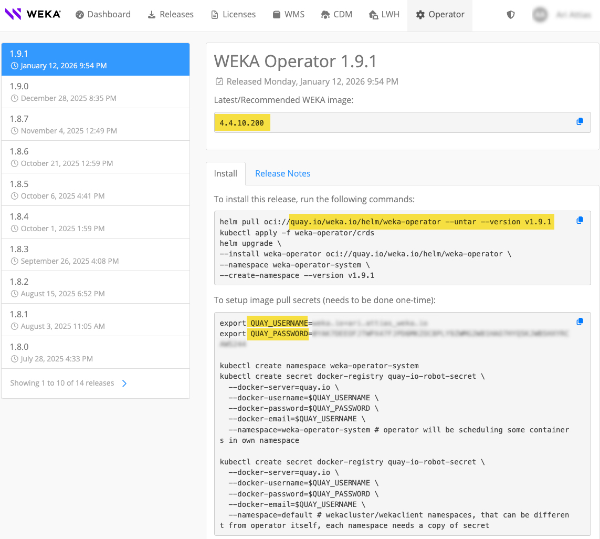

# WEKA Operator deployments

## Overview

The WEKA Operator simplifies deploying, managing, and scaling the WEKA Data Platform within a Kubernetes cluster. It provides custom Kubernetes resources that define and manage WEKA components effectively.

By integrating WEKA's high-performance storage into Kubernetes, the Operator supports compute-intensive applications like AI, ML, and HPC. This enhances data access speed and boosts overall performance.

The WEKA Operator automates tasks, enables periodic maintenance, and ensures robust cluster management. This setup provides resilience and scalability across the cluster. With its persistent, high-performance data layer, the WEKA Operator enables efficient management of large datasets, ensuring scalability and efficiency.


**Target audience:** This guide is intended exclusively for experienced Kubernetes cluster administrators. It provides detailed procedures for deploying the WEKA Operator on a Kubernetes cluster that meets the specified requirements in the [#id-2.-prepare-kubernetes-environment](./#id-2.-prepare-kubernetes-environment "mention") section.


### Versions compatibility

The following matrix outlines the minimum version requirements for specific features when managed through the WEKA Kubernetes Operator. To ensure stability, always verify that your WEKA cluster and Operator versions are aligned.

<table><thead><tr><th width="150">Feature</th><th width="201">Operator (min. version)</th><th width="230">WEKA Cluster (min. version)</th><th>Status</th></tr></thead><tbody><tr><td>S3</td><td>v1.7</td><td>4.4</td><td>Supported</td></tr><tr><td>NFS</td><td>v1.10</td><td>5.1.0</td><td>Supported</td></tr><tr><td>Audit</td><td>v1.10</td><td>5.1.0</td><td>Supported</td></tr><tr><td>SMB-W</td><td>—</td><td>—</td><td>Not supported</td></tr><tr><td>Data Services</td><td>—</td><td>—</td><td>Not supported</td></tr></tbody></table>

### WEKA Operator backend deployment overview

The WEKA Operator backend deployment integrates various components within a Kubernetes cluster to deploy, manage, and scale the WEKA Data Platform effectively.

#### How it works

* **Local Server Setup**: This setup integrates Kubernetes with the WekaCluster custom resources (CRDs) and facilitates WEKA Operator installation through Helm. Configuring Helm registry authentication provides access to the necessary CRDs and initiates the operator installation.
* **WekaCluster CR**: The WekaCluster CR defines the WEKA cluster’s configuration, including storage, memory, and resource limits, while optimizing memory and CPU settings to prevent out-of-memory errors. Cluster and container management also support operational tasks through on-demand executions (through WekaManualOperation) and scheduled tasks (through WekaPolicy).
* **WEKA Operator**:
  * The WEKA Operator retrieves Kubernetes configurations from WekaCluster CRs, grouping multiple WEKA containers to organize WEKA nodes into a single unified cluster.
  * To enable access to WEKA container images, the Operator retrieves credentials from Kubernetes secrets in each namespace that requires WEKA resources.
  * Using templates, it calculates the required number of containers and deploys the WEKA cluster on Kubernetes backends through a CRD.
  * Each node requires specific Kubelet configurations—such as kernel headers, storage allocations, and huge page settings—to optimize memory management for the WEKA containers. Data is stored in the `/opt/k8s-weka` directory on each node, with CPU and memory allocations determined by the number of WEKA containers and available CPU cores per node.
* **Driver Distribution Model**: This model ensures efficient kernel module loading and compatibility across nodes, supporting scalable deployment for both clients and backends. It operates through three primary roles:
  * **Distribution Service**: A central repository storing and serving WEKA drivers for seamless access across nodes.
  * **Drivers Builder**: Compiles drivers for specific WEKA versions and kernel targets, uploading them to the Distribution Service. Multiple builders can run concurrently to support the same repository.
  * **Drivers Loader**: Automatically detects missing drivers, retrieves them from the Distribution Service, and loads them using `modprobe`.

<div data-with-frame="true"><figure><figcaption><p>WEKA Operator backend deployment</p></figcaption></figure></div>

### WEKA Operator client deployment overview

The WEKA Operator client deployment uses the WekaClient custom resource to manage WEKA containers across a set of designated nodes, similar to a DaemonSet. Each WekaClient instance provisions WEKA containers as individual pods, creating a persistent layer that supports high availability by allowing safe pod recreation when necessary.

#### How it works

* **Deployment initiation**: The user starts the deployment from a local server, which triggers the process.
* **Custom resource retrieval**: The WEKA Operator retrieves the WekaClient custom resource (CR) configuration. This CR defines which nodes in the Kubernetes cluster run WEKA containers.
* **WEKA containers deployment**: Based on the WekaClient CR, the Operator deploys WEKA containers across the specified Kubernetes client nodes. Each WEKA container instance runs as a single pod, similar to a DaemonSet.
*   **Persistent storage setup**: The WEKA Operator automates the deployment of the WEKA Container Storage Interface (CSI) plugin, which is the standard way to provide persistent storage for applications within Kubernetes. This plugin enables pods (clients) to dynamically provision and mount Persistent Volumes (PVs) from the WEKA system.

    Starting with Operator version 1.7.0, the deployment process has been streamlined:

    * **Embedded CSI plugin:** The CSI plugin is now embedded directly within the WekaClient CR, simplifying its management.
    * **Co-located cluster requirement:** This integrated CSI deployment is only supported when the WEKA cluster and the WEKA clients reside within the same Kubernetes cluster. This is configured by referencing the WEKA cluster in the `targetCluster` field of the WekaClient CR.
* **High availability**: The WEKA containers act as a persistent layer, enabling each pod to be safely recreated as needed. This supports high availability by ensuring continuous service even if individual pods are restarted or moved.

<div data-with-frame="true"><figure><figcaption><p>WEKA Operator client deployment</p></figcaption></figure></div>

#### WEKA Operator client-only deployment

If the WEKA cluster is outside the Kubernetes cluster but you have workloads inside Kubernetes, you can deploy a WEKA client within the Kubernetes cluster to connect to the external WEKA cluster.

#### Client Pod CLI restrictions

Cluster-level WEKA CLI commands are supported only from the Compute or Drive pods.

The WEKA Operator client and application client pods operate with restricted permissions intended for data-path access only. Running cluster CLI commands, such as `weka status`, from these contexts is not supported and results in authorization errors.

***

## Deployment workflow

1. **Obtain setup information:** Collect registry credentials and version tags.
2. **Prepare Kubernetes environment:** Configure servers, huge pages, and kubelet policies.
3. **Install the WEKA Operator:** Deploy the controller and define drive type ratios.
4. **Manage driver distribution:** Configure local or external driver building services.
5. **Discover and sign drives:** Identify physical storage and configure sharing policies.
6. **Provision WEKA resources:** Deploy the WekaCluster (backend) and WekaClient (frontend).
7. **Manage resources and label propagation:** Monitor the health of your WEKA resources.
8. **Manage the WEKA cluster management proxy:** Access WEKA management and service endpoints using Kubernetes Ingress resources.
9. **Perform post-deployment storage configuration:** Configure the CSI plugin and storage classes based on your operator version to enable persistent volume provisioning.


WEKA Operator currently supports only x86 architecture.


### 1. Obtain setup information

Identify and record the credentials required to pull WEKA container images and the specific version tags for your deployment.

**Before you begin**

Contact the WEKA Customer Success Team to receive your authorized registry credentials.

**Procedure**

1. Access [get.weka.io/ui/operator](https://get.weka.io/ui/operator) to identify the latest `WEKA_OPERATOR_VERSION` and `WEKA_IMAGE_VERSION_TAG`.
2. Record the following credentials for your image pull secret:
   * Registry: `quay.io`
   * QUAY\_USERNAME
   * QUAY\_PASSWORD
   * QUAY\_SECRET\_KEY: Typically `quay-io-robot-secret`.


Replace all placeholders in your setup files with these values to ensure a consistent deployment.


<div data-with-frame="true"><figure><figcaption><p>Example: WEKA Operator page on get.weka.io</p></figcaption></figure></div>

### 2. Prepare Kubernetes environment

Ensure the infrastructure meets the performance and resiliency requirements of the WEKA data plane.

#### Local server requirements

Ensure access to a server for manual helm installation, unless using a higher-level deployment tool such as Argo CD.

```bash
curl -fsSL -o get_helm.sh https://raw.githubusercontent.com/helm/helm/main/scripts/get-helm-3 && chmod 700 get_helm.sh && ./get_helm.sh
```

#### **Control plane high availability**

Configure the Kubernetes control plane for high availability (HA) to match WEKA resiliency. HA depends on `etcd` quorum.

* **Quorum rule:** `etcd` requires an odd number of members (N) and tolerates failures up to (N-1)/2.
* **Recommendation:** Use five or nine `etcd` members for production storage backends.


Consider using an external `etcd` cluster or distributing control plane components across multiple failure domains. For more information, see the official [Kubernetes HA topology guidance](https://kubernetes.io/docs/setup/production-environment/tools/kubeadm/ha-topology/).


#### **Node hardware and software requirements**

Verify that every node in the cluster adheres to these specifications:

* **Kubernetes version:** 1.25 or later (OpenShift 4.17 or later).
* **Storage allocation:** Reserve \~20 GiB per WEKA container plus 10 GiB per allocated CPU core in `/opt/k8s-weka`. Do not use NFS or network-attached storage.
* **Kernel headers:** Ensure kernel headers exactly match the running kernel version to allow driver compilation.

#### Configure HugePages for Kubernetes worker nodes

Configure HugePages on worker nodes to ensure the WEKA process has the required memory allocation for high-performance data operations.

**Memory allocation requirements**

The WEKA process requires dedicated memory in the form of HugePages. The allocation size depends on the drive capacity and the number of CPU cores assigned to the process.

* **Server capacity:** The sum of the usable capacity of all drives assigned to the server and allocated for WEKA.
* **Cores for WEKA:** The number of CPU cores dedicated to the WEKA process on the container.
* **WEKA Container factor:** The standard allocation of 1.7 GiB of hugePages on per WEKA container.
* **Metadata ratio:** The relationship between metadata requirements and HugePages consumption. The default value is 1000. You can increase this up to 2000 to preserve non-HugePages Resident Set Size based on server memory availability.
* **Headroom:** A 10% multiplier (1.1) to account for memory fragmentation and operational variance.

**HugePages calculation reference**

Use the following formula to determine the required memory:

$$
\text{Total GiB} = \left( \frac{\text{Server capacity}}{\text{Ratio}} + \text{Cores for WEKA} \times 1.7 \right) \times 1.1
$$

To calculate the total required HugePages:

1. Convert the Total GiB value to MiB by multiplying by 1024.
2. Divide the result by 2 to get the total number of 2 MiB HugePages needed.

**Example calculation**

The following example demonstrates how to calculate the required HugePages for a high-performance server configuration.

Server specifications:

* CPU cores: 64 total.
* Cores for WEKA: 63 cores dedicated to the WEKA process.
* Storage configuration: 16 drives, each with 15.3 TiB.
* Server capacity: 244.8 TiB usable capacity (250,675 GiB).

Step-by-step calculation:

1. Calculate total GiB:

$$
\left( \frac{250,675GiB}{1000} + 63 \times 1.7 GiB\right) \times 1.1 = 393.55 GiB
$$

2. Convert to MiB:

$$
393.55GiB \times 1024 = 402,998MiB
$$

3. Calculate the total required HugePages (2 MiB per HugePage):

$$
402,998MiB \div 2MiB = 201499
$$

Final requirement: 201,500 HugePages (rounded up).

**Apply HugePages settings**

Before you begin:

* Identify the number of drives and CPU cores allocated to WEKA on the server.
* Ensure you have root or sudo permissions on the worker nodes.

Procedure:

1.  Check the current HugePages status on the server:

    ```bash
    grep Huge /proc/meminfo
    ```
2.  Apply the required HugePages value:

    ```bash
    sudo sysctl -w vm.nr_hugepages=201500
    ```
3.  Persist the setting to ensure it remains active after a reboot:

    ```bash
    sudo sh -c 'echo "vm.nr_hugepages = 201500" >> /etc/sysctl.conf'
    ```

#### **Identify Kubernetes port requirements**

Manage port allocations for the WEKA Operator and client services to ensure reliable network communication. The WEKA Operator automates port allocation to prevent collisions within multi-cluster environments.

Starting with WEKA Operator 1.10 and WEKA 5.1.0, the operator maintains a port pool starting at port 35000. It allocates a contiguous range of 260 ports per cluster. Earlier versions of the operator and WEKA software allocate 500 ports for this purpose.

WEKA clients discover and connect to services using a separate default range that starts at port 45000. The system handles these allocations internally. Manual configuration is typically unnecessary unless specific infrastructure or policy requirements apply.

**Port allocation summary**

<table><thead><tr><th width="355">Component</th><th width="170">Default start port</th><th>Port range size</th></tr></thead><tbody><tr><td>WEKA Operator (v1.10+) / WEKA (v5.1.0+)</td><td>35000</td><td>260 ports per cluster</td></tr><tr><td>WEKA Operator / WEKA (previous versions)</td><td>35000</td><td>500 ports per cluster</td></tr><tr><td>WEKA client connectivity</td><td>45000</td><td>Internal allocation</td></tr></tbody></table>

## Configure Kubelet requirements

Ensure predictable, high-performance behavior for WEKA data-plane processes by configuring the Kubelet CPU Manager with a static policy. This configuration enables Kubernetes to assign dedicated CPU cores to Guaranteed-QoS pods, which prevents CPU contention and eliminates scheduler jitter.

On Kubernetes v1.32 and later, enable `strict-cpu-reservation` to extend this protection to Burstable and Best Effort pods. Without this option, pods in those QoS classes can schedule onto reserved cores and reduce WEKA IO throughput under load.

### Identify HyperThreading sibling cores

Each physical core has two logical CPUs on hyperthreaded systems. Include both logical CPUs from the same physical core in `reservedSystemCPUs` to ensure isolation. Reserving only one logical CPU leaves the physical core shared and defeats the isolation.

Do not treat CPUs on different sockets with the same core index as siblings. Siblings are the logical CPUs listed for the same physical core on the same server topology.

Run the following commands to identify the real sibling pairs on the server:

```bash
lscpu -e=cpu,core,socket,node

cat /sys/devices/system/cpu/cpu*/topology/thread_siblings_list
```

Example output for a 48-logical-CPU, 2-socket server:

```bash
CPU  CORE  SOCKET  NODE
0    0     0       0
1    1     0       0
2    2     0       0
...
24   0     1       0
25   1     1       0
26   2     1       0
...
```

In this example, logical CPUs `0` and `24` have the same core index on different sockets, but they are not HyperThreading siblings. If `thread_siblings_list` shows pairs such as `1,25` and `2,26`, reserving those physical cores for the WEKA client means reserving `1,2,25,26`.

### Configure the Kubelet

Apply the configuration to each worker node separately.

1. Edit the Kubelet configuration file to add the settings shown in the following example.
2. Set `reservedSystemCPUs` to include at least one physical core (both logical CPUs) for the OS, plus the cores assigned to the WEKA client and their HyperThreading siblings.
3. Save the file and restart the Kubelet:

```bash
systemctl restart kubelet
```

#### Example: Kubelet configuration for static CPU allocation with strict reservation

In this example, one physical core is reserved for the OS and four physical cores are reserved for the WEKA client. The `reservedSystemCPUs` list includes both logical CPUs for each reserved physical core. `strict-cpu-reservation` prevents all pod QoS classes from scheduling onto reserved cores.

```yaml
apiVersion: kubelet.config.k8s.io/v1beta1
kind: KubeletConfiguration
cpuManagerPolicy: "static"
reservedSystemCPUs: "0,1-4,24-28"
featureGates:
  CPUManagerPolicyOptions: "true"
  CPUManagerPolicyAlphaOptions: "true"   # requires Kubernetes v1.32 or later
cpuManagerPolicyOptions:
  strict-cpu-reservation: "true"
```

Adjust the `reservedSystemCPUs` list to match the actual sibling pairs reported by `lscpu -e` and `thread_siblings_list`. Reserve additional OS cores on larger or busier containers.


`CPUManagerPolicyAlphaOptions` and `strict-cpu-reservation` require Kubernetes v1.32 or later. Omit the `featureGates` and `cpuManagerPolicyOptions` blocks on earlier versions. Without strict reservation, Burstable and Best Effort pods use reserved cores under load, which reduces WEKA IO throughput.


**Related topic**

[best-practices-for-weka-stateless-client-and-kubernetes.md](../../best-practice-guides/best-practices-for-weka-stateless-client-and-kubernetes.md "mention")

**Related information**

[Control CPU Management Policies on the Node](https://kubernetes.io/docs/tasks/administer-cluster/cpu-management-policies/)

#### Configure image pull secrets

Set up Kubernetes secrets to enable secure image pulling from the WEKA container registry. These secrets must exist in every namespace where WEKA resources are deployed to avoid authorization failures.

**Before you begin**

Identify your QUAY\_USERNAME, QUAY\_PASSWORD, and the desired QUAY\_SECRET\_KEY name obtained during the setup information phase.

**Procedure**

1. Define the target namespaces and ensure they do not overlap to prevent configuration conflicts.
2. Create the secret for `quay.io` authentication in both the `weka-operator-system` and the default namespaces. Repeat this process for any additional namespaces as required.

<details>

<summary>Example: Creating secrets for quay.io</summary>

```bash
# Set environment variables for the session
export QUAY_USERNAME='your_username'
export QUAY_PASSWORD='your_password'

# Create the operator namespace
kubectl create ns weka-operator-system

# Create the secret in the operator namespace
kubectl create secret docker-registry quay-io-robot-secret \
  --docker-server=quay.io \
  --docker-username=$QUAY_USERNAME \
  --docker-password=$QUAY_PASSWORD \
  --docker-email=$QUAY_USERNAME \
  --namespace=weka-operator-system

# Create the secret in the default namespace
kubectl create secret docker-registry quay-io-robot-secret \
  --docker-server=quay.io \
  --docker-username=$QUAY_USERNAME \
  --docker-password=$QUAY_PASSWORD \
  --docker-email=$QUAY_USERNAME \
  --namespace=default
```

</details>

## Configure failure domains

Ensure high availability and data protection by grouping backend nodes into failure domains. A failure domain (FD) represents a set of processes that share a common physical risk, such as a rack, power circuit, or network switch. By defining these domains, the system ensures that data and parity blocks from the same stripe are distributed across different physical groups. If an entire failure domain fails, the cluster reconstructs the missing data from the remaining domains.

### Select a failure domain mode

Choose the distribution mode that matches your physical infrastructure risks.

<table><thead><tr><th width="161">Mode</th><th>Function</th><th>Usage</th></tr></thead><tbody><tr><td>Implicit (default)</td><td>Assigns every process as its own independent failure domain.</td><td>Deployments with no shared infrastructure risks between containers.</td></tr><tr><td>Explicit</td><td>Groups processes into named domains based on physical node labels.</td><td>Deployments where containers share a rack, switch, or power source.</td></tr></tbody></table>

### Determine stripe width and domain count

Coordinate the number of failure domains with the stripe width and protection level during cluster formation. Stripe width and protection levels are permanent once set. Use the following constraint to prevent data loss:

* Blocks lost during FD failure = stripe width / number of failure domains
* This value must not exceed the parity block count (P).

#### Minimum healthy server requirements

The stripe data width and protection level determine the minimum number of healthy servers required to remain operational.

| Stripe configuration | Minimum healthy serve |
| -------------------- | --------------------- |
| 5+2                  | 4                     |
| 16+ 2                | 9                     |
| 5+4                  | 3                     |
| 16+4                 | 5                     |

### Configure failure domains in Kubernetes

Define how the operator identifies failure domains by modifying the `WekaCluster` custom resource (CR).

#### Map a single node label

Assign nodes to failure domains using a specific Kubernetes label key.

**Procedure**

1.  Label every backend node with a physical grouping value:

    ```bash
    kubectl label nodes <node-name> weka.io/failure-domain=<rack-id>
    ```
2.  Configure the `failureDomain` field in the `WekaCluster` CR:

    ```yaml
    spec:
      failureDomain:
        label: "weka.io/failure-domain"
        skew: 1
    ```

    * `label`: The node label key identifying the failure domain.
    * `skew`: The permitted difference in container count between domains.

#### Use composite topology labels

Combine existing Kubernetes topology labels, such as zone and rack, into a compound failure domain identity.

**Procedure**

1.  Identify the existing labels on your nodes:

    ```bash
    kubectl get nodes --show-labels
    ```
2.  Add the `compositeLabels` list to the `WekaCluster` CR:

    ```yaml
    spec:
      failureDomain:
        compositeLabels:
          - "topology.kubernetes.io/zone"
          - "rack"
    ```

    The operator combines these values. For example, a node in zone `us-east-1a` on `rack-1` becomes failure domain `us-east-1a/rack-1`.

### Verify the configuration

Confirm the distribution of containers across the defined domains.

**Procedure**

1.  Apply the CR changes:

    ```bash
    kubectl apply -f wekacluster.yaml
    ```
2.  Check the container status:

    ```bash
    weka cluster container
    ```
3. Verify that the `FAILURE DOMAIN` column displays your custom label values instead of `AUTO`.

### 3. Install the WEKA Operator

Manage the lifecycle of WEKA resources by installing the WEKA Operator. This process involves applying Custom Resource Definitions (CRDs) and deploying the operator controller with specific configurations for the Container Storage Interface (CSI) and drive types.

**Before you begin**

* Ensure the QUAY\_SECRET\_KEY is created in the weka-operator-system namespace.
* Verify that helm and kubectl are installed on your server.

**Procedure**

1. **Apply the WEKA CRDs:** Download and apply the definitions required for the Kubernetes API to recognize WEKA resources. Replace \<WEKA\_OPERATOR\_VERSION> with your specific version.

```bash
helm pull oci://quay.io/weka.io/helm/weka-operator --untar --version <WEKA_OPERATOR_VERSION>
kubectl apply -f weka-operator/crds
```

2. **Define drive allocation ratios:** Starting with version **1.10**, you must specify the ratio between QLC and TLC drive types. This is essential for Hybrid Flash environments. Use the following parameters according to your storage configuration:
   * **Hybrid Flash:** `--set driveSharing.driveTypesRatio='{tlc: 9, qlc: 1}'`\
     Result: Allocates 1/10 capacity to QLC and 9/10 to TLC.
   * **Single drive type:** `--set driveSharing.drivesTypesRatio='{qlc: 0}'`\
     Result: Disables hybrid allocation.
3. **Deploy the WEKA Operator:** Execute the Helm command to install the operator. For versions **1.7.0** and later, include the CSI plugin enablement flag.

```bash
helm upgrade --create-namespace \
    --install weka-operator oci://quay.io/weka.io/helm/weka-operator \
    --namespace weka-operator-system \
    --version <WEKA_OPERATOR_VERSION> \
    --set csi.installationEnabled=true \
    --set driveTypeRatio='{tlc: 4, qlc: 1}'
```


For operator versions earlier than 1.7.0, omit the `--set csi.installationEnabled=true` parameter.


4. **Verify the installation:** Ensure the operator pod is running.

```bash
kubectl -n weka-operator-system get pod
```

The expected output show the weka-operator-controller-manager with a **Running** status.

```
NAME                                               READY  STATUS  RESTARTS   AGE
weka-operator-controller-manager-564bfd6b49-p6k7d   2/2   Running     0      13s
```

### 4. Manage driver distribution

The WEKA Operator manages the distribution of WEKA drivers to client and backend processes, ensuring compatibility across kernel versions and architectures. It does this by either downloading pre-built drivers or compiling them locally.

Use the `driversDistService` attribute to configure the driver distribution service.

**Pre-built drivers (recommended)**

For most deployments, use pre-built drivers sourced directly from the WEKA driver registry at `drivers.weka.io`. This approach requires no additional build infrastructure.

**Local driver builder**

A local driver builder is required in any of the following cases:

* You are using a customized image.
* You are operating in an air-gapped environment.
* Your system cannot access external sources.

For architectural details, see [driver-management-with-the-weka-operator.md](driver-management-with-the-weka-operator.md "mention").

**Before you begin**

* **External service:** WEKA recommends the registry at `https://drivers.weka.io` for standard Linux distributions and supported kernels.
* **Local distribution:** Configure a local distribution service for air-gapped environments or custom OS builds.
* **Registry access:** Ensure a WEKA-compatible image (`weka-in-container`) and a valid `imagePullSecret` are accessible.
* **Version matching:** Builder container versions must match the target WEKA version.

**Local driver distribution components**

To build and serve drivers within the cluster, the operator deploys the following:

* **Drivers-Builder:** Compiles the kernel module for specific WEKA and kernel version combinations.
* **Drivers-Dist:** An internal HTTP server that stores and serves the compiled driver packages.
* **Service:** A Kubernetes Service that exposes the Drivers-Dist at a stable internal endpoint.

**Procedure**

1. **Define node selection:** Use a `nodeSelector` to identify the target Kubernetes nodes that require the driver.
2. **Create the distribution policy:** Use a `WekaPolicy` (for WEKA Operator 1.6.0+) to deploy the local driver distribution service.


```yaml
apiVersion: weka.weka.io/v1alpha1
kind: WekaPolicy
metadata:
  name: weka-drivers
  namespace: weka-operator-system
spec:
  type: enable-local-drivers-distribution
  image: quay.io/weka.io/weka-in-container:5.1.0 # Use the target 5.x LTS version
  imagePullSecret: "quay-io-robot-secret"
  payload:
    driverDistPayload:
      builderPreRunScript: "apt-get update && apt-get install -y gcc-12"
    interval: 1m
  nodeSelector:
    weka.io/supports-backends: "true"
```


3. **Apply the configuration:** Save and apply the manifest to the cluster.

```bash
kubectl apply -f weka-drivers.yaml
```

**Reference: WekaPolicy attributes**

<table><thead><tr><th width="194.0234375">Attribute</th><th>Description</th></tr></thead><tbody><tr><td><code>image</code></td><td>The WEKA container image used for the distributor and default builder.</td></tr><tr><td><code>interval</code></td><td>How often the operator reconciles the policy (default: 1m).</td></tr><tr><td><code>builderPreRunScript</code></td><td>Optional script to run (for example, installing a compiler) before the build.</td></tr></tbody></table>

<details>

<summary>Examples: Driver distribution service for WEKA Operator using WekaPolicy, starting from version 1.6.0</summary>

The WEKA operator supports driver distribution deployment using the WEKA policy. When a valid policy is applied, the operator automatically creates the required resources as shown in the examples.

**Requirements:** When configuring driver distribution, the following elements must be preserved exactly as shown in the provided configuration snippets:

* Ports
* Network modes
* Core configurations
* Container name (spec.name)

**Example 1: Minimal policy for drivers distribution (typical)**

```yaml
apiVersion: weka.weka.io/v1alpha1
kind: WekaPolicy
metadata:
  name: weka-drivers
  namespace: weka-operator-system
spec:
  image: quay.io/weka.io/weka-in-container:5.1.0
  imagePullSecret:  "quay-io-robot-secret"
  payload:
    driverDistPayload: 
      builderPreRunScript: "apt-get update && apt-get install -y gcc-12"
    interval: 1m
  nodeSelector:
    weka.io/supports-backends: "true"
  type: enable-local-drivers-distribution
```

**WekaPolicy additional attributes**

You can use the following attributers if needed in addition to to the minimal policy:

* `ensureNICsPayload`: Defines the configuration for ensuring a specific number of data NICs on selected nodes.
* `interval`: Defines how often to reconcile the policy.
* `signDrivesPayload`: Configures parameters to scan and sign drives for WEKA backend containers.

**Example 2: Manual deployment of WEKA drivers distribution and builder containers**

```yaml
apiVersion: weka.weka.io/v1alpha1
kind: WekaContainer
metadata:
  name: weka-drivers-dist
  namespace: weka-operator-system
  labels:
    app: weka-drivers-dist
spec:
  agentPort: 60001
  image: quay.io/weka.io/weka-in-container:5.1.0
  imagePullSecret: "quay-io-robot-secret"
  mode: "drivers-dist"
  name: dist
  numCores: 1
  port: 60002
---
apiVersion: v1
kind: Service
metadata:
  name: weka-drivers-dist
  namespace: weka-operator-system
spec:
  type: ClusterIP
  ports:
    - name: weka-drivers-dist
      port: 60002
      targetPort: 60002
  selector:
    app: weka-drivers-dist
---
apiVersion: weka.weka.io/v1alpha1
kind: WekaContainer
metadata:
  name: weka-drivers-builder-157
  namespace: weka-operator-system
spec:
  agentPort: 60001
  image: quay.io/weka.io/weka-in-container:5.1.0
  imagePullSecret: "quay-io-robot-secret"
  mode: "drivers-builder"
  name: dist # WEKA container name
  numCores: 1
  uploadResultsTo: "weka-drivers-dist"
  port: 60002
  nodeSelector:
    weka.io/supports-backends: "true"
---
apiVersion: weka.weka.io/v1alpha1
kind: WekaContainer
metadata:
  name: weka-drivers-builder-157-ubuntu-1
  namespace: weka-operator-system
spec:
  agentPort: 60001
  image: quay.io/weka.io/weka-in-container:5.1.0
  imagePullSecret: "quay-io-robot-secret"
  mode: "drivers-builder"
  name: dist # WEKA container name
  numCores: 1
  uploadResultsTo: "weka-drivers-dist"
  port: 60002
  nodeSelector:
    weka.io/supports-backends: "true"
    weka.io/kernel: "6.5.0-45-generic"
  overrides:
    preRunScript: "apt-get update && apt-get install -y gcc-12"
```

**Example 3: Example: WekaPolicy for enabling local drivers distribution**


```yaml
apiVersion: weka.weka.io/v1alpha1
kind: WekaPolicy
metadata:
  name: weka-drivers
  namespace: weka-operator-system # Specify the namespace where the Weka operator is deployed
spec:
  type: "enable-local-drivers-distribution"
  # Base image used for the drivers-dist container; also used as the default for driver builders
  image: "quay.io/weka.io/weka-in-container:5.1.0 # Replace with the target Weka image version
  imagePullSecret: "quay-io-robot-secret" # Replace with your image pull secret for accessing the image registry
  tolerations:
  - key: "example-key"
    operator: "Exists"
    effect: "NoSchedule"
  payload:
    interval: "1m" # Reconciliation interval for the policy
    driverDistPayload: # Required: configuration for driver distribution
      # List of additional Weka images for which drivers should be prebuilt
      # These are in addition to any images detected from existing WekaCluster/WekaClient resources
      ensureImages:
        - "quay.io/weka.io/weka-in-container:5.1.0" # Example image for proactive driver build
        - "quay.io/weka.io/weka-in-container:5.1.0" # Another example
      # Node selectors defining where builder containers can be scheduled
      # Builders run on nodes matching both these selectors and the discovered kernel/architecture
      nodeSelectors:
        - role: "worker-nodes"
          environment: "production"
        - custom-label: "drivers-build-pool"
      # Optional: Override default label keys for kernel and architecture detection
      # Defaults: weka.io/kernel and weka.io/architecture
      # kernelLabelKey: "custom.io/kernel-version"
      # architectureLabelKey: "custom.io/arch"
      # Optional: Node selector for the driver distribution container
      # Leave empty to allow scheduling on any node
      # distNodeSelector: {}
      # Optional: Script to run in builder containers after kernel validation and before the build process
      builderPreRunScript: |
        #!/bin/sh
        apt-get update && apt-get install -y gcc-12
```


</details>

### 5. Discover and sign drives

Identify and prepare physical storage devices for use within the WEKA cluster. This process ensures all drives are uniquely identified, healthy, and ready for integration.

The discovery process performs the following actions:

* **Node annotation:** Each node is updated with a list of known serial IDs for all accessible drives.
* **Resource creation:** An extended resource, `weka.io/drives`, is created on each node to indicate the count of ready drives.
* **Health verification:** Only healthy, unblocked drives are marked as available. Drives with errors or manual blocks are excluded to maintain cluster stability.

**Drive discovery methods**

Identify the appropriate method for your environment:

* **WekaManualOperation:** A one-time action that signs and discovers drives. Use this for initial manual provisioning.
* **WekaPolicy:** An automated approach that performs periodic discovery. It initiates discovery immediately when it detects node updates or hardware additions.

**Procedure**

1. **Define drive sharing and signing:** Apply a WekaPolicy to sign compatible drives. For WEKA 5.1.0 and Operator 1.10, enable drive sharing to support composable clusters.


```yaml
apiVersion: weka.weka.io/v1alpha1
kind: WekaPolicy
metadata:
  name: sign-drives
  namespace: weka-operator-system
spec:
  type: sign-drives
  payload:
    signDrivesPayload:
      type: "all-not-root"
      shared: true # Enables drive sharing for WEKA 5.1.0 and Operator 1.10
```


2. **Initiate discovery:** Use a WekaManualOperation to detect signed drives across the cluster. Replace placeholders with your recorded version and secret key.


```yaml
apiVersion: weka.weka.io/v1alpha1
kind: WekaManualOperation
metadata:
  name: discover-drives
  namespace: weka-operator-system
spec:
  action: "discover-drives"
  image: quay.io/weka.io/weka-in-container:5.1.0
  imagePullSecret: "quay-io-robot-secret"
  payload:
    discoverDrivesPayload:
      nodeSelector:
        weka.io/supports-backends: "true"
```


3. **Verify discovery:** Confirm that the `weka.io/drives` extended resource is present on the target nodes.

**Reference: Drive selection types**

<table><thead><tr><th width="185">Name</th><th>Description</th></tr></thead><tbody><tr><td><code>all-not-root</code></td><td>Signs all detected block devices except the root device.</td></tr><tr><td><code>aws-all</code></td><td>Detects NVMe devices using AWS PCI identifiers.</td></tr><tr><td><code>device-paths</code></td><td>Targets specific device paths listed in the manifest.</td></tr></tbody></table>

### 6. Provision WEKA resources

Deploy the WekaCluster and WekaClient Custom Resources (CRs) to provision the backend storage and connect your Kubernetes nodes.

Perform these steps in sequence:

1. Install the WekaCluster CR.
2. Create the WEKA cluster client secret.
3. Install the WekaClient CR.

#### 1. Install the WekaCluster CR

Provision the WEKA cluster backend using the WekaCluster CR. This resource defines the storage containers, drive configurations, and networking for the cluster.

**Before you begin**

* **Drive discovery:** Ensure you have signed and discovered drives.
* **Driver distribution:** Verify the driver distribution service is accessible. WEKA recommends the external service at [https://drivers.weka.io](https://drivers.weka.io/).
* **Drive sharing:** If using WEKA 5.1.0 and Operator 1.10 onwards, use the `containerCapacity` parameter instead of `numDrives`.

**Procedure**

1. Create a manifest file named `weka-cluster.yaml`.
2. Configure the resource using the following template. Replace the image tag and secret key placeholders with your recorded values.


```yaml
apiVersion: weka.weka.io/v1alpha1
kind: WekaCluster
metadata:
  name: cluster-dev
  namespace: default
spec:
  template: dynamic
  dynamicTemplate:
    computeContainers: 6
    driveContainers: 6
    # Use containerCapacity for WEKA 5.1.0+ with drive sharing
    containerCapacity: 1000 
  image: quay.io/weka.io/weka-in-container:5.1.0
  nodeSelector:
    weka.io/supports-backends: "true"
  driversDistService: "https://drivers.weka.io"
  imagePullSecret: "quay-io-robot-secret"
  network:
    udpMode: true
```


3. Apply the manifest:

```bash
kubectl apply -f weka-cluster.yaml
```

**Reference: WekaCluster parameters**

Identify and configure the parameters for the WekaCluster Custom Resource (CR) to define the backend storage environment.

<table><thead><tr><th width="210.73046875">Name</th><th>Description</th></tr></thead><tbody><tr><td><code>template</code></td><td>Specifies the deployment template. Currently, only dynamic is supported.<br><strong>Default:</strong> dynamic</td></tr><tr><td><code>dynamicTemplate</code></td><td>Defines the scale of the cluster, including the number of computeContainers, driveContainers, and <code>numDrives</code> (or <code>containerCapacity</code> for v1.10+).</td></tr><tr><td><code>image</code></td><td>The WEKA container image version to deploy.</td></tr><tr><td><code>imagePullSecret</code></td><td>The Kubernetes secret name used to authenticate with the image registry.</td></tr><tr><td><code>driversDistService</code></td><td>The URL of the driver distribution service (e.g., <a href="https://drivers.weka.io/">https://drivers.weka.io</a>).</td></tr><tr><td><code>nodeSelector</code></td><td>A map of key-value pairs used to select the nodes for the cluster pods.</td></tr><tr><td><code>roleNodeSelector</code></td><td>Defines specific node scheduling for compute, drive, and s3 roles.</td></tr><tr><td><code>wekaHome</code></td><td>Configures the endpoint and <code>cacertSecret</code> for WEKA Home connectivity.</td></tr><tr><td><code>ipv6</code></td><td>Enables or disables IPv6 networking.</td></tr><tr><td><code>additionalMemory</code></td><td>Specifies additional memory allocation per role beyond the default.<br>Default: 0</td></tr><tr><td><code>ports</code></td><td>Overrides default port assignments, typically used for cluster migration.</td></tr><tr><td><code>operatorSecretRef</code></td><td>Reference to a secret used for migration-by-healing from non-Kubernetes environments.</td></tr><tr><td><code>expandEndpoints</code></td><td>Enables endpoint expansion during migration scenarios.<br>Default: false</td></tr><tr><td><code>hugepagesOffsets</code></td><td>Specifies memory offsets for hugepage allocations (e.g., driveHugepagesOffset).</td></tr><tr><td><code>tolerations</code></td><td>A list of strings that expand to standard Kubernetes tolerations.</td></tr><tr><td><code>rawTolerations</code></td><td>A list of structured Kubernetes toleration objects for advanced scheduling.</td></tr><tr><td><code>network</code></td><td>Configures networking modes, such as <code>udpMode</code> or specific <code>ethDevice</code> settings.</td></tr></tbody></table>

#### 2. Create the WEKA cluster client secret

Create a Kubernetes Secret containing the credentials required for clients to join the WEKA cluster.

**Before you begin**

Obtain the `org`, `join-secret`, `password`, and `username` from your WEKA backend.

**Procedure**

1. Encode each credential value to **base64**.
   * **Linux/macOS example:** `echo -n 'my_password' | base64`
2. Create a file named `secret.yaml` and populate it with the encoded values.


```yaml
apiVersion: v1
kind: Secret
metadata:
  name: weka-cluster-dev
  namespace: weka-operator-system
type: Opaque
data:
  org: <base64-encoded-org>
  join-secret: <base64-encoded-join-secret>
  password: <base64-encoded-password>
  username: <base64-encoded-username>
```


3. Apply the secret:

```bash
kubectl apply -f secret.yaml
```

#### 3. Install the WekaClient CR

Deploy the WekaClient Custom Resource (CR) to manage WEKA containers across designated Kubernetes nodes. The WekaClient CR operates similarly to a DaemonSet, provisioning individual pods that maintain a persistent data-plane layer for your workloads.

**Before you begin**

* **Label nodes:** Apply the following label to every worker node intended to host WEKA client pods: `kubectl label nodes <node-name> weka.io/supports-clients=true`
* **Verify secrets:** Ensure a Kubernetes Secret (for example, weka-cluster-dev) exists in the `weka-operator-system` namespace. The secret must contain base64-encoded cluster credentials (`org`, `join-secret`, `password`, and `username`).
* **Identify drivers service:** Identify whether you are using the external driver distribution service ([https://drivers.weka.io](https://drivers.weka.io)) or a local service endpoint.

**Procedure**

1. Create a manifest file named `weka-client.yaml`.
2. Configure the WekaClient resource based on your environment. Use the targetCluster field for internal Kubernetes-managed clusters or joinIpPorts for clusters external to the environment.

**Example: Internal cluster connection**


```yaml
apiVersion: weka.weka.io/v1alpha1
kind: WekaClient
metadata:
  name: cluster-dev-clients
spec:
  image: quay.io/weka.io/weka-in-container:5.1.0
  imagePullSecret: "quay-io-robot-secret"
  driversDistService: "https://weka-drivers-dist.weka-operator-system.svc.cluster.local:60002"
  portRange:
    basePort: 46000
  nodeSelector:
    weka.io/supports-clients: "true"
  wekaSecretRef: weka-cluster-dev
  targetCluster:
    name: cluster-dev
    namespace: default
```


**Example: External cluster connection**


```yaml
apiVersion: weka.weka.io/v1alpha1
kind: WekaClient
metadata:
  name: cluster-dev-clients
spec:
  image: quay.io/weka.io/weka-in-container:5.1.0
  imagePullSecret: "quay-io-robot-secret"
  driversDistService: "https://drivers.weka.io"
  portRange:
    basePort: 46000
  nodeSelector:
    weka.io/supports-clients: "true"
  wekaSecretRef: weka-cluster-dev 
  joinIpPorts: ["10.0.2.137:16101"]
  network:
    ethDevice: mlnx0
```


3. Apply the manifest.

```bash
kubectl apply -f weka-client.yaml
```

**Reference: WekaClient parameters**

Identify the configurable fields within the WekaClient specification to customize your deployment.

<table><thead><tr><th width="212.390625">Name</th><th>Description</th></tr></thead><tbody><tr><td><code>image</code></td><td>The WEKA container image version to deploy.</td></tr><tr><td><code>imagePullSecret</code></td><td>Secret name used to authenticate with the image registry.</td></tr><tr><td><code>port</code></td><td>Defines a range of 100 ports for the container.<br>Default: Dynamic</td></tr><tr><td><code>agentPort</code></td><td>Specifies a single port used by the agent process.<br>Default: Dynamic</td></tr><tr><td><code>portRange</code></td><td>Defines a basePort (for example, 45000) for automatic allocation.</td></tr><tr><td><code>nodeSelector</code></td><td>Selects the nodes where WEKA containers are scheduled.</td></tr><tr><td><code>network</code></td><td>Defines the network device (for example, mlnx0) or defaults to UDP mode.<br>Default:</td></tr><tr><td><code>driversDistService</code></td><td>URL for the driver distribution service.</td></tr><tr><td><code>targetCluster</code></td><td>Reference to a WekaCluster CR within the same environment.</td></tr><tr><td><code>joinIpPorts</code></td><td>IP addresses used to join a cluster outside the local environment.</td></tr><tr><td><code>wekaSecretRef</code></td><td>Reference to the Kubernetes Secret containing cluster credentials.</td></tr><tr><td><code>coresNum</code></td><td>Number of physical CPU cores to allocate to each container.<br>Default: 1</td></tr><tr><td><code>cpuPolicy</code></td><td>Defines core allocation behavior (auto, manual, shared, dedicated).<br>Default: auto</td></tr><tr><td><code>upgradePolicy</code></td><td>Sets the upgrade strategy (rolling, manual, all-at-once).<br>Default: rolling</td></tr><tr><td><code>gracefulDestroyDuration</code></td><td>Pause duration for local data/drive allocations during pod deletion.<br>Default: 24H</td></tr></tbody></table>

### 7. Manage resources and label propagation

Monitor the health of your WEKA resources and understand how configuration metadata flows through the system.

**Label propagation**

The WEKA Operator automatically propagates labels from parent objects to children to maintain consistent metadata across the environment:

* WekaClient > WekaContainer > Pod
* WekaPolicy > WekaContainer
* WekaCluster > WekaContainer

**Resource monitoring**

Run the following commands to verify the status of your deployment:

* Monitor cluster status: `kubectl get wekaClusters`
* Monitor client status: `kubectl get wekaClients`

### 8. Manage the WEKA cluster management proxy

Access WEKA management and service endpoints using Kubernetes Ingress resources. WEKA exposes these endpoints to provide a unified interface for system administration and monitoring.

To enable external access, the Kubernetes environment typically requires the following infrastructure:

* **Ingress controller:** A controller such as NGINX or Traefik to manage incoming traffic.
* **External connectivity:** A load balancer or equivalent mechanism to route traffic from outside the cluster.
* **DNS resolution:** Configured hostnames that resolve to the Ingress controller's external IP.
* **TLS termination:** Optional platform-managed certificate management for secure HTTPS communication.

**Ingress configuration**

WEKA simplifies basic setups by managing Ingress configuration through a single `ingressClass` setting. For advanced or highly customized networking scenarios, you can wrap or modify the service using standard Kubernetes Ingress resources.


WEKA does not install or configure Ingress controllers, external load balancers, DNS records, or TLS certificates. These components remain the responsibility of the platform administrator.


### 9. Perform post-deployment storage configuration

Configure the CSI plugin and storage classes based on your operator version to enable persistent volume provisioning.

<table><thead><tr><th width="170.171875">Operator version</th><th width="246.9453125">Behavior</th><th>Required action</th></tr></thead><tbody><tr><td>v1.7.0 and newer</td><td>CSI plugin and StorageClass are configured automatically.</td><td>Proceed to create a Persistent Volume Claim (PVC).<br>See <a data-mention href="../../appendices/weka-csi-plugin/dynamic-and-static-provisioning.md">dynamic-and-static-provisioning.md</a>.</td></tr><tr><td>v1.6.2 and older</td><td>CSI plugin requires manual installation.</td><td>Manually install the WEKA CSI Plugin. See <a data-mention href="../../appendices/weka-csi-plugin/">weka-csi-plugin</a>.</td></tr></tbody></table>


For v1.7.0+, the operator creates storage classes following the pattern `weka-<groupName>-<fsName>`. To disable this, set `csi.storageClassCreationDisabled: true` in your Helm values.


***

## Upgrade the WEKA Operator

Upgrading the WEKA Operator involves updating the Operator and managing `wekaClient` configurations to ensure all client pods operate on the latest version. Additionally, each WEKA version requires a new builder instance with a unique `wekaContainer` metadata name, ensuring compatibility and streamlined management of version-specific resources.

**Procedure:**

1. **Upgrade the WEKA Operator**\
   Follow the steps in [Install the WEKA Operator](./#id-3.-install-the-weka-operator) using the latest version. Re-running the installation process with the updated version upgrades the WEKA Operator without requiring additional setup.
2.  **Configure upgrade policies for `wekaClient`**\
    The `upgradePolicy` parameter in the `wekaClient` Custom Resource (CR) specification controls how client pods are updated when the WEKA version changes. Options include:

    * **rolling**: The operator automatically updates each client pod sequentially, replacing one pod at a time to maintain availability.
    * **manual**: No automatic pod replacements are performed by the operator. Manual deletion of each client pod is required, after which the pod restarts with the updated version. Use `kubectl delete pod <pod-name>` to delete each pod manually.
    * **all-at-once**: The operator updates all client pods simultaneously, applying the new version cluster-wide in a single step.

    To apply the upgrade, update the `weka-in-container` version:

    * Edit the version with `kubectl edit` on the `wekaClient` CR.
    * Modify the client configuration manifest, then reapply it with `kubectl apply -f <manifest-file>`.
3. **Create a new builder Instance for each WEKA version**\
   Rather than updating existing builder instances, create a new instance of the builder with each WEKA kernel version. Each builder must have a unique `wekaContainer` metadata name to support version-specific compatibility.
   * **Create a new builder**: For each WEKA version, create a new builder instance with an updated `wekaContainer` meta name that corresponds to the new version. This ensures that clients and resources linked to specific kernel versions can continue to operate without conflicts.
   * **Cleanup outdated builders**: Once the upgrade is validated and previous versions are no longer needed, you can delete outdated builder instances associated with those older versions. This cleanup step optimizes resources but allows you to maintain multiple builder instances if supporting different kernel versions is required.

***

## Delete a WekaCluster

When you delete a WekaCluster, the system enforces a 24-hour grace period before completing the removal. To expedite this process and delete the cluster immediately, you can set the graceful destroy duration to zero before initiating the deletion.

**Procedure**

1.  Run the following command to set the graceful destroy duration to zero:

    <pre class="language-bash" data-overflow="wrap"><code class="lang-bash">kubectl patch WekaCluster &#x3C;cluster name> --type='merge' -p='{"spec":{"gracefulDestroyDuration": "0"}}'
    </code></pre>

    **Where:**

    * `<cluster name>`: Specifies the name of your WekaCluster.
2.  Run the following command to delete the WekaCluster:

    ```bash
    kubectl delete WekaCluster <cluster name> --namespace <cluster namespace>
    ```

    **Where:**

    * `<cluster name>`: Specifies the name of the WekaCluster you want to delete.
    * `<cluster namespace>`: Specifies the namespace where the cluster is located.

***

## **Migrate a WEKA client to a Kubernetes Operator-controlled client**

To migrate a WEKA client running directly on a worker node to a Kubernetes Operator-controlled client, select either the container name override approach or a clean installation based on your environment's needs. Choose the container name override approach for minimal operational impact, or opt for a clean installation if you prefer a fresh environment without legacy components.

#### Migrate with container name override

This approach smoothly migrates the WEKA client without interrupting workloads by using container name overrides.

**Before you begin**

* Ensure the environment does not use local mounts.
* To prevent client duplication conflicts, ensure that quick manual removal of containers are possible.
* Anticipate a maximum of two minutes of I/O stalls during the switchover process.
* When WEKA modifies cgroups, the CPU cores allocated aren't automatically freed. To reclaim them in Kubernetes, typically a node reboot is needed, although a Kubernetes service restart may sometimes capture these resources based on specific settings. Until a reboot is executed, CPUs remain double allocated.

**Procedure**

1.  **Identify the standalone container name:** Run the following command on the worker node to locate the active WEKA client container.<br>

    ```bash
    weka local ps
    ```

    \
    Example output:

    ```bash
    CONTAINER  STATE    DISABLED  UPTIME     MONITORING  PERSISTENT   PORT     PID  STATUS  VERSION    LAST FAILURE
    client     Running  False     14:02:13h  True        False       14000  166663  Ready  4.4.9.130
    ```

    Note the name in the CONTAINER column, for example, `client`.
2. **Configure the deployment manifest:**
   1. Update the `wekaclients` YAML file with the exact container name identified in the previous step.
   2.  Insert the name into the `overrides` section under the `WekaClient` spec:

       ```yaml
       overrides:
         wekaContainerName: <client_container_name>
       ```
3. **Apply the configuration:** Deploy the updated WEKA client file to the Kubernetes cluster to initiate the Operator-based client.
4. **Remove the standalone container:** Run the following commands on the worker node immediately after applying the new configuration. Complete these steps within **two minutes** to avoid crashes caused by duplicate clients.
   * **Stop the container:** `weka local stop <container_name>` (use `--force` if needed)
   * **Remove the container:** `weka local rm <container_name>`
5.  **Service cleanup:** After a successful deployment, if the legacy WEKA service it is no longer required, remove it from the Kubernetes worker node that runs WEKA client manually.<br>

    ```bash
    weka agent uninstall --force
    ```

#### Migrate with a clean installation

This approach evicts the workload from the node and performs a clean installation of the WEKA client through the Kubernetes Operator, ensuring a fresh environment without requiring a container name override.

**Before you begin**

* Ensure the cluster has sufficient resources to handle workloads during node eviction.
* The environment must not use local mounts. Use only CSI.
* This procedure may cause a temporary disruption to the node being migrated. Anticipate up to two minutes of I/O delays during the switchover process as the Operator-based client establishes connectivity.

**Procedure**

1. **Evict the node:** Use the Kubernetes eviction process to move all running pods to other healthy worker nodes in the cluster. This prevents data access errors for active applications during the client removal.
2.  **Uninstall the standalone client:** Log in to the k8s worker node that runs WEKA client and remove the existing WEKA service and its components. Use the following command to ensure a complete cleanup.<br>

    ```bash
    weka agent uninstall --force
    ```
3.  **Verify container removal:** Ensure no legacy WEKA processes remain active on the node. Run:<br>

    ```bash
    weka local ps
    ```

    Confirm that no WEKA containers are running.
4. **Install the Operator-managed client:** Apply the `wekaclients` YAML manifest to the cluster. The Operator now manages the new container lifecycle, eliminating the need for the `wekaContainerName` override.
5. **Monitor the switchover:** Observe the system as the Operator pulls the necessary images and starts the client processes.

## Best practices

### Preloading images

To optimize runtime and minimize delays, preloading images during the reading or preparation phase can significantly reduce waiting time in subsequent steps. Without preloading, some servers may sit idle while images download, leading to further delays when all servers advance to the next step.

<details>

<summary>Sample DaemonSet configuration for preloading images</summary>

```yaml
apiVersion: apps/v1
kind: DaemonSet
metadata:
  name: weka-preload
  namespace: default
spec:
  selector:
    matchLabels:
      app: weka-preload
  template:
    metadata:
      labels:
        app: weka-preload
    spec:
      imagePullSecrets:
        - name: quay-secret
        - name: QUAY_SECRET_KEY" # Replace with the actual value
      nodeSelector:
        weka.io/supports-backends: "true"
      tolerations:
        - key: "key1"
          operator: "Equal"
          value: "value1"
          effect: "NoSchedule"
        - key: "key2"
          operator: "Exists"
          effect: "NoExecute"
      containers:
        - name: weka-preload
          image: quay.io/weka.io/weka-in-container:WEKA_IMAGE_VERSION_TAG # Replace with the actual value
          command: ["sleep", "infinity"]
          resources:
            requests:
              cpu: "100m"
              memory: "128Mi"
            limits:
              cpu: "500m"
              memory: "256Mi"
```

</details>

### Display custom fields

WEKA Custom Resources enable enhanced observability by marking certain display fields. While `kubectl get` displays only a limited set of fields by default, using the `-o wide` option or exploring through `k9s` allows you to view all fields.

**Example command to quickly assess WekaContainer status:**

```bash
kubectl get wekacontainer -o wide --all-namespaces
```

**Example output:**

```bash
NAMESPACE              NAME                                                       STATUS          MODE              AGE     DRIVES COUNT   WEKA CID
weka-operator-system   cluster-dev-clients-34.242.2.16                            Running         client            64s
weka-operator-system   cluster-dev-clients-52.51.10.75                            Running         client            64s                    12
weka-operator-system   cluster-dev-compute-16fd029f-8aad-487c-be32-c74d70350f69   Running         compute           6m49s                  9
weka-operator-system   cluster-dev-compute-33f54d4b-302d-4d85-9765-f6d9a7a31d02   Running         compute           6m50s                  8

... (additional rows)

weka-operator-system   weka-dsc-34.242.2.16                                       PodNotRunning   discovery         64s
```

This view provides a quick status overview, showing progress and resource allocation at a glance.

***

## Troubleshooting

This section provides guidance for resolving common deployment issues with WEKA Operator.

### Pod stuck in pending state

Describe the pod to identify the scheduling issue (using Kubernetes native reporting).

If the pod is blocked on `weka.io/drives`, it indicates that the operator was unable to allocate the required drives for the corresponding WekaContainer. This issue may occur if the user has requested more drives than are available on the node or if there are too many `driveContainers` already running.

Ensure the drives are signed and the number of drives corresponds to the requested in the spec of the WekaCluster.

If there’s an image pull failure, verify your `imagePullSecret`. Each customer must have a unique robot secret for [quay.io](http://quay.io).

### Pod in “wekafsio driver not found” loop

Check the logs for this message and see for further steps.

### CSI not functioning

Ensure the `nodeSelector` configurations on both the CSI installation and the WekaClient match.

***

## Appendix: Kubernetes Glossary

<details>

<summary>Kubernetes Glossary</summary>

Learning Kubernetes is outside the scope of this document. This glossary covers essential Kubernetes components and concepts to support understanding of the environment. It is provided for convenience only and does not replace the requirement for Kubernetes knowledge and experience.

**Pod**

A Pod is the smallest, most basic deployable unit in Kubernetes. It represents a single instance of a running process in a cluster, typically containing one or more containers that share storage, network, and a single IP address. Pods are usually ephemeral; when they fail, a new Pod is created to replace them.

**Node**

A Node is a physical or virtual machine that serves as a worker in a Kubernetes cluster, running Pods and providing the necessary compute resources. Each Node is managed by the Kubernetes control plane and runs components like kubelet, kube-proxy, and a container runtime.

**Namespace**

A Namespace is a Kubernetes resource that divides a cluster into virtual sub-clusters, allowing for isolated environments within a single physical cluster. Namespaces help organize resources, manage permissions, and enable resource quotas within a cluster.

**Label**

Labels are key-value pairs attached to Kubernetes objects, like Pods and Nodes, used for identification and grouping. Labels facilitate organizing, selecting, and operating on resources, such as scheduling workloads based on specific node labels.

**Taint**

Taints are properties applied to nodes to restrict the schedule of pods. A taint on a Node prevents Pods without a matching toleration from being scheduled there. Taints often prevent certain workloads from running on specific Nodes unless explicitly permitted.

**Toleration**

A Toleration is a property of Pods that enables them to be scheduled on Nodes with matching taints. Tolerations work with taints to control, which workloads can run on specific Nodes in the cluster.

**Affinity and Anti-Affinity**

Affinity rules allow administrators to specify which Nodes or other Pods a given Pod should run nearby. Anti-affinity rules define the opposite: which Pods should not be scheduled near each other. These rules help with optimal resource allocation and reliability.

**Selector**

Selectors are expressions that enable filtering and selecting specific resources within the Kubernetes API. Node selectors, for example, specify the Nodes on which a Pod can run by matching their labels.

**Deployment**

A Deployment is a higher-level object for managing and scaling applications in Kubernetes. It defines the desired state for Pods and ensures they are created, updated, and scaled to maintain that state.

**DaemonSet**

A DaemonSet ensures that a specific Pod runs on all (or some) Nodes in the cluster, often used for tasks like logging, monitoring, or networking, where each Node requires the same component.

**ReplicaSet**

A ReplicaSet ensures a specified number of replicas of a Pod are running at any given time, allowing for redundancy and high availability. It is often managed by a Deployment, which abstracts the ReplicaSet management.

**Service**

A Service is an abstraction that defines a logical set of Pods and provides a stable network endpoint for access. It enables reliable communication between different Pods or external services, regardless of the individual Pods’ IP addresses.

**ConfigMap**

A ConfigMap is a Kubernetes resource used to store application configuration data. It separates configuration from application code, enabling easy updates without redeploying the entire application.

**Secret**

A Secret is a Kubernetes object used to store sensitive information, such as passwords, tokens, or keys. Like ConfigMaps, secrets are designed for confidential data, and Kubernetes provides mechanisms for securely managing and accessing them.

**Persistent Volume (PV)**

A Persistent Volume is a storage resource in Kubernetes that exists independently of any particular Pod. PVs provide long-term storage that persists beyond the lifecycle of individual Pods.

**Persistent Volume Claim (PVC)**

A Persistent Volume Claim is a request for storage made by a Pod. PVCs allow Pods to use persistent storage resources, which are dynamically or statically provisioned in the cluster.

**Ingress**

Ingress is a Kubernetes resource that manages external access to services within a cluster, typically via HTTP/HTTPS. Ingress enables load balancing, SSL termination, and routing to various services based on the request path.

**Container Runtime**

The container runtime is the underlying software that runs containers on a Node. Kubernetes supports multiple container runtimes, such as Docker, containers, and CRI-O.

**Operator**

An Operator is a method of packaging, deploying, and managing a Kubernetes application or service. It often provides automated management and monitoring for complex applications in Kubernetes clusters.

</details>
