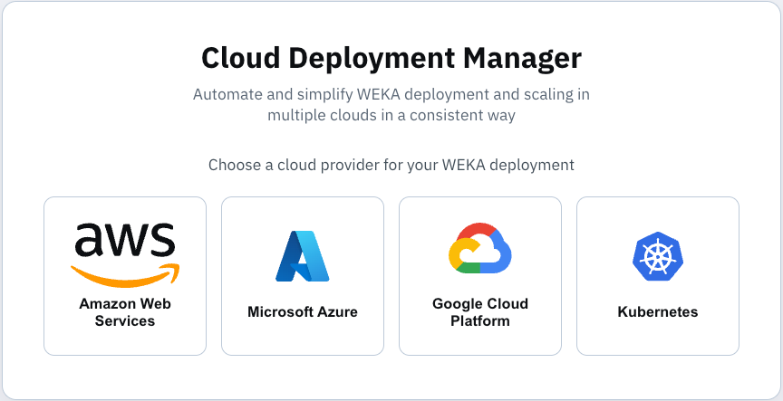
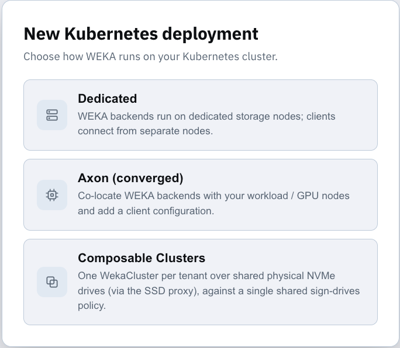

# Cloud Deployment Manager Kubernetes deployment types

Explore Kubernetes deployment types available in Cloud Deployment Manager (CDM). CDM guides configuration and generates validated WEKA Operator deployment artifacts. Select the deployment model that matches your infrastructure, performance requirements, and tenancy design.

### Access Cloud Deployment Manager

Open [Cloud Deployment Manager](https://cloud.weka.io/) and sign in with your WEKA account. Select **Kubernetes** to start a deployment configuration.

<figure><figcaption></figcaption></figure>

### Kubernetes deployment types

Choose how WEKA runs on your Kubernetes cluster before generating deployment artifacts. CDM supports three deployment types. Each type follows a separate deployment procedure.

| Deployment type | Description | When to use |
| --- | --- | --- |
| **Dedicated** | WEKA backends run on dedicated storage nodes. Clients connect from separate nodes. | Standard production layout with a clear separation between storage and workload nodes. |
| **Axon (converged)** | Co-locates WEKA backends with your workload or GPU nodes and adds a client configuration. | GPU or compute clusters where storage and workloads share the same nodes. |
| **Composable Clusters** | One WekaCluster per tenant over shared physical NVMe drives (through the SSD proxy), against a single shared sign-drives policy. | Multi-tenant environments where several WEKA clusters share the same physical drives. |

Select the required type from the deployment options in CDM.

<figure><figcaption>
Deployment type options in Cloud Deployment Manager
</figcaption></figure>

Dedicated is the recommended deployment type for most production environments.

To change the deployment type after you start a configuration, select the type badge (for example, **Dedicated**) at the top of the wizard page. Switching starts a new configuration for the selected type.

For the deployment procedure, see:

* [Deploy dedicated WEKA on Kubernetes using the CDM](deploy-dedicated-weka-on-kubernetes-using-the-cdm.md)
* [Deploy Axon on Kubernetes using the CDM](deploy-axon-on-kubernetes-using-the-cdm.md)
* [Deploy Composable Clusters on Kubernetes using the CDM](deploy-composable-clusters-on-kubernetes-using-the-cdm.md)

**Related topics**

* [WEKA Operator deployments](../)
* [WEKA Operator full deployment workflow](../weka-operator-full-deployment-workflow.md)
* [WEKA CRD API Reference](https://weka.github.io/weka-k8s-api/)
