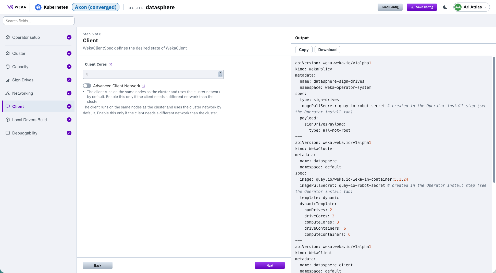

# Deploy Axon on Kubernetes using the CDM

Generate WEKA Operator deployment artifacts for an Axon (converged) deployment with the Cloud Deployment Manager (CDM) wizard. Axon co-locates WEKA backends with your workload or GPU nodes and adds a client configuration. Use this deployment type for GPU or compute clusters where storage and workloads share the same nodes.

Access the wizard at Cloud Deployment Manager and sign in with your WEKA account. Select **Kubernetes** as the target platform, then select **Axon (converged)**.

### Before you begin

Complete the same preparation as the Dedicated flow. See **Before you begin** in [Deploy dedicated WEKA on Kubernetes using the CDM](deploy-dedicated-weka-on-kubernetes-using-the-cdm.md).

### Procedure

The Axon flow contains 8 steps and reuses the Dedicated flow building blocks.

1. Complete the following steps as described in [Deploy dedicated WEKA on Kubernetes using the CDM](deploy-dedicated-weka-on-kubernetes-using-the-cdm.md): **Set up the operator**, **Define the cluster**, **Size the capacity**, **Configure drive signing**, and **Configure networking**. The Protocols step doesn't apply to Axon.
2. Continue with **Configure the client**, described below.
3. Complete **Choose driver distribution** and **Set debuggability** as described in the same topic. The CSI driver and Stateless clients steps don't apply to Axon.
4. **Configure the client:** The **Client** step (step 6 of 8) generates a WekaClient resource for the co-located workload or GPU nodes. The client runs on the same nodes as the cluster and uses the cluster network by default.
   1. Set **Client Cores**: the number of cores allocated to the WEKA client on each node (default: 4).
   2. Keep **Advanced Client Network** disabled unless the client needs a different network than the cluster. When enabled, set **Client Data NICs** or **Client Device Subnets (CIDR)** for the client data path.

Client screen

<figure><figcaption></figcaption></figure>

5. Select **Next**.

The **Output** manifest includes the generated WekaClient resource, named `<cluster>-client`, with the new cluster as its target. Apply it together with the rest of the output.

### Apply the generated configuration

Apply the generated output the same way as the Dedicated flow. See Apply the generated configuration in Deploy WEKA on Kubernetes using the Cloud Deployment Manager. The output also includes the WekaClient resource generated in the Client step.

To save or reload this configuration, see **Save and reload a configuration** in [Deploy dedicated WEKA on Kubernetes using the CDM](deploy-dedicated-weka-on-kubernetes-using-the-cdm.md).

**Related topics**

* [Cloud Deployment Manager Kubernetes deployment types](./)
* [Deploy dedicated WEKA on Kubernetes using the CDM](deploy-dedicated-weka-on-kubernetes-using-the-cdm.md)
* [WEKA Operator full deployment workflow](../weka-operator-full-deployment-workflow.md)
