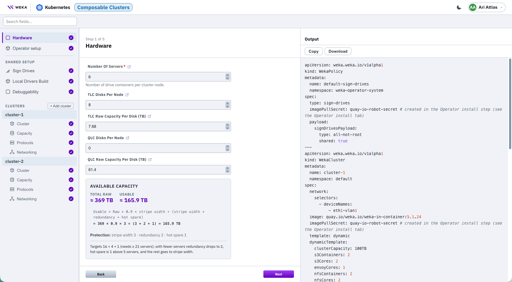
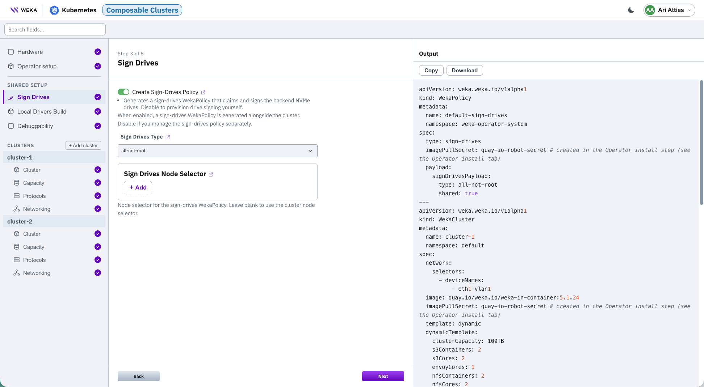

# Deploy Composable Clusters on Kubernetes using the CDM

Generate WEKA Operator deployment artifacts for a Composable Clusters deployment with the Cloud Deployment Manager (CDM) wizard. This deployment type creates one WekaCluster per tenant over shared physical NVMe drives through the SSD proxy. All tenants use one shared sign-drives policy.

Sign drives, local drivers build, and debuggability are configured once and shared across all tenants. Each tenant cluster has its own Cluster, Capacity, Protocols, and Networking configuration.

Access the wizard at Cloud Deployment Manager and sign in with your WEKA account. Select **Kubernetes** as the target platform, then select **Composable Clusters**.

## Before you begin

Complete the same preparation as the Dedicated flow. See **Before you begin** in [Deploy dedicated WEKA on Kubernetes using the CDM](deploy-dedicated-weka-on-kubernetes-using-the-cdm.md).

## Workflow

### 1. Configure shared hardware

The **Hardware** step defines the physical drives available to all tenant clusters.

<details>

<summary>Hardware screen</summary>

<div data-with-frame="true"><figure><figcaption></figcaption></figure></div>

</details>

1. Enter the **Number Of Servers**.
2. Enter **TLC Disks Per Node** and **TLC Raw Capacity Per Disk (TB)**.
3. Enter **QLC Disks Per Node** and **QLC Raw Capacity Per Disk (TB)**.
4. Review the resulting **Available Capacity**.
5. Select **Next**.

### 2. Configure shared sign drives, driver distribution, and debuggability

Configure shared settings that apply to all tenant clusters.

<details>

<summary>Shared setup: sign drives screen</summary>

<figure><figcaption></figcaption></figure>

</details>

1. **Sign drives:**
   1. Keep **Create Sign-Drives Policy** enabled.
   2. Select the discovery method for shared NVMe drives.
   3. Select **Next**.
2. **Local builder build:**
   1. Keep **Build drivers locally** disabled when servers reach `drivers.weka.io`.
   2. Enable it for air-gapped environments or custom kernels.
   3. Select **Next**.
3. **Debuggability:**
   1. Configure **Remote Traces** according to your support access policy.
   2. Select **Next**.

### 3. Add a tenant cluster

1. **Cluster:**
   1. Select **+ Add cluster**.
   2. Set the tenant cluster **Namespace**, and **WEKA image**.
   3. Select **Next**.
2. **Capacity:**
   1. Configure the tenant capacity.
   2. Select **Next**.
3. **Protocols:**
   1. Configure the protocol settings.
   2. Select **Next**.
4. **Networking:**
   1. Configure the networking settings and data interfaces.
   2. Select **Next**.
5. Repeat for each additional tenant.

## Apply the generated configuration

Apply the generated configuration in the displayed order.

1. Run the **Operator setup** commands. Create the namespace and secrets. Apply the CRDs and install the operator Helm chart.
2.  Apply the generated **Output** manifest.

    ```bash
    kubectl apply -f weka-cluster-output.yaml
    ```
3. Verify that each WekaCluster forms and its tenant services are available.

Save the wizard state with **Save Config**. Restore a saved state with **Load Config**.

**Related topics**

* [Composable clusters for multi-tenancy in Kubernetes](https://app.gitbook.com/s/ZW262oqYA8pNNfGvXjHa/kubernetes/composable-clusters-for-multi-tenancy-in-kubernetes)
* [Cloud Deployment Manager Kubernetes deployment types](./)
* [Deploy dedicated WEKA on Kubernetes using the CDM](deploy-dedicated-weka-on-kubernetes-using-the-cdm.md)
* [WEKA Operator full deployment workflow](https://app.gitbook.com/s/ZW262oqYA8pNNfGvXjHa/kubernetes/weka-operator-deployments/weka-operator-full-deployment-workflow)
