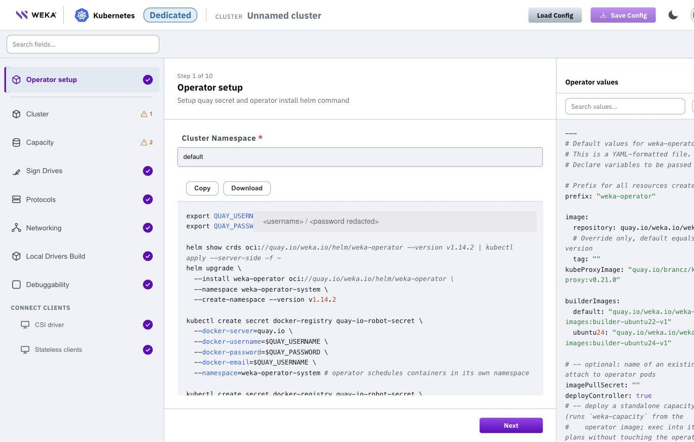
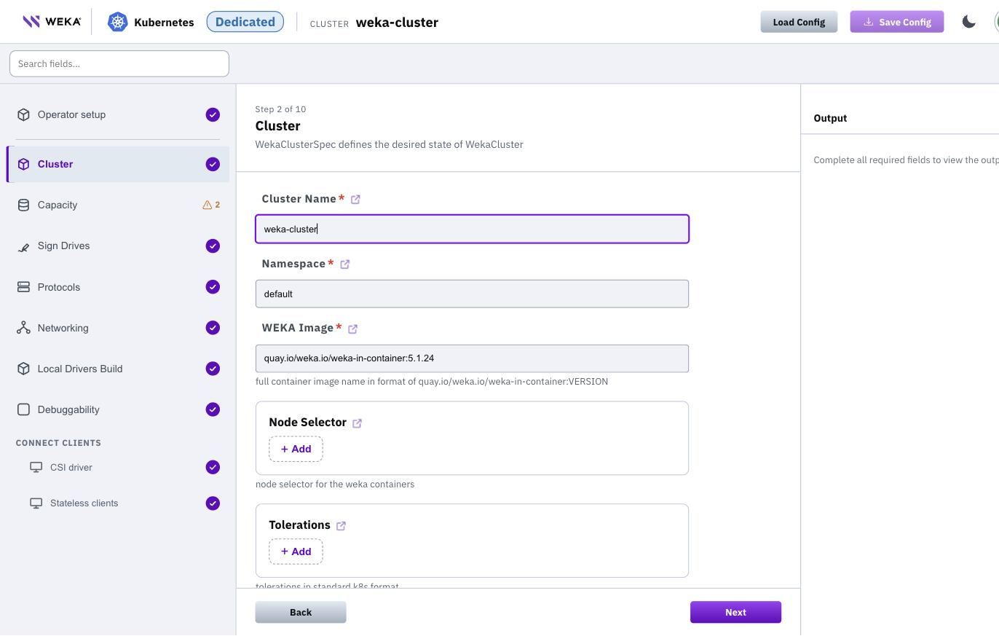

# Deploy dedicated WEKA on Kubernetes using the CDM

Generate a complete, validated set of WEKA Operator deployment artifacts for Kubernetes with the Cloud Deployment Manager (CDM) wizard. Select deployment options and generate operator installation commands, Helm values, and WekaCluster and WekaPolicy manifests. The wizard also generates a CSI StorageClass and stateless client examples for workload connectivity.

The wizard generates configuration only. It does not connect to your Kubernetes cluster or apply anything on your behalf. Review the generated output, download or copy it, and apply it with `kubectl` and `helm`.

Access the [Cloud Deployment Manager](https://cloud.weka.io/) wizard and sign in with your WEKA account. Select **Kubernetes** as the target platform, then select **Dedicated**.

## Before you begin

The wizard generates configuration that assumes the target Kubernetes environment is already prepared for the WEKA data plane. Complete the following on the cluster and its worker nodes before you apply the generated output. For full preparation details, see Prepare Kubernetes environment in the WEKA Operator full deployment workflow topic.

* **Kubernetes version**: 1.25 or later (OpenShift 4.17 or later).
* **HugePages**: WEKA processes require dedicated 2 MiB HugePages memory on every worker node that hosts WEKA containers. Calculate the required number of HugePages from the drive capacity and the CPU cores allocated to WEKA, apply it with `sysctl -w vm.nr_hugepages=<calculated-value>`, and persist it in `/etc/sysctl.conf`. Nodes without HugePages configured fail to schedule WEKA pods.
* **Core allocation (Kubelet CPU Manager)**: Enable the static CPU Manager policy on all worker nodes so WEKA processes receive dedicated CPU cores. On hyperthreaded systems, include both logical CPUs of each reserved physical core in `reservedSystemCPUs`. On Kubernetes v1.32 and later, also enable `strict-cpu-reservation`. Without these settings, other workloads share the WEKA cores and reduce I/O throughput.
* **Local persistent storage**: Reserve approximately 20 GiB per WEKA container plus 10 GiB per allocated CPU core in `/opt/k8s-weka` on each node. Do not use NFS or network-attached storage for this path.
* **Kernel headers**: Ensure kernel headers exactly match the running kernel version to allow driver compilation.
* **Data-plane NICs**: Identify the backend data interfaces on the storage nodes, either by Ethernet device name (for example, `eth1`) or by subnet (CIDR). The wizard asks for these in the Networking step.
* **NVMe drives**: Ensure the backend NVMe drives intended for WEKA are present and not in use. The generated sign-drives policy claims and signs them.
* **Ports**: The operator allocates cluster ports starting at 35000. Reserve the range on every node so the kernel does not assign these ports to other processes.
* **Registry credentials**: The wizard pre-fills your quay.io registry credentials in the generated commands. Get credentials for Quay from get.weka.io.

## Workflow

### 1. Set up the operator

The **Operator setup** step generates the commands that create the `weka-operator-system` namespace, create the image pull secrets, apply the WEKA CRDs, and install the WEKA Operator Helm chart. Your registry credentials are pre-filled.

The **Operator values** panel on the right shows the complete operator Helm values file. Use the search box in the panel to locate a specific value. Select **Copy** or **Download** on either pane to take the content.

<details>

<summary>Operator setup screen</summary>

<figure><figcaption><p>Operator setup</p></figcaption></figure>

</details>

1. Review the generated commands. The image pull secret is created twice: once in `weka-operator-system` for the operator, and once in each namespace where you create WekaCluster or WekaClient resources (the example uses `default`).
2. Select **Next**.

### 2. Define the cluster

The **Cluster** step defines the WekaCluster identity and placement.

<details>

<summary>Cluster screen</summary>

<figure><figcaption><p>Cluster</p></figcaption></figure>

</details>

1. Enter a **Cluster Name**. The name appears in the top bar and is used in all generated resource names.
2. Set the **Namespace** (default: `default`).
3. Confirm the **WEKA Image**, in the format `quay.io/weka.io/weka-in-container:VERSION`.
4. Optional: add a **Node Selector** to pin WEKA containers to specific storage nodes, and **Raw Tolerations** in standard Kubernetes format.
5. Select **Next**.

### 3. Size the capacity

The **Capacity** step sizes the cluster. Each server runs one drive container and one compute container.

<details>

<summary>Capacity screen</summary>

<figure><figcaption><p>Capacity</p></figcaption></figure>

</details>

1. Enter the **Number Of Servers**.
2. Enter **Drives Per Server**: the number of virtual or physical drives per drive container.
3. Confirm **Capacity Per Drive (TB)** (default: 7.68). The wizard uses this value only to auto-size the compute cores from the raw capacity. It is not written to the cluster spec.
4. Leave **Drive Cores** and **Compute Cores** empty unless you need to override the automatic sizing. Drive cores default to 1 core per drive. Compute cores are auto-sized from the raw capacity.
5. Review the protection settings: **Redundancy Level** (recommended: 4), **Hot Spare** (recommended: 1), and **Stripe Width** (recommended: 16).
6. Select **Next**.

The step shows the resulting target usable capacity with its formula (for example, 6 servers x 4 drives x 7.68 TB raw is approximately 115.0 TiB usable). The **Output** panel updates the `dynamicTemplate` fields of the WekaCluster manifest (`numDrives`, `driveCores`, `computeCores`, `driveContainers`, `computeContainers`) as you type.

### 4. Configure drive signing

The **Sign Drives** step generates a sign-drives WekaPolicy that claims and signs the backend NVMe drives.

<details>

<summary>Sign Drives screen</summary>

<figure><figcaption><p>Sign Drives</p></figcaption></figure>

</details>

1. Keep **Create Sign-Drives Policy** enabled unless you manage the sign-drives policy separately.
2. Confirm the **Sign Drives Type** (default: `all-not-root`, which signs all detected block devices except the root device).
3. Optional: set a **Sign Drives Node Selector**. Leave blank to use the cluster node selector.
4. Select **Next**.

### 5. Enable protocols

The **Protocols** step adds protocol gateway containers to the cluster.

<details>

<summary>Protocols screen</summary>

<figure><figcaption><p>Protocols</p></figcaption></figure>

</details>

1. Toggle the protocols the cluster serves: **Enable S3**, **Enable NFS**, or **Enable SMB-W**.
2. For S3, review the defaults: **S3 Containers** (number of gateway containers), **Cores Per S3 Container**, and **Envoy Cores** for the proxy process. **S3 Extra Cores** is auto-set from the compute cores value. Enter a value only to override.
3. Select **Next**.

### 6. Configure networking

The **Networking** step defines how the WEKA containers select the backend data interfaces.

<details>

<summary>Networking screen</summary>

<figure><figcaption><p>Networking</p></figcaption></figure>

</details>

1. Enable **UDP Mode** only if your network infrastructure or CNI blocks traffic that is not IP-based. The default uses standard raw Ethernet frames.
2. In **Match By**, choose **Eth Devices** to select interfaces by device name, or **Subnet** to select them by CIDR.
3. Add the device names (for example, `eth1`) or subnets. All entries are grouped into a single network selector in the WekaCluster manifest.
4. Optional: set **Min** and **Max** counts, and enable **RDMA Only** to match RDMA-capable interfaces only.
5. Optional: for NVIDIA virtual functions, review **NVIDIA VF Single IP** and **Allocate VF Per IO Node**.
6. Select **Next**.

### 7. Choose driver distribution

The **Local Drivers Build** step controls how the WEKA drivers are distributed.

<details>

<summary>Local Drivers Build screen</summary>

<figure><figcaption><p>Local Drivers Build</p></figcaption></figure>

</details>

1. Keep **Build drivers locally** disabled if the nodes have outbound access to drivers.weka.io. The operator then uses the pre-built driver service.
2. Enable it for air-gapped environments or custom kernels. The wizard adds a local drivers distribution WekaPolicy to the output.
3. Select **Next**.

### 8. Set debuggability

The **Debuggability** step controls support access.

<details>

<summary>Debuggability screen</summary>

<figure><figcaption><p>Debuggability</p></figcaption></figure>

</details>

1. Keep **Remote Traces** enabled to deploy a WekaPolicy that lets WEKA personnel connect to the cluster's remote traces for support and debugging. Provide a token before any access is possible.
2. Select **Next**.

### 9. Connect clients: CSI driver

The **CSI driver** step generates the StorageClass and an example PersistentVolumeClaim for provisioning WEKA-backed PersistentVolumes to pods in the same Kubernetes cluster.

<details>

<summary>CSI driver screen</summary>

<figure><figcaption><p>CSI driver</p></figcaption></figure>

</details>

The operator issues a CSI secret named `weka-csi-<cluster>` that holds the CSI service-account credentials and API endpoints. The generated StorageClass references that secret.

1. Ensure the CSI driver is enabled in the operator values (`csi.installationEnabled: true`).
2. Copy or download the StorageClass and PersistentVolumeClaim manifests for use after the cluster is running.
3. Select **Next**.

### 10. Connect clients: stateless clients

The **Stateless clients** step generates the commands for mounting the WEKA filesystem from a host outside Kubernetes.

<details>

<summary>Stateless clients screen</summary>

<figure><figcaption><p>Stateless clients</p></figcaption></figure>

</details>

The script selects a backend pod IP to bootstrap the installation, reads the join token from the operator-managed secret (`weka-client-<cluster>`, key `join-secret`), downloads the WEKA client installer from a backend, and mounts the filesystem with DPDK networking over a dedicated data NIC. Adjust the NIC name and port to your environment before you run it on the client host.

## Apply the generated configuration

After you complete the steps, apply the output to your Kubernetes cluster in this order:

1. Run the **Operator setup** commands: create the namespace and secrets, apply the CRDs, and install the operator Helm chart. Verify the `weka-operator-controller-manager` pod reaches `Running` in the `weka-operator-system` namespace.
2.  Apply the **Output** manifest from the right panel (**Copy** or **Download**). It contains the sign-drives WekaPolicy, the WekaCluster, and the remote traces WekaPolicy in a single multi-document YAML:

    ```bash
    kubectl apply -f weka-cluster-output.yaml
    ```
3. After the cluster forms, apply the CSI StorageClass and PersistentVolumeClaim, or run the stateless client commands, depending on how your workloads connect.

## Save and reload a configuration

Save your wizard state so you can share it for review or reuse it as a per-environment template. This applies to the Dedicated, Axon, and Composable Clusters flows.

1. Select **Save Config** in the top bar to download the wizard state as a file.
2. Select **Load Config** to restore a saved configuration later.

Use the **Search fields** box above the step list to jump to a specific field across all steps. Select the field-level link (the external-link icon next to each field name) to open the matching entry in the WEKA CRD API Reference.

**Related topics**

* [Cloud Deployment Manager Kubernetes deployment types](./)
* [WEKA Operator deployments](../)
* [WEKA Operator full deployment workflow](../weka-operator-full-deployment-workflow.md)
* [WEKA CRD API Reference](https://weka.github.io/weka-k8s-api/)
