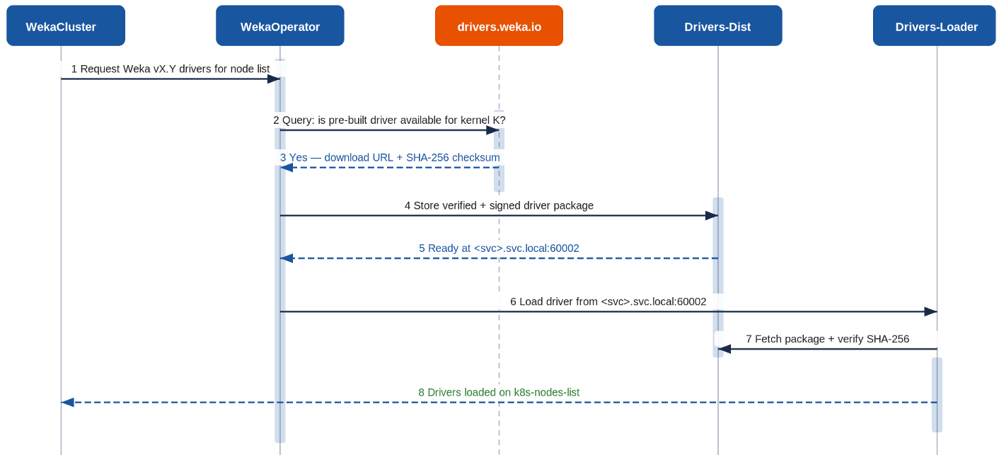
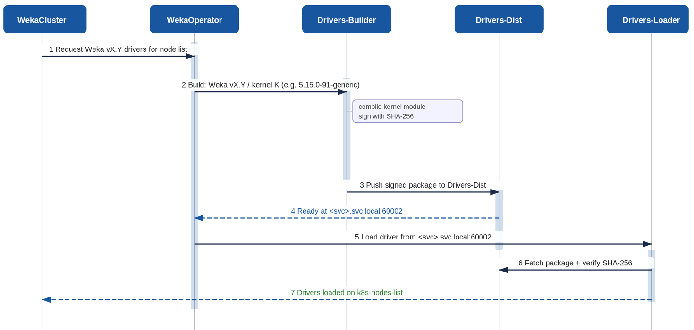

# Driver management with the WEKA Operator

## Overview

The WEKA Operator streamlines driver management across Kubernetes nodes. Instead of manual installation on each host, it automates the process of building, distributing, and loading the correct WEKA kernel drivers for every node in a cluster.

WEKA Operator can obtain drivers in two ways:

* **Pre-built drivers:** Retrieved from the WEKA driver registry ([drivers.weka.io](https://drivers.weka.io/)).
* **Locally-built drivers:** Created within the cluster using a Drivers-Builder component.

In either method, the WEKA Operator ensures the driver version aligns with the WEKA version and kernel on each node, loading it automatically without manual intervention.

### Architecture and component roles

Driver management is composed of four main components that interact through the WEKA Operator:

* **WekaOperator**: Manages the entire driver lifecycle by monitoring WekaCluster resources, initiating builds or downloads, and guiding the loader.
* **Drivers-Builder**: Compiles kernel drivers specific to WEKA and kernel version combinations and publishes them to Drivers-Dist with a SHA-256 signature.
* **Drivers-Dist**: Distributes built or downloaded drivers over HTTP within the cluster using a stable internal service address, ensuring signatures are verified before serving.
* **Drivers-Loader**: Operates as a DaemonSet on target nodes. It retrieves the driver package from Drivers-Dist and integrates it into the host kernel.

### Choose the right driver mode

Identify and select the appropriate driver provisioning mode based on the network environment and server kernel requirements.

<table><thead><tr><th width="164">Mode</th><th>Recommended use cases</th><th>Considerations</th></tr></thead><tbody><tr><td><strong>Pre-built</strong> (drivers.weka.io)</td><td><ul><li>Standard Linux distributions with supported kernel versions.</li><li>Servers have outbound network access to <code>drivers.weka.io</code>.</li></ul></td><td><ul><li><strong>Fastest Path</strong>: This method bypasses the compilation process by utilizing pre-made packages, eliminating the need for build infrastructure within the cluster.</li><li><p><strong>Constraints</strong>:</p><ul><li>Not suitable for air-gapped or network-restricted environments.</li><li>Cannot be used with custom or patched kernels that are missing from the registry.</li></ul></li></ul></td></tr><tr><td><strong>Locally-built</strong> (Drivers-Builder)</td><td><ul><li>Air-gapped or outbound-restricted environments.</li><li>Custom, patched, or uncommon kernel versions.</li><li>Requirements for full control over build flags through <code>extraBuildArgs</code>.</li></ul></td><td><ul><li><p><strong>Purpose:</strong> Supplies drivers when a pre-built package for the specific kernel is unavailable.</p><p><strong>Requirement:</strong> Ensure matching kernel headers are installed on the build server.</p><p><strong>Impact:</strong> Increases overall driver provisioning time due to added compilation.</p></li></ul></td></tr></tbody></table>

## Pre-built drivers mode

Ensure seamless automated provisioning of pre-built kernel drivers when Kubernetes can access the WEKA driver registry. This is the easiest implementation method and is advised for most deployments, as it removes the necessity for an in-cluster build step.

**Pre-built driver provisioning sequence**

The following sequence describes the coordination between the operator and the registry to distribute ready-made driver packages.

<div data-with-frame="true"><figure><figcaption><p>Pre-built drivers sequence diagram</p></figcaption></figure></div>

<table><thead><tr><th width="50">#</th><th width="151">Actor</th><th width="392">Action</th><th>Notifies</th></tr></thead><tbody><tr><td>1</td><td>WekaCluster</td><td>Requests driver provisioning for a list of Kubernetes processes, specifying the required WEKA version.</td><td>WekaOperator</td></tr><tr><td>2</td><td>WekaOperator</td><td>Queries <code>drivers.weka.io</code> to determine if a pre-built driver is available for the target kernel version.</td><td>Registry</td></tr><tr><td>3</td><td>Registry</td><td>Provides a download URL and a SHA-256 checksum if a matching package exists.</td><td>WekaOperator</td></tr><tr><td>4</td><td>WekaOperator</td><td>Downloads the verified and signed driver package directly to the Drivers-Dist component.</td><td>Drivers-Dist</td></tr><tr><td>5</td><td>Drivers-Dist</td><td>Stores the package and notifies the operator that the driver is available at the internal service endpoint (for example, <code>&#x3C;svc>.svc.local:60002</code>).</td><td>WekaOperator</td></tr><tr><td>6</td><td>WekaOperator</td><td>Instructs Drivers-Loader to fetch the driver from the internal endpoint.</td><td>Drivers-Loader</td></tr><tr><td>7</td><td>Drivers-Loader</td><td>Fetches the package from Drivers-Dist, verifies the SHA-256 signature, and loads the driver into the host kernel.</td><td>Drivers-Dist</td></tr><tr><td>8</td><td>Drivers-Loader</td><td>Reports successful loading on all target processes back to the cluster resource.</td><td>WekaCluster</td></tr></tbody></table>

#### Operational notes

* **Prerequisites:** Servers must have outbound network access to `drivers.weka.io`, but no compiler toolchain or kernel headers are required on the processes.
* **Compatibility:** Pre-built drivers are provided for common Linux distributions.
* **Fallback:** If the specific kernel version is not found in the registry, the operator falls back to local build mode if a Drivers-Builder is configured.

## Locally-built drivers mode

Manage the compilation and distribution of kernel drivers within clusters, especially when servers are running custom kernels or in air-gapped environments. The Drivers-Builder component automates this process, producing signed packages tailored to the specific kernel of each container.

**Locally-built driver provisioning sequence**

The following sequence describes how the operator coordinates an internal build and distribution flow.

<div data-with-frame="true"><figure><figcaption><p>Locally-built drivers sequence diagram</p></figcaption></figure></div>

<table><thead><tr><th width="54">#</th><th width="145">Actor</th><th width="391">Action</th><th>Notifies</th></tr></thead><tbody><tr><td>1</td><td>WekaCluster</td><td>Requests driver provisioning for a list of Kubernetes processes, specifying the required WEKA version.</td><td>WekaOperator</td></tr><tr><td>2</td><td>WekaOperator</td><td>Detects the kernel version (for example, <code>5.15.0-91-generic</code>) on each target process and submits a build request.</td><td>Drivers-Builder</td></tr><tr><td>3</td><td>Drivers-Builder</td><td>Compiles the kernel module and signs the resulting package with a SHA-256 signature.</td><td>Drivers-Dist</td></tr><tr><td>4</td><td>Drivers-Builder</td><td>Pushes the signed driver package to the Drivers-Dist service.</td><td>Drivers-Dist</td></tr><tr><td>5</td><td>Drivers-Dist</td><td>Stores the package and notifies the operator that drivers are ready at the internal endpoint (for example, <code>&#x3C;svc>.svc.local:60002</code>).</td><td>WekaOperator</td></tr><tr><td>6</td><td>WekaOperator</td><td>Instructs Drivers-Loader to fetch the driver from the internal service address.</td><td>Drivers-Loader</td></tr><tr><td>7</td><td>Drivers-Loader</td><td>Fetches the package from Drivers-Dist, verifies the SHA-256 signature, and loads it into the kernel.</td><td>Drivers-Dist</td></tr><tr><td>8</td><td>Drivers-Loader</td><td>Reports that drivers are successfully loaded on the target processes back to the cluster resource.</td><td>WekaCluster</td></tr></tbody></table>

#### Operational requirements

* **Kernel headers:** Local builds require that headers matching the running kernel are installed on the build server before the process begins.
* **Control:** Users can specify additional arguments for the build process through the `extraBuildArgs` field for highly custom environments.
* **Storage:** Drivers-Dist must be deployed with persistent storage to cache these locally compiled packages.

## Configure infrastructure for locally-built drivers

Configure the infrastructure and parameters required to enable the automated compilation and distribution of kernel drivers within the cluster.

### Prepare for local driver provisioning

Before the operator can initiate a local build, ensure the environment meets these prerequisites:

* **Install kernel headers:** For locally built drivers, the Drivers-Builder requires headers that match the exact kernel version running on each target server. Use the server's package manager (for example, `apt-get install -y linux-headers-$(uname -r)` for Debian-based distributions) to install headers before the operator attempts a build.
* **Deploy Drivers-Dist:** This service must be deployed and reachable within the cluster to act as the internal HTTP server for driver packages.
* **Provision storage:** Drivers-Dist requires sufficient storage, such as a PersistentVolumeClaim, to cache driver packages.
* **Configure networking:** Ensure port 60002 is open to allow communication between the operator, Drivers-Builder, Drivers-Dist, and Drivers-Loader.

### Configure local driver distribution

Define the internal service endpoint in the WekaCluster resource. Configure local build settings separately in a `WekaPolicy`.

1. Identify the fully qualified internal service hostname and port for the Drivers-Dist service, such as `<service-name>.svc.local:60002`.
2. Set the `driversDistService` attribute in the WekaCluster spec to this value.
3. Configure the local builder and distribution policy using a `WekaPolicy`.
4. Apply the updated resources to the cluster.


`WekaCluster` defines the driver distribution endpoint. Builder settings are managed through a `WekaPolicy`. For a policy example, see [WEKA Operator deployments](./).


### WekaCluster fields for local driver distribution

Use the following `WekaCluster` field to connect cluster processes to the local driver distribution service.

<table><thead><tr><th width="179">Field</th><th width="436">Description</th><th>Type / Default</th></tr></thead><tbody><tr><td><code>driversDistService</code></td><td>Specify the internal Drivers-Dist service endpoint that serves the driver packages.</td><td>string / required for local distribution</td></tr></tbody></table>

<details>

<summary>WekaCluster spec example</summary>

Use a WekaCluster resource such as the following:

```yaml
apiVersion: weka.weka.io/v1alpha1
kind: WekaCluster
metadata:
  name: my-weka-cluster
spec:
  image: quay.io/weka.io/weka-in-container:5.1.0
  imagePullSecret: "quay-io-robot-secret"
  driversDistService: "https://weka-drivers-dist.weka-system.svc.local:60002"
  nodeSelector:
    weka.io/role: "compute"
```

</details>

## Troubleshoot driver management

Identify and resolve common issues encountered during the driver provisioning and distribution process.

### Driver build timeouts

* **Symptom:** The driver build process exceeds the allocated `buildTimeout` duration.
* **Description:** The Drivers-Builder cannot complete the compilation of the kernel module within the required timeframe.
* **Resolution:** Verify that kernel headers matching the running kernel are installed on the build server using `uname -r`. Ensure the `linux-headers-$(uname -r)` package is present before the build starts.

### Distribution connectivity failures

* **Symptom:** The Drivers-Loader is unable to reach the Drivers-Dist service.
* **Description:** The internal HTTP communication between the loading agent and the distribution endpoint is interrupted or misconfigured.
* **Resolution:** Confirm the service defined in `driversDistService` is correctly created and that port 60002 is open in all relevant network policies.

### Signature verification errors

* **Symptom:** A signature verification failure occurs during the driver fetch process.
* **Description:** The SHA-256 signature of the driver package in Drivers-Dist does not match the expected value, indicating potential corruption.
* **Resolution:** Delete the cached driver package from the Drivers-Dist storage and allow the operator to re-fetch or rebuild a clean version.

### Driver delivery failures

* **Symptom:** A specific container or server is not receiving the required driver.
* **Description:** The operator does not target the server for provisioning because it does not satisfy the defined selection criteria.
* **Resolution:** Check the server labels and ensure they match the `nodeSelector` used by your local driver distribution policy.

### Custom kernel build failures

* **Symptom:** The build process fails specifically for a custom or uncommon kernel version.
* **Description:** The standard Drivers-Builder environment lacks the necessary tools or parameters to compile for a non-standard kernel.
* **Resolution:** Ensure the Drivers-Builder image supports the target kernel and consider providing specific compilation flags using the `extraBuildArgs` field.
