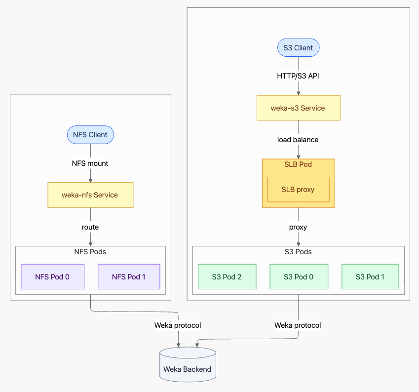

# Set up protocols on K8s with WEKA Operator

## Overview of WEKA Operator protocols

The WEKA Kubernetes operator streamlines the deployment of protocol gateways by managing dedicated containers within the WekaCluster custom resource. By defining protocol settings in the cluster configuration, the operator automatically provisions and manages S3 and NFS frontend containers on the WEKA cluster fabric.

#### S3 protocol architecture

The S3 data path facilitates object access through a layered service structure:

* **Client access:** S3 clients communicate with the weka-s3 Service using the HTTP/S3 API.
* **Load balancing:** Traffic is directed to a Software Load Balancer (SLB Pod) running an SLB proxy.
* **Protocol delivery:** The SLB proxy routes requests to a pool of S3 Pods.
* **Backend integration:** S3 Pods communicate with the WEKA Backend using the internal WEKA protocol.

#### NFS protocol architecture

The NFS data path provides file access through a direct routing mechanism:

* **Client access:** NFS clients establish an NFS mount to the weka-nfs Service.
* **Routing:** The service routes traffic directly to the available NFS Pods.
* **Backend integration:** NFS Pods connect to the WEKA Backend by way of the WEKA protocol.

<figure><figcaption>
WEKA Operator S3 and NFS protocols setup
</figcaption></figure>

## **Before you begin**

* Ensure the WEKA Operator is deployed and running in the Kubernetes cluster.
* Verify that the WekaCluster resource is initialized.
* Confirm that the target servers have sufficient CPU and memory resources to support additional protocol containers.
* Confirm the minimum versions of the WEKA Operator and WEKA image:

<table><thead><tr><th width="138.09088134765625">Protocol</th><th>Minimum WEKA Operator version</th><th>Minimum WEKA version</th></tr></thead><tbody><tr><td>S3</td><td>1.7</td><td>4.4</td></tr><tr><td>NFS</td><td>1.10</td><td>5.1</td></tr></tbody></table>

### **Procedure**

1. Open the WekaCluster YAML configuration file.
2.  **S3 protocol setup:** Set the S3 parameters in the relevant sections.

    <pre class="language-yaml" data-title="WekaCluster YAML configuration file example with S3 parameters"><code class="lang-yaml">apiVersion: weka.weka.io/v1
    kind: WekaCluster
    metadata:
      name: weka-cluster-dev
      namespace: default
    spec:
      gracefulDestroyDuration: "0"
      template: dynamic
      dynamicTemplate:
        s3Containers: 3
        s3Cores: 2
        s3FrontendHugepages: 3072
        envoyCores: 1
        computeContainers: 5 # WEKA cluster
        driveContainers: 5 # WEKA cluster
      additionalMemory:
        s3: 1000  
      image: quay.io/weka.io/weka-in-container-dev:5.1.0.547
      nodeSelector:
        weka.io/supports-backends: "true"
      driversDistService: "https://weka-drivers-dist.weka-operator-system.svc.cluster.local:60002"
      imagePullSecret: "quay-io-robot-secret"
    </code></pre>
3.  **NFS protocol setup:** Set the NFS parameters in the relevant sections.

    <pre class="language-yaml" data-title="WekaCluster YAML configuration file example with NFS parameters"><code class="lang-yaml">apiVersion: weka.weka.io/v1
    kind: WekaCluster
    metadata:
      name: weka-cluster-dev
      namespace: default
    spec:
      gracefulDestroyDuration: "0"
      nfs:
        interfaces: ["ens5"]
        ipRanges: ["10.0.1.1-10.0.1.10"]
      template: dynamic
      dynamicTemplate:
        computeContainers: 5 # WEKA cluster
        driveContainers: 5 # WEKA cluster
        nfsContainers: 2
        nfsCores: 2
        nfsFrontendHugepages: 3072
      additionalMemory:
        nfs: 1000
      image: quay.io/weka.io/weka-in-container-dev:5.1.0.547
      nodeSelector:
        weka.io/supports-backends: "true"
      driversDistService: "https://weka-drivers-dist.weka-operator-system.svc.cluster.local:60002"
      imagePullSecret: "quay-io-robot-secret"
    </code></pre>
4.  Apply the updated configuration to the Kubernetes cluster:

    `kubectl apply -f <cluster-config>.yaml`
5. Identify the S3 port: \
   `kubectl get wekacluster <cluster name> -o jsonpath='{.status.ports.s3Port}'`

### S3 configuration reference

Use the following parameters in the WekaCluster `spec` to define S3 settings.

<table><thead><tr><th width="352">Parameter</th><th>Description</th></tr></thead><tbody><tr><td><code>dynamicTemplate.s3Containers</code></td><td>Total number of S3 containers to be deployed. Data type: Integer Example: <code>2</code></td></tr><tr><td><code>dynamicTemplate.s3Cores</code></td><td>Number of CPU cores assigned to each S3 container process. Data type: Integer Example: <code>3</code></td></tr><tr><td><code>dynamicTemplate.s3FrontendHugepages</code></td><td>Hugepage memory for the S3 frontend in MiB. A minimum of 1600 MiB is required. Data Type: Integer Example: <code>3072</code></td></tr><tr><td><code>dynamicTemplate.envoyCores</code></td><td>Number of CPU cores assigned to the software load balancer container. Type: Integer Example: <code>3</code></td></tr><tr><td><code>additionalMemory.s3</code></td><td>Additional memory allocation in MiB for S3 containers, exceeding automatic calculations. Data type: Integer Example: <code>1000</code></td></tr></tbody></table>

### NFS configuration reference

Use the following parameters to define NFS and networking settings.

<table><thead><tr><th width="336.9090576171875">Parameter</th><th>Description</th></tr></thead><tbody><tr><td><code>nfs.interfaces</code></td><td>Restricted network interfaces for NFS traffic. Data type: List of strings Example: <code>["ens5"]</code></td></tr><tr><td><code>nfs.ipRanges</code></td><td>Floating IP addresses for client access, supporting CIDR or range formats. Data type: List of strings Example: <code>["10.0.1.1-10.0.1.10"]</code></td></tr><tr><td><code>dynamicTemplate.nfsContainers</code></td><td>Experimental count of NFS frontend containers to create. Data type: Integer Example: <code>2</code></td></tr><tr><td><code>dynamicTemplate.nfsCores</code></td><td>Number of CPU cores assigned to each NFS container process. Data type: Integer Example: <code>3</code></td></tr><tr><td><code>dynamicTemplate.nfsFrontendHugepages</code></td><td>Hugepage memory for the NFS frontend in MiB. A minimum of 1600 MiB is required. Data type: Integer Example: <code>3072</code></td></tr><tr><td><code>additionalMemory.nfs</code></td><td>Additional memory allocation in MiB for NFS containers, exceeding automatic calculations. Data type: Integer Example: <code>1000</code></td></tr></tbody></table>
