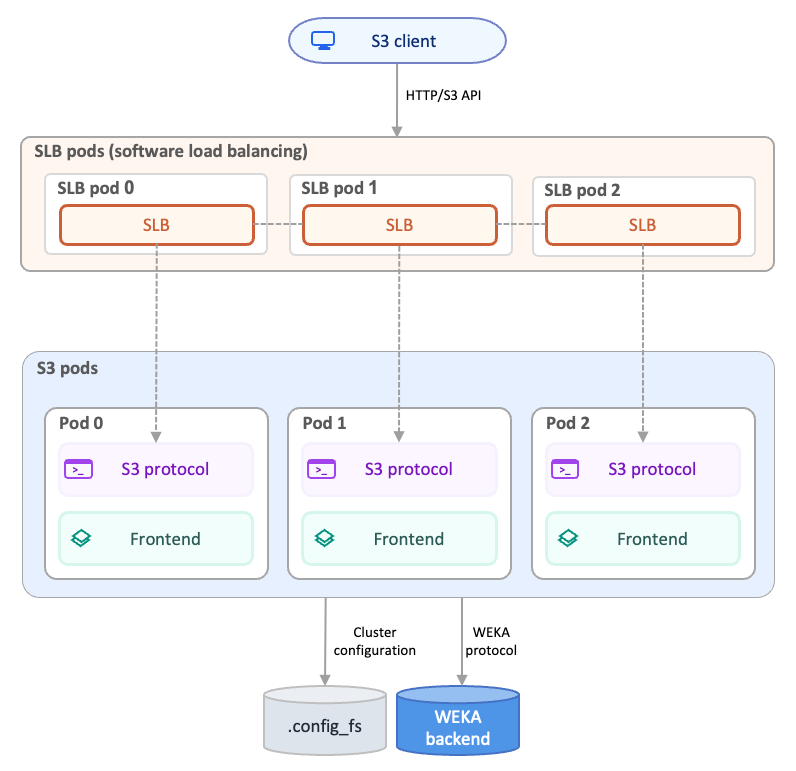
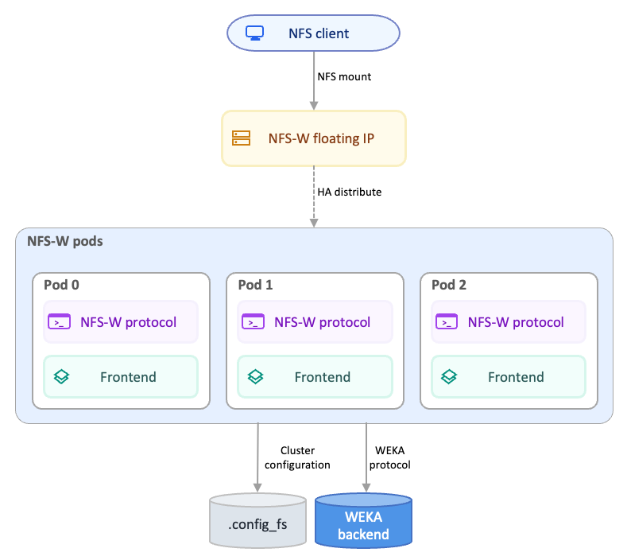
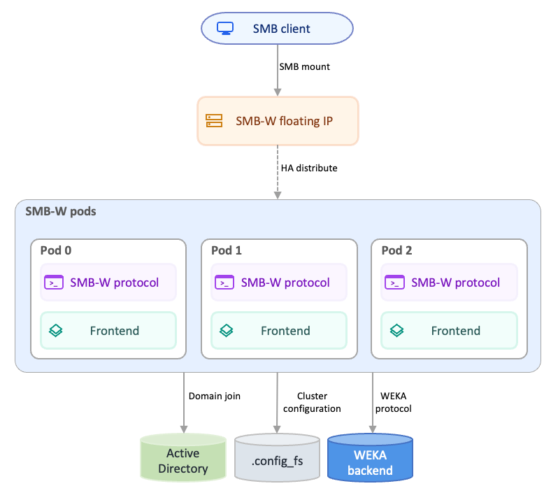

# Set up protocols on K8s with WEKA Operator

## Overview of WEKA Operator protocols

The WEKA Kubernetes operator streamlines the deployment of protocol gateways by managing dedicated containers within the WekaCluster custom resource. By defining protocol settings in the cluster configuration, the operator automatically provisions and manages S3, NFS-W, and SMB-W frontend containers on the WEKA cluster fabric.

### S3 protocol architecture

The S3 data path routes object requests through the Kubernetes service, the software load balancer, and the S3 frontend containers:

* **Client access:** S3 clients send HTTP or HTTPS requests to the `weka-s3` service.
* **Service routing:** The service forwards each request to an SLB pod that runs the software load balancer. The SLB pods are interconnected, so an SLB can relay traffic through a peer SLB if the selected S3 pod is unreachable.
* **S3 processing:** The software load balancer forwards the request to one of the S3 pods.
* **Backend access:** The S3 pod reads and writes data through the internal WEKA protocol to the backend containers.

<div data-with-frame="true"><figure><figcaption><p>WEKA Operator S3 protocol architecture</p></figcaption></figure></div>

### NFS-W protocol architecture

The NFS-W data path routes file requests from the Kubernetes service directly to the NFS-W frontend containers:

* **Client access:** NFS clients mount the exported filesystem through the `weka-nfs` service.
* **Service routing:** The service forwards traffic directly to one of the NFS pods.
* **Backend access:** The NFS-W pod reads and writes data through the internal WEKA protocol to the backend containers.

<div data-with-frame="true"><figure><figcaption><p>WEKA Operator NFS-W protocol architecture</p></figcaption></figure></div>

### SMB-W protocol architecture

The SMB-W data path routes file requests through floating IPs, SMB-W frontend containers, Active Directory integration, and the WEKA backend:

* **Client access:** SMB clients connect to one of the floating IP addresses assigned to the SMB-W cluster.
* **Floating IP routing:** The operator distributes the configured floating IP range across the SMB-W containers. If a container becomes unavailable, another container takes over its floating IP.
* **Identity services:** The SMB-W cluster joins Active Directory by using credentials stored in a Kubernetes Secret. The domain can include trusted domains.
* **Backend access:** The SMB-W container reads and writes data through the internal WEKA protocol to the backend containers.
* **Persistent configuration:** Cluster-wide SMB-W configuration is stored on the operator-managed `.config_fs` filesystem.

<div data-with-frame="true"><figure><figcaption><p>WEKA Operator SMB-W protocol architecture</p></figcaption></figure></div>

## Before you begin

* Confirm the minimum versions of the WEKA Operator and WEKA image:

<table><thead><tr><th width="138.09088134765625">Protocol</th><th>Minimum WEKA Operator version</th><th>Minimum WEKA version</th></tr></thead><tbody><tr><td>S3</td><td>1.7</td><td>4.4</td></tr><tr><td>NFS-W</td><td>1.10</td><td>5.1</td></tr><tr><td>SMB-W</td><td>1.11</td><td>5.1.20</td></tr></tbody></table>

* Ensure the WEKA Operator is deployed and running in the Kubernetes cluster.
* Verify that the WekaCluster resource is initialized.
* Confirm that the target servers have sufficient CPU and memory resources to support additional protocol containers.
* For SMB-W deployments, complete the Active Directory and DNS prerequisites (the operator does not provision Active Directory objects or DNS records):
  * **Active Directory:** A reachable Active Directory domain controller, configured to support either RFC2307 or RID identity mapping. For SMB-W identity requirements, see [Manage the SMB protocol](https://docs.weka.io/additional-protocols/smb-support).
  * **AD user with computer-join permission:** An AD account that the operator uses to add the SMB-W cluster computer object to the domain. Store the password in a Kubernetes Secret in the same namespace as the WekaCluster.
  * **DNS resolution from the Kubernetes cluster:** All WEKA backend Pods must resolve the AD domain name and the AD domain controllers. Add the AD domain to CoreDNS or to the upstream resolver used by the cluster. Without this, the operator-driven domain join fails.
  * **Floating IPs on the management subnet:** Reserve a range of unused IP addresses on the same subnet as the WEKA management network. The operator assigns these IPs across the SMB-W containers for high availability. Do not assign these IPs to any other host, WEKA component, or NFS-W pool.
  * **Three to eight SMB-W containers:** Plan for a minimum of three SMB-W containers and a maximum of eight. Container counts below this minimum prevent cluster formation.


High availability for SMB-W is not supported in public cloud environments. In all-cloud installations, clients connect through the primary addresses of the SMB-W containers.


## Procedure

1. Open the WekaCluster YAML configuration file.
2.  **S3 protocol setup:** Set the S3 parameters in the relevant sections.

    <pre class="language-yaml" data-title="WekaCluster YAML configuration file example with S3 parameters"><code class="lang-yaml">apiVersion: weka.weka.io/v1
    kind: WekaCluster
    metadata:
      name: weka-cluster-dev
      namespace: default
    spec:
      gracefulDestroyDuration: "0"
      template: dynamic
      dynamicTemplate:
        s3Containers: 3
        s3Cores: 2
        s3FrontendHugepages: 3072
        envoyCores: 1
        computeContainers: 5 # WEKA cluster
        driveContainers: 5 # WEKA cluster
      additionalMemory:
        s3: 1000  
      image: quay.io/weka.io/weka-in-container-dev:5.1.0.547
      nodeSelector:
        weka.io/supports-backends: "true"
      driversDistService: "https://weka-drivers-dist.weka-operator-system.svc.cluster.local:60002"
      imagePullSecret: "quay-io-robot-secret"
    </code></pre>
3.  **NFS-W protocol setup:** Set the NFS-W parameters in the relevant sections.

    <pre class="language-yaml" data-title="WekaCluster YAML configuration file example with NFS parameters"><code class="lang-yaml">apiVersion: weka.weka.io/v1
    kind: WekaCluster
    metadata:
      name: weka-cluster-dev
      namespace: default
    spec:
      gracefulDestroyDuration: "0"
      nfs:
        interfaces: ["ens5"]
        ipRanges: ["10.0.1.1-10.0.1.10"]
      template: dynamic
      dynamicTemplate:
        computeContainers: 5 # WEKA cluster
        driveContainers: 5 # WEKA cluster
        nfsContainers: 2
        nfsCores: 2
        nfsFrontendHugepages: 3072
      additionalMemory:
        nfs: 1000
      image: quay.io/weka.io/weka-in-container-dev:5.1.0.547
      nodeSelector:
        weka.io/supports-backends: "true"
      driversDistService: "https://weka-drivers-dist.weka-operator-system.svc.cluster.local:60002"
      imagePullSecret: "quay-io-robot-secret"
    </code></pre>
4.  **SMB-W protocol setup:** Create a Kubernetes Secret with the Active Directory join password, then set the SMB-W parameters in the WekaCluster.

    Create the AD join Secret in the same namespace as the WekaCluster:

    ```bash
    kubectl create secret generic smbw-ad-join \
      --from-literal=password='<ad-user-password>' \
      -n default
    ```

    Add the SMB-W configuration to the WekaCluster:

    <pre class="language-yaml" data-title="WekaCluster YAML configuration file example with SMB-W parameters"><code class="lang-yaml">apiVersion: weka.weka.io/v1
    kind: WekaCluster
    metadata:
      name: weka-cluster-dev
      namespace: default
    spec:
      gracefulDestroyDuration: "0"
      smbw:
        clusterName: "wekaSMB"
        domainName: "ad.example.com"
        userName: "ad-admin"
        domainJoinSecret: "smbw-ad-join"
        ipRanges: ["10.0.2.1-10.0.2.10"]
      template: dynamic
      dynamicTemplate:
        computeContainers: 5 # WEKA cluster
        driveContainers: 5 # WEKA cluster
        smbwContainers: 3
        smbwCores: 2
      image: quay.io/weka.io/weka-in-container-dev:5.1.0.547
      nodeSelector:
        weka.io/supports-backends: "true"
      driversDistService: "https://weka-drivers-dist.weka-operator-system.svc.cluster.local:60002"
      imagePullSecret: "quay-io-robot-secret"
    </code></pre>


Unlike NFS-W, the SMB-W configuration does not include an `interfaces` field. The operator selects the floating IP interface from the management network of each SMB-W container.


5. Apply the updated configuration to the Kubernetes cluster:\
   `kubectl apply -f <cluster-config>.yaml`
6. Identify the S3 port:\
   `kubectl get wekacluster <cluster name> -o jsonpath='{.status.ports.s3Port}'`
7. Verify the SMB-W cluster status from any backend container:\
   `kubectl exec -it <weka-backend-pod> -- weka smb cluster status`


The hugepage and additional memory parameters listed in the reference tables (`*FrontendHugepages` and `additionalMemory.*`) are advanced tuning options. Set them only when guided by the WEKA team. The operator computes safe defaults automatically when these fields are omitted.


### S3 configuration reference

Use the following parameters in the WekaCluster `spec` to define S3 settings.

<table><thead><tr><th width="352">Parameter</th><th>Description</th></tr></thead><tbody><tr><td><code>dynamicTemplate.s3Containers</code></td><td>Total number of S3 containers to be deployed.<br>Data type: Integer<br>Example: <code>2</code></td></tr><tr><td><code>dynamicTemplate.s3Cores</code></td><td>Number of CPU cores assigned to each S3 container process.<br>Data type: Integer<br>Example: <code>3</code></td></tr><tr><td><code>dynamicTemplate.s3FrontendHugepages</code></td><td>Hugepage memory for the S3 frontend in MiB. A minimum of 1600 MiB is required.<br>Data type: Integer<br>Example: <code>3072</code><br><strong>Set only when guided by the WEKA team.</strong></td></tr><tr><td><code>dynamicTemplate.envoyCores</code></td><td>Number of CPU cores assigned to the software load balancer container.<br>Data type: Integer<br>Example: <code>3</code></td></tr><tr><td><code>additionalMemory.s3</code></td><td>Additional memory allocation in MiB for S3 containers, exceeding automatic calculations.<br>Data type: Integer<br>Example: <code>1000</code><br><strong>Set only when guided by the WEKA team.</strong></td></tr></tbody></table>

### NFS-W configuration reference

Use the following parameters to define NFS-W and networking settings.

<table><thead><tr><th width="336.9090576171875">Parameter</th><th>Description</th></tr></thead><tbody><tr><td><code>nfs.interfaces</code></td><td>Restricted network interfaces for NFS-W traffic.<br>Data type: List of strings<br>Example: <code>["ens5"]</code></td></tr><tr><td><code>nfs.ipRanges</code></td><td>Floating IP addresses for client access, supporting CIDR or range formats.<br>Data type: List of strings<br>Example: <code>["10.0.1.1-10.0.1.10"]</code></td></tr><tr><td><code>dynamicTemplate.nfsContainers</code></td><td>Experimental count of NFS-W frontend containers to create.<br>Data type: Integer<br>Example: <code>2</code></td></tr><tr><td><code>dynamicTemplate.nfsCores</code></td><td>Number of CPU cores assigned to each NFS-W container process.<br>Data type: Integer<br>Example: <code>3</code></td></tr><tr><td><code>dynamicTemplate.nfsFrontendHugepages</code></td><td>Hugepage memory for the NFS-W frontend in MiB. A minimum of 1600 MiB is required.<br>Data type: Integer<br>Example: <code>3072</code><br><strong>Set only when guided by the WEKA team.</strong></td></tr><tr><td><code>additionalMemory.nfs</code></td><td>Additional memory allocation in MiB for NFS-W containers, exceeding automatic calculations.<br>Data type: Integer<br>Example: <code>1000</code><br><strong>Set only when guided by the WEKA team.</strong></td></tr></tbody></table>

### SMB-W configuration reference

Use the following parameters to define SMB-W settings. Field names match the `WekaCluster` CRD in [weka-k8s-api](https://github.com/weka/weka-k8s-api).

<table><thead><tr><th width="352">Parameter</th><th>Description</th></tr></thead><tbody><tr><td><code>smbw.clusterName</code></td><td>Name of the SMB-W cluster. Used as the NetBIOS name and the Active Directory computer object name. Must be 1-15 characters, alphanumeric and hyphens only.<br>Data type: String<br>Default: <code>default</code><br>Example: <code>wekaSMB</code></td></tr><tr><td><code>smbw.domainName</code></td><td>Active Directory domain name that the SMB-W cluster joins. Required for SMB-W cluster creation.<br>Data type: String<br>Example: <code>ad.example.com</code></td></tr><tr><td><code>smbw.userName</code></td><td>Active Directory user with permission to add a computer object to the domain. The operator uses this user to perform the domain join.<br>Data type: String<br>Example: <code>ad-admin</code></td></tr><tr><td><code>smbw.domainJoinSecret</code></td><td>Name of the Kubernetes Secret that holds the AD user password. The operator joins the domain when this Secret is set and skips the join otherwise. Required for AD join.<br>Data type: String<br>Example: <code>smbw-ad-join</code></td></tr><tr><td><code>smbw.ipRanges</code></td><td>Floating IP ranges that the operator distributes across SMB-W containers for high availability. Maps to <code>weka smb cluster add --smb-ips-range</code>.<br>Data type: List of strings<br>Example: <code>["10.0.2.1-10.0.2.10"]</code></td></tr><tr><td><code>dynamicTemplate.smbwContainers</code></td><td>Number of SMB-W frontend containers to create. Minimum 3, maximum 8.<br>Data type: Integer<br>Example: <code>3</code></td></tr><tr><td><code>dynamicTemplate.smbwCores</code></td><td>Number of CPU cores assigned to each SMB-W container process. When not set, the operator uses an automatic value.<br>Data type: Integer<br>Example: <code>2</code></td></tr><tr><td><code>dynamicTemplate.smbwFrontendHugepages</code></td><td>Hugepage memory for the SMB-W frontend in MiB. When not set, the operator computes the value as <code>1400 × smbwCores</code> plus a fixed offset.<br>Data type: Integer<br>Example: <code>3072</code><br><strong>Set only when guided by the WEKA team.</strong></td></tr></tbody></table>

#### Behavior notes for SMB-W

* The operator creates the `.config_fs` filesystem automatically when the SMB-W configuration is applied. You do not need to pre-create it.
* The operator joins the SMB-W cluster to Active Directory when `domainJoinSecret` is set. Without the Secret, the cluster forms but remains unjoined.
* SMB-W uses a single network interface per container, taken from the management network. The `nfs.interfaces` equivalent is not available for SMB-W.
* Encryption is set to `desired` by default. To change the encryption policy after deployment, use `weka smb cluster update --encryption <policy>` from a backend container.
* NetBIOS name and ConfigFS name are not exposed through the CRD. The operator uses defaults that match the SMB-W requirements.

**Related topics**

[smb-support](../../additional-protocols/smb-support/ "mention")

[smb-management-using-the-cli.md](../../additional-protocols/smb-support/smb-management-using-the-cli.md "mention")

[composable-clusters-for-multi-tenancy-in-kubernetes.md](../composable-clusters-for-multi-tenancy-in-kubernetes.md "mention")
