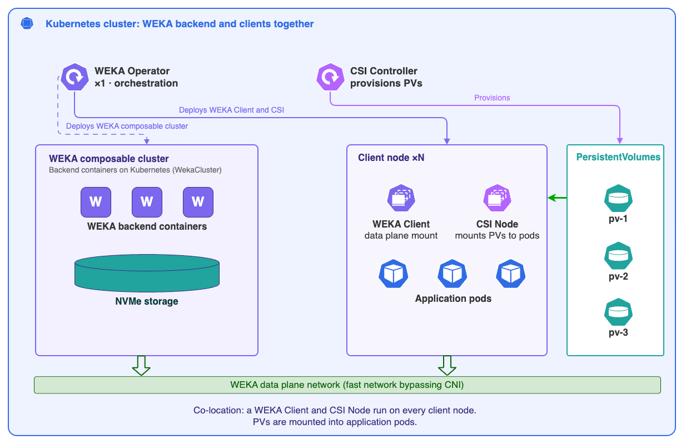
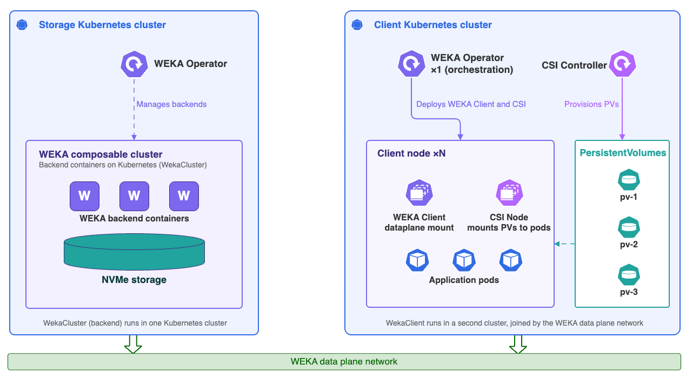
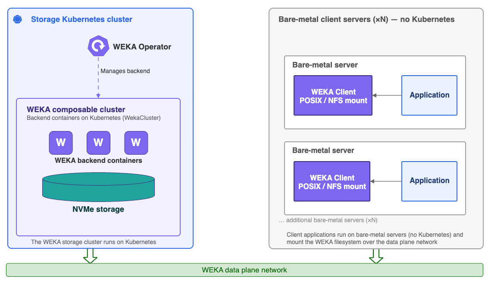

# WEKA Operator architecture overview

## Components and terms

The following table defines the main WEKA Operator components, custom resources, and supporting services used across a Kubernetes deployment:

<table><thead><tr><th width="192">Term</th><th>Role</th></tr></thead><tbody><tr><td><strong>WEKA Operator</strong></td><td>Orchestrates the full WEKA deployment on Kubernetes. Manages WekaCluster and WekaClient CRs across namespaces, deploys the CSI driver, and maintains the NeuralMesh client on designated nodes.</td></tr><tr><td><strong>WekaCluster CR</strong></td><td>
Represents a complete, discrete WEKA cluster deployment spanning one or more Kubernetes nodes. Each instance defines the backend cluster configuration (storage, compute, memory, and resource limits) and manages the lifecycle of all components that comprise that cluster.

Supports on-demand operations through <code>WekaManualOperation</code> and scheduled tasks through <code>WekaPolicy</code>.
</td></tr><tr><td><strong>WekaClient CR</strong></td><td>
Represents multiple WEKA client instances spanning one or more Kubernetes nodes matched by <code>nodeSelector</code>. Defines the data plane connectivity layer between those nodes and the WEKA cluster, and deploys one WEKA client pod per designated node (DaemonSet behavior).

A mandatory prerequisite for provisioning and mounting WEKA as persistent storage.
</td></tr><tr><td><strong>WekaContainer CR</strong></td><td>
The foundational building block of any WEKA deployment on Kubernetes. Each instance represents a single WEKA software component (the smallest deployable unit), which can be a drive, compute, frontend, or protocol container, as well as ephemeral workloads spawned during the deployment lifecycle.

Some WekaContainers carry a persistent identity that must be stored on the Kubernetes node. These are pinned to a specific node for their entire lifecycle.
</td></tr><tr><td><strong>Pod</strong></td><td>The Kubernetes runtime object created by the operator from a WekaContainer CR. The pod runs the WEKA process on the node.</td></tr><tr><td><strong>Driver Distribution Model</strong></td><td>
Ensures the correct WEKA kernel driver is available on every node. Operates through three components:
<ul><li><strong>Drivers-Builder:</strong> Compiles drivers for specific WEKA and kernel version combinations; multiple instances can run concurrently against the same repository.</li><li><strong>Drivers-Dist:</strong> Stores and serves driver packages over HTTP.</li><li><strong>Drivers-Loader:</strong> Detects missing drivers, retrieves them from Drivers-Dist, and loads them using <code>modprobe</code>.</li></ul></td></tr></tbody></table>

Node-level requirements, including kernel headers, storage allocations in `/opt/k8s-weka`, and HugePages settings, are configured during environment preparation and consumed by the operator when scheduling WEKA containers.

## Backend deployment

In a full backend deployment, the operator provisions and maintains one or more WekaCluster CRs. Each WekaCluster CR is an umbrella definition for multiple WEKA backend components and the business logic the operator uses to form, provision, and configure a complete WEKA NeuralMesh deployment:

* **Compute containers:** Handle WEKA compute processing and cluster logic.
* **Drive containers:** Manage the physical drives assigned to WEKA on each node.
* **Protocol containers:** Deployed only when protocol services are configured. Each protocol container type handles a specific service: S3 for object storage, NFS-W for NFS access, and SMB-W for SMB access.

For each container type, the operator automatically calculates the required hardware resources and the number of container instances to create. This calculation ensures consistent resource allocation across all instances of the same kind.

The operator places these backend containers on the nodes defined by the WekaCluster resource.

The following diagrams show three deployment models for WEKA backend services and client connectivity. Use them to identify where backend services run, how Kubernetes-managed clients connect to the backend cluster, and when access comes from external stateless clients instead.



Run WekaCluster and WekaClient in a shared Kubernetes cluster. Use this model when backend services, clients, and application workloads share one Kubernetes environment.

<figure><figcaption>
WekaCluster (backend) and WekaClient deployment on a shared Kubernetes cluster
</figcaption></figure>


WEKA containers run in `hostNetwork` mode, giving them direct access to the host network interfaces and bypassing the Kubernetes CNI. This ensures the WEKA data plane operates at the highest performance and lowest latency without contending with Kubernetes control plane or pod network traffic. CNI bypass applies in all networking modes, including UDP.




Run WekaCluster and WekaClient on separate Kubernetes clusters. Use this model when storage services and application workloads remain isolated.

<figure><figcaption>
WekaCluster (backend) and WekaClient on separate Kubernetes clusters
</figcaption></figure>




Connect a stateless client running outside Kubernetes to a WekaCluster deployed on Kubernetes. Use this model when external servers need WEKA access without deploying WekaClient.

<figure><figcaption>
External stateless clients on bare-metal servers
</figcaption></figure>




## Resources and label propagation

WEKA resources report status throughout the deployment lifecycle, and the WEKA Operator propagates labels from parent resources to child resources to keep metadata consistent across the environment.

**Label propagation**

The WEKA Operator automatically propagates labels from parent resources to child resources to maintain consistent metadata across the environment. This propagation follows these paths:

* `WekaCluster` > `WekaContainer`
* `WekaClient` > `WekaContainer` > Pod
* `WekaPolicy` > `WekaContainer`

Labels applied to a parent resource are reflected on all child resources the operator creates from it. This ensures that monitoring, scheduling, and selection policies applied at the cluster or client level flow through consistently to individual containers and pods.

**Resource status**

Each `WekaCluster`, `WekaClient`, and `WekaContainer` resource reports a status that reflects its current position in the deployment lifecycle, from initial creation through to a running state. Cluster and client resources report status at the deployment level, while container resources report status at the individual pod level, giving visibility into deployment health from the top-level cluster down to the containers running on each server.

For a full explanation of resource states and transitions, see [WekaCluster and WekaContainer lifecycle](wekacluster-and-wekacontainer-lifecycle.md).

## Client deployment

The WekaClient CR defines which nodes run WEKA client processes. The deployment involves the following component types:

* **WEKA Operator (Deployment):** A single instance that installs and manages WEKA. It is the orchestration layer: it manages WekaCluster and WekaClient CRs, deploys the WEKA CSI Plugin, and maintains the full lifecycle of all related resources.
*   **WEKA Client (DaemonSet):** Runs on each eligible Kubernetes node and connects that node to the WEKA storage cluster, providing data plane mount connectivity. The WEKA Operator manages the WekaClient and creates a WekaContainer for each eligible node. Each WekaContainer is then managed independently by the Operator, resulting in per-node deployment behavior similar to a DaemonSet, though not implemented as one.

    The WEKA Client is a mandatory prerequisite for PV provisioning and mounting WEKA as persistent storage.
* **CSI Controller (Deployment):** Handles CSI requests from the Kubernetes API and provisions PersistentVolumes. Runs on any two nodes (by default) that have a WEKA Client connected to the cluster. Kubernetes binds each provisioned PV to the requesting PersistentVolumeClaim.
* **CSI Plugin (DaemonSet):** Runs on every worker node that has a WEKA Client and mounts volumes into pods on that node. In embedded mode, the Operator manages this automatically. In standalone mode, you must ensure the CSI Plugin `nodeSelector` matches the WekaClient `nodeSelector`.
* **PersistentVolumeClaim (PVC):** A request for storage submitted by an application. Specifies the required capacity and access mode.
* **Persistent Volume(PV):** The WEKA storage provisioned in response to a PVC. Kubernetes binds the PV to the requesting PVC, making it available to the application.

**App Pod** (your workload) runs alongside the WEKA Client and CSI Plugin on the same node. The CSI Plugin mounts volumes locally for co-located pods.

This diagram shows the separate-cluster deployment model. The WEKA Operator processes a WekaClient CR and deploys the WEKA Client and CSI Plugin DaemonSets across designated nodes that are co-located with user application pods. Application workloads and WEKA clients run in one Kubernetes cluster, while backend WEKA containers and NVMe storage run in a separate Kubernetes cluster.

<figure><figcaption>
WEKA Operator client deployment
</figcaption></figure>

### Embedded CSI plugin

Starting with Operator v1.7.0, the CSI plugin runs in embedded mode, managed directly by the operator as part of the WekaClient CR. This removes the need to install the WEKA CSI Plugin as a separate Helm chart and eliminates manual lifecycle management.

Embedded mode supports a subset of CSI features and configuration options, which covers most deployment scenarios. In specific cases, the WEKA Customer Success team may recommend using the standalone CSI plugin instead.

The CSI plugin depends on WEKA client processes running on the same nodes. Client pods must be running before the CSI plugin can provision or mount volumes.

For instructions on switching from standalone to embedded mode, see [migrate-standalone-csi-to-weka-operator-embedded.md](migrate-standalone-csi-to-weka-operator-embedded.md "mention").


When the WEKA backend runs as a WekaCluster on the same Kubernetes cluster, embedded CSI can automatically provision storage classes. When connecting to an external WEKA backend, storage classes must be configured manually.

To connect a WekaClient to an in-cluster WekaCluster, set `targetCluster` in the WekaClient spec to reference the WekaCluster resource.


**Related topics**

[WEKA Operator full deployment workflow](weka-operator-full-deployment-workflow.md)

[Driver management with the WEKA Operator](/broken/pages/CnmsppNCO6Z9dfmCPGL1)

[WekaCluster and WekaContainer lifecycle](wekacluster-and-wekacontainer-lifecycle.md)

[Set up protocols on K8s with WEKA Operator](set-up-protocols-on-k8s-with-weka-operator.md)
