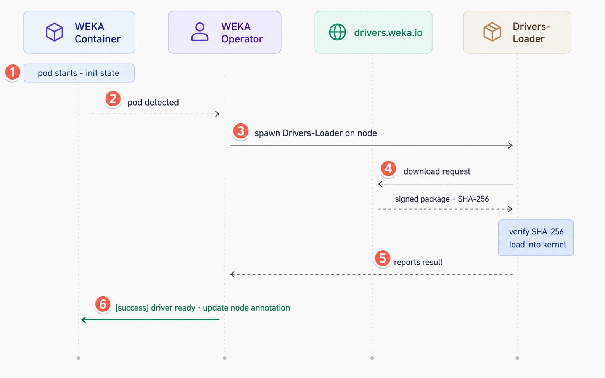
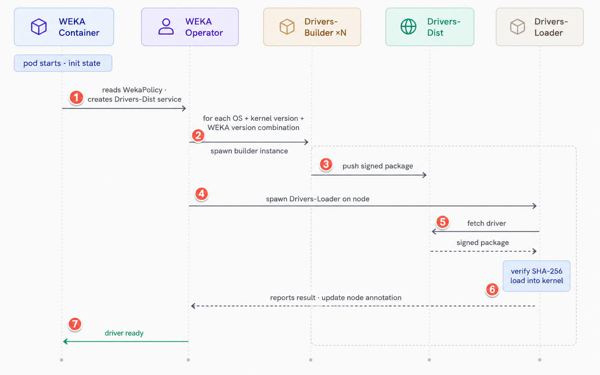

# WEKA Operator driver management

The WEKA Operator automates driver lifecycle across Kubernetes nodes. Instead of manually installing kernel drivers on each server, the operator builds, distributes, and loads the correct WEKA kernel driver for every node in the cluster. It supports two provisioning modes depending on network access and kernel requirements.

## Architecture and component roles

Driver management is composed of five components that interact through the WEKA Operator:

**WekaOperator:** Orchestrates the entire driver lifecycle. It monitors WekaContainer resources, calculates the required driver hash from the WEKA version, checks node annotations for a matching hash, and spawns the appropriate workloads to provision or replace drivers.

**WekaPolicy:** Defines the driver build and distribution policy. The operator creates Drivers-Builder and Drivers-Dist instances based on the policy configuration. Builder settings are managed exclusively through WekaPolicy.

**Drivers-Builder:** Compiles kernel drivers specific to a WEKA version, OS, and kernel version combination. Each build is signed with a SHA-256 signature and pushed to Drivers-Dist. The operator spawns a separate Drivers-Builder instance for each combination it detects across the node pool.

**Drivers-Dist:** Distributes built or downloaded drivers over HTTPS within the cluster using a stable internal service address. It verifies signatures before serving packages and caches compiled drivers if persistent storage is configured.

**Drivers-Loader:** An ephemeral WekaContainer spawned by the operator when a driver load or replacement is required. It fetches the driver package from either `drivers.weka.io` (pre-built mode) or Drivers-Dist (locally-built mode), verifies the SHA-256 signature, and loads the driver into the host kernel. Failed executions are terminated and retried by the operator indefinitely until the driver loads successfully.


WEKA containers run in `hostNetwork` mode, giving them direct access to the host network interfaces and bypassing the Kubernetes CNI. This ensures the WEKA dataplane operates at the highest performance and lowest latency without contending with Kubernetes control plane or pod network traffic. CNI bypass applies in all networking modes, including UDP.


## Choose the right driver mode

Identify and select the appropriate driver provisioning mode based on your network environment and kernel requirements.

|  | Pre-built (drivers.weka.io) | Locally-built (Drivers-Builder) |
| --- | --- | --- |
| **Recommended for** | Standard Linux distributions with supported kernel versions and outbound network access | Air-gapped or outbound-restricted environments; custom, patched, or uncommon kernel versions |
| **How it works** | Operator downloads ready-made signed packages directly from `drivers.weka.io`. No compilation required. | Operator builds, signs, and distributes drivers entirely within the cluster using the Drivers-Builder component. |
| **Main advantage** | Fastest path. No build infrastructure required in the cluster. | Full control over the build environment, including custom build flags through `extraBuildArgs`. |
| **Constraints** | Not suitable for air-gapped environments. Cannot be used with custom or patched kernels absent from the registry. | Increases overall provisioning time due to compilation. Requires Drivers-Dist with persistent storage. |
| **Fallback behavior** | If a kernel version is not found in the registry, the operator falls back to locally-built mode if a Drivers-Builder is configured. | Failed builds are retried indefinitely. |

## Pre-built drivers mode

In pre-built mode, the operator downloads ready-made signed driver packages from the WEKA driver registry at `drivers.weka.io`. This is the recommended mode for most deployments: it removes the need for any in-cluster build infrastructure and provides the fastest driver provisioning path.

**Pre-built drivers provisioning sequence**

The sequence below describes how the operator coordinates with the registry to provision drivers on each node.

1. The WekaContainer pod starts and enters an init state, waiting for the kernel driver to be loaded.
2. The operator calculates the required driver hash from the WEKA version and checks the node annotation for a matching hash.
3. If no match is found, the operator spawns a Drivers-Loader on the node.
4. The Drivers-Loader downloads the signed driver package directly from `drivers.weka.io`.
5. The Drivers-Loader verifies the SHA-256 signature and loads the driver into the host kernel.
6. On success, the operator updates the node annotation with the driver hash and the WekaContainer resumes initialization. On failure, the operator terminates the Drivers-Loader and retries indefinitely.

**Operational notes**

* Servers must have outbound network access to `https://drivers.weka.io`. No compiler toolchain or kernel headers are required.
* Pre-built drivers are provided for common Linux distributions with supported kernel versions.
* If the specific kernel version is not found in the registry, the operator falls back to locally-built mode if a Drivers-Builder is configured.

<div data-with-frame="true"><figure><figcaption><p>Pre-built drivers sequence diagram</p></figcaption></figure></div>

## Locally-built drivers mode

In locally-built mode, the operator builds, stores, and distributes drivers entirely within the cluster. This mode applies when servers run custom or uncommon kernels, or when the environment has no outbound network access.

The operator reads the WekaPolicy configuration, creates the Drivers-Dist service, and queries each node for its kernel version. It then spawns a separate Drivers-Builder instance for each unique combination of OS, kernel version, and WEKA version it detects. Each builder compiles the kernel module, signs it with SHA-256, and pushes the package to Drivers-Dist. Failed builds are retried indefinitely.

**Locally-built drivers provisioning sequence**

The sequence below describes how the operator coordinates an internal build and distribution flow under WekaPolicy.

The WekaContainer pod starts and enters an init state, waiting for the kernel driver to be loaded.

1. The operator reads the WekaPolicy configuration, creates the Drivers-Dist service, and identifies the required WEKA version.
2. The operator queries each target node to detect its OS and kernel version.
3. For each unique OS + kernel version + WEKA version combination, the operator spawns a Drivers-Builder instance.
4. Each Drivers-Builder compiles the kernel module, signs it with SHA-256, and pushes the signed package to Drivers-Dist. Failed builds are retried indefinitely.
5. The operator spawns a Drivers-Loader on each target node.
6. The Drivers-Loader fetches the driver from Drivers-Dist, verifies the SHA-256 signature, and loads the driver into the host kernel.
7. On success, the operator updates the node annotation and the WekaContainer resumes initialization. On failure, the operator terminates the Drivers-Loader and retries indefinitely.

**Operational notes**

* **Kernel headers:** whether kernel headers are required on the build server depends on the target OS and distribution. Requirements differ across standard Linux, OpenShift, and GKE environments. Consult the WEKA support documentation for your specific platform.
* **Build flags:** specify additional compilation parameters through the `extraBuildArgs` field in the WekaPolicy for highly custom environments.
* **Drivers-Dist storage:** Drivers-Dist requires persistent storage, such as a PersistentVolumeClaim, to cache compiled driver packages. If Drivers-Dist is restarted, the operator recreates it automatically. Previously cached drivers are retained if persistent storage is available. If storage is unavailable on restart, the operator rebuilds the affected drivers.

<div data-with-frame="true"><figure><figcaption><p>Locally-built drivers sequence diagram</p></figcaption></figure></div>

## Configure infrastructure for locally-built drivers

Configure the prerequisites and policy settings required to enable locally-built driver provisioning.

### Before you begin

Before the operator can initiate a local build, ensure the environment meets these prerequisites:

* **Persistent storage for Drivers-Dist:** Provision sufficient storage, such as a PersistentVolumeClaim, for the Drivers-Dist service to cache driver packages.
* **Network access:** Ensure port 60002 is open to allow communication between the operator, Drivers-Builder, Drivers-Dist, and Drivers-Loader.
* **WekaPolicy:** Prepare a WekaPolicy resource that defines the build and distribution settings. See [Configure WekaPolicy for local driver builds](weka-operator-driver-management.md#configure-wekapolicy-for-local-driver-builds).

### Configure WekaPolicy for local driver builds

Define the driver distribution endpoint and builder settings in a WekaPolicy resource, then apply it to the cluster.

### Configure the driver distribution endpoint

Set the `driversDistService` field in the WekaCluster or WekaClient resource to the internal Drivers-Dist service endpoint. The operator propagates this setting to each managed WekaContainer.

**Field reference**

| Field | Description | Type |
| --- | --- | --- |
| `driversDistService` | Internal Drivers-Dist service endpoint that serves driver packages. | string, required for locally-built mode |

**WekaCluster example**

```yaml
apiVersion: weka.weka.io/v1alpha1
kind: WekaCluster
metadata:
  name: my-weka-cluster
spec:
  image: quay.io/weka.io/weka-in-container:5.1.0
  imagePullSecret: "quay-io-robot-secret"
  driversDistService: "https://weka-drivers-dist.wekasystem.svc.local:60002"
  nodeSelector:
    weka.io/role: "compute"
```

**WekaClient example**

```yaml
apiVersion: weka.weka.io/v1alpha1
kind: WekaClient
metadata:
  name: my-weka-client
spec:
  image: quay.io/weka.io/weka-in-container:5.1.0
  imagePullSecret: "quay-io-robot-secret"
  driversDistService: "https://weka-drivers-dist.wekasystem.svc.local:60002"
  nodeSelector:
    weka.io/role: "client"
```

## Troubleshoot driver management

Identify and resolve common issues encountered during driver provisioning and distribution.

### Driver build timeouts

**Symptom:** The build process exceeds the allocated `buildTimeout` duration.

**Description:** Drivers-Builder cannot complete kernel module compilation within the required timeframe.

**Resolution:** Verify that the build server has the correct kernel headers installed for the running kernel version. Confirm the required package is present before the build starts. For reference, on Debian-based distributions, install headers using:

```bash
apt-get install -y linux-headers-$(uname -r)
```

### Distribution connectivity failures

**Symptom:** Drivers-Loader cannot reach the Drivers-Dist service.

**Description:** Internal HTTP communication between the Drivers-Loader and the Drivers-Dist endpoint is interrupted or misconfigured.

**Resolution:** Confirm that the service defined in `driversDistService` is running and that port 60002 is open in all relevant network policies.

### Signature verification errors

**Symptom:** A signature verification failure occurs during the driver fetch.

**Description:** The SHA-256 signature of the driver package in Drivers-Dist does not match the expected value, indicating possible corruption.

**Resolution:** Delete the cached driver package from Drivers-Dist storage and allow the operator to re-fetch or rebuild a clean version.

### Driver delivery failures

**Symptom:** A specific node is not receiving the required driver.

**Description:** The operator does not target the node for provisioning because it does not satisfy the defined selection criteria.

**Resolution:** Check the node labels and confirm they match the `nodeSelector` defined in the driver distribution policy. In standalone CSI mode, also verify that the CSI Plugin `nodeSelector` matches the WekaClient `nodeSelector`.

### Custom kernel build failures

**Symptom:** The build process fails for a custom or uncommon kernel version.

**Description:** The standard Drivers-Builder environment lacks the tools or parameters required to compile for a non-standard kernel.

**Resolution:** Confirm the Drivers-Builder image supports the target kernel. Provide specific compilation flags using the `extraBuildArgs` field in the WekaPolicy.

### Review Drivers-Loader pod logs

**Symptom:** Driver provisioning fails or stalls with no clear error in the operator logs.

**Description:** Drivers-Loader pod logs contain detailed output from the download, signature verification, and kernel load steps and are the primary source for diagnosing provisioning failures.

**Resolution:** Identify the Drivers-Loader pod on the affected node and review its logs:

```bash
kubectl get pods -n <namespace> | grep drivers-loader
kubectl logs -n <namespace> <drivers-loader-pod-name>
```

Look for download errors, signature mismatches, or kernel module load failures in the output.
