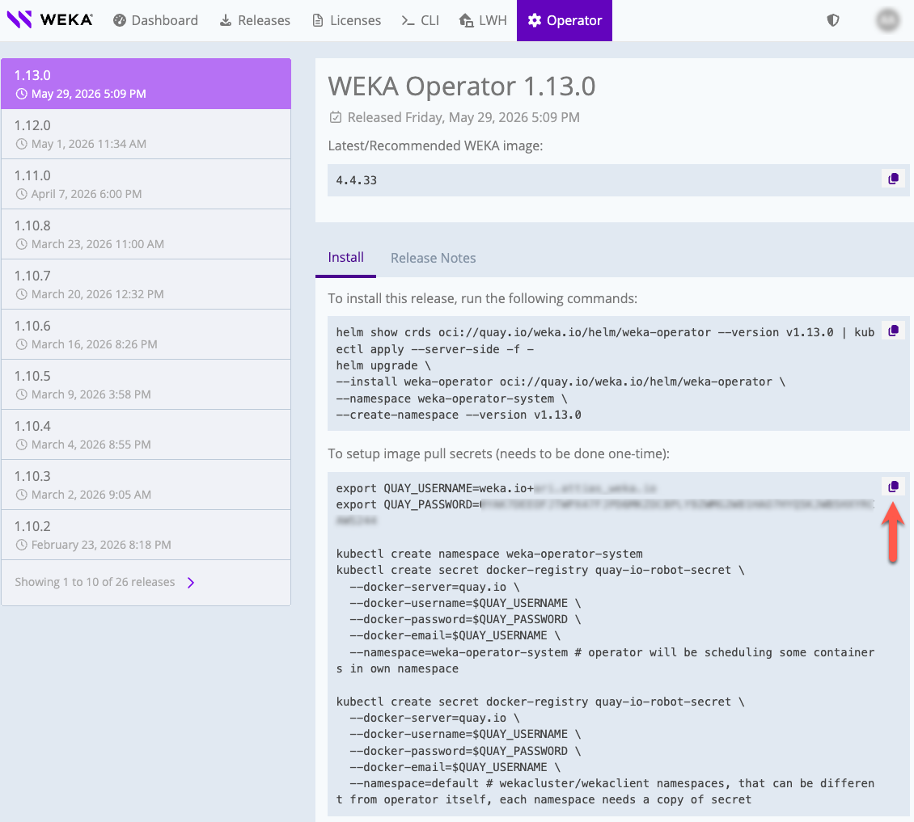

# WEKA Operator full deployment workflow

**Workflow**

<table><thead><tr><th width="80">Step</th><th width="272">Task</th><th>Description</th></tr></thead><tbody><tr><td>1</td><td><a href="weka-operator-full-deployment-workflow.md#id-1.-obtain-setup-information">Obtain setup information</a></td><td>Collect registry credentials and version tags.</td></tr><tr><td>2</td><td><a href="weka-operator-full-deployment-workflow.md#id-2.-prepare-kubernetes-environment">Prepare Kubernetes environment</a></td><td>Configure control plane readiness, HugePages, Kubelet settings, image pull secrets, and failure domains.</td></tr><tr><td>3</td><td><a href="weka-operator-full-deployment-workflow.md#id-3.-install-the-weka-operator">Install the WEKA Operator</a></td><td>Deploy the operator and set the required drive type configuration.</td></tr><tr><td>4</td><td><a href="weka-operator-full-deployment-workflow.md#id-4.-manage-driver-distribution">Manage driver distribution</a></td><td>Select external or local driver distribution and apply the required policy.</td></tr><tr><td>5</td><td><a href="weka-operator-full-deployment-workflow.md#id-5.-discover-and-sign-drives">Discover and sign drives</a></td><td>Detect available drives and apply the required signing policy.</td></tr><tr><td>6</td><td><a href="weka-operator-full-deployment-workflow.md#id-6.-provision-weka-resources">Provision WEKA resources</a></td><td>Deploy the WekaCluster, create the optional client secret, and install the WekaClient when needed.</td></tr><tr><td>7</td><td><a href="weka-operator-full-deployment-workflow.md#id-7.-manage-the-weka-cluster-management-proxy">Manage the WEKA cluster management proxy</a></td><td>Optionally expose WEKA management endpoints through an operator-managed Service and Ingress.</td></tr><tr><td>8</td><td><a href="weka-operator-full-deployment-workflow.md#id-8.-assign-network-space-proxy-subnets-for-multiple-weka-clusters">Assign network space proxy subnets</a></td><td>Assign unique proxy subnets when multiple WEKA clusters share the same Kubernetes environment.</td></tr><tr><td>9</td><td><a href="weka-operator-full-deployment-workflow.md#id-9.-perform-post-deployment-storage-configuration-on-weka-client">Perform post-deployment storage configuration on WEKA client</a></td><td>Configure CSI behavior and storage provisioning for WEKA clients.</td></tr></tbody></table>

***

## 1. Obtain setup information

Identify and record the credentials required to pull WEKA container images and the specific version tags for your deployment.

#### Before you begin

Contact the WEKA Customer Success Team to receive your authorized registry credentials.

#### Procedure

1. Access [WEKA Operator page](https://get.weka.io/ui/operator) to identify the latest `WEKA_OPERATOR_VERSION` and `WEKA_IMAGE_VERSION_TAG`.
2. Record the following credentials for your image pull secret:
   * Registry: `quay.io`
   * QUAY\_USERNAME
   * QUAY\_PASSWORD
   * QUAY\_SECRET\_KEY: Typically `quay-io-robot-secret`.


Replace all placeholders in your setup files with these values before proceeding.


<div data-with-frame="true"><figure><figcaption><p>Example: WEKA Operator page on get.weka.io</p></figcaption></figure></div>

***

## 2. Prepare Kubernetes environment

Ensure the infrastructure meets the performance and resiliency requirements of the WEKA data plane. This step covers control plane configuration, node hardware and software requirements, HugePages, port requirements, and Kubelet CPU policy.

#### Control plane high availability

Configure the Kubernetes control plane for high availability to match WEKA resiliency. High availability depends on etcd quorum.

* **Quorum rule:** etcd requires an odd number of members (N) and tolerates failures up to (N-1)/2 failures.
* **Recommendation:** Use five or nine etcd members for production storage backends.


Consider using an external etcd cluster or distributing control plane components across multiple failure domains. For more information, see the [Kubernetes HA topology guidance](https://kubernetes.io/docs/setup/production-environment/tools/kubeadm/ha-topology/).


#### Node hardware and software requirements

Verify that every node in the cluster meets these specifications:

* **Kubernetes version:** 1.25 or later (OpenShift 4.17 or later).
* **Storage allocation:** Reserve approximately 20 GiB per WEKA container plus 10 GiB per allocated CPU core in `/opt/k8s-weka`. Do not use NFS or network-attached storage.
* **Kernel headers:** Ensure kernel headers exactly match the running kernel version to allow driver compilation.

#### Configure HugePages for Kubernetes worker nodes

WEKA processes require dedicated HugePages memory. Configure HugePages on every worker node before deploying the WekaCluster. Nodes without HugePages configured will fail to schedule WEKA pods.

#### Memory allocation requirements

Use the following formula to calculate the required number of 2 MiB HugePages for your server:

```
Total GiB = (Server capacity GiB / Ratio + Cores for WEKA × 1.7) × 1.1
HugePages  = (Total GiB × 1024) / 2
```

Variables:

<table><thead><tr><th width="201.60003662109375">Variable</th><th>Description</th></tr></thead><tbody><tr><td>Server capacity</td><td>Total usable capacity of all drives assigned to WEKA on the server, measured in GiB.</td></tr><tr><td>Ratio</td><td>Controls the metadata memory component in the HugePages calculation. Server capacity is divided by this value, so a higher ratio allocates less memory to metadata, which reduces total HugePages consumption. The default is 1000. Set to 2000 to lower HugePages usage on servers where reduced metadata allocation is acceptable.</td></tr><tr><td>Cores for WEKA</td><td>Number of CPU cores allocated to the WEKA container on the server.</td></tr><tr><td>WEKA Container factor</td><td>Fixed HugePages allocation of 1.7 GiB for each WEKA container.</td></tr><tr><td>Headroom</td><td>Additional 10% buffer, expressed as 1.1, to account for memory fragmentation and operational variance. If you plan to run additional workloads that require HugePages, add their planned requirements on top of the calculated value.</td></tr></tbody></table>

**Example calculation**

Server specifications:

* CPU cores: 64 total; 63 dedicated to WEKA.
* Storage: 16 drives × 15.3 TiB = 244.8 TiB usable (250,675 GiB).

Step 1: Calculate total GiB:

```
(250,675 / 1000 + 63 × 1.7) × 1.1 = 393.55 GiB
```

Step 2: Convert to MiB:

```
393.55 × 1024 = 402,998 MiB
```

Step 3: Calculate HugePages:

```
402,998 / 2 = 201,499 → round up to 201,500 HugePages
```

**Apply HugePages settings**

Before you begin:

* Identify the number of drives and CPU cores allocated to WEKA on the server.
* Ensure you have root or `sudo` permissions on the worker nodes.

Procedure:

1.  Check the current HugePages status on the server:

    ```bash
    grep Huge /proc/meminfo
    ```
2.  Apply the calculated HugePages value. Replace `<calculated-value>` with the value computed for your server:

    ```bash
    sudo sysctl -w vm.nr_hugepages=<calculated-value>
    ```
3.  Persist the setting to ensure it remains active after a reboot:

    ```bash
    sudo sh -c 'echo "vm.nr_hugepages = <calculated-value>" >> /etc/sysctl.conf'
    ```

#### Kubernetes port requirements

The WEKA Operator automatically allocates ports to prevent collisions in multi-cluster environments. Manual configuration is typically unnecessary unless specific infrastructure or policy requirements apply.

<table><thead><tr><th width="273.39996337890625">Component</th><th width="144.39990234375">Default start port</th><th>Port range size</th></tr></thead><tbody><tr><td>WEKA Operator (v1.10+) / WEKA (v5.1.0+)</td><td>35000</td><td>260 ports per cluster</td></tr><tr><td>WEKA Operator / WEKA (previous versions)</td><td>35000</td><td>500 ports per cluster</td></tr><tr><td>WEKA client connectivity</td><td>45000</td><td>Maximum: 65535</td></tr></tbody></table>

**Reserve ports on each node**

To prevent the Linux kernel from assigning WEKA ports to other processes, add the following to `/etc/sysctl.d/99-weka.conf` on every node. For example:

```
net.ipv4.ip_local_reserved_ports = 35000-37600
```

The range 35000–37600 covers 2,600 ports, which supports up to 10 WekaCluster instances at 260 ports each. If you plan to deploy more than 10 clusters, extend the upper bound by 260 ports per additional cluster.

For full kernel parameter configuration, see [Set custom kernel parameters](../../planning-and-installation/bare-metal/setting-up-the-hosts/#configure-the-networking).

#### Configure Kubelet requirements

Enable the static CPU Manager policy on all worker nodes to give WEKA processes dedicated CPU cores. Without this, the Kubernetes scheduler can place other workloads on the same cores, causing contention and reducing I/O throughput.

On Kubernetes v1.32 and later, also enable `strict-cpu-reservation` to prevent Burstable and Best Effort pods from scheduling onto reserved cores.

For the full rationale, sibling-pair guidance, and version-specific reservation details, see [WEKA Operator best practices](weka-operator-best-practices.md).

**Before you begin: identify HyperThreading sibling cores**

On hyperthreaded systems, each physical core exposes two logical CPUs. Include both logical CPUs from the same physical core in `reservedSystemCPUs` to ensure full isolation. Reserving only one sibling of a physical core leaves that core shared.

Run the following commands to identify sibling pairs on the node:

```bash
lscpu -e=cpu,core,socket,node

cat /sys/devices/system/cpu/cpu*/topology/thread_siblings_list
```

Example output for a 12-logical-CPU, single-socket server with HyperThreading enabled:

```
CPU  CORE  SOCKET  NODE
0    0     0       0
1    1     0       0
2    2     0       0
3    3     0       0
4    4     0       0
5    5     0       0
6    0     0       0
7    1     0       0
8    2     0       0
9    3     0       0
10   4     0       0
11   5     0       0
```

In this example, there are 6 physical cores and 12 logical CPUs. CPUs that share the same\
`CORE` and `SOCKET` values are HyperThreading siblings:

<table><thead><tr><th width="179">Physical core</th><th width="225">Logical CPU (thread 0)</th><th>Logical CPU (thread 1, HT sibling)</th></tr></thead><tbody><tr><td>0</td><td>0</td><td>6</td></tr><tr><td>1</td><td>1</td><td>7</td></tr><tr><td>2</td><td>2</td><td>8</td></tr><tr><td>3</td><td>3</td><td>9</td></tr><tr><td>4</td><td>4</td><td>10</td></tr><tr><td>5</td><td>5</td><td>11</td></tr></tbody></table>

The `thread_siblings_list` confirms these pairs directly:

```
/sys/devices/system/cpu/cpu0/topology/thread_siblings_list  → 0,6
/sys/devices/system/cpu/cpu1/topology/thread_siblings_list  → 1,7
... 
```


Do not treat CPUs on different sockets with the same core index as siblings. Always verify pairs using `thread_siblings_list` rather than relying on the `CORE` column alone.


**Procedure**

1. Edit the Kubelet configuration file on each worker node and add the following settings. In this example, physical core 0 is reserved for the OS. `reservedSystemCPUs` includes both logical CPUs of that core (CPU 0 and its HT sibling, CPU 6):

```yaml
apiVersion: kubelet.config.k8s.io/v1beta1
kind: KubeletConfiguration
cpuManagerPolicy: "static"
reservedSystemCPUs: "0,6"
featureGates:
  CPUManagerPolicyOptions: "true"
  CPUManagerPolicyAlphaOptions: "true"
cpuManagerPolicyOptions:
  strict-cpu-reservation: "true"
```

Adjust `reservedSystemCPUs` to match the sibling pairs reported by `thread_siblings_list` on your node. Reserve at least one physical CPU (two sibling cores) for the Kubelet. Reserve additional physical cores, including both logical CPUs for each core, when OS or platform workloads require more capacity.


Kubelet configuration methods vary by Kubernetes distribution. Some environments manage `KubeletConfiguration` centrally, while others require per-node file or bootstrap changes. Treat this example as the target Kubelet state and apply the equivalent settings by using the method your platform supports on every worker node that hosts WEKA processes.



`CPUManagerPolicyAlphaOptions` and `strict-cpu-reservation` require Kubernetes v1.32 or later. Omit the `featureGates` and `cpuManagerPolicyOptions` blocks on earlier versions. Without strict reservation, Burstable and Best Effort pods can schedule onto reserved cores under load, reducing WEKA I/O throughput.


2. Save the file and restart the Kubelet:

```bash
systemctl restart kubelet
```

**Related information**

[Control CPU Management Policies on the Node](https://kubernetes.io/docs/tasks/administer-cluster/cpu-management-policies/)

#### Configure image pull secrets

Set up Kubernetes secrets to enable secure image pulling from the WEKA container registry. These secrets must exist in every namespace where WEKA resources are deployed.

**Before you begin**

Identify your `QUAY_USERNAME`, `QUAY_PASSWORD`, and `QUAY_SECRET_KEY` from [step 1](weka-operator-full-deployment-workflow.md#id-1.-obtain-setup-information).

**Procedure**

1. Define the target namespaces and ensure they do not overlap to prevent configuration conflicts.
2. Create the secret in the `weka-operator-system` namespace. Repeat the same step in every namespace where you plan to create a WEKA CR. For example, if you deploy WEKA resources in the `default` namespace, create the secret there as well:

```bash
export QUAY_USERNAME='your_username'
export QUAY_PASSWORD='your_password'

kubectl create ns weka-operator-system

kubectl create secret docker-registry quay-io-robot-secret \
  --docker-server=quay.io \
  --docker-username=$QUAY_USERNAME \
  --docker-password=$QUAY_PASSWORD \
  --docker-email=$QUAY_USERNAME \
  --namespace=weka-operator-system

# Example workload namespace: default
kubectl create secret docker-registry quay-io-robot-secret \
  --docker-server=quay.io \
  --docker-username=$QUAY_USERNAME \
  --docker-password=$QUAY_PASSWORD \
  --docker-email=$QUAY_USERNAME \
  --namespace=default
```

#### Configure failure domains

Group backend nodes into failure domains to ensure high availability and data protection. A failure domain represents a set of processes that share a common physical risk, such as a rack, power circuit, or network switch.

The system distributes data and parity blocks from the same stripe across different failure domains. If an entire failure domain fails, the cluster reconstructs the missing data from the remaining domains.

**Select a failure domain mode**

<table><thead><tr><th width="113">Mode</th><th width="320">Function</th><th>Usage</th></tr></thead><tbody><tr><td>Implicit (default)</td><td>Assigns every process as its own independent failure domain.</td><td>Deployments where infrastructure shared risks cannot be identified by Kubernetes node labels.</td></tr><tr><td>Explicit</td><td>Groups processes into named domains based on physical node labels.</td><td>Deployments where containers share a rack, switch, or power source.</td></tr></tbody></table>


Prefer explicit mode when Kubernetes node labels can represent shared infrastructure boundaries. Explicit mode provides better failure protection by separating processes across known physical domains such as racks, power feeds, or switches. To use it, ensure the required topology labels are present on the nodes.


**Determine stripe width and domain count**

Coordinate the number of failure domains with the stripe width and protection level during cluster formation. Stripe width and protection levels are permanent once set.

Constraint to prevent data loss: blocks lost during a failure domain failure = stripe width / number of failure domains. This value must not exceed the parity block count (P).

Minimum healthy server requirements:

| Stripe configuration | Minimum healthy server |
| -------------------- | ---------------------- |
| 5+2                  | 4                      |
| 16+ 2                | 9                      |
| 5+4                  | 3                      |
| 16+4                 | 5                      |

**Map a single node label**

1.  Label every backend node with a physical grouping value:

    ```bash
    kubectl label nodes <node-name> weka.io/failure-domain=<rack-id>
    ```
2.  Configure the `failureDomain` field in the `WekaCluster` CR:

    ```yaml
    spec:
      failureDomain:
        label: "weka.io/failure-domain"
        skew: 1
    ```

    * `label`: The node label key identifying the failure domain.
    * `skew`: The permitted difference in container count between domains.

**Use composite topology labels**

Combine existing Kubernetes topology labels, such as zone and rack, into a compound failure domain identity.

**Procedure**

1.  Identify the existing labels on your nodes:

    ```bash
    kubectl get nodes --show-labels
    ```
2.  Add the `compositeLabels` list to the `WekaCluster` CR:

    ```yaml
    spec:
      failureDomain:
        compositeLabels:
          - "topology.kubernetes.io/zone"
          - "rack"
    ```

    The operator combines these values. For example, a node in zone `us-east-1a` on `rack-1` becomes failure domain `us-east-1a/rack-1`.

**Verify the configuration**

Confirm the distribution of containers across the defined domains.

**Procedure**

1.  Apply the CR changes:

    ```bash
    kubectl apply -f wekacluster.yaml
    ```
2.  Check the container status:

    ```bash
    weka cluster container
    ```
3. Verify that the `FAILURE DOMAIN` column displays your custom label values instead of `AUTO`.

***

## 3. Install the WEKA Operator

Manage the lifecycle of WEKA resources by installing the WEKA Operator. This process involves applying Custom Resource Definitions (CRDs) and deploying the operator controller with specific configurations for the Container Storage Interface (CSI) and drive types.

#### Before you begin

* Ensure the `QUAY_SECRET_KEY` is created in the `weka-operator-system` namespace (completed in [step 2](weka-operator-full-deployment-workflow.md#id-2.-prepare-kubernetes-environment)).
*   Install Helm on a local server, unless using a higher-level deployment tool such as Argo CD:

    ```bash
    curl -fsSL -o get_helm.sh \
      https://raw.githubusercontent.com/helm/helm/main/scripts/get-helm-3 && \
      chmod 700 get_helm.sh && ./get_helm.sh
    ```
* Confirm `kubectl` is installed and configured against the target cluster.
*   Identify your deployment configuration before running the Helm command:

    <table><thead><tr><th width="218">Condition</th><th>Required flag</th></tr></thead><tbody><tr><td>Operator v1.7.0 and later</td><td><code>--set csi.installationEnabled=true</code></td></tr><tr><td>Operator v1.10 and later with AlloyFlash</td><td><code>--set driveSharing.driveTypesRatio='{tlc: 9, qlc: 1}'</code></td></tr><tr><td>Operator v1.10 and later with single drive type</td><td><code>--set driveSharing.driveTypesRatio='{qlc: 0}'</code></td></tr></tbody></table>

#### Procedure

1. Download and apply the CRDs so the Kubernetes API can recognize WEKA resources. Replace `<WEKA_OPERATOR_VERSION>` with your version:

```bash
helm pull oci://quay.io/weka.io/helm/weka-operator \
  --untar --version <WEKA_OPERATOR_VERSION>
kubectl apply -f weka-operator/crds
```

2. Deploy the WEKA Operator using the Helm flags that match your configuration. The following examples show the two most common layouts:

**Mixed flash configuration** (AlloyFlash<sup>TM</sup>)**:**

```bash
helm upgrade --create-namespace \
  --install weka-operator oci://quay.io/weka.io/helm/weka-operator \
  --namespace weka-operator-system \
  --version <WEKA_OPERATOR_VERSION> \
  --set csi.installationEnabled=true \
  --set driveSharing.driveTypesRatio='{tlc: 9, qlc: 1}'
```

This setting allocates 9/10 capacity to TLC and 1/10 to QLC.

**Single drive type**:

```bash
helm upgrade --create-namespace \
    --install weka-operator oci://quay.io/weka.io/helm/weka-operator \
    --namespace weka-operator-system \
    --version <WEKA_OPERATOR_VERSION> \
    --set csi.installationEnabled=true \
    --set driveSharing.driveTypesRatio='{qlc: 0}'
```

This setting configures a single drive type and disables Hybrid Flash.

3. Verify the installation. The `weka-operator-controller-manager` pod must show `Running` status:

```bash
kubectl -n weka-operator-system get pod
```

Expected output:

```bash
NAME                                                  READY   STATUS    RESTARTS   AGE
weka-operator-controller-manager-564bfd6b49-p6k7d    2/2     Running   0          13s
```

If the pod does not reach `Running` state, see [Troubleshoot WEKA Operator deployments](troubleshoot-weka-operator-deployments.md).

***

## 4. Manage driver distribution

If outbound access to `drivers.weka.io` is available, use the pre-built driver service. Configure driver distribution only when you need a local build and distribution path for client and backend processes.

**Choose a distribution method**

<table><thead><tr><th width="334">Condition</th><th>Method</th></tr></thead><tbody><tr><td>Standard Linux distribution with supported kernel, outbound access to <code>drivers.weka.io</code></td><td>Pre-built drivers (recommended): No build infrastructure required. By default, the drivers are pulled from <code>https://drivers.weka.io</code>.</td></tr><tr><td>Air-gapped environment, custom or patched kernel, or no external network access</td><td>Local driver builder: Configure driver distribution policy.</td></tr></tbody></table>

For architectural details on how driver distribution works, see [Driver management with the WEKA Operator](/broken/spaces/ZW262oqYA8pNNfGvXjHa/pages/CnmsppNCO6Z9dfmCPGL1).

#### Before you begin

* Ensure a WEKA-compatible image (`weka-in-container`) and a valid `imagePullSecret` are accessible.
* Confirm that builder container versions match the target WEKA version.
* For local distribution: ensure kernel headers matching the running kernel are installed on the build server. On Ubuntu, install `linux-headers-$(uname -r)`. On Rocky Linux, install `kernel-devel-$(uname -r)` and `kernel-headers-$(uname -r)`. Also confirm port 60002 is open for communication between the operator, Drivers-Builder, Drivers-Dist, and Drivers-Loader.

**Local driver distribution components**

When using a local builder, the operator deploys three components:

* **Drivers-Builder:** Compiles the kernel module for specific WEKA and kernel version combinations.
* **Drivers-Dist:** An internal HTTP server that stores and serves compiled driver packages.
* **Service:** A Kubernetes Service that exposes Drivers-Dist at a stable internal endpoint.


When configuring driver distribution manually, the following elements must be preserved exactly as shown in the configuration examples: ports, network modes, core configurations, and `spec.name`.


**Procedure**

1. Define node selection using a `nodeSelector` to identify target Kubernetes nodes that require the driver.
2. Apply a WekaPolicy to deploy the driver distribution service. Use the example that matches your environment:

<details>

<summary>Example 1: Minimal policy (recommended for most deployments)</summary>

**Ubuntu**


```yaml
apiVersion: weka.weka.io/v1alpha1
kind: WekaPolicy
metadata:
  name: weka-drivers
  namespace: weka-operator-system
spec:
  type: enable-local-drivers-distribution
  image: quay.io/weka.io/weka-in-container:5.1.0
  imagePullSecret: "quay-io-robot-secret"
  payload:
    driverDistPayload:
      builderPreRunScript: "apt-get update && apt-get install -y gcc-12"
    interval: 1m
  nodeSelector:
    weka.io/supports-backends: "true"
```


**Rocky Linux**


```yaml
apiVersion: weka.weka.io/v1alpha1
kind: WekaPolicy
metadata:
  name: weka-drivers
  namespace: weka-operator-system
spec:
  type: enable-local-drivers-distribution
  image: quay.io/weka.io/weka-in-container:5.1.0
  imagePullSecret: "quay-io-robot-secret"
  payload:
    driverDistPayload:
      builderPreRunScript: "dnf install -y gcc"
    interval: 1m
  nodeSelector:
    weka.io/supports-backends: "true"
```


</details>

<details>

<summary>Example 2: Manual deployment of distribution and builder containers</summary>

Use this example only when direct resource control is required instead of a WekaPolicy:


```yaml
apiVersion: weka.weka.io/v1alpha1
kind: WekaContainer
metadata:
  name: weka-drivers-dist
  namespace: weka-operator-system
  labels:
    app: weka-drivers-dist
spec:
  agentPort: 60001
  image: quay.io/weka.io/weka-in-container:5.1.0
  imagePullSecret: "quay-io-robot-secret"
  mode: "drivers-dist"
  name: dist
  numCores: 1
  port: 60002
---
apiVersion: v1
kind: Service
metadata:
  name: weka-drivers-dist
  namespace: weka-operator-system
spec:
  type: ClusterIP
  ports:
    - name: weka-drivers-dist
      port: 60002
      targetPort: 60002
  selector:
    app: weka-drivers-dist
---
apiVersion: weka.weka.io/v1alpha1
kind: WekaContainer
metadata:
  name: weka-drivers-builder-157
  namespace: weka-operator-system
spec:
  agentPort: 60001
  image: quay.io/weka.io/weka-in-container:5.1.0
  imagePullSecret: "quay-io-robot-secret"
  mode: "drivers-builder"
  name: dist
  numCores: 1
  uploadResultsTo: "weka-drivers-dist"
  port: 60002
  nodeSelector:
    weka.io/supports-backends: "true"
---
apiVersion: weka.weka.io/v1alpha1
kind: WekaContainer
metadata:
  name: weka-drivers-builder-157-ubuntu-1
  namespace: weka-operator-system
spec:
  agentPort: 60001
  image: quay.io/weka.io/weka-in-container:5.1.0
  imagePullSecret: "quay-io-robot-secret"
  mode: "drivers-builder"
  name: dist
  numCores: 1
  uploadResultsTo: "weka-drivers-dist"
  port: 60002
  nodeSelector:
    weka.io/supports-backends: "true"
    weka.io/kernel: "6.5.0-45-generic"
  overrides:
    preRunScript: "apt-get update && apt-get install -y gcc-12"
```


On Rocky Linux, replace the `preRunScript` value with `dnf install -y gcc`.

</details>

<details>

<summary>Example 3: WekaPolicy with proactive driver pre-building</summary>

Use this example when you need to pre-build drivers for specific images beyond those detected from existing WekaCluster and WekaClient resources:

**Ubuntu**


```yaml
apiVersion: weka.weka.io/v1alpha1
kind: WekaPolicy
metadata:
  name: weka-drivers
  namespace: weka-operator-system
spec:
  type: "enable-local-drivers-distribution"
  image: "quay.io/weka.io/weka-in-container:5.1.0"
  imagePullSecret: "quay-io-robot-secret"
  tolerations:
    - key: "example-key"
      operator: "Exists"
      effect: "NoSchedule"
  payload:
    interval: "1m"
    driverDistPayload:
      ensureImages:
        - "quay.io/weka.io/weka-in-container:5.1.0"
      nodeSelectors:
        - role: "worker-nodes"
          environment: "production"
        - custom-label: "drivers-build-pool"
      builderPreRunScript: |
        #!/bin/sh
        apt-get update && apt-get install -y gcc-12
```


**Rocky Linux**


```yaml
apiVersion: weka.weka.io/v1alpha1
kind: WekaPolicy
metadata:
  name: weka-drivers
  namespace: weka-operator-system
spec:
  type: "enable-local-drivers-distribution"
  image: "quay.io/weka.io/weka-in-container:5.1.0"
  imagePullSecret: "quay-io-robot-secret"
  tolerations:
    - key: "example-key"
      operator: "Exists"
      effect: "NoSchedule"
  payload:
    interval: "1m"
    driverDistPayload:
      ensureImages:
        - "quay.io/weka.io/weka-in-container:5.1.0"
      nodeSelectors:
        - role: "worker-nodes"
          environment: "production"
        - custom-label: "drivers-build-pool"
      builderPreRunScript: |
        #!/bin/sh
        dnf install -y gcc
```


</details>

**WekaPolicy additional attributes**

<table><thead><tr><th width="197">Attribute</th><th>Description</th></tr></thead><tbody><tr><td><code>image</code></td><td>The WEKA container image used for the distributor and default builder.</td></tr><tr><td><code>interval</code></td><td>How often the operator reconciles the policy. Default: <code>1m</code>.</td></tr><tr><td><code>builderPreRunScript</code></td><td>Optional script to run before the build, for example to install a compiler.</td></tr><tr><td><code>ensureNICsPayload</code></td><td>Defines the configuration for ensuring a specific number of data NICs on selected nodes.</td></tr><tr><td><code>signDrivesPayload</code></td><td>Configures parameters to scan and sign drives for WEKA backend containers.</td></tr></tbody></table>

3. Apply the configuration:

```bash
kubectl apply -f weka-drivers.yaml
```

***

## 5. Discover and sign drives

Identify and prepare physical storage devices before provisioning the WEKA cluster.

**How drive discovery works**

When a drive discovery operation runs, the operator performs three actions on each node:

* Annotates the node with a list of known serial IDs for all accessible drives.
* Creates the extended resource `weka.io/drives` on the node to indicate the count of ready drives.
* Marks only healthy, unblocked drives as available. Drives with errors or manual blocks are excluded.

**Choose a discovery method**

<table><thead><tr><th width="208">Method</th><th>Use case</th></tr></thead><tbody><tr><td><code>WekaManualOperation</code></td><td>One-time action for initial manual provisioning.</td></tr><tr><td><code>WekaPolicy</code></td><td>Automated periodic discovery. Initiates immediately when it detects node updates or hardware additions. Recommended for production.</td></tr></tbody></table>

**Understand the shared field**

The `shared` field in the `signDrivesPayload` controls whether SSD Proxy is enabled on the signed drives.



Whole drives are assigned directly to WEKA processes. This is the simpler configuration and suits deployments where clusters are large enough to use full drives.

Consider `false` when:

* You intend to assign complete drives to one or more WekaCluster CRs.
* Your clusters are consistently active and you want to avoid sharing drive workload across tenants.


Running multiple WekaCluster CRs on the same hardware does not require drive sharing. With 6 drives available, you can assign each drive to a separate WekaCluster without enabling `shared`.




Enables SSD Proxy, which introduces a layer between WEKA processes and the physical drives. This enables two capabilities:

* **Drive slicing:** A single physical drive can be divided into logical slices, each used by a different WekaCluster. This is useful when clusters are smaller and do not need full drives.
* **Higher aggregate throughput:** When clusters are not all fully loaded at the same time, drive sharing increases the number of drives used in parallel, which can improve overall performance. If clusters are consistently active simultaneously, drive workload is shared across tenants.


SSD Proxy enables allocating multiple CPU cores per physical drive.


For details on SSD Proxy operation and resource requirements,, see [Drive sharing](../../operation-guide/drives-sharing.md).



#### Procedure

1. **Define drive sharing and signing:** Apply a WekaPolicy to sign compatible drives.


```yaml
apiVersion: weka.weka.io/v1alpha1
kind: WekaPolicy
metadata:
  name: sign-drives
  namespace: weka-operator-system
spec:
  type: sign-drives
  payload:
    signDrivesPayload:
      type: "all-not-root"
      shared: true # To support drive slicing or higher per-drive throughput through SSD Proxy. See the Understand the shared field section above.
```


<table><thead><tr><th width="185">Name</th><th>Description</th></tr></thead><tbody><tr><td><code>all-not-root</code></td><td>Signs all detected block devices except the root device.</td></tr><tr><td><code>aws-all</code></td><td>Detects NVMe devices using AWS PCI identifiers.</td></tr><tr><td><code>device-paths</code></td><td>Targets specific device paths listed in the manifest.</td></tr></tbody></table>

## 6. Provision WEKA resources

Deploy the WekaCluster and WekaClient Custom Resources to provision the backend storage and connect your Kubernetes nodes.


Run cluster-level WEKA CLI commands from Compute or Drive pods only. Do not run WEKA CLI commands inside WekaClient pods or application client pods.


Perform these steps in sequence:

1. Install the WekaCluster CR.
2. Create the WEKA cluster client secret (only required if WekaCluster and WekaClient are not deployed on the same Kubernetes cluster)
3. Install the WekaClient CR.

### 6.1. Install the WekaCluster CR

Provision the WEKA cluster backend using the WekaCluster CR. This resource defines the storage containers, drive configurations, and networking for the cluster.

#### Before you begin

* Verify that drives are signed and discovered ([step 5](weka-operator-full-deployment-workflow.md#id-5.-discover-and-sign-drives)).
* Verify the driver distribution service is accessible. WEKA recommends the external service at `https://drivers.weka.io`.
* If you set `shared: true` when signing drives, use `containerCapacity` instead of `numDrives`. If you set `shared: false`, `numDrives` is optional and defaults to `1`, which assigns one whole drive per drive container.

#### Procedure

1. Create `weka-cluster.yaml`:

<details>

<summary>Example: weka-cluster.yaml</summary>


```yaml
apiVersion: weka.weka.io/v1alpha1
kind: WekaCluster
metadata:
  name: weka-cluster-dev
  namespace: default
spec:
  template: dynamic
  dynamicTemplate:
    computeContainers: 6
    driveContainers: 6
    containerCapacity: 1000   # Use instead of numDrives when shared: true is set in sign-driv
  image: quay.io/weka.io/weka-in-container:5.1.0
  nodeSelector:
    weka.io/supports-backends: "true"
  driversDistService: "https://drivers.weka.io"
  imagePullSecret: "quay-io-robot-secret"
  network:
    udpMode: true
```


</details>

2. If your cluster requires settings that cannot be applied through standard configuration, for example overriding the default bucket count on a small or non-standard cluster, set `spec.overrides.postFormClusterScript` in the manifest before applying it. The operator runs this script once, after the cluster forms and before `start-io`. Use it only when no standard configuration option achieves the required result:

<details>

<summary>Example: postFormClusterScript override</summary>


```yaml
apiVersion: weka.weka.io/v1alpha1
kind: WekaCluster
metadata:
  name: weka-cluster-dev
spec:
  overrides:
    postFormClusterScript: |
      weka debug jrpc cluster_configure_internal buckets_number=280
```


</details>

To inspect the field definition, run:

```bash
kubectl explain wekacluster.spec.overrides.postFormClusterScript
```


`postFormClusterScript` runs privileged debug commands on a cluster that is not yet serving I/O. Validate the script on a non-production cluster before applying it to production.


4. Apply the manifest:

```bash
kubectl apply -f weka-cluster.yaml
```

**Related information**

[WekaClusterSpec](https://weka.github.io/weka-k8s-api/wekacluster/)

### 6.2. Create the WEKA cluster client secret

Create a Kubernetes Secret that stores the credentials WekaClient uses to join the WEKA cluster. This is required only when WekaClient and WekaCluster are not deployed in the same Kubernetes cluster.

#### Before you begin

Obtain the `org`, `join-secret`, `password`, and `username` from your WEKA backend.

#### Procedure

1. Encode each credential value to **base64**.


```bash
echo -n 'my_password' | base64
```


2. Create `secret.yaml`:

<details>

<summary>Example: secret.yaml</summary>


```yaml
apiVersion: v1
kind: Secret
metadata:
  name: weka-cluster-dev
  namespace: weka-operator-system
type: Opaque
data:
  org: <base64-encoded-org>
  join-secret: <base64-encoded-join-secret>
  password: <base64-encoded-password>
  username: <base64-encoded-username>
```


</details>

3. Apply the secret:

```bash
kubectl apply -f secret.yaml
```

### 6.3. Install the WekaClient CR

If you need WEKA clients on Kubernetes, deploy the WekaClient CR on the designated Kubernetes nodes. WekaClient works like a DaemonSet and provisions one pod per selected node to provide a persistent WEKA data plane for your workloads.

#### Before you begin

* Label every worker node intended to host WEKA client pods:

```bash
kubectl label nodes <node-name> <label>
```

Example:

```bash
kubectl label nodes <node-name> weka.io/supports-clients=true
```


Ensure the label matches the `nodeSelector` property in the WekaClient CR.


* Verify that the Kubernetes Secret (for example, `weka-cluster-dev`) exists in the `weka-operator-system` namespace and contains base64-encoded cluster credentials (`org`, `join-secret`, `password`, and `username`).
* Identify whether you are using the external driver distribution service (`https://drivers.weka.io`) or a local service endpoint.

#### Procedure

1. Create `weka-client.yaml` using the connection type that matches your environment:

<details>

<summary>Example: Internal cluster connection (WekaCluster and WekaClient in the same Kubernetes cluster)</summary>


```yaml
apiVersion: weka.weka.io/v1alpha1
kind: WekaClient
metadata:
  name: cluster-dev-clients
spec:
  image: quay.io/weka.io/weka-in-container:5.1.0
  imagePullSecret: "quay-io-robot-secret"
  driversDistService: "https://weka-drivers-dist.weka-operator-system.svc.cluster.local:60002"
  portRange:
    basePort: 46000
  nodeSelector:
    weka.io/supports-clients: "true"
  wekaSecretRef: weka-cluster-dev
  targetCluster:
    name: weka-cluster-dev
    namespace: default
```


</details>

<details>

<summary>Example: External cluster connection (WEKA cluster running outside Kubernetes)</summary>


```yaml
apiVersion: weka.weka.io/v1alpha1
kind: WekaClient
metadata:
  name: cluster-dev-clients
spec:
  image: quay.io/weka.io/weka-in-container:5.1.0
  imagePullSecret: "quay-io-robot-secret"
  driversDistService: "https://drivers.weka.io"
  portRange:
    basePort: 46000
  nodeSelector:
    weka.io/supports-clients: "true"
  wekaSecretRef: weka-cluster-dev
  joinIpPorts: ["10.0.2.137:16101"]
  network:
    ethDevice: mlnx0
```


</details>

3. Apply the manifest.

```bash
kubectl apply -f weka-client.yaml
```

<details>

<summary><strong>WekaClient parameters reference</strong></summary>

For the full list of configurable fields, see [WekaClient parameters](https://weka.github.io/weka-k8s-api/wekaclient/).

<table><thead><tr><th width="229">Name</th><th width="367">Description</th><th>Default</th></tr></thead><tbody><tr><td><code>image</code></td><td>The WEKA container image version to deploy.</td><td>—</td></tr><tr><td><code>imagePullSecret</code></td><td>Secret name used to authenticate with the image registry.</td><td>—</td></tr><tr><td><code>port</code></td><td>Defines a range of 100 ports for the container.</td><td>Dynamic</td></tr><tr><td><code>agentPort</code></td><td>Specifies a single port used by the agent process.</td><td>Dynamic</td></tr><tr><td><code>portRange</code></td><td>Defines a <code>basePort</code> for automatic port allocation.</td><td>—</td></tr><tr><td><code>nodeSelector</code></td><td>Selects the nodes where WEKA containers are scheduled.</td><td>—</td></tr><tr><td><code>network</code></td><td>Network configuration map. Sub-keys: <code>ethDevice</code> (single device), <code>ethDevices</code> (multiple devices), and <code>udpMode</code> (true/false). Defaults to UDP mode when not set.</td><td>UDP</td></tr><tr><td><code>driversDistService</code></td><td>URL for the driver distribution service.</td><td>—</td></tr><tr><td><code>targetCluster</code></td><td>Name and namespace of the WekaCluster CR to connect to. Applies when the WekaCluster runs in the same Kubernetes cluster.</td><td>—</td></tr><tr><td><code>joinIpPorts</code></td><td>IP addresses used to join a cluster outside the local environment.</td><td>—</td></tr><tr><td><code>wekaSecretRef</code></td><td>Reference to the Kubernetes Secret containing cluster credentials.</td><td>—</td></tr><tr><td><code>coresNum</code></td><td>Number of physical CPU cores to allocate to each container.</td><td>1</td></tr><tr><td><code>cpuPolicy</code></td><td>Defines core allocation behavior: <code>auto</code>, <code>manual</code>, <code>shared</code>, <code>dedicated</code> or <code>dedicated_ht</code></td><td><code>auto</code></td></tr><tr><td><code>upgradePolicy</code></td><td>Sets the upgrade strategy: <code>rolling</code>, <code>manual</code>, or <code>all-at-once</code>.</td><td><code>rolling</code></td></tr><tr><td><code>gracefulDestroyDuration</code></td><td>Pause duration for local data and drive allocations during pod deletion.</td><td>24h</td></tr></tbody></table>

</details>

***

## 7. Manage the WEKA cluster management proxy

Optionally - access WEKA management endpoints through an operator-managed Service, and optionally expose them outside the Kubernetes cluster using a Kubernetes Ingress.

**Required infrastructure**

WEKA does not install or configure the following components. These remain the responsibility of the platform administrator:

<table><thead><tr><th width="217">Component</th><th>Purpose</th></tr></thead><tbody><tr><td>Ingress controller</td><td>Manages incoming traffic, for example NGINX or Traefik.</td></tr><tr><td>External connectivity</td><td>A load balancer or equivalent mechanism to route traffic from outside the cluster.</td></tr><tr><td>DNS resolution</td><td>Configured hostnames that resolve to the Ingress controller's external IP.</td></tr><tr><td>TLS termination</td><td>Optional platform-managed certificate management for secure HTTPS communication.</td></tr></tbody></table>

**Ingress configuration**

WEKA simplifies basic setups by managing Ingress configuration through a single `ingressClass` setting. For advanced or customized networking scenarios, wrap or modify the service using standard Kubernetes Ingress resources.

***

## 8. Assign network space proxy subnets for multiple WEKA clusters

Optionally, allocate a unique proxy subnet to each WEKA cluster when you deploy more than one WekaCluster on the same Kubernetes environment. Each WEKA cluster uses an internal proxy subnet for its network space. When two clusters share the same subnet, their address ranges overlap and cause routing conflicts.

Assign a non-overlapping subnet to every WEKA cluster so that each cluster keeps a dedicated address range and isolates its traffic from other tenants on the same Kubernetes nodes.

### Before you begin

* Deploy the WEKA Operator on the target Kubernetes environment.
* Identify every WEKA cluster already deployed on the same Kubernetes environment.


**Important:** Assign a unique proxy subnet to each WEKA cluster on the same Kubernetes environment. This prevents overlapping address ranges and routing conflicts when you deploy additional clusters.


### Procedure

1.  Record the proxy subnets already assigned to the existing WEKA clusters:

    ```
    weka cluster network-space proxy subnet
    ```
2. For each new WEKA cluster, choose a subnet in CIDR notation that no other WEKA cluster on the same Kubernetes environment uses.
3.  Assign the subnet to the WEKA cluster:

    ```
    weka cluster network-space proxy subnet set 10.1.0.0   ## WekaCluster_A
    weka cluster network-space proxy subnet set 10.2.0.0   ## WekaCluster_B
    weka cluster network-space proxy subnet set 10.3.0.0   ## WekaCluster_C
    ```
4.  Confirm the assignment by listing the proxy subnets again and verifying that each WEKA cluster holds a distinct range:

    ```
    weka cluster network-space proxy subnet
    ```

***

## 9. Perform post-deployment storage configuration on WEKA client

If your deployment includes a WEKA client on Kubernetes and embedded CSI is enabled, configure the CSI plugin and storage classes based on your operator version to enable persistent volume provisioning.

<table><thead><tr><th width="168.171875">Operator version</th><th width="345.9453125">Behavior</th><th>Required action</th></tr></thead><tbody><tr><td>v1.7.0 and later</td><td>Embedded CSI is supported. When embedded CSI is enabled during operator installation, the operator configures the CSI plugin and StorageClass automatically.</td><td>Proceed to create a Persistent Volume Claim (PVC).<br>See <a data-mention href="../../appendices/weka-csi-plugin/dynamic-and-static-provisioning.md">dynamic-and-static-provisioning.md</a>.</td></tr><tr><td>v1.6.2 and earlier</td><td>Embedded CSI is not available. CSI requires manual installation.</td><td>See <a data-mention href="../../appendices/weka-csi-plugin/">weka-csi-plugin</a>.</td></tr></tbody></table>


For v1.7.0 and later, when embedded CSI installation is enabled, the operator creates storage classes following the pattern `weka-<groupName>-<fsName>`. To disable automatic storage class creation, set `csi.storageClassCreationDisabled: true` in your Helm values.

