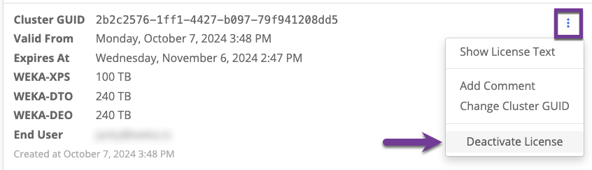
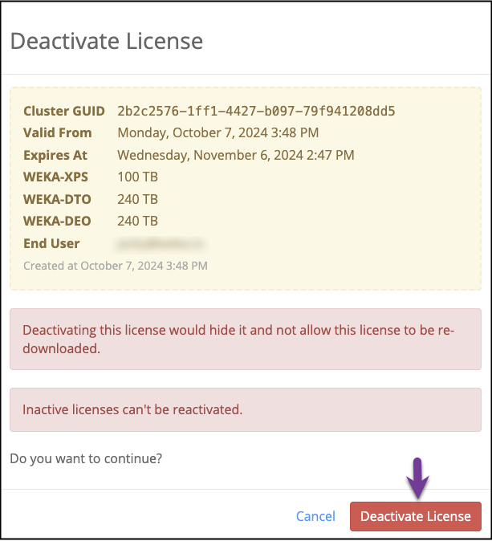

# Classic license

A classic license is a text-based element generated in get.weka.io for a specific WEKA cluster, which you then apply to that cluster. Only users with the **Account Owner** role can manage licenses.

## Obtain a classic license from get.weka.io

**Before you begin**

* To create a classic license in get.weka.io, you need a WEKA account. If you already have a WEKA account, skip this step. If not, see instructions in [Register to get.weka.io](../install/bare-metal/obtaining-the-weka-install-file.md#register-to-get.weka.io).
* Obtain the cluster GUID and capacity from your system and keep it for later use.\
  Run the command `weka cluster license`.\
  The command provides an output of all the information required for creating your license.\
  \
  **Output example**

```
# weka cluster license 
Licensing status: Unlicensed

Your cluster is currently unlicensed. Please go to https://get.weka.io/ to get a license
or enroll in a subscription.

When asked, you'll need the following details to create your license:

    Cluster GUID          : bbb6639d-3eaa-483b-b532-31a560d5859d
    Raw Drive Capacity    : 11399 GB
    Usable Capacity       : 0 GB
    Object-store Capacity : 0 GB

If you already have a license, please enter it by running

    weka cluster license set <license-key>
```

**Procedure**

1. Sign in to [get.weka.io](http://get.weka.io).
2. **Obtain an entitlement:** Once you have a WEKA account, the Customer Success Team applies an entitlement to the account. You can view the outstanding entitlements on the account dashboard.


3\. In the Outstanding Entitlements pane, select **Create a license**.

4\. In the subsequent pane, select the line containing the entitlement for which a license is created\
&#x20;   and then select **Create a license.**


4\. In the Create License dialog, fill in the cluster GUID and capacities that you have obtained \
&#x20;   (as part of the Before you begin section above) and select **Create License**.


If you plan a cluster expansion for the future, you can fill in capacities larger than those appearing in the WEKA cluster license.

The licenses' capacities represent the limits to which it is possible to expand the cluster and do not have to match the actual usage.



## Apply the license to the cluster

After creating the license, apply the license to the cluster.

**Procedure**

1. In the Licenses tab in get.weka.io, select the three dots to the right of the license details and then select **Show License Text**.


2\. In the License Text dialog that opens, select **copy to clipboard**.


3\. On the Weka cluster, run the following command:

```
weka cluster license set <license-key>
```

Instead of the \<license-key> in the command line, paste the license copied to the clipboard.

The license is assigned to the cluster.

## Reuse an existing license on a new cluster

When installing a new cluster, it is assigned with a new GUID. You can reuse an existing license for the newly-installed cluster.

**Procedure**

1. In the Licenses tab in get.weka.io, select the three dots to the right of the license details and then select **Change Cluster GUID**.


2\. Set the new cluster GUID and select **Save Changes**.


3\. Apply the license with the updated GUID. See [Apply the license to the cluster](classic-licensing.md#apply-the-license-to-the-cluster).

## Deactivate your license

Deactivating a license allows you to reclaim capacity back to your linked entitlement, which is useful when rebuilding clusters or correcting licenses issued with incorrect capacity. By deactivating a license, you can redeploy the correct capacity without needing to contact support, streamlining your workflow.

This feature is especially helpful in scenarios where licenses were issued by mistake or clusters are being rebuilt with different configurations.

**Procedure:**

1. **Locate the license:** Log in to [get.weka.io](https://get.weka.io) and navigate to the list of licenses. Find the license you want to deactivate.
2. **Deactivate the license:** Select the three dots (more options) next to the license, and select **Deactivate License**.

<figure><figcaption><p>License options menu</p></figcaption></figure>

3. **Confirm deactivation:** In the Deactivate License dialog, review the details to ensure this is the correct license. When you're ready, select **Deactivate License** to proceed.

<figure><figcaption><p><strong>Deactivate License</strong></p></figcaption></figure>
