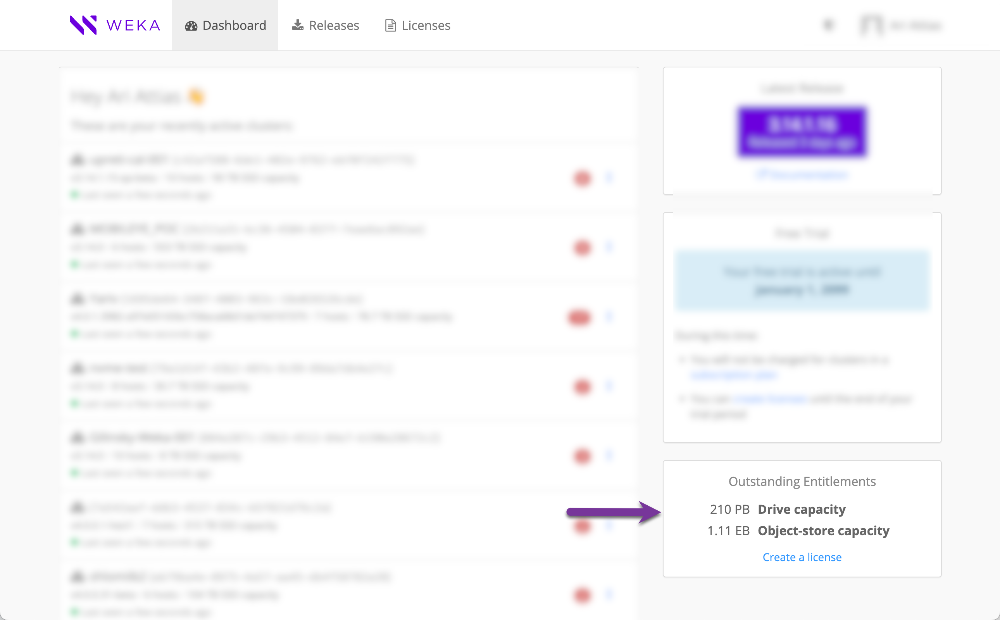
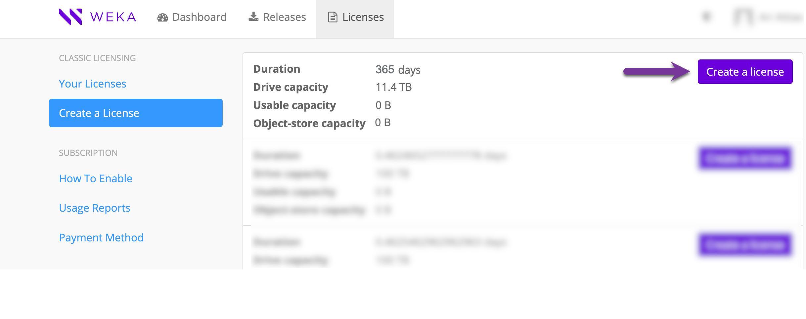
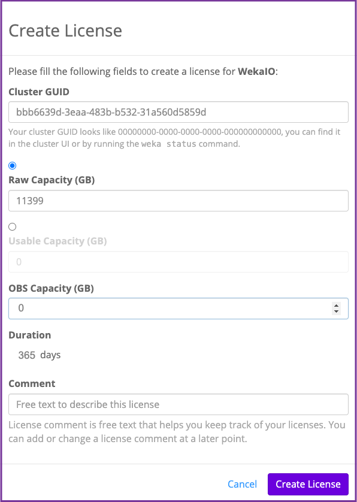
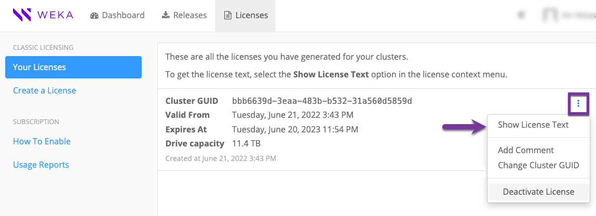
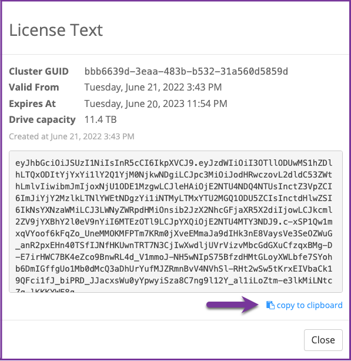
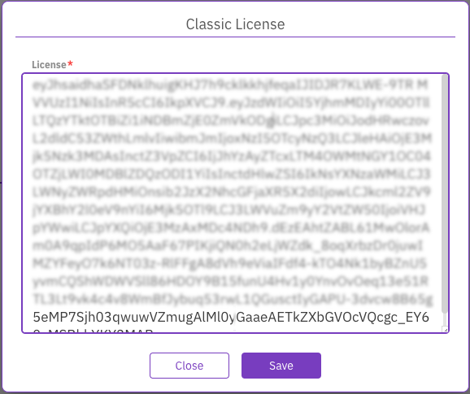
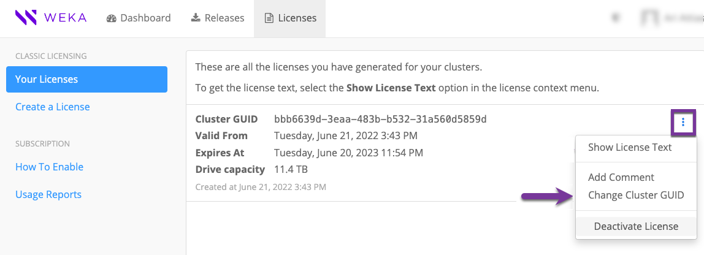
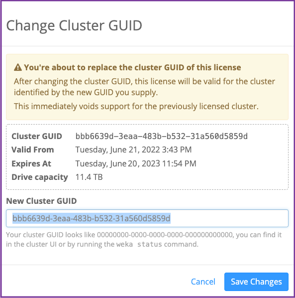
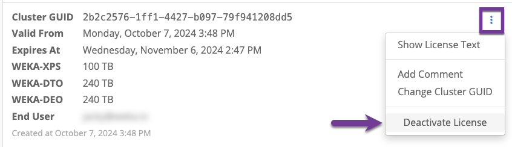
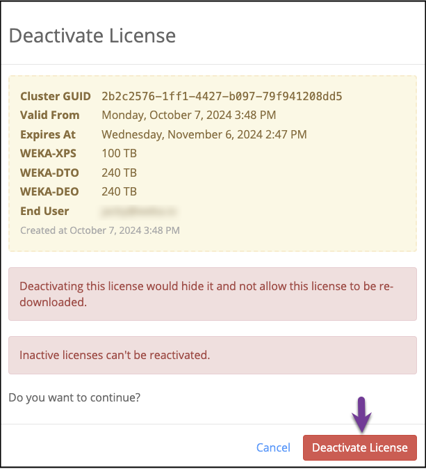

# Classic license

## Obtain a classic license from get.weka.io

A classic license is a text-based license file generated via [get.weka.io](https://get.weka.io) for a specific WEKA cluster. You must apply this license to the intended cluster.


Only users with the Account Owner role can manage licenses.


#### **Before you begin**

1. **WEKA account:** Ensure you have a WEKA account. If not, follow the instructions in [#register-to-get.weka.io](../planning-and-installation/bare-metal/obtaining-the-weka-install-file.md#register-to-get.weka.io "mention").
2. **Cluster information:** Collect your cluster’s GUID and capacity values by running the following command on your WEKA system:

```
weka cluster license
```

**Sample output**


```bash
Licensing status: Unlicensed

Your cluster is currently unlicensed. Please go to https://get.weka.io/ to get a license or enroll in a subscription.

When asked, you'll need the following details to create your license:

    Cluster GUID          : bbb6639d-3eaa-483b-b532-31a560d5859d
    Raw Drive Capacity    : 11399 GB
    Usable Capacity       : 0 GB
    Object-store Capacity : 0 GB

If you already have a license, please enter it by running

    weka cluster license set <license-key>
```


**Procedure**

1. **Sign in to** [**get.weka.io**](http://get.weka.io)**:** Sign in using your WEKA account credentials.
2. **Obtain an entitlement:** Sales Operations will assign an entitlement to your account. You can view available entitlements on the **Account Dashboard**.

<div data-with-frame="true"></div>

3. **Create the license:**
   1. In the Outstanding Entitlements section, select **Create a license**.
   2. In the next pane, select the entitlement line item for which the license will be created.
   3. Select **Create a license** again to proceed.

<div data-with-frame="true"></div>

5. **Enter cluster information:** In the Create License dialog:
   1. Enter the Cluster GUID and capacity values obtained earlier.
   2. Optionally, enter higher capacity values if planning a future cluster expansion. The license defines the capacity limits for the cluster and does not need to match current usage exactly.
6. **Complete the process:** Select **Create License** to generate the license. You can apply it to your WEKA cluster.

<div data-with-frame="true"></div>

## Apply or update a license to the cluster

After creating a license, apply it to the cluster. Only one license can be active at a time; applying a new license replaces the existing one.

**Procedure**

1. In the Licenses tab in get.weka.io, select the three dots to the right of the license details and then select **Show License Text**.

<div data-with-frame="true"></div>

2. In the License Text dialog that opens, select **copy to clipboard**.

<div data-with-frame="true"></div>

3. If you use the CLI to apply the license, run the following command:\
   `weka cluster license set <license-key>`\
   Where the \<license-key> is the license copied to the clipboard.
4. If you use the GUI to apply the license, do the following:
   * From the menu, select **Configure > Cluster Settings.**
   * From the Cluster Settings pane, select **License**.
   * Paste the license copied to the clipboard, and select **Save**.

<figure><figcaption></figcaption></figure>

## Reuse an existing license on a new cluster

When installing a new cluster, it is assigned with a new GUID. You can reuse an existing license for the newly-installed cluster.

**Procedure**

1. In the Licenses tab in get.weka.io, select the three dots to the right of the license details and then select **Change Cluster GUID**.

<div data-with-frame="true"></div>

2\. Set the new cluster GUID and select **Save Changes**.

<div data-with-frame="true"></div>

3\. Apply the license with the updated GUID. See [#apply-or-update-a-license-to-the-cluster](classic-licensing.md#apply-or-update-a-license-to-the-cluster "mention").

## Changing the size of your license

When you purchase additional entitlement to increase the license size of an existing cluster, you must create and apply a new license. This requires deactivating the current license for that cluster in the [get.weka.io](https://get.weka.io) portal. Deactivating a license has no impact on cluster operations.

License deactivation reclaims capacity back to your linked entitlement, enabling you to:

* Expand existing clusters
* Rebuild clusters
* Correct licenses issued with incorrect capacity

This process allows you to redeploy the appropriate capacity without contacting support, streamlining license management.

**Procedure:**

1. **Locate the license:** Log in to [get.weka.io](https://get.weka.io) and navigate to the Licenses page. Identify the license associated with the cluster you want to deactivate.
2. **Deactivate the license:** Select the **More options** icon (three dots) next to the relevant license, then select Deactivate License. This action does not impact the operation of the associated cluster.

<div data-with-frame="true"><figure><figcaption><p>License options menu</p></figcaption></figure></div>

3. **Confirm deactivation:** In the Deactivate License dialog, verify the license details. When confirmed, select **Deactivate License** to complete the process.

<div data-with-frame="true"><figure><figcaption><p><strong>Deactivate License</strong></p></figcaption></figure></div>

After deactivation, the license capacity is returned to the linked entitlement. You can then use the available entitlement to [#apply-or-update-a-license-to-the-cluster](classic-licensing.md#apply-or-update-a-license-to-the-cluster "mention").
