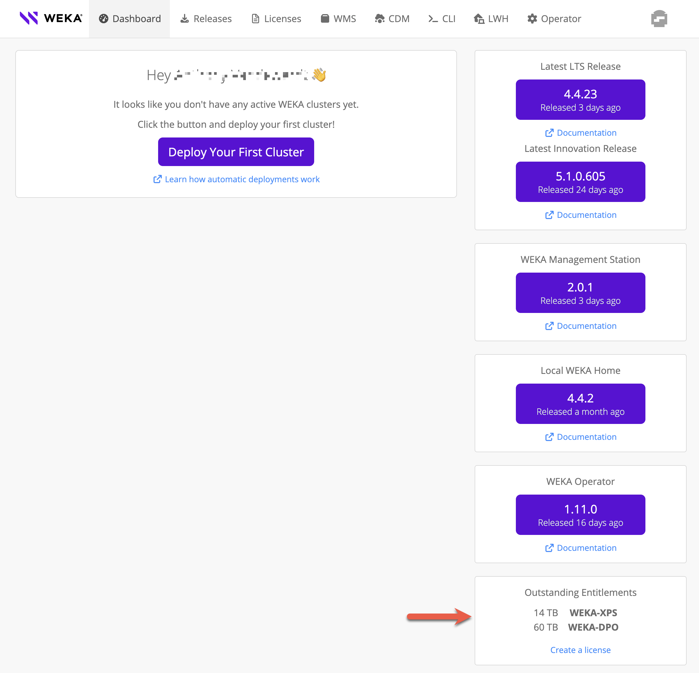
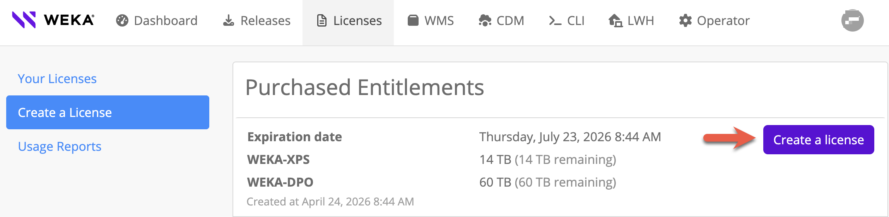
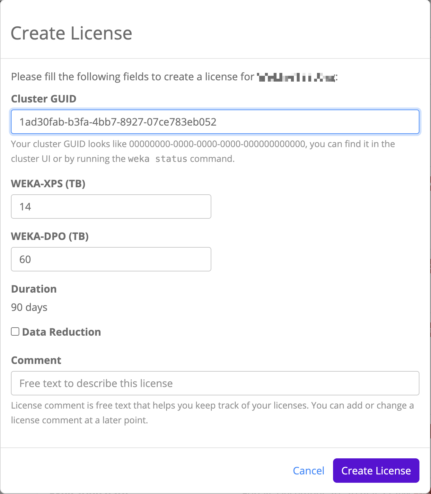
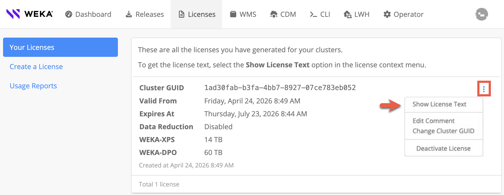
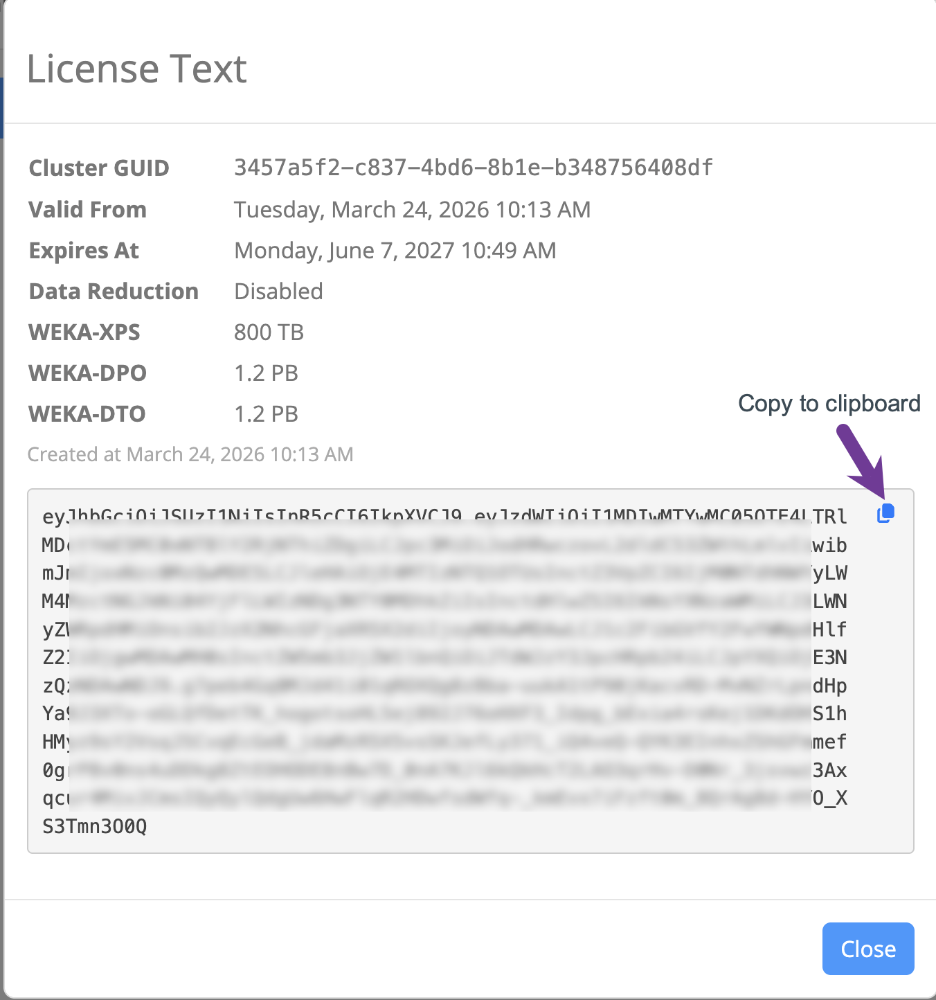

# Apply a classic license

Obtain and apply a classic license from [get.weka.io](https://get.weka.io) to activate a WEKA cluster. You can also reuse the license on a new cluster or resize it when capacity changes.


Only users with the Account Owner role can manage licenses.


## Before you begin

Before you start, confirm the following prerequisites:

1. You have a WEKA account. If not, follow the instructions in [obtaining-the-weka-install-file.md](../planning-and-installation/bare-metal/obtaining-the-weka-install-file.md "mention").
2. You have access to the target cluster.
3. You can retrieve the cluster GUID and capacity values by running the following command:

```bash
weka cluster license
```

Example output:


```bash
Licensing status: Unlicensed

Your cluster is currently unlicensed. Please go to https://get.weka.io/ to get a license
or enroll in a subscription.

When asked, you'll need the following details to create your license:

    Cluster GUID          : 3457a5f2-c837-4bd6-8b1e-b348756408df
    Raw Drive Capacity    : 1610 GB
    Usable Capacity       : 694 GB
    Object-store Capacity : 0 GB

If you already have a license, please enter it by running

    weka cluster license set <license-key>
```


## Obtain a classic license

**Procedure**

1. Sign in to [get.weka.io](https://get.weka.io) using your WEKA account credentials.
2. Confirm that Sales Operations assigned an entitlement to your account. View available entitlements on the **Account Dashboard**.

<div data-with-frame="true"></div>

3. Create the license:
   * In **Outstanding Entitlements**, select **Create a license**.
   * Select the entitlement line item for the license.
   * Select **Create a license** again.

<div data-with-frame="true"></div>

4. Enter the cluster information in the **Create License** dialog:
   * Enter the **Cluster GUID** and capacity values from `weka cluster license`.
   * Optionally, enter higher capacity values if you plan to expand the cluster later.
   * The license defines the cluster capacity limit. It does not need to match current usage exactly.
5. Select **Create License**.

<div data-with-frame="true"></div>

## Apply a classic license

After you create the license, apply it to the cluster. Only one license can be active at a time. Applying a new license replaces the existing one.

**Procedure**

1. In the **Licenses** tab in get.weka.io, select the three dots next to the license and then select **Show License Text**.

<div data-with-frame="true"></div>

2. In the **License Text** dialog, copy the full license text to the clipboard.

<div data-with-frame="true"></div>

3. Apply the license.



1) From the menu, select **Configure > Cluster Settings**.
2) In the **Cluster Settings** pane, select **License**.
3) Paste the license text and select **Save**.



Run the following command:

```bash
weka cluster license set <license-key>
```

Replace `<license-key>` with the license text you copied.



4. Verify that the cluster shows the expected license details.



1) Open **Configure > Cluster Settings > License**.
2) Confirm the displayed license details.



1. Run the following command:

```bash
weka cluster license
```

2. Confirm the displayed license details.



## Reuse a license on a new cluster

Reuse an existing classic license when you install a new cluster. A new cluster receives a new GUID. Changing the cluster GUID repurposes the license for the new cluster.

**Procedure**

1. In the **Licenses** tab in get.weka.io, select the three dots next to the license and then select **Change Cluster GUID**.
2. Enter the new cluster GUID and select **Save Changes**.
3. Apply the updated license. For the procedure, see [Apply a classic license](classic-licensing.md#apply-a-classic-license).


After you change the cluster GUID, the license no longer matches the previous cluster.


## Resize a classic license

Resize a classic license when you purchase additional entitlement or need to correct the licensed capacity for a cluster.

Deactivating a license in [get.weka.io](https://get.weka.io) returns the capacity to the linked entitlement. Deactivation does not interrupt cluster operations.

License deactivation reclaims capacity back to your linked entitlement, enabling you to:

* Expand existing clusters
* Rebuild clusters
* Correct licenses issued with incorrect capacity

**Procedure**

1. Sign in to [get.weka.io](https://get.weka.io) and open the **Licenses** page.
2. Locate the license for the cluster you want to resize.
3. Select the **More options** menu and then select **Deactivate License**.
4. In the **Deactivate License** dialog, verify the license details and select **Deactivate License**.
5. Create a new license with the updated capacity values. For the procedure, see [Obtain a classic license](classic-licensing.md#obtain-a-classic-license).
6. Apply the new license to the cluster. For the procedure, see [Apply a classic license](classic-licensing.md#apply-a-classic-license).


For details about license capacity rules, see [Licensing overview](overview.md).

