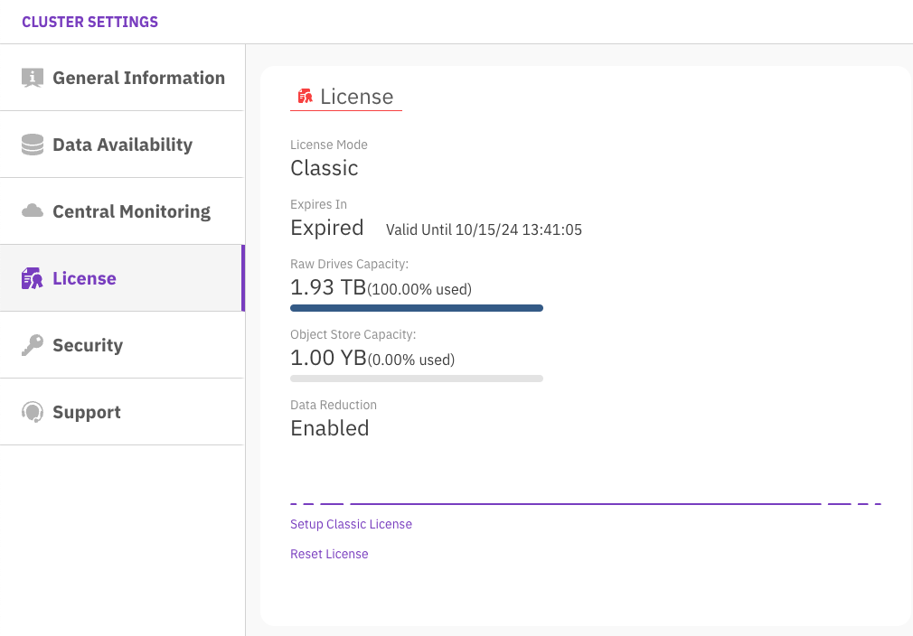

# License overview

A license is a legal instrument that defines the usage terms of the WEKA cluster. When applied, the cluster verifies the license’s validity by comparing its terms with actual cluster usage. Only one license can be active on a cluster at a time; applying a new license replaces the existing one.

The license terms include the following properties:

* Cluster GUID that is created during the installation
* Expiry date (usage period)
* Raw or usable hot-tier (SSD) capacity
* Object store capacity
* Data Efficiency Option (DEO) license (if provided)

## Display the license status using the GUI

The WEKA cluster license page displays the license properties: license mode, expiry date, raw or usable drive capacity, and object store capacity.


The Pay As You Go (PAYG) license was deprecated in version 4.1 and is no longer available to new customers. However, the term _Classic License_ remains for backward compatibility.


**Procedure**

1. From the menu, select **Configure > Cluster Settings**.
2. From the Cluster Settings pane, select **License**.

<div data-with-frame="true"></div>

## Display the license status using the CLI

You can display the license status using one of the following commands:

* `weka cluster license`: Displays the license properties.
* `weka status`: Displays the weka status, license status, and expiry date.
* `weka alerts`: If no license is assigned to the cluster, the command displays a relevant alert.

**Example: License status using the `weka cluster license` command**

```
# weka cluster license
Licensing status: Classic

Current usage:
    1932 GB raw drive capacity
    963 GB usable capacity
    49 GB object-store capacity
    Disabled data reduction

Installed license:
    Valid from 2023-07-01T08:17:24Z
    Expires at 2023-07-31T08:17:24Z
    1932 GB raw drive capacity
    0 GB usable capacity
    1000000000000000 GB object-store capacity
    Enabled data reduction
    
```

**Example: Display the license status using the `weka status` command**

```
WekaIO v4.2.0 (CLI build 4.2.0)

...
       license: OK, valid thru 2023-07-19T09:22:34Z
...
```

**Example: License status when the cluster does not have a valid license**

```
# weka status
Weka v4.2.0 (CLI build 4.2.0)
...
       license: Unlicensed
...
```

**Example: License status using the `weka alerts` command for a cluster without an assigned license**


```
# weka alerts
...
No License Assigned
This cluster does not have a license assigned, please go to https://get.weka.io to obtain your license
```

