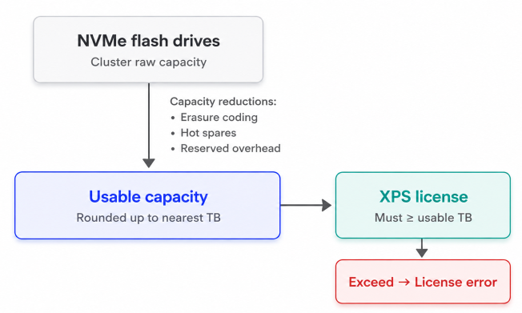
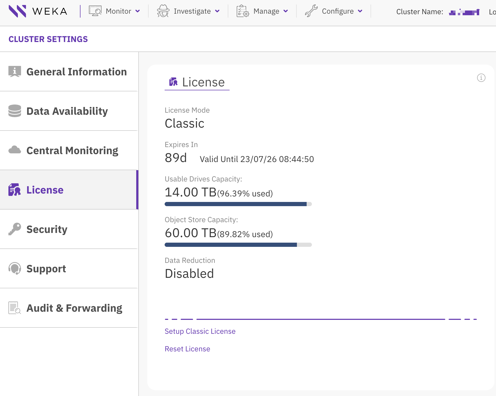

# Licensing overview

Learn how WEKA licenses define cluster usage, capacity limits, and runtime validation. Use this page to understand license types, capacity rules, and status output in the GUI and CLI.

Apply these licensing rules:

* Only one license can be active on a cluster at a time.
* Applying a new license replaces the existing one.
* Licenses are subscription-based rather than perpetual.
* A valid license is required to start a newly configured cluster.
* A classic license is a text-based file generated through get.weka.io for a specific cluster.

## License types

WEKA uses a modular licensing model where specific editions serve as the foundation, while add-ons provide supplemental functionality.

| License | Full name | Type | Description |
| --- | --- | --- | --- |
| XPS | Extreme Performance and Scale Performance Edition | Core | Flash-tier license for on-premises environments that includes POSIX, S3, SMB, NFS, and GDS protocol support. Includes local snapshot capability. |
| XCL | Extreme Performance and Scale Hybrid Cloud Edition | Core | Flash-tier license for hybrid cloud environments that includes POSIX, S3, SMB, NFS, and GDS protocol support. Includes local snapshot capability and local Snap-To-Object capability for one local object store repository. |
| DPO | WEKA Data Protection Option | Add-on | Add-on data protection license for XPS and XOS deployments. Includes tiering, local and remote Snap-To-Object, and synchronous snapshots. |
| XOS | Extreme Performance Object Edition | Standalone / Add-on | Use XOS as an alternative to XPS if the cluster operates exclusively as an S3 target. Use XOS with DPO if the cluster also needs to offload snapshots to a third-party object store. Includes local snapshot capability. |
| DEO | Data Efficiency Option | Add-on | Add-on data efficiency license for XPS deployments. Enables cluster-wide data reduction on a per-filesystem basis. |

## License properties

Identify the key attributes and capacity limits defined within each license.

| Property | Description |
| --- | --- |
| **Cluster GUID** | Unique identifier assigned during cluster installation. |
| **Expiry date** | End of the licensed usage period. |
| **Usable capacity** | Licensed usable flash capacity in TB. |
| **Object-store capacity** | Licensed object-store capacity for DPO license. |
| **Data Efficiency Option** | Shows whether the DEO license is enabled or disabled. |

## XPS, XCL and XOS capacity

The license size in TB must equal or exceed the total usable capacity of all NVMe flash drives in the cluster, rounded up to the nearest TB. Usable capacity is the space available for filesystems after accounting for erasure encoding, hot spares, and reserved overhead.

Consumption changes when adding or removing NVMe drives or virtual hot spares. If the usable capacity rounded up to the nearest TB exceeds the license value, the cluster reports a license conflict.

<div data-with-frame="true"><figure><figcaption><p>XPS capacity calculation example</p></figcaption></figure></div>

## DPO capacity

The DPO license size must equal or exceed the total object-store capacity consumed across all tiered filesystems.

Use the following formula to determine consumption for a tiered filesystem:

$$DPO\ consumption = Total\ filesystem\ capacity - Allocated\ NVMe\ drive\ capacity$$

Apply these DPO rules:

* If both DPO and XOS licenses are active, the total licensed object-store capacity is the sum of both. For example, 4 TB DPO and 1 TB XOS provide 5 TB of total object-store capacity.
* As a best practice, keep the DPO license size no greater than four times the XPS license size.
* DPO consumption changes when you increase or decrease the total capacity or allocated NVMe capacity of a tiered filesystem.

**Example:** A tiered filesystem with a total capacity of 1,000 TB and 200 TB of allocated NVMe capacity consumes an 800 TB DPO license.

$$
DPO\ consumption = 1,000~\text{TB} - 200~\text{TB} = 800~\text{TB}
$$

## XOS license

XOS capacity is calculated identically to XPS. The license size must equal or exceed the total usable capacity of all NVMe flash drives in the cluster, rounded up to the nearest TB.

Use XOS as an alternative license if the cluster operates exclusively as an S3 target. Use XOS with DPO if the cluster also needs to offload snapshots to a third-party object store.

**Related topics**

* [Apply a classic license](classic-licensing.md)
* [Filesystems, object stores, and filesystem groups](../weka-system-overview/filesystems-object-stores-and-filesystem-groups/#data-reduction-in-weka-filesystems)
* [Cluster and filesystem capacity counter definitions](../weka-system-overview/filesystems-object-stores-and-filesystem-groups/cluster-and-filesystem-capacity-counter-definitions.md)

## Display the license status

Check license status after you apply, update, or troubleshoot a license.

### Using the GUI

The **License** page in **Cluster Settings** displays the current license details, including the license mode, expiry date, usable capacity, object-store capacity, and data reduction status.

**To display the license status:**

1. From the menu, select **Configure > Cluster Settings**.
2. From the **Cluster Settings** pane, select **License**.

<div data-with-frame="true"><figure><figcaption><p>Cluster license settings</p></figcaption></figure></div>

### Using the CLI

Display the license status using one of the following commands:

* `weka cluster license`: Displays current license properties.
* `weka status`: Displays cluster status, license state, and expiry date.
* `weka alerts`: Displays relevant license alerts.

**Example: License status using `weka cluster license`**

```bash
# weka cluster license
Licensing status: Classic

Current usage:
    29999 GB raw drive capacity
    13494 GB usable capacity
    6000 GB object-store capacity
    Disabled data reduction

Installed license:
    Valid from 2026-04-23T22:49:40Z
    Expires at 2026-07-22T22:44:50Z
    0 GB raw drive capacity
    14000 GB usable capacity
    60000 GB object-store capacity
    Disabled data reduction
```


The raw drive capacity field is displayed for informational purposes. License validation is based on usable capacity only.


**Example: License status using `weka status`**

```bash
# weka status
WekaIO v5.1.0 (CLI build 5.1.0)
...
license: OK, valid thru 2027-03-19T09:22:34Z
...
```

**Example: License status when the cluster has no valid license**

```bash
# weka status
WekaIO v5.1.0 (CLI build 5.1.0)
...
license: Unlicensed
...
```

#### Common alert examples

**Example: License alert when no license is assigned**

```bash
# weka alerts
...
No License Assigned
This cluster does not have a license assigned, please go to
https://get.weka.io to obtain your license
```

**Example: License alert when insufficient XPS license is assigned**


```bash
# weka alerts
...
A license conflict exists
There is a conflict between your deployed cluster and license:
Cluster is licensed for 10000 GB of usable capacity but 13494 GB are in use.
Ensure the cluster uses the correct license, the license has not expired, and the allocated space does not exceed the license limits.
```


**Example: License alert when insufficient DPO license is assigned**

```bash
# weka alerts
...
A license conflict exists
There is a conflict between your deployed cluster and license
Cluster is licensed for 60000 GB of object-store capacity but 78000 GB are in use
```
