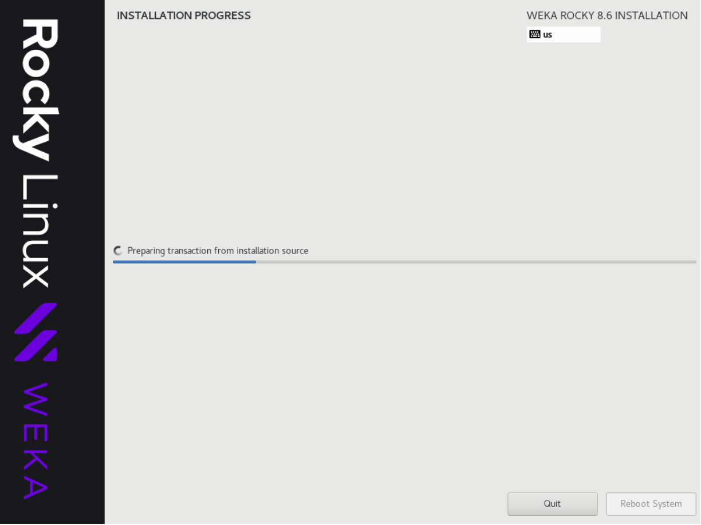
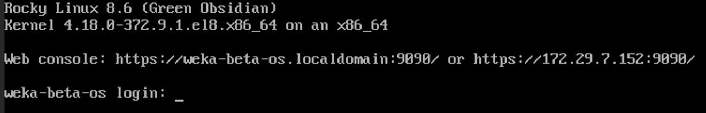
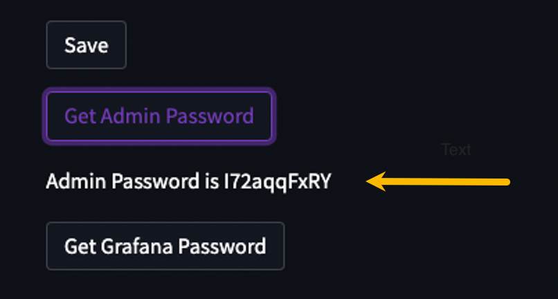
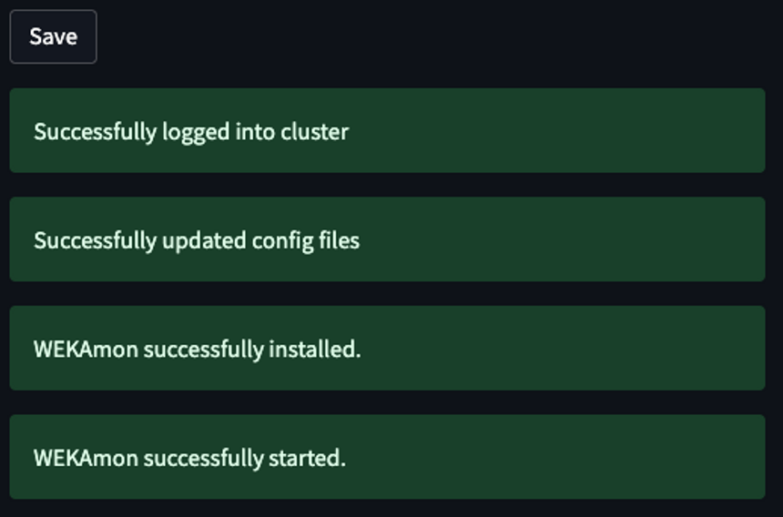

# Deploy monitoring tools using the WEKA Management Station (WMS)

The WEKA Management Station (WMS) is an installation kit similar to an OS installation disk that simplifies the installation and configuration of the Local WEKA Home (LWH), WEKAmon, and SnapTool in an on-premises environment. The WMS installs the WEKA OS, drivers, and WEKA software automatically and unattended.

The WMS can also install a WEKA cluster by deploying the WEKA Software Appliance (WSA) package on bare metal servers.

<figure><figcaption><p>WEKA Management Station deployment</p></figcaption></figure>

See the related topics to learn about the tools installed with the WMS.

**Related topics**

[the-wekaio-support-cloud](the-wekaio-support-cloud/ "mention")

[external-monitoring.md](external-monitoring.md "mention")

[snapshot-management.md](snapshot-management.md "mention")

[bare-metal](../install/bare-metal/ "mention")

## WMS deployment prerequisites

The server or VM must meet the following requirements:

* **Boot drives:** One or two identical boot drives as an installation target.
  * A system with two identical boot drives has the OS installed on mirrored partitions (LVM).
  * A system with one drive has a simple partition.
* **Minimum boot drive capacity:**
  * If not configuring LWH: SSD 125 GiB.
  * If configuring LWH: See the SSD-backed storage requirements section in [#1.-verify-prerequisites](the-wekaio-support-cloud/local-weka-home-deployment.md#1.-verify-prerequisites "mention").
* **Boot type:** UEFI boot (BIOS boot is also supported but deprecated).
* **Cores and RAM:**
  * If not configuring LWH: minimum 4 cores and 16 GiB.
  * If configuring LWH, see the Server minimum CPU and RAM requirements section in [#1.-verify-prerequisites](the-wekaio-support-cloud/local-weka-home-deployment.md#1.-verify-prerequisites "mention").
* **Network interface:** 1 Gbps.&#x20;
* **Firewall rules:**   The WMS listens on multiple ports depending on which service you are accessing.  See [#required-ports](../support/prerequisites-and-compatibility.md#required-ports "mention")


This workflow only applies to installation on a server or VM. It does not apply to installation on AWS. To install on AWS, contact the Customer Success Team.


## Before you begin

Before deploying the WMS, adhere to the following:

* The root password is `WekaService`
* The WEKA user password is `weka.io123`
* If errors occur during installation and the installation halts (no error messages appear), use the system console to review the logs in `/tmp`. The primary log is `/tmp/ks-pre.log`.
* To get a command prompt from the Installation GUI, do one of the following:
  * On macOS, type **ctrl+option+f2**&#x20;
  * On Windows, type **ctrl+alt+f2**.
* Creating a unique local username dedicated to WMS with a ClusterAdmin or OrgAdmin role is highly recommended. The unique username is displayed in the event logs, making identifying and troubleshooting issues easier.\
  To create a local user, see the [Create local users](../usage/user-management/user-management.md#create-a-local-user) topic.

## &#x20;WMS deployment workflow

1. [Install the WMS](deploy-monitoring-tools-using-the-weka-management-station-wms.md#install-the-wms).
2. [Configure the WMS](deploy-monitoring-tools-using-the-weka-management-station-wms.md#configure-the-wms).
3. [Change password](deploy-monitoring-tools-using-the-weka-management-station-wms.md#change-password).
4. [Configure the email notifications](deploy-monitoring-tools-using-the-weka-management-station-wms.md#configure-the-email-notifications).
5. [Install and configure the LWH](deploy-monitoring-tools-using-the-weka-management-station-wms.md#install-and-configure-the-lwh).
6. [Configure the WEKAmon](deploy-monitoring-tools-using-the-weka-management-station-wms.md#configure-the-wekamon).
7. [Edit the hosts file](deploy-monitoring-tools-using-the-weka-management-station-wms.md#edit-the-hosts-file).
8. [Configure the Snaptool](deploy-monitoring-tools-using-the-weka-management-station-wms.md#configure-the-snaptool).
9. [Download logs](deploy-monitoring-tools-using-the-weka-management-station-wms.md#download-logs).

### Install the WMS

**Procedure**

1. Download the latest WMS image from [get.weka.io](https://get.weka.io/) (requires sign-in).
2. Boot the server from the WMS image. \
   The following are some options to do that:



Copy the WEKA Management Station ISO image to an appropriate location so the server’s BMC (Baseboard Management Controller) can mount it or be served through a PXE (Preboot Execution Environment).



Depending on the server manufacturer, consult the documentation for the server’s BMC (for example, iLO, iDRAC, and IPMI) for detailed instructions on mounting and booting from a bootable ISO image, such as:

* A workstation or laptop sent to the BMC through the web browser.
* Ann SMB share in a Windows server or a Samba server.
* An NFS share.&#x20;



To use PXE boot, use the WEKA Management Station as any other Operating System ISO image and configure accordingly.



Burn the WMS image to a DVD and boot it from the physical DVD. However, most modern servers do not have DVD readers anymore.



A bootable USB drive should work (follow online directions for creating a bootable USB drive) but has not been tested yet.



Once you boot the server, the WEKA Management Station installs the WEKA OS (Rocky Linux), drivers, and WEKA software automatically and unattended (no human interaction required).

Depending on network speed, this can take about 10-60 mins (or more) per server.

<figure><figcaption><p>WMS installation progress</p></figcaption></figure>

### Configure the WMS

Once the WMS installation is complete and rebooted, configure the WMS.

**Procedure**

1. Run the OS using one of the following options:



Run the OS through the BMC’s Console. See the specific manufacturer’s BMC documentation.



Run the OS through the Cockpit Web Interface on port 9090 of the OS management network.

If you don’t know the WMS hostname or IP address, go to the console and press the **Return** key a couple of times until it prompts the URL of the WMS OS Web Console (Cockpit) on port 9090.

Change the port from 9090 to 8501, which is the WMS Admin port.

<figure><figcaption><p>Cockpit URL (IP address of this WMS is 172.29.7.152)</p></figcaption></figure>



2. Browse to the WMS Admin UI using the following URL:\
   `https://<WMS-hostname-or-ip>:8501`

<figure><figcaption><p>WMS Landing Page: Login</p></figcaption></figure>

3. If you have created a local username dedicated to WMS, as recommended, enter its credentials. Otherwise, enter the default username and password _admin_/_admin_. Then, select **Login**.\
   The Landing Page appears.

<figure><figcaption><p>WMS Landing Page</p></figcaption></figure>

### Change password

The default password is _admin_. It is recommended to change it for security reasons.

**Procedure**

1. From the left pane, select **Change Password**.
2. Provide your current password, choose a new password, confirm the new password, and click **Reset**.

<figure><figcaption><p>Change Password</p></figcaption></figure>

### Configure the email notifications

Set up email notifications by configuring the SMTP Relay to enable WMS for sending notifications related to:

* **LWH alerts and events:** The LWH sends email alerts and events notifications.
* **WEKAmon quota notifications:** The WEKAmon Alert Manager sends email alerts when a user reaches the soft quota limit.

**Procedure**

1. From the left pane, select **Email Notification Settings**.
2. Set the required details:
   * **Email From Name:** The designated name for the sender of WMS emails.
   * **Email From Address:** The email address used for outgoing emails from WMS.
   * **Email Relay Host:** The smart host or upstream SMTP Relay address WMS uses for sending emails.
   * **Email Relay Port:** The port number used on the SMTP Relay. Typically set to 25, 465, 587, or 2525.
   * **SMTP Relay allows/requires TLS:** Select if the SMTP Relay uses TLS encryption.
   * **Email Relay Username:** Enter the username for logging into the SMTP Relay, if necessary.
   * **Email Relay Password:** Enter the password for logging into the SMTP Relay, if necessary.
   * **Allow Insecure TLS with SMTP Relay:** Enable TLS for an SMTP Relay with a self-signed certificate.
3. Select **Save**.

<figure><figcaption><p>WMS Email Notification Settings</p></figcaption></figure>

### Install and configure the LWH

**Procedure**

1. From the left pane, select **Configure Local WEKA Home**.
2. Set the required details:&#x20;
   * **Listen Address/Domain:** Specify the address or hostname on which LWH will listen. Leave it blank or use 0.0.0.0 to listen on all interfaces. Alternatively, input an IP address, hostname, or FQDN as the TLS certificate requires.
   * **Email Alert Domain Name (REQUIRED):** Enter a domain name (or IP address) for Alert Email URL links. For instance, if you input _sample.com_, the links appear as _https://sample.com/something_. Typically, this is the domain you use to access WMS (this server's name).
   * **Enable Ingress TLS:** Toggle to enable TLS for all connections.
   * **TLS Cert:** Specify the TLS certificate to be used.
   * **TLS Key:** Enter the TLS key corresponding to the specified certificate above.
   * **Enable email notifications (configure in the Email Notification Setting page):** Activate email notifications and set up your email server configurations in the Email Notification Settings page.
   * **Enable forwarding data to Cloud WEKA Home:** Activate this feature to send data to Cloud WEKA Home. Internet connectivity to api.home.weka.io is required for this functionality. The default setting is activated.

<figure><figcaption><p>Local WEKA Home configuration (post Installation example)</p></figcaption></figure>

3. Select **Save**.\
   The WMS saves the configuration and installs the Minikube and LWH. This process can take several minutes. When the process completes, the following appears:

<figure><figcaption><p>LWH installation is complete</p></figcaption></figure>

4. Retrieve the LWH Admin and Grafana passwords as follows:
   * Select **Get Admin Password**. The password appears below the button.
   * Select **Get Grafana Password**. The password appears below the button. This password only applies to the Grafana instance within LWH (not related to the Grafana instance of the WEKAmon).

<figure><figcaption><p>Admin password</p></figcaption></figure>

4. Register the cluster with the LWH.
   * Choose one of the backend servers in your cluster to run the command.
   *   Run the appropriate command based on your TLS configuration. If TLS is configured, use the following command with the WMS server IP or hostname:

       
       ```bash
       weka cloud enable --cloud-url https://<WMS server IP or hostname>
       ```
       

       If TLS is not configured, use the following command with the WMS server IP or hostname:

       
       ```bash
       weka cloud enable --cloud-url http://<WMS server IP or hostname>
       ```
       

       Ensure that the provided WMS server IP or hostname matches the WMS instance information.


The WMS can have multiple IP interfaces, such as when installed as a jump host with distinct interfaces for the corporate network and the cluster network. In scenarios where the cluster is isolated from the corporate network, it is essential to specify the IP address of the WMS associated with the cluster network. &#x20;


5. Log in to the LWH.\
   On the Landing Page, select **Open Local WEKA Home in new tab**.  \
   When prompted for a password, enter the Admin password retrieved in the previous steps.\
   The **LWH Cluster Overview** page appears.

<figure><figcaption><p>Open Local WEKA Home in a new tab</p></figcaption></figure>


**Reconfiguring LWH:** If required, return to the LWH configuration page, update the configuration, and select **Save** again. The LWH configuration will be updated and restarted. &#x20;


### Configure the WEKAmon

**Procedure**

1. From the left pane, select **Configure WEKAmon**.

<figure><figcaption><p>WEKAmon Services Configuration</p></figcaption></figure>

2. Select the services you want to enable. Possible options:
   * **Enable Metrics Exporter & Grafana:** Select to activate metrics exporter and Grafana integration to visualize and analyze performance metrics seamlessly.
   * **Enable Quota Exporter & Notifications:** Select to enable the WEKAmon to send notifications for soft storage quotas.
   * **Enable Snaptool:** Select to activate the snapshots manager, facilitating scheduled snapshots and automated operations.
   * **Enable WEKAmon Log Storage:** Select this option to enable long-term event storage within WEKAmon.


To set the quota limits, see [quota-management](../fs/quota-management/ "mention").


3. Set the hostname or public IP address, username, and password of the cluster to monitor (it can be a backend server of the cluster). Then, select **Save**.


If DNS does not have the hostnames of the cluster, do one of the following:

* Edit the /etc/hosts file before trying again. See [Edit the hosts file](deploy-monitoring-tools-using-the-weka-management-station-wms.md#edit-the-hosts-file).
* Use the Cockpit Web Interface on port 9090 to change the DNS settings. See Cockpit Web Interface in [Configure the WMS](deploy-monitoring-tools-using-the-weka-management-station-wms.md#configure-the-wms).


Once the WMS successfully logs in to the cluster, the WEKAmon installation begins. When the WEKAmon installation is completed, you can open it from the WMS Landing Page.

<figure><figcaption><p>WEKAmon installation completes</p></figcaption></figure>

#### Open Grafana

1. From the Landing Page, select **Grafana**.
2. For username and password, use `admin/admin` (not the username/password that was retrieved for LWH.)

### Edit the hosts file

If the WEKA cluster servers are not resolvable with a DNS, resolve the server names and associate them with the relevant IP addresses accessible to the WMS in the `/etc/hosts` file.

The WMS provides a simple text editor to facilitate editing the `/etc/hosts` file.

<figure><figcaption><p>Edit /etc/hosts</p></figcaption></figure>

**Procedure**

1. From the left pane, select **Edit Hosts File**.
2. Add the IP addresses of the cluster servers. Type, copy, and paste as in any other simple text editor.&#x20;
3. Select **Save**.

### Configure the Snaptool

Snaptool is pre-installed in the `/opt/snaptool` directory and includes all the containers, so there is no need to download anything. Only configuration is required.

**Procedure**

1. From the left pane, select **Snaptool Configuration**.
2. In the Snaptool Configuration Editor, if required, you can update the configuration. For details, see [#edit-the-configuration-in-the-snaptool.yml-file](snapshot-management.md#edit-the-configuration-in-the-snaptool.yml-file "mention").\
   Snaptool shares the same cluster login information as WEKAmon and automatically detects and re-loads its configuration when any changes are made.
3. Select **Save**.&#x20;

<figure><figcaption><p>Snaptool Configuration</p></figcaption></figure>

### Download diagnostics logs

If errors occur during the WMS installation, download the diagnostics logs and send them to the Customer Success Team.

**Procedure**

1. From the left pane, select **Download Logs**.
2. Select **Gather Logs** to collect the logs.
3. Once finished, select **Download Logs** to save a local copy of the diagnostics tarball on your workstation.

<figure><figcaption><p>Download Logs</p></figcaption></figure>

4. Share the downloaded files with the Customer Success Team.

<figure><figcaption><p>Downloaded logs example</p></figcaption></figure>
