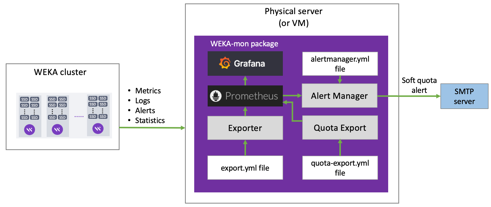

# Set up WEKAmon for external monitoring

WEKAmon is an external monitoring package integrating Grafana[^1] and Prometheus[^2] to provide a centralized metrics, logs, alerts, and statistics dashboard.

WEKAmon integrates the following components to pprocide a unified dashboard for metrics, logs, alerts, and statistics:

* **Exporter**: Collects data from the WEKA cluster and sends it to Prometheus.
* **Quota Export**: Manages storage quotas and exports quota data to Prometheus.
* **Alert Manager**: Sends alerts via SMTP when users approach soft quota limits.

WEKAmon operates independently of the built-in monitoring of the WEKA GUI.

<div data-with-frame="true"><figure><figcaption><p>WEKAmon setup</p></figcaption></figure></div>

You can deploy WEKAmon in one of two ways:

* Full WEKAmon stack deployment.
* Exporter-only integration into an existing Grafana and Prometheus environment to visualize all monitoring data on a unified dashboard.

<div data-with-frame="true"></div>


If you have deployed the WMS, follow the procedure in: [Broken link](/broken/pages/oN2CN5R7Ygi54qAFZ6Uc "mention"). Otherwise, continue with this workflow.


## Deploy full WEKAmon stack (Docker Compose)

Use this option when you do not already operate Grafana and Prometheus.

**Before you begin**

Setting up a dedicated physical server (or VM) for the installation is recommended.

Server minimum requirements:

* 4 CPU cores
* 16 GB RAM
* 50 GB /
* 50 GB /opt
* 1 Gbps network
* Docker CE
* Docker Compose (or docker-compose-plugin)

For instructions on the Docker installation, see the [Docker website](https://www.docker.com/get-started).

### Workflow: Install the WEKAmon package

1. Obtain WEKAmon package
2. Configure authentication
3. Run install script
4. Configure export.yml
5. Configure quota-export.yml (optional)
6. Start Docker containers
7. Validate deployment

#### 1. Obtain WEKAmon package

Install under `/opt` (recommended):

```bash
cd /opt
git clone https://github.com/weka/weka-mon
cd /opt/weka-mon
```

Alternatively, download the [latest release](https://github.com/weka/weka-mon/releases) from GitHub and extract into `/opt`.

#### 2. Configure authentication

Authentication requires a WEKA cluster user and token.

**On a WEKA cluster server**

Perform the following steps on an **existing host with access to the WEKA CLI**, for example, on a WEKA backend server.

1. Create a unique local username (for example, `wekamon`) for WEKAmon. The unique username is displayed in the event logs, making identification and troubleshooting easier. Then, assign the appropriate role based on your use case:
   * **ReadOnly**: Sufficient for standard monitoring use cases, including statistics collection, filesystem allocation and usage reporting, events, and alerts. Use this role if WEKAmon is deployed for read-only observability or billing purposes. \
     Example: `weka user add wekamon readonly`
   * **ClusterAdmin or TenantAdmin**: Required only if your WEKAmon deployment performs management actions, such as muting or unmuting alerts or resetting statistics retention. Example: `weka user add wekamon clusteradmin`
2. Generate an authentication token for the user:

```bash
weka user login wekamon --path wekamon-authtoken.json
```

3. Transfer the `wekamon-authtoken.json` file to the WEKAmon server.
4. Remove the token locally:

```bash
rm wekamon-authtoken.json
```

**On a** **WEKAmon server**

1. Ensure the user running the WEKAmon container can read the authentication token file (`/weka/.weka/auth-token.json`). If the container operates with restricted permissions, adjust the file permissions accordingly. Typically, you can determine the container's user using `docker inspect`.
2. Create a directory for the authentication token:

```bash
mkdir /opt/weka-mon/.weka
```

3. Move the authentication token into the new directory:

```bash
mv ~/wekamon-authtoken.json /opt/weka-mon/.weka/auth-token.json
```

4. Ensure appropriate ownership and permissions are set:

```bash
chown root:root /opt/weka-mon/.weka/auth-token.json
chmod 400 /opt/weka-mon/.weka/auth-token.json
```

**Related topics**

[#create-a-local-user](../operation-guide/user-management/user-management.md#create-a-local-user "mention")

[obtain-authentication-tokens.md](../security/obtain-authentication-tokens.md "mention")

#### 3. Run installation script

```bash
cd /opt/weka-mon
./install.sh
```

This script creates required directories and permissions.

#### 4. Configure export.yml

The WEKAmon and exporter configuration are defined in the `export.yml` file.

1. Change directory to `/opt/weka-mon` and open the `export.yml` file.
2. In the **cluster** section under the **hosts** list, replace the hostnames with the actual hostnames/IP addresses of the WEKA containers (up to three). Ensure the hostnames are mapped to the IP addresses in `/etc/hosts`.

```yaml
hosts:
 - hostname01 
 - hostname02
 - hostname03
```

3. Optional. In the **exporter** section, customize the values according to your preferences. For details, see the [Exporter configuration options](external-monitoring.md#exporter-configuration-options-in-the-export.yml-file) topic below.
4. Optional. Add custom panels to Grafana containing other metrics.

All other settings in the `export.yml` file have pre-defined defaults that do not need modification to work with WEKAmon. All the configurable items are defined but marked as comments by an asterisk (#).

To add custom panels to Grafana containing other metrics from the cluster, you can remove the asterisk from the required metrics (uncomment).

**Example:** In the following snippet of the `export.yml`, to enable getting the FILEATOMICOPEN\_OPS statistic, remove the `#` character at the beginning of the line.

If the statistic you want to get is in a Category that is commented out, also uncomment the Category line (the first line in the example). Conversely, insert the # character at the beginning of the line to stop getting a statistic.

```
 'ops_driver':     # Category
   'DIRECT_READ_SIZES':  'sizes'
   'DIRECT_WRITE_SIZES':  'sizes'
#   'FILEATOMICOPEN_LATENCY':  'microsecs'
#   'FILEATOMICOPEN_OPS':  'ops'
```

#### 5. Configure quota-export.yml (optional)

This step is required if monitoring filesystem quotas.

1. Edit:

```
/opt/weka-mon/quota-export.yml
```

2. Ensure hosts match `export.yml`.


The configuration of the Alert Manager is defined in the `alertmanager.yml` file found in the `etc_alertmanager` directory. It contains details about the SMTP server, user email addresses, quotas, and alert rules. To set this file, contact the [Customer Success Team](../support/getting-support-for-your-weka-system.md#contact-customer-success-team).


#### 6. Start the docker-compose containers

1. Run the following command:

```bash
docker compose up -d
```

* For older Docker versions:

```bash
docker-compose up -d
```

2. Verify containers:

```bash
docker ps
```

Expected containers:

* grafana
* prometheus
* loki
* export
* quota-export (optional)
* alertmanager

Example output:

```bash
CONTAINER ID   IMAGE                               COMMAND                  CREATED          STATUS            PORTS                                       NAMES
ec1d2584acab   grafana/loki:2.3.0                  "/usr/bin/loki -conf…"   20 minutes ago   Up 20 minutes     0.0.0.0:3100->3100/tcp, :::3100->3100/tcp   weka-mon_loki_1
4645533501f0   grafana/grafana:latest              "/run.sh"                20 minutes ago   Up 20 minutes     0.0.0.0:3000->3000/tcp, :::3000->3000/tcp   weka-mon_grafana_1
d930e903b74e   wekasolutions/export:latest         "/weka/export -v"        20 minutes ago   Up 7 minutes      0.0.0.0:8001->8001/tcp, :::8001->8001/tcp   weka-mon_export_1
dc5f9f710997   wekasolutions/quota-export:latest   "/weka/quota-export"     20 minutes ago   Up 7 minutes      0.0.0.0:8101->8101/tcp, :::8101->8101/tcp   weka-mon_quota-export_1
17689ac9377d   prom/prometheus:latest              "/bin/prometheus --s…"   20 minutes ago   Up 20 minutes     0.0.0.0:9090->9090/tcp, :::9090->9090/tcp   weka-mon_prometheus_1
```

If the status of the containers is not up, check the logs and troubleshoot accordingly. To check the logs, run the following command:

```bash
docker logs <container id>
```

#### 7. Validate deployment

Access Grafana:

```bash
http://<server-ip>:3000
```

`<server-ip>`: the physical server running the docker containers.

Default credentials: `admin/admin`.

## Integrate exporter with existing Grafana and Prometheus

Use this option if Grafana and Prometheus are already deployed in your environment.

Only the exporter (and optionally quota-export) must be deployed.

**Before you begin**

Ensure:

* Prometheus is operational
* Grafana is operational
* Exporter host can reach:
  * WEKA cluster API
  * Prometheus server
* Port 8001 (exporter) is available
* Authentication token exists (`~/.weka/`)

**Procedure**

1. **Obtain dashboard files from the WEKAmon package:** `weka-mon/var_lib_grafana/dashboards`.
2. **Import dashboards into Grafana:**
   1. Open Grafana UI.
   2. Navigate to **Dashboards > Import**.
   3. Upload JSON files.
   4. Select the existing Prometheus data source. (For details, see [Import Dashboard](https://grafana.com/docs/grafana/v9.0/dashboards/export-import/#importing-a-dashboard) in the Grafana documentation.)
3. **Configure exporter files:** Edit the `export.yml` file and `quota-export.yaml` file (if monitoring filesystem quota).
   * Cluster API endpoints.
   * Authentication file location
   * Organization details
   * Optional performance tuning
4. **Deploy exporter:** Based on your environment requirements, you can deploy using:
   * Option 1: Docker container
   * Option 2: Compiled binary
   * Option 3: Python script

**Option 1: Docker (recommended)**

1. Pull container:

```bash
docker pull wekasolutions/export
```

2. Run exporter:

```bash
docker run -d \
  --network=host \
  --mount type=bind,source=/root/.weka/,target=/weka/.weka/ \
  --mount type=bind,source=/dev/log,target=/dev/log \
  --mount type=bind,source=/etc/hosts,target=/etc/hosts \
  --mount type=bind,source=$PWD/export.yml,target=/weka/export.yml \
  wekasolutions/export -v
```

3. If monitoring filesystem quotas:

<pre class="language-bash"><code class="lang-bash">docker pull wekasolutions/quota-export
docker run -d \
<strong>  --network=host \
</strong>  --mount type=bind,source=/root/.weka/,target=/weka/.weka/ \
  --mount type=bind,source=/dev/log,target=/dev/log \
  --mount type=bind,source=/etc/hosts,target=/etc/hosts \
  --mount type=bind,source=$PWD/quota-export.yml,target=/weka/quota-export.yml \
  wekasolutions/quota-export -v
</code></pre>


* `--network=host` works only on Linux.
* On macOS/Windows, use `-p` to publish ports.


**Option 2: Compiled binary (if Docker is not available)**

1. Download latest release ([export](https://github.com/weka/export/releases)):

```bash
tar xvf export-<version>.tar
cd export
./export -v
```

2. If monitoring filesystem quotas ([quota-export](https://github.com/weka/export/releases)):

```bash
tar xvf quota-export.tar
cd quota-export
./quota-export -v
```

**Option 3: Run as a Python script**

1. Clone the [export](https://github.com/weka/export/releases) files and run the Python modules:

```bash
git clone https://github.com/weka/export
cd export
pip3 install -r requirements.txt
./export -v
```

2. If monitoring filesystem quotas ([quota-export](https://github.com/weka/export/releases)):

```bash
git clone https://github.com/weka/quota-exporter
cd quota-exporter
pip3 install -r requirements.txt
./quota-export -v
```

#### **Configure Prometheus**

1. Add exporter target to `prometheus.yml`:

<pre class="language-yml"><code class="lang-yml"><strong>...
</strong><strong>## scrape configurations
</strong>scrape_configs:
  - job_name: 'weka-exporter'
    scrape_interval: 60s  # Overriding the global default for this job
    static_configs:
      - targets: ['&#x3C;exporter-host>:8001']
...
</code></pre>

2. If using quota-export, also add:

```yaml
...
## scrape configurations
scrape_configs:
...
   - job_name: 'weka-quota-exporter'
     scrape_interval: 60m
     static_configs:
      - targets: ['<exporter-host>:8101']
...
```

## Exporter configuration reference

### Exporter configuration options in the export.yml file

The **exporter** section defines the program behavior.

```yaml
# exporter section
exporter:
  listen_port: 8150
  events_only: False
  events_to_loki: True
  events_to_syslog: True
  timeout: 10.0
  max_procs: 8
  max_threads_per_proc: 100
  backends_only: True
  datapoints_per_collect: 5
  certfile: null
  keyfile: null
# loki configuration (if enabled)
loki:
  host: localhost
  port: 3100
  protocol: https
  path: /loki/api/v1/push
  user: null
  password: null
  org_id: null
  client_cert: null
  verify_cert: False
```

### **Exporter and loki parameters**

<table><thead><tr><th width="218">Parameter</th><th>Description</th></tr></thead><tbody><tr><td><code>listen_port</code></td><td>Do not change the Prometheus listening port unless the Prometheus configuration is updated.</td></tr><tr><td><code>timeout</code></td><td>Specify the maximum wait time in seconds for an API response. The default value is usually adequate.</td></tr><tr><td><code>backends_only</code></td><td>Run exclusively on WEKA backend servers.</td></tr><tr><td><code>max_procs</code> and <code>max_threads_per_proc</code></td><td><p><strong>Scaling behavior:</strong></p><p>The scaling behavior ensures that if the total number of hosts (servers and clients) exceeds the <code>max_threads_per_proc</code>, the system initiates additional processes as needed.</p><p><strong>Example:</strong></p><p>In a cluster configuration with 80 WEKA servers and 200 compute nodes, totaling 280 hosts, and using a default <code>max_threads_per_proc</code> of 100, it will operate with 3 processes since 280 / 100 approximately equals 3.</p><p><strong>Recommendation:</strong></p><p>For optimal performance, allocate at least 1 core per process. Therefore, for the given example, ensure there are at least 4 available cores on the hosting server or virtual machine.</p></td></tr><tr><td><p><code>loki:</code></p><p><code>host</code></p></td><td>When using the WEKAmon setup, keep the hostname unchanged. If you wish to disable sending events to Loki, leave the field blank.</td></tr><tr><td><p><code>loki:</code></p><p><code>port</code></p></td><td>Don't change the port when using the WEKAmon setup.</td></tr></tbody></table>


In a cluster with 1000 servers, the exporter attempts to allocate one server per thread, ensuring the number of processes does not exceed the `max_procs` parameter. If necessary, it assigns multiple servers to a single thread by doubling or tripling them.



**Scenario:** In a cluster consisting of 3000 hosts with configurations of `max_procs` = 8 and `max_threads_per_proc` = 100, the system is currently running 8 processes. Each process operates with 100 threads, but instead of managing 1 host per thread, each thread is handling nearly 4 hosts.


[^1]: [Grafana](https://grafana.com/) is an open-source analytics and interactive visualization web application used for monitoring application performance. It allows users to ingest data from a wide range of sources, query and display it in customizable charts, set alerts for abnormal behavior, and visualize data on dashboards.

[^2]: [Prometheus](https://prometheus.io/docs/introduction/overview/) is an open-source systems monitoring and alerting toolkit originally built at SoundCloud.
