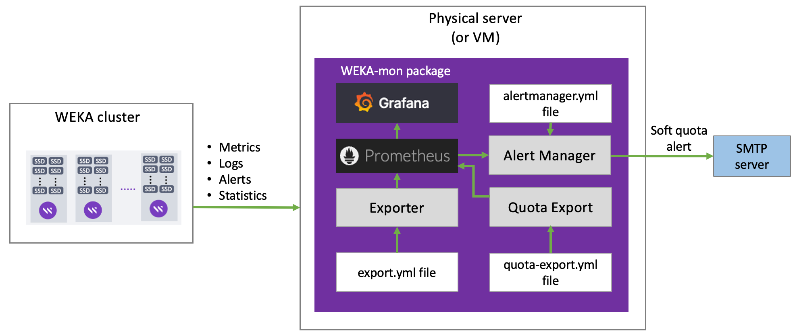

# Set up the WEKAmon external monitoring

WEKA provides an external monitoring package named **WEKAmon**. The package implements the well-known [_Grafana_](https://grafana.com/) dashboard with [_Prometheus_](https://prometheus.io/docs/introduction/overview/), which provides a central monitoring dashboard of metrics, logs, alerts, and statistics with enriched capabilities.

The package also includes the following components:

* **Exporter**: The Exporter gets the data from the WEKA cluster and sends the data to Prometheus.
* **Quota Export**:  The Quota Export manages the quotas and sends the data to Prometheus.
* **Alert Manager**:  The Alert Manger alerts users through an SMTP server when they reach their soft quota limits.

You can set up the WEKAmon package regardless of the data monitoring provided by the Weka GUI.

<figure><figcaption><p>WEKAmon setup</p></figcaption></figure>

One of the advantages of setting up the WEKAmon package is that if you already use the Grafana and Prometheus tools for monitoring other products, you can integrate these tools with WEKA to correlate and display monitoring information from all your products on the same dashboard.

 (1).png>)


If you have deployed the WMS, follow the procedure in:[deploy-monitoring-tools-using-the-weka-management-station-wms.md](deploy-monitoring-tools-using-the-weka-management-station-wms.md "mention"). Otherwise, continue with this workflow.


## Before you begin

Setting up a dedicated physical server (or VM) for the installation is recommended.

### Server minimum requirements

* 4 cores
* 16 GB RAM
* 50 GB / partition (for the root)
* 50 GB /opt/ partition (for WEKAmon installation)
* 1 Gbps network
* _Docker_ is the recommended container for the WEKAmon setup.\
  To use Docker, the following must be installed on the dedicated physical server (or VM):
  * `docker-ce`
  * `docker-compose` or `docker-compose-plugin` depending on the existing operating system.

&#x20;     For the Docker installation instructions, see the [Docker website](https://www.docker.com/get-started).

### Authentication token requirement

To enable communication between the physical server and the WEKA cluster, the security token is required in the **auth-token.json** file.

1. Create the directory `.weka/` in the WEKAmon installation directory.
2. Generate the `auth-token.json` file and save it in the `.weka/` directory you created. See the [Obtain authentication tokens](../operation-guide/security/obtain-authentication-tokens.md) topic.


Creating a unique local username dedicated to SnapTool with a ReadOnly role is highly recommended. The unique username is displayed in the event logs, making the identification and troubleshooting of issues easier.\
To create a local user, see the [Create local users](../operation-guide/user-management/user-management.md#create-a-local-user) topic.


## Workflow: Install the WEKAmon package

1. [Obtain the WEKAmon package](external-monitoring.md#1.-obtain-the-weka-mon-package): Obtain the WEKAmon package from the GitHub repository by downloading or cloning.
2. [Run the install.sh script](external-monitoring.md#2.-run-the-install.sh-script): The script creates a few directories and sets their permissions.
3. [Edit the export.yml file](external-monitoring.md#3.-edit-the-export.yml-file): The `export.yml` file contains the WEKAmon and the exporter configuration. Customize the file according to your actual WEKA deployment.
4. [Edit the quota-export.yml file](external-monitoring.md#4.-edit-the-quota-export.yml-file): The `quota-export.yml` file contains the configuration of the quota-export container. Customize the file according to your actual WEKA deployment.
5. [Start the docker-compose containers](external-monitoring.md#4.-start-the-docker-compose-containers): Once done, you can connect to Grafana on port 3000 of the physical server running the docker containers.&#x20;

### 1. Obtain the WEKAmon package

The WEKAmon package resides on the GitHub repository. Obtain the WEKAmon package using one of the following methods:

* [Download the WEKAmon source code](external-monitoring.md#download-the-wekamon-source-code)&#x20;
* [Clone the repository](external-monitoring.md#clone-the-repository)

#### Download the WEKAmon source code

1. Go to [https://github.com/weka/weka-mon/releases.](https://github.com/weka/weka-mon/releases)
2. On the **latest** release section, select the **Source Code** link to download.
3. Copy the downloaded source code to the dedicated physical server (or VM) and unpack it.

#### Clone the repository

Run the following commands to clone the WEKAmon package from GitHub:

```
git clone https://github.com/weka/weka-mon
cd weka-mon
```

### 2. Run the install.sh script

The `install.sh` script creates a few directories and sets their permissions.

Run the following command:

```
./install.sh
```

### 3. Edit the export.yml file

The WEKAmon and exporter configuration are defined in the `export.yml` file.

1. Change the directory to `weka-mon` and open the `export.yml` file.
2. In the **cluster** section under the **hosts** list, replace the hostnames with the actual hostnames/IP addresses of the Weka containers (up to three would be sufficient). Ensure the hostnames are mapped to the IP addresses in /etc/hosts.

```
hosts:
 - hostname01 
 - hostname02
 - hostname03
```

3. Optional. In the **exporter** section, customize the values according to your preferences. For details, see the [Exporter configuration options](external-monitoring.md#exporter-configuration-options-in-the-export.yml-file) topic below.
4. Optional. Add custom panels to Grafana containing other metrics.

All other settings in the `export.yml` file have pre-defined defaults that do not need modification to work with WEKAmon. All the configurable items are defined but marked as comments by an asterisk (#).

To add custom panels to Grafana containing other metrics from the cluster, you can remove the asterisk from the required metrics (uncomment).

**Example:** In the following snippet of the `export.yml`, to enable getting the FILEATOMICOPEN\_OPS statistic, remove the `#` character at the beginning of the line.

If the statistic you want to get is in a Category that is commented out, also uncomment the Category line (the first line in the example). Conversely, insert the # character at the beginning of the line to stop getting a statistic.

```
 'ops_driver':     # Category
   'DIRECT_READ_SIZES':  'sizes'
   'DIRECT_WRITE_SIZES':  'sizes'
#   'FILEATOMICOPEN_LATENCY':  'microsecs'
#   'FILEATOMICOPEN_OPS':  'ops'
```

### 4. Edit the quota-export.yml file

The WEKAmon deployment includes a dedicated container named **quota-export**. The container includes an Alert Manager that emails users when they reach their soft quota.

The configuration of the quota-export container is defined in the `quota-export.yml` file.

1. Go to the `weka-mon` directory and open the `quota-export.yml` file.
2. Specify the same **hosts** as you specified in the `export.yml file` (see [above](external-monitoring.md#3.-edit-the-export.yml-file)).


The configuration of the Alert Manager is defined in the `alertmanager.yml` file found in the `etc_alertmanager` directory. It contains details about the SMTP server, user email addresses, quotas, and alert rules. To set this file, contact the [Customer Success Team](../support/getting-support-for-your-weka-system.md#contact-customer-success-team).


### 5. Start the docker-compose containers

1. Run the following command:

```
docker-compose up -d
```

2. Verify that the containers are running using the following command:

```
docker ps
```

Example:

```
[root@av0412CL-3 weka-mon] 2022-12-05 17:30:37 $ docker ps
CONTAINER ID   IMAGE                               COMMAND                  CREATED          STATUS            PORTS                                       NAMES
ec1d2584acab   grafana/loki:2.3.0                  "/usr/bin/loki -conf…"   20 minutes ago   Up 20 minutes     0.0.0.0:3100->3100/tcp, :::3100->3100/tcp   weka-mon_loki_1
4645533501f0   grafana/grafana:latest              "/run.sh"                20 minutes ago   Up 20 minutes     0.0.0.0:3000->3000/tcp, :::3000->3000/tcp   weka-mon_grafana_1
d930e903b74e   wekasolutions/export:latest         "/weka/export -v"        20 minutes ago   Up 7 minutes      0.0.0.0:8001->8001/tcp, :::8001->8001/tcp   weka-mon_export_1
dc5f9f710997   wekasolutions/quota-export:latest   "/weka/quota-export"     20 minutes ago   Up 7 minutes      0.0.0.0:8101->8101/tcp, :::8101->8101/tcp   weka-mon_quota-export_1
17689ac9377d   prom/prometheus:latest              "/bin/prometheus --s…"   20 minutes ago   Up 20 minutes     0.0.0.0:9090->9090/tcp, :::9090->9090/tcp   weka-mon_prometheus_1
[root@av0412CL-3 weka-mon] 2022-12-05 17:35:46 $ 
```

If the status of the containers is not up, check the logs and troubleshoot accordingly. To check the logs, run the following command:

```
docker logs <container id>
```

Once all containers run, you can connect to Grafana on port 3000 of the physical server running the docker containers. The default credentials for Grafana are `admin/admin`.

## Integrate with an existing Grafana/Prometheus environment

If you already have Grafana and Prometheus running in your environment, you only need to run the exporter and add it to the Prometheus configuration.

### 1. Obtain the WEKAmon package

Follow the steps in the [1. Obtain the WEKAmon package](external-monitoring.md#1.-obtain-the-wekamon-package) section.

### 2. Import the dashboard JSON files

In the Grafana application, import the dashboard `JSON` files from the directory `weka-mon/var_lib_grafana/dashboards`. For instructions, see the [Import dashboard](https://grafana.com/docs/grafana/v9.0/dashboards/export-import/#importing-a-dashboard) topic in Grafana documentation.

### 3. Edit the export.yml and quota-export.yml files&#x20;

Follow steps [3](external-monitoring.md#3.-edit-the-export.yml-file) and [4](external-monitoring.md#4.-edit-the-quota-export.yml-file) in the above sections.

### 4. Run the exporter

Do one of the following:

* [Run the exporter in the docker container](external-monitoring.md#run-the-exporter-in-the-docker-container) (if you have a docker, this is the simple method).
* [Run the exporter as a compiled binary](external-monitoring.md#run-the-exporter-as-a-compiled-binary) (if you do not have a docker, use this option)
* [Run the exporter as a Python script](external-monitoring.md#run-the-exporter-as-a-python-script) (requires installing a few Python Modules from PyPi).

#### Run the exporter in the docker container

Get and run the container (the `export.yml` configuration file is already edited).

The following example maps the `export.yml` configuration file in several volumes in the container:

* &#x20;`~/.weka directory` to enable the container to read the authentication file.
* `/dev/log` to enable entries in the Syslog.
* `/etc/hosts` to enable the hostname resolution (a DNS can also be used, if exists in the docker environment).

There are more options; you can run the command with`-help` or `-h` for a full description.

```
# get the container from dockerhub:
docker pull wekasolutions/export

# example of how to run the container
docker run -d --network=host \
  --mount type=bind,source=/root/.weka/,target=/weka/.weka/ \
  --mount type=bind,source=/dev/log,target=/dev/log \
  --mount type=bind,source=/etc/hosts,target=/etc/hosts \
  --mount type=bind,source=$PWD/export.yml,target=/weka/export.yml \
  wekasolutions/export -v
```

#### Run the exporter as a compiled binary

1. Go to [https://github.com/weka/export/releases](https://github.com/weka/export/releases) and download the tarball from the latest release.
2. Copy this file to the physical server (or VM).
3. Run the exporter as follows (for the description of the command-line parameters, see the [Exporter section parameters](external-monitoring.md#exporter-section-parameters)):

```
tar xvf export-1.3.0.tar
cd export
./export -v
```

#### Run the exporter as a Python script

1. Do one of the following:
   * Run `git clone https://github.com/weka/export`
   * Go to [https://github.com/weka/export/releases](https://github.com/weka/export/releases) and download the source tarball.
2. Install the required python modules by running the following command:\
   `pip3 install -r requirements.txt`
3. Run the exporter (for the description of the command-line parameters, see the [Exporter section parameters](external-monitoring.md#exporter-section-parameters)):

```
./export -v
```

### Exporter configuration options in the export.yml file

The **exporter** section defines the program behavior.

```
# exporter section
exporter:
  listen_port: 8001
  loki_host: loki
  loki_port: 3100
  timeout: 10.0
  max_procs: 8
  max_threads_per_proc: 100
  backends_only: True
```

#### **Exporter section parameters**

<table><thead><tr><th width="263">Parameter</th><th>Description</th></tr></thead><tbody><tr><td><code>listen_port</code></td><td>The Prometheus listening port. Do not modify this port unless you modify the Prometheus configuration.</td></tr><tr><td><code>loki_host</code> </td><td>If using the Weka-mon setup, do not modify the hostname. Leave blank to disable sending events to Loki.</td></tr><tr><td><code>loki_port</code></td><td>If using the Weka-mon setup, do not modify the port.</td></tr><tr><td><code>timeout</code></td><td>The max time in seconds to wait for an API call to return. The default value is sufficient for most purposes.</td></tr><tr><td><code>max_procs</code> and <code>max_threads_per_proc</code></td><td>Define the scaling behavior. If the number of hosts (servers and clients) exceeds <code>max_threads_per_proc</code>, the exporter runs more processes accordingly.<br><strong>Example:</strong> a cluster with 80 Weka servers and 200 compute nodes (aka clients) has 280 hosts. With the default <code>max_threads_per_proc</code> of 100, it runs 3 processes (280 / 100 ~ 3).<br>It's recommended to have 1 available core per process. In this cluster example, deploy at least 4 available cores on the server/VM.</td></tr><tr><td><code>backends_only</code></td><td>Run only on the Weka backend hosts</td></tr></tbody></table>

The exporter always tries to allocate one host per thread but does not exceed the maximum processes specified in the `max_procs` parameter. In a cluster with 1000 hosts, it doubles or triples up the hosts on the threads.


**Example:**

In a cluster with 3000 hosts, `max_procs` = 8,  and `max_threads_per_proc`= 100, only 8 processes running. Each process with 100 threads, but there are close to 4 hosts serviced per thread instead of the default 1 host.

