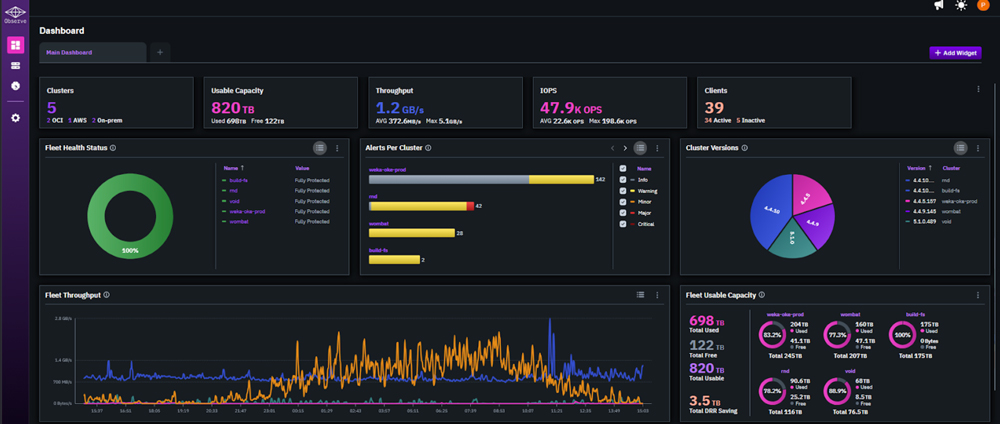

# NeuralMesh Observe overview

NeuralMesh Observe is a SaaS observability platform for the WEKA® products. It provides a single web interface at [observe.weka.io](https://observe.weka.io) to monitor, plan, and troubleshoot your entire WEKA estate across on-premises, public cloud, and NeuralMesh Axon configurations.

<div data-with-frame="true"><figure><figcaption><p>Overview dashboard screen</p></figcaption></figure></div>

## Connectivity and access

* **Native telemetry**: Observe leverages Cloud WEKA Home (CWH) telemetry as its foundation. Each cluster uploads statistics, events, alerts, and usage data in encrypted form.
  * For details on cloud telemetry data and the retention periods, see [#cloud-weka-home-data-collection](../the-wekaio-support-cloud/#cloud-weka-home-data-collection "mention").
* **Zero infrastructure management**: You do not need to deploy or maintain any monitoring infrastructure or local agents.
* **Support portal SSO**: Access is managed through Single Sign-On (SSO) using your [support.weka.io](https://support.weka.io/) credentials.
* **Included service**: Observe is included with your WEKA software at no additional cost.

## Key capabilities

* **Fleet-wide health and capacity monitoring**
  * **Unified dashboards:** View the status of all clusters globally, including those in the cloud and on-premises.
  * **Comprehensive inventory:** Maintain visibility into servers, drives, filesystems, and S3 buckets.
  * **Data retention:** Access up to 12 months of historical data for long-term trend analysis and capacity planning.
* **Advanced performance analytics**
  * **Metric correlation:** Use Hover Sync to align all charts (throughput, latency, IOPS) to the same timestamp for rapid root-cause analysis.
  * **Resource attribution:** Identify specific filesystems or clients consuming system resources.
  * **External integration:** Includes a Prometheus exporter for sharing metrics with third-party tools.
* **Intelligent alerting and diagnostics**
  * **Proactive notifications:** Receive alerts for performance and health events through Slack, PagerDuty, Email, or Webhooks.
  * **Client-level diagnostics:** Troubleshoot connectivity and I/O distribution issues independently at the client layer.
  * **Dedicated cluster views:** Drill down into single-cluster dashboards that maintain the same diagnostic layout as the fleet view.

## Get started

Complete two steps to onboard a cluster to Observe:

1. Enable and verify telemetry on the cluster (one-time setup).
2. Sign in to Observe and confirm visibility.

**Before you begin**

Confirm the following requirements:

* **Minimum cluster version:** WEKA version 4.4.6 or later. Some Observe features require version 5.x.
* **Support portal account:** Each user must have a registered account on support.weka.io.
* **Cloud telemetry enabled:** The cluster must have Cloud WEKA Home telemetry enabled and upload data actively.

**Procedure**

1. **Verify telemetry (one-time):**
   1.  Check the cluster connection status:

       ```bash
       weka cloud status
       ```
   2.  If the cluster is disconnected, enable telemetry upload:

       ```bash
       weka cloud enable
       ```
   3. Allow time for the cluster to upload telemetry to Cloud WEKA Home.
2.  **Access Observe and validate:** Sign in to Observe and confirm that the cluster appears.

    Access Observe: [https://observe.weka.io](https://observe.weka.io/).

    Observe uses Single Sign-On (SSO) with your support.weka.io credentials associated with your organization.

<div data-with-frame="true"><figure><figcaption><p>Sign in to Observe</p></figcaption></figure></div>

Clusters appear only after telemetry data is successfully uploaded to Cloud WEKA Home.

**Related topic**

[Upload information from the WEKA cluster to WEKA Home](../the-wekaio-support-cloud/#upload-information-from-the-weka-cluster-to-weka-home)
