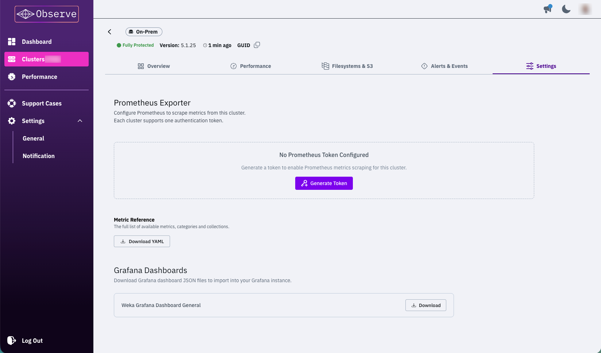
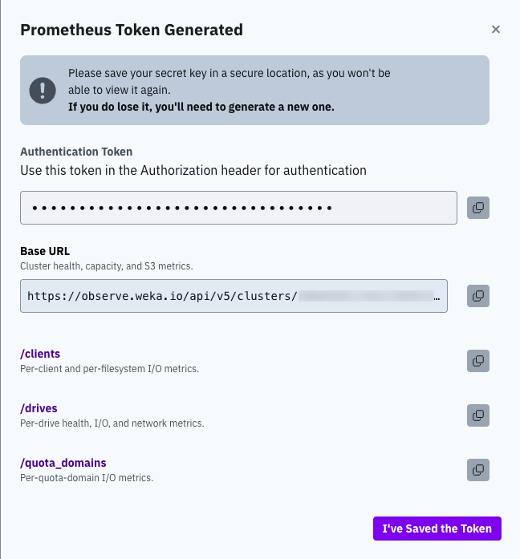

# Export cluster metrics from Observe to Prometheus

## Export cluster metrics from Observe to Prometheus

Observe exposes WEKA cluster metrics directly as Prometheus scrape endpoints. Configure your Prometheus server to scrape these endpoints and get metrics delivered in standard Prometheus format. For access details, see [NeuralMesh Observe overview](https://app.gitbook.com/s/ZW262oqYA8pNNfGvXjHa/monitor-the-weka-cluster/neuralmesh-observe-overview#connectivity-and-access).

Metrics are organized across four endpoints, each covering a distinct area of cluster telemetry. This keeps the cardinality of each individual scrape manageable, rather than one large payload that grows with every drive, client, and filesystem added to the cluster.

Use the exporter to build alerts on cluster health, track I/O performance and latency, monitor drive health, or visualize metrics in Grafana through Prometheus.

### Generate an authentication token

Access to the scrape endpoints is protected by token-based authentication. Each request to an endpoint must include a valid token in the Authorization header. Unauthenticated requests are rejected.

Each cluster has one active token. The token authenticates all four scrape endpoints.

**Before you begin**

* Ensure you have access to the Observe dashboard and the cluster you want to monitor.
* Have a secure password manager or secrets vault ready to store the token. The token is shown only once. If you lose it, you must generate a new one.

**Procedure**

1. In Observe, go to the cluster settings and locate the Prometheus Exporter section.

<div data-with-frame="true"><figure><figcaption></figcaption></figure></div>

2. Select **Generate New Key**.&#x20;
3. Copy the token and all endpoint URLs you intend to scrape using the copy icon next to each. Each endpoint covers a distinct area of cluster telemetry:
   * **Base URL**: cluster health, capacity, and S3 metrics.
   * **/clients**: per-client and per-filesystem I/O metrics.
   * **/drives**: per-drive health, I/O, and network metrics.
   * **/quota\_domains**: per-quota-domain I/O metrics.
4. Select **I've Saved the Token** to close the dialog.

<div data-with-frame="true"><figure><figcaption></figcaption></figure></div>

5. To get the full list of available metrics, categories, and collections, select **Download YAML** under **Metric Reference**.


Each cluster supports one active token. Generating a new token immediately invalidates the previous one. Update your Prometheus configuration with the new token as soon as possible to avoid a gap in metric collection.


### Configure Prometheus

Configure Prometheus to scrape metrics from Observe by adding one scrape job per endpoint. Each job authenticates using a Bearer token and targets the Observe hostname.

**Before you begin**

Obtain the following from the Observe token dialog:

* The authentication token
* The full URL for each endpoint you want to scrape (hostname and path)

**Procedure**

1. Open your Prometheus configuration file.
2. Under `scrape_configs`, add one job block for each endpoint you want to collect.
3. In each job, set the following values:
   * `metrics_path`: the path portion of the endpoint URL copied from the token dialog
   * `targets`: the hostname portion of the URL from the cluster settings
   * `credentials`: your authentication token
4. Save the configuration file and reload Prometheus.

**Example: scrape all four endpoints**


```yaml
...
scrape_configs:

  - job_name: weka_cluster
    metrics_path: <base-url>
    scheme: https
    authorization:
      credentials: <your-token>
    static_configs:
      - targets: ['<observe-host>']

  - job_name: weka_clients
    metrics_path: <base-url>/clients
    scheme: https
    authorization:
      credentials: <your-token>
    static_configs:
      - targets: ['<observe-host>']

  - job_name: weka_drives
    metrics_path: <base-url>/drives
    scheme: https
    authorization:
      credentials: <your-token>
    static_configs:
      - targets: ['<observe-host>']

  - job_name: weka_quota_domains
    metrics_path: <base-url>/quota_domains
    scheme: https
    authorization:
      credentials: <your-token>
    static_configs:
      - targets: ['<observe-host>']
```


Replace the placeholders with your values:

| Placeholder | Value |
| --- | --- |
| `&#x3C;observe-host>` | Hostname from the cluster settings URL |
| `&#x3C;base-url>` | Path portion of the endpoint URL from the token dialog |
| `&#x3C;your-token>` | Authentication token from the token dialog |

### Selective metric collection

Limit the exported metrics for this job. See [Configure selective Prometheus metric collection](https://app.gitbook.com/s/ZW262oqYA8pNNfGvXjHa/monitor-the-weka-cluster/the-wekaio-support-cloud/configure-selective-prometheus-metric-collection).

### Grafana dashboards

Grafana dashboards are available from the Grafana Dashboards section of the Observe **Settings** page. Each dashboard provides a default panel set and imports directly into your Grafana instance.
