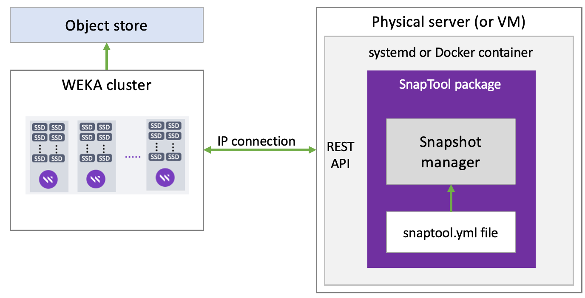

# Set up the SnapTool external snapshots manager

WEKA provides an external snapshots manager named SnapTool, enabling scheduled snapshots for your WEKA cluster.

The SnapTool provides the following features:

* Schedule snapshots monthly, daily, or at multiple (minute granularity) intervals during a daily schedule.
* Set the number of snapshot copies to retain per schedule.
* Delete expired snapshots automatically.
* Upload snapshots to an object store automatically.
* Upload and delete in the background.
* Access a Web Status GUI to view the snapshot schedules, upload and download queue, , locator IDs for successfully uploaded snapshots, and logs. The default URL is `http://<snaptool server hostname/IP>:8090`.

The SnapTool runs on any Linux-based physical server (or VM). All communication with the WEKA cluster is done by an IP connection only to a WEKA host using the WEKA REST API.

The SnapTool package can be installed with a _systemd_ service or _Docker_ container. In both options, you need to edit the configuration in the `snaptool.yml` file before running the installation.

<figure><figcaption><p>SnapTool setup</p></figcaption></figure>


If you have deployed the WMS, follow the procedure in:[deploy-monitoring-tools-using-the-weka-management-station-wms.md](deploy-monitoring-tools-using-the-weka-management-station-wms.md "mention"). Otherwise, continue with this workflow.&#x20;


## Before you begin

If a previous SnapTool version exists in the physical server, make a copy of your existing `snaptool.yml` file.

If the `snaptool.yml` file is from releases before 1.0.0, it is incompatible with 1.0.0 or higher. You need to modify the file to use the new syntax.

Setting up a dedicated physical server (or VM) for the installation is recommended.

### Server minimum requirements

* 2 cores
* 8 GB RAM
* 5 GB /opt/ partition (for the SnapTool installation)
* Network access to the WEKA cluster
*   To use Docker, the following must be installed on the dedicated physical server:

    * `docker-ce`
    * `docker-compose` or `docker-compose-plugin` depending on the existing operating system.

    For instructions on the Docker installation, see the [Docker website](https://www.docker.com/get-started).

### SnapTool authentication

For the SnapTool host to communicate with the WEKA cluster, a security token is necessary. However, the SnapTool host is not required to have the WEKA client installed.

#### Prepare SnapTool user and token

Perform the following steps on an **existing host with access to the WEKA CLI**, for example, on a WEKA backend server.

1. **Create a dedicated user:** Create a unique local username (for example, `snaptool`) for SnapTool. The unique username is displayed in the event logs, making the identification and troubleshooting of issues easier. Then, assign the ClusterAdmin or OrgAdmin role.\
   Example: `weka user add snaptool clusteradmin`
2. **Generate an authentication token for the user:** Run the following command:\
   `weka user login snaptool --path snaptool-authtoken.json`
3. **Transfer the token:** Copy the `snaptool-authtoken.json` file to the SnapTool management server. It will later be placed in a specific directory on that host.
4. **Remove the token file:** Delete the `snaptool-authtoken.json` locally.\
   Example: `rm snaptool-authtoken.json`

#### Configure SnapTool host with authentication token

Perform the following steps on the **SnapTool host**.

1.  **Create a directory for the authentication token:** Run the following command:

    `mkdir /root/.weka`
2. **Move the previously-created authentication token into the new directory: :** Run the following command: `mv ~/snaptool-authtoken.json /root/.weka/auth-token.json`
3. **Ensure appropriate ownership and permissions are set:** Run the following commands:\
   `chown root:root /root/.weka/auth-token.json`\
   `chmod 400 /root/.weka/auth-token.json`

**Related topics**

[#create-a-local-user](../usage/user-management/user-management.md#create-a-local-user "mention")

[obtain-authentication-tokens.md](../usage/security/obtain-authentication-tokens.md "mention")

## Option 1: Install the SnapTool package with the systemd service

1. Download the latest `snaptool.tar` file from [https://github.com/weka/snaptool/releases](https://github.com/weka/snaptool/releases) and extract it to the physical server.\
   Example:\
   `wget https://github.com/weka/snaptool/releases/snaptool.tar`\
   `tar xvf snaptool.tar`
2. Edit the `snaptool.yml` configuration file (default location: /opt/weka/snaptool).\
   See [Edit the configuration in snaptool.yml](snapshot-management.md#edit-the-configuration-in-snaptool.yml).\
   This is a mandatory step before running the installer. Otherwise, the installation fails.
3. Install the _unit_ file into the `systemd` and start the service. Run the following command:\
   `./install.sh`\
   The installer validates the connection to the cluster by the hosts specified in the `snaptool.yml` file.


If the systemd service is already running locally, the installer stops it and preserves the existing `snaptool.yml` file before restarting it.


## Option 2: Install the SnapTool package in Docker

The `snaptool` container runs similarly to other WEKA Docker containers.

1. Download the docker image from the docker hub. Run the following command:\
   `docker pull wekasolutions/snaptool:latest`
2. Download the following files from GitHub [https://github.com/weka/snaptool/releases](https://github.com/weka/snaptool/releases) to a dedicated directory in the physical server:
   * `snaptool.yml`
   * `docker_run.sh`
3. Edit the `snaptool.yml` configuration file (default location: /opt/weka/snaptool).\
   See [Edit the configuration in snaptool.yml](snapshot-management.md#edit-the-configuration-in-snaptool.yml).\
   This is a mandatory step before running the installer. Otherwise, the installation fails.
4. Edit the `time_zone` field in the `docker_run.sh` file.
5. Run the following command:\
   `./docker_run.sh`
6. Verify that the SnapTool container is running using the following command:\
   `docker ps`

Example:

```
oot@weka142:~# docker ps
CONTAINER ID   IMAGE                   COMMAND                 CREATED      STATUS     PORTS   NAMES
718486e75b38   wekasolutions/snaptool  "/wekabin/snaptool -…"  30 hours ago Up 5 hours         weka_snaptool
```


A `logs` directory is created in the current working directory for logs and snapshot journaling files.


## Edit the configuration in the snaptool.yml file

The SnapTool configuration is defined in the `snaptool.yml` file.

1. Go to the `snaptool` directory and open the `snaptool.yml` file.
2. In the **cluster** section under the **hosts** list, replace the hostnames with the actual hostnames/IP addresses of the Weka containers (up to three would be sufficient).&#x20;

&#x20;Syntax:

```
cluster:
    auth_token_file: auth-token.json
    hosts: vweka01,vweka02,vweka03
```

&#x20;Example:

```
cluster:
    auth_token_file: auth-token.json
    hosts: hostname1,hostname2,hostname3
```

3\. In the **snaptool** section, the default network port to access the Web Status GUI is 8090. If required, you can modify it. To disable the Web Status GUI, set the port to 0.

Syntax:

```
snaptool:
    port: 8090
```

4\. In the **filesystems** section, specify the filesystems and their schedule names to run snapshots.

Syntax:

```
<fs_name1>:  <schedule1>,<schedule2>...
<fs_name2>:  <schedule1>,<schedule2>...
```

&#x20;Example:

```
filesystems:
   fs01: default
   fs02: Weekdays-6pm, Weekends-noon
```

5\. Optional. Customize the snapshot schedules.

Adhere to the following rules when customizing the schedules:

* Schedules within a schedules group, such as `default`, cannot be assigned separately from the group. Use only the group name.
* To set a specific schedule within a schedules group, such as monthly and weekly, **not** to run on a filesystem, remove it from the filesystem's schedule list.
* When deleting snapshots automatically, based on the `retain:` value, snapshots for a schedule and filesystem are sorted by the creation time. The oldest snapshots are deleted until the number of snapshots to retain (the value specified in the `retain:` section) remains.
* The SnapTool checks if the `snaptool.yml` file has changed about every minute and reloads it if it is changed. Snapshot schedules are then recalculated before creating new snapshots.


For details about the syntax of the `schedules` section, see the comments in the `snaptool.yml` file.


Example:

```yaml
schedules:
   default:
      monthly:
         every: month
         retain: 6
         # day: 1   (this is default)
         # at: 0000 (this is default)
      weekly:
         every: Sunday
         retain: 8
         # at: 0000 (this is default)
      daily:
         every: Mon,Tue,Wed,Thu,Fri,Sat
         retain: 14
         # at: 0000 (this is default)
      hourly:
         every: Mon,Tue,Wed,Thu,Fri
         retain: 8
         interval: 60
         at: 9:00am
         until: 5pm
   workhoursHourlyUp:
      every: Mon,Tue,Wed,Thu,Fri
      retain: 7
      at: 0900
      until: 5pm
      interval: 60
      upload: True
   workhoursEvery20:
      every: Mon,Tue,Wed,Thu,Fri
      retain: 7
      at: 0900
      until: 5pm
      interval: 20
   weekendsNoon:
      every: Sat,Sun
      retain: 4
      at: 1200
   fridayUpload:
      every: Friday
      retain: 3
      at: 7pm
      upload: True

```

### Snapshot naming conventions

The format of the snapshot names is `<schedulename>.YYMMDDHHMM`, with the access point `@GMT-YYYY.MM.DD-HH.MM.SS`.&#x20;

**Example:** For a snapshot name `Weekends-noon.2103101200` and access point `@GMT-2021.03.10-12.00.00`, the snapshot name is in the local timezone, the access point is in GMT,  and the server timezone is GMT.

The name for a group of snapshots is`<schedulegroupname>_<schedulename>.YYMMDDHHMM`. The length of the full name before the '.' is a maximum of 18 characters.

**Example:** The `default` schedule group with an `hourly` schedule can be named `default_hourly.YYMMDDHHMM`.


The SnapTool distinguishes between user-created snapshots and scheduled snapshots only by their names.

When creating user-created snapshots, avoid name collisions with scheduled snapshot names. The SnapTool might automatically select the user-created snapshots for deletion if the same naming format is used.

