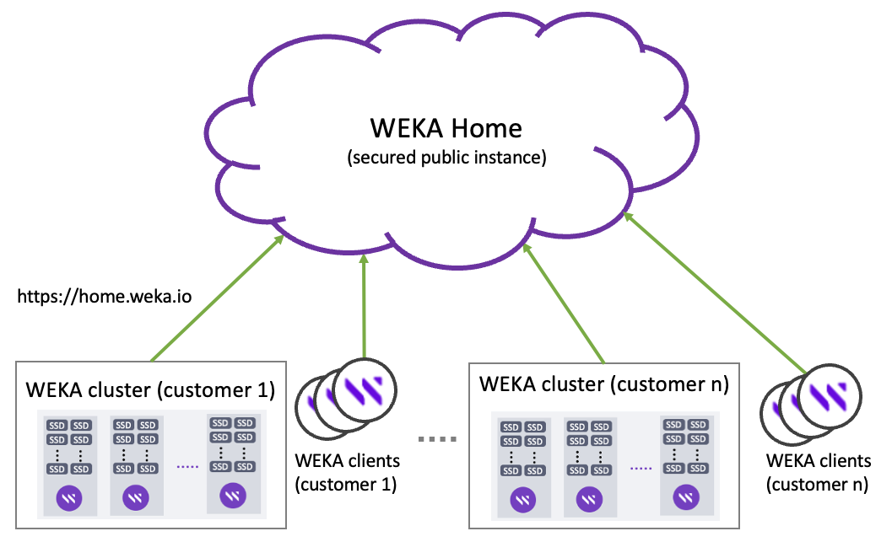

# WEKA Home - The WEKA support cloud

WEKA Home is a central cloud location that collects telemetry data, monitors, and keeps track of WEKA clusters in the field. This information is uploaded from customers' WEKA clusters and clients and is primarily used to improve the support process.

WEKA Home is intended for the Customer Success Team and is not accessible to customers directly. WEKA Home enables the Customer Success Team to provide proactive support when recognizing cluster irregularities, improving incident response time, and streamlining the troubleshooting process.

It is intended to be the first source of information to investigate a critical event or an issue in the field. Also, it provides insights into customer usage and behaviors to improve the WEKA product further.

Only licensed WEKA clusters are monitored through WEKA Home, with all telemetry data sent in an encrypted format to ensure security.&#x20;

WEKA Home provides the following main features:&#x20;

* Receive and store alerts, events, usage, analytics, statistics, and support diagnostics.
* Query cluster-wide events and statistics.
* Trigger events and alerts for a 24x7 support response.

In the WEKA Home portal, the Customer Success Team can view the cluster’s statistics, state of health, consolidated view of events, and diagnostics for various triaging activities. The team can offer a comprehensive 24x7x365 support view of all customer systems sending telemetry data.&#x20;

<figure><figcaption>
WEKA clusters and clients connected to WEKA Home
</figcaption></figure>

## Which information is uploaded to WEKA Home?

The WEKA cluster periodically and on-demand uploads various information types to Cloud WEKA Home. The retention period for all the following is 14 days. &#x20;

**Periodic uploads:**

* **Alerts:** Alerts indicate problematic ongoing states that are impacting the cluster. Alerts are uploaded immediately when a cluster container (host) creates an alert.
* **Events:** Events contain relevant information for the WEKA cluster and customer environment. Triggered by a customer or an environmental change, events can be informational, indicate an issue with the cluster, or a previously resolved issue. Events are uploaded immediately when a cluster container creates an event.
* **Statistics:** Statistics help analyze the WEKA system performance and determine the source of any issue. Statistics are uploaded every minute from each container.
* **Usage reports:**  Usage reports provide metrics for interface groups, containers, processes (nodes), drives, status, version, and filesystems. Usage reports are uploaded every minute.
* **Analytics:** Analytics provide metrics for the cluster, drives, filesystem settings, containers, network devices, nodes, protocols, and more. Analytics are uploaded every 30 minutes.

**On-demand uploads:**

* **Diagnostics (support files):** Uploaded on-demand from the container that collected the diagnostics.

## Upload information from the WEKA cluster to the WEKA Home

Uploading information to WEKA Home from the WEKA cluster backend servers and clients is essential for the Customer Success Team to provide practical assistance. If client connectivity cannot be configured, enabling upload information from the backend servers is still beneficial.

**Before you begin**

* Ensure the Cloud WEKA Home and Customer Success Team remote access ports are open. For details, see [#required-ports](../../install/prerequisites-and-compatibility.md#required-ports "mention").
* If the connection to the cloud WEKA Home is through a proxy, set the proxy by running the command: `weka cloud proxy --set <proxy_url>`.  Ensure that the proxy allow list includes the following two endpoints:
  * `api.home.weka.io`
  * `get.weka.io`

**Procedure**

1. To enable cloud notifications, run the `weka cloud enable` command (during the WEKA cluster installation, it is an optional step, which may be already done).
2. To upload diagnostics collected by the cluster, run the `weka diags upload` command.

**Related topics**

[list-of-alerts.md](../../usage/alerts/list-of-alerts.md "mention")

[list-of-events.md](../../usage/events/list-of-events.md "mention")

[list-of-statistics.md](../../usage/statistics/list-of-statistics.md "mention")

[#upload-diagnostics-to-weka-home](../../support/diagnostics-management/diagnostics-utility.md#upload-diagnostics-to-weka-home "mention")
