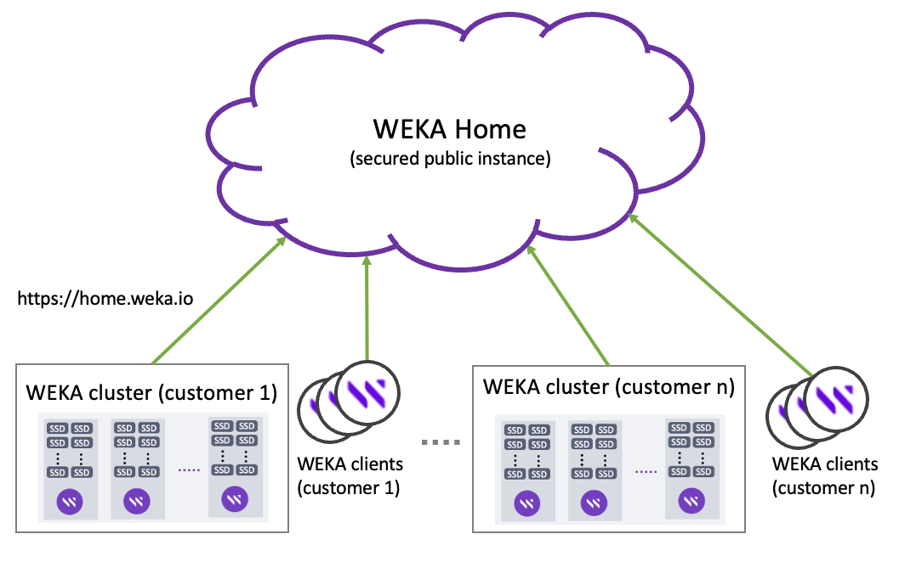

# WEKA Home - The WEKA support cloud

WEKA Home is a central cloud location that collects telemetry data, monitors, and keeps track of WEKA clusters in the field. This information is uploaded from customers' WEKA clusters and clients and is primarily used to improve the support process.

WEKA Home is intended for the Customer Success Team and is not accessible to customers directly. WEKA Home enables the Customer Success Team to provide proactive support when recognizing cluster irregularities, improving incident response time, and streamlining the troubleshooting process.

It is intended to be the first source of information to investigate a critical event or an issue in the field. Also, it provides insights into customer usage and behaviors to improve the WEKA product further.

Only licensed WEKA clusters are monitored through WEKA Home, with all telemetry data sent in an encrypted format to ensure security.&#x20;

WEKA Home provides the following main features:&#x20;

* Receive and store alerts, events, usage, analytics, statistics, and support diagnostics.
* Query cluster-wide events and statistics.
* Trigger events and alerts for a 24x7 support response.

In the WEKA Home portal, the Customer Success Team can view the cluster’s statistics, state of health, consolidated view of events, and diagnostics for various triaging activities. The team can offer a comprehensive 24x7x365 support view of all customer systems sending telemetry data.&#x20;

<figure><figcaption>
WEKA clusters and clients connected to WEKA Home
</figcaption></figure>

## Cloud WEKA Home data collection

Analyze cluster performance and health using data uploaded to Cloud WEKA Home.

#### Data upload types

The WEKA cluster uploads specific datasets to Cloud WEKA Home based on the following schedules:

* **Alerts:** Real-time indicators of issues affecting the cluster, triggered instantly by containers. No history is retained.
* **Events:** Records of environmental changes or cluster status updates. Containers upload events immediately. The retention is 30 days.
* **Statistics:** Performance metrics including IOPS, throughput, latency, metadata, and block size. Each container uploads a subset of available statistics every minute. The retention is 1 year during which the data resolution decreases over time to optimize storage. For example, while the system stores raw data for 14 days, it aggregates that data into 1-hour intervals after 180 days.
* **Usage Reports:** Metrics are available for interface groups, containers, processes, drives, status, version, and filesystems. Data uploads occur every minute, with a real-time display only (no history retention).
* **Analytics:** This system provides real-time configuration data for drives, filesystem settings, network devices, and protocols. Uploads occur every 30 minutes with no history retention.
* **Diagnostics (support files):** Uploaded **on-demand** from the container that collected the diagnostics. The retention is 1 year.

## Upload information from the WEKA cluster to WEKA Home

Uploading information to WEKA Home from the WEKA cluster backend servers and clients is essential for the Customer Success Team to provide practical assistance. If client connectivity cannot be configured, enabling upload information from the backend servers is still beneficial.

**Before you begin**

* Ensure the Cloud WEKA Home and Customer Success Team remote access ports are open. For details, see [#required-ports](../../planning-and-installation/prerequisites-and-compatibility.md#required-ports "mention").
* If the connection to the Cloud WEKA Home is through a proxy, set the proxy by running the command: `weka cloud proxy --set <proxy_url>`.&#x20;
* Ensure that the proxy allow list includes the following two endpoints:
  * `api.home.weka.io`
  * `get.weka.io`

**Procedure**

1. To enable cloud notifications, run the `weka cloud enable` command (during the WEKA cluster installation, it is an optional step, which may be already done).
2. To upload diagnostics collected by the cluster, run the `weka diags upload` command.

**Related topics**

[list-of-alerts-and-corrective-actions.md](../../operation-guide/alerts/list-of-alerts-and-corrective-actions.md "mention")

[events-list.md](../../operation-guide/events/events-list.md "mention")

[Broken link](/broken/pages/bMFgrKhsr9h4LXtSIuYo "mention")

[#upload-diagnostics-data-to-weka-home](../../support/diagnostics-management/diagnostics-utility.md#upload-diagnostics-data-to-weka-home "mention")
