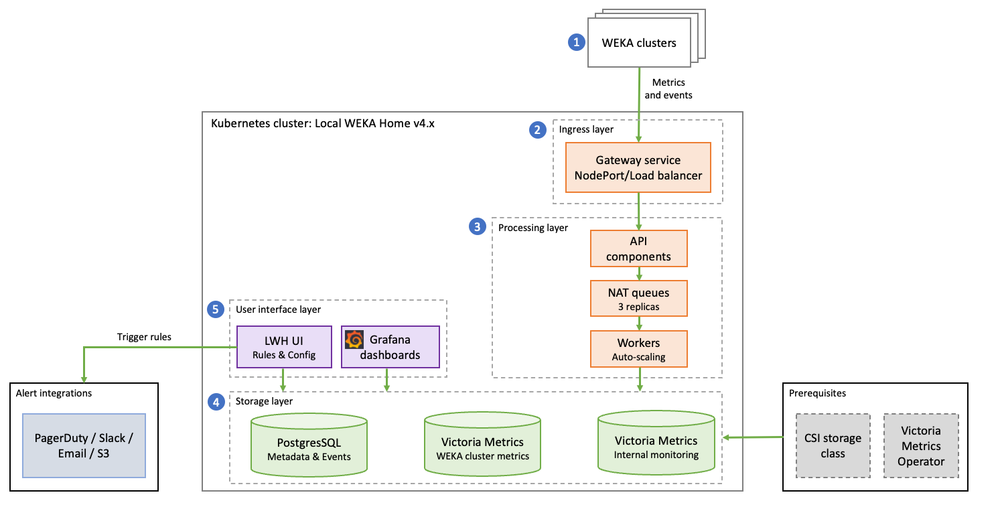

# Deploy Local WEKA Home on K8s

## Overview

The LWH deployment provides an on-premises observability and monitoring solution for WEKA clusters. Organizations use this model to operate within their own infrastructure instead of relying on the WEKA-hosted cloud service. Running on a K8s cluster offers enhanced scalability, resilience, and control over system resources and data.

Deploying LWH on K8s supports scale-out environments and large cluster configurations. This architecture leverages Kubernetes orchestration capabilities for high availability, automated recovery, and simplified lifecycle management of the LWH components.


Deployment on K8s is supported for LWH version 4.x and above.


The deployment is managed through a configuration file to ensure a consistent, reproducible, and upgradeable installation process.

## Solution architecture

The diagram below illustrates the overall solution architecture and how the core components interact within the Kubernetes (K8s) environment.

<div data-with-frame="true"><figure><figcaption><p>Local WEKA Home v4.x solution architecture</p></figcaption></figure></div>

### Architecture components

The LWH v4.x solution ingests data from registered WEKA clusters and processes it through the following layers:

1. **Data ingestion layer:** WEKA clusters send metrics, events, and alerts to LWH API endpoints.
2. **API and ingress layer:** Handles HTTP ingestion and routing. It supports multiple ingress controllers (ALB, Traefik, or Nginx) and can use an Envoy-based gateway service. API endpoints receive data and forward it to the persistent queue layer.
3. **Processing layer:** Uses NATS (persistent queues) for durable message storage and buffering. Worker services consume messages from these queues to process statistical data, events, and alerts.
4. **Storage layer:** Consists of specialized databases including a Postgres Database for metadata and a Victoria Metrics Cluster for raw time-series metrics. A secondary Victoria Metrics instance is used for internal application monitoring.
5. **User interface layer:** Provides a Grafana Dashboard for visualization and an LWH UI for managing rules and configurations.

### Data flow

1. WEKA clusters send statistics, events, and alerts to API endpoints.
2. API components authenticate and validate incoming data.
3. Data is ingested into NATS persistent queues for reliable buffering.
4. Worker services consume messages from queues and process them.
5. Processed data is written to the appropriate databases:
   * Metrics are stored in the Victoria Metrics Cluster.
   * Events, alerts, and cluster metadata are stored in the Postgres Database.
6. The rules engine evaluates conditions and triggers configured integrations.
7. Grafana queries the databases to provide visual health and performance data.

## Sizing and scaling guidelines

Determine the resource requirements and scaling behavior for a Local WEKA Home (LWH) deployment to ensure consistent performance across the platform.

#### **Scaling fundamentals**

The load on LWH scales linearly with the number of unique (`host_id`, `node_id`) metric pairs. These pairs represent the intersection of every monitored server and every active WEKA process.

* **Metric pair:** The primary unit of measure for stats processing capacity.
* **WEKA process:** Includes cores, backends, clients, and management processes. On average, a cluster generates metric pairs at a 1:1 ratio with its total process count.

#### **Deployment estimation**

For initial planning, use the following guidelines to ensure the stats workers can handle the ingestion and processing load with sufficient headroom.

* **Baseline capacity:** Supports up to 40,000 WEKA processes by default.
* **CPU core estimate:** Allocate approximately 2 CPU cores for every 1,000 WEKA processes.
* **Time series density:** Each process typically generates 2,000 unique time series.

For high stats throughput, use the detailed sizing formulas in [lwh-stats-sizing-and-performance-optimization.md](../lwh-stats-sizing-and-performance-optimization.md "mention").

#### Component scaling behavior

LWH components are pre-configured to handle standard production loads. Adjustments are only required when approaching the limits of the default installation.

<table data-header-hidden><thead><tr><th width="185.3636474609375">Component</th><th width="179.6363525390625">Default capacity</th><th>Scaling behavior</th></tr></thead><tbody><tr><td>API and Workers</td><td>100,000 processes</td><td>Scale dynamically based on load using Horizontal Pod Autoscaling (HPA).</td></tr><tr><td>VictoriaMetrics (VM)</td><td>80,000 processes</td><td>Operates as a stateful set. High loads may require manual adjustment of CPU, memory, or shard count.</td></tr><tr><td>NATS</td><td>100,000 processes</td><td>Managed through the STATS stream. Default limit is 3 GiB.</td></tr><tr><td>Postgres</td><td>N/A</td><td>Typically maintains low utilization. Relies on quick failover and fast CSI reattachment via the WEKA filesystem.</td></tr></tbody></table>

#### Key tuning parameters

While the defaults handle common loads, tune the following parameters for very large or small deployments:

* **VMCluster:** Adjust the CPU, memory, shard count, or capacity. You can reduce these resources for smaller deployments to save infrastructure costs.
* **Stats workers:** The default memory setting is 1 GiB. Processing statistics for approximately 40,000 processes requires approximately 40 CPU cores (hyperthreads).
* **Worker autoscaling:** To prevent the HPA from resetting during redeployments, set `workers.stats.autoscaling.minReplicas`  to match your calculated baseline usage.

## Prerequisites

Before installing the Local WEKA Home, ensure the environment meets the following requirements.

#### Storage

A CSI (Container Storage Interface) driver is required. The storage class must support sharing or moving volumes between nodes, such as the WEKA CSI driver or Amazon EBS.

#### VictoriaMetrics Operator

The VictoriaMetrics Operator needs to be installed separately before installing the Local WEKA Home chart.

This separate installation prevents issues during uninstallation, such as Custom Resource (CR) objects becoming stuck, which can occur if the operator is auto-installed as a chart dependency.

The required installation method is Helm. The Operator Lifecycle Manager (OLM) method is not supported (see VictoriaMetrics Operator note about [Setup chart repository](https://docs.victoriametrics.com/helm/victoria-metrics-operator/)).

**Procedure**

1.  Run the following Helm command to install the operator. This command:

    * Installs version `0.39.1`.
    * Creates and uses the `victoria-metrics` namespace.
    * Names the release `vmo`.

    ```bash
    helm install vmo vm/victoria-metrics-operator -n victoria-metrics \
    --debug --create-namespace --version 0.39.1
    ```

**Related information**

[VictoriaMetrics Operator official documentation](https://operatorhub.io/operator/victoriametrics-operator)

## Deployment workflow

1. **Configure Helm values:** Create a `values.yaml` file to customize your WEKA Home deployment.
2. **Install the LWH**: Follow one of the methods for deploying LWH on a Kubernetes environment: standard Helm installation or ArgoCD integration.
3. **Configure networking and access:** Set up ingress or gateway service access

### Configure Helm values

Create a `values.yaml` file to customize your WEKA Home deployment. This file overrides the chart's default settings.

The following example highlights common adjustments, particularly for specifying a WEKA storage class for persistent volumes and using `nodeSelector` to schedule pods onto specific nodes (such as those running WEKA clients).

Refer to the complete `values.yaml` file in the [WEKA Home Helm Chart repository](https://github.com/weka/gohome/blob/v4.4.0/charts/wekahome/values.yaml) for a full list of available parameters.

<details>

<summary><strong>Example <code>values.yaml</code></strong></summary>

```yaml
# -----------------------------------------------------------------
# VictoriaMetrics Components
# -----------------------------------------------------------------
vmstorage:
  # Use a WEKA filesystem storage class
  storageClassName: storageclass-wekafs-dir-api
  # Schedule pods to nodes with this label
  nodeSelector:
    "weka.io/supports-clients": "true"
  # Adjust resource requests and limits as needed
  resources:
    requests:
      memory: "16Gi" # Default is 16Gi
      cpu: 12         # Default is 4
    limits:
      memory: "32Gi"
      cpu: 16         # Default is 8

vmselect:
  storageClassName: storageclass-wekafs-dir-api
  nodeSelector:
    "weka.io/supports-clients": "true"

vminsert:
  nodeSelector:
    "weka.io/supports-clients": "true"

# -----------------------------------------------------------------
# VictoriaMetrics Monitoring Components
# -----------------------------------------------------------------
vmstorageMonitoring:
  enabled: true
  nodeSelector:
    "weka.io/supports-clients": "true"
  storageClassName: storageclass-wekafs-dir-api

vmselectMonitoring:
  nodeSelector:
    "weka.io/supports-clients": "true"
  storageClassName: storageclass-wekafs-dir-api

vminsertMonitoring:
  nodeSelector:
    "weka.io/supports-clients": "true"

# -----------------------------------------------------------------
# WEKA Home API and Workers
# -----------------------------------------------------------------
api:
  forwarding:
    enabled: true
    # url: "https://api.home.prod-us-east-1.weka.io"  # Default="https://api.home.weka.io"
  diagnostics:
    nodeSelector:
      "weka.io/supports-clients": "true"
    storage:
      filesystem:
        persistence:
          storageClass: storageclass-wekafs-dir-api
  stats:
     replicas: 1
     resources:
       requests:
         memory: 200Mi
         cpu: 200m
       limits:
         memory: 1000Mi
         cpu: 1000m
     autoscaling:
       enabled: true
       minReplicas: 1
       maxReplicas: 10
workers:
  stats:
    enabled: true
    replicas: 1
    resources:
      requests:
        memory: 200Mi
        cpu: 1000m
      limits:
        memory: 1000Mi
        cpu: 2000m
    autoscaling:
      enabled: true
      minReplicas: 1
      maxReplicas: 300
  forwarding:
    replicas: 1
    resources:
      requests:
        memory: "200Mi"
        cpu: 100m
      limits:
        memory: "400Mi"
        cpu: 500m
    autoscaling:
      enabled: true
      minReplicas: 1
      maxReplicas: 10

# -----------------------------------------------------------------
# NATS Jetstream Configuration
# -----------------------------------------------------------------
nats:
  config:
    jetstream:
      fileStore:
        pvc:
          storageClassName: storageclass-wekafs-dir-api
    resolver:
      pvc:
        storageClassName: storageclass-wekafs-dir-api
  podTemplate:
    merge:
      spec:
        nodeSelector:
          "weka.io/supports-clients": "true"

# -----------------------------------------------------------------
# Grafana Configuration
# -----------------------------------------------------------------
grafana:
  persistence:
    storageClassName: storageclass-wekafs-dir-api
  nodeSelector:
    "weka.io/supports-clients": "true"

# -----------------------------------------------------------------
# PostgreSQL Databases (Main, Support, Events)
# -----------------------------------------------------------------
maindb:
  primary:
    persistence:
      storageClass: storageclass-wekafs-dir-api
    nodeSelector:
      "weka.io/supports-clients": "true"

supportdb:
  primary:
    persistence:
      storageClass: storageclass-wekafs-dir-api
    nodeSelector:
      "weka.io/supports-clients": "true"

eventsdb:
  primary:
    persistence:
      storageClass: storageclass-wekafs-dir-api
    nodeSelector:
      "weka.io/supports-clients": "true"

# -----------------------------------------------------------------
# Monitoring Agents (Disabled)
# -----------------------------------------------------------------
vmagent:
  enabled: false

prometheus-node-exporter:
  # Setting a non-existent label ensures it doesn't run
  nodeSelector:
    "non-existing-label": "non-existing"
  enabled: false

# -----------------------------------------------------------------
# Gateway / Ingress Configuration
# -----------------------------------------------------------------
gateway:
  port: 8000
  # service:
  #   type: NodePort # Default is ClusterIP
  # nodePort: 30080
  
  # --- TLS Example ---
  # tls: true
  # tlsNodePort: 30443
  # secretName: "wekahome-gateway" # Must be pre-created by user
```

</details>

**Configure gateway TLS (Optional)**

If you enable TLS for the gateway (`gateway.tls: true`), you must manually create a Kubernetes secret containing your certificate and private key _before_ installing the chart. The `gateway.secretName` value in your `values.yaml` must match the name of this secret.

<details>

<summary>Example TLS secret manifest</summary>

Ensure the `cert.pem` and `key.pem` data fields contain your Base64-encoded certificate and key content.

```yaml
apiVersion: v1
kind: Secret
metadata:
  name: wekahome-gateway
  namespace: weka-home # Must be in the same namespace as your deployment
type: Opaque
data:
  cert.pem: (Base64-encoded certificate content)
  key.pem: (Base64-encoded private key content)
```

</details>

### Install the LWH

You can deploy LWH on a Kubernetes environment using two primary methods: standard Helm installation or ArgoCD integration. Each method differs in setup complexity, ingress handling, and lifecycle management.

<table><thead><tr><th width="168">Feature</th><th>Standard Helm Installation</th><th>ArgoCD Integration</th></tr></thead><tbody><tr><td>Method</td><td>Direct installation using Helm commands.</td><td>Integration with an ArgoCD application.</td></tr><tr><td>Requirements</td><td>Standard Helm CLI.</td><td>LWH v4.1.0-b40 or higher.</td></tr><tr><td>Configuration</td><td>Straightforward deployment.</td><td>Requires special handling for Helm hooks, secrets, and job lifecycle.</td></tr><tr><td>Secrets</td><td>Auto-generated during deployment.</td><td>Requires manual pre-creation of secrets.</td></tr><tr><td>Recommendation</td><td>Recommended for most standard deployments.</td><td>Suitable for environments managing applications using GitOps with ArgoCD.</td></tr></tbody></table>

#### Install the LWH using Helm

Use this procedure for a standard deployment of LWH using Helm commands.

The LWH Helm chart is publicly available on GitHub. The documentation on GitHub reflects the latest build. For a specific version, download the required `values.yaml` file directly.

**Procedure**

1.  Add the WEKA Home Helm repository:

    ```bash
    helm repo add wekahome https://weka.github.io/gohome/
    ```
2.  Run the Helm `upgrade` command to install or update the chart. Specify your namespace, the chart version, and the path to your customized `values.yaml` file.

    ```bash
    helm upgrade --create-namespace \
        --install wekahome wekahome/wekahome \
        --namespace weka-home \
        --version v4.2.4 \
        --values /path/to/values.yaml
    ```

#### Integrate the LWH with ArgoCD

Use this procedure to deploy LWH using ArgoCD.

ArgoCD integration requires version v4.1.0-b40 or higher. This method requires specific configuration adjustments because ArgoCD handles Helm charts differently than a standard Helm installation.

* **Helm hooks and jobs:** ArgoCD uses alternative hook annotations. Job TTL (Time-To-Live) requires special handling to avoid conflicts.
* **Secrets:** ArgoCD does not support the Helm `lookup` function. You must manually create all required secrets before deployment.
* **Ingress:** Ingress updates in ArgoCD can be slow. If you use a gateway service instead of ingress, disable the ingress resource to improve update speeds.
* **Dashboards:** LWH dashboards (starting from v4.1.0-b40) include an annotation (`argocd.argoproj.io/sync-options: Replace=true`) to manage ConfigMap size limits.

**Procedure**

1. Configure Helm values for ArgoCD In your `values.yaml` file, set the following parameters:
   * Set `generateSecrets: false` at the top level.
   *   To prevent conflicts with ArgoCD's job management, set the TTL for migration jobs:

       ```yaml
       jobs:
         dbMigrator:
           ttlSecondsAfterFinished: 0
         natsMigrator:
           ttlSecondsAfterFinished: 0
       ```
   *   (Optional) If you use a gateway service and not ingress, disable ingress creation:

       ```yaml
       ingress:
         # -- Enables ingress creation
         enabled: false
       ```
2.  Pre-create required secrets. Because ArgoCD does not support the Helm `lookup` function, you must create the secrets manually.

    You can use the following script as a template. Update the `NAMESPACE` and `ARGO_APP_NAME` variables to match your environment.

<details>

<summary>Creating secrets script template</summary>

```bash
# Helper: Generate an alphanumeric random string of given length
gen_random() {
  local len=$1
  # base64 gives ~1.33× bytes, so over-generate then trim
  openssl rand -base64 $((len * 2)) \
    | tr -dc 'A-Za-z0-9' \
    | head -c "$len"
  echo
}

export NAMESPACE="weka-home"
export ARGO_APP_NAME="weka-home-app" # Change this to your ArgoCD app name

export MAIN_DB_PASSWORD=$(gen_random 16)
export EVENTS_DB_PASSWORD=$(gen_random 16)
export SUPPORT_DB_PASSWORD=$(gen_random 16)
export WEKA_ADMIN_PASSWORD=$(gen_random 16)
export GRAFANA_PASSWORD=$(gen_random 16)

# 64-char alphanumeric
export JWT_KEY=$(gen_random 64)
export ENCRYPTION_KEY=$(gen_random 64)

kubectl create namespace "$NAMESPACE"

kubectl create secret generic --namespace "$NAMESPACE" wekahome-main-db-credentials \
  --from-literal=database=weka_home \
  --from-literal=hostname=${ARGO_APP_NAME}-maindb \
  --from-literal=password="$MAIN_DB_PASSWORD" \
  --from-literal=port="5432" \
  --from-literal=postgres-password="$MAIN_DB_PASSWORD" \
  --from-literal=postgres-username=postgres \
  --from-literal=postgresql-password="$MAIN_DB_PASSWORD" \
  --from-literal=postgresql-username=postgres \
  --from-literal=username=wekahome

kubectl create secret generic --namespace "$NAMESPACE" wekahome-events-db-credentials-0 \
  --from-literal=database=weka_home \
  --from-literal=hostname=${ARGO_APP_NAME}-eventsdb \
  --from-literal=password="$EVENTS_DB_PASSWORD" \
  --from-literal=port="5432" \
  --from-literal=postgres-password="$EVENTS_DB_PASSWORD" \
  --from-literal=postgres-username=postgres \
  --from-literal=postgresql-password="$EVENTS_DB_PASSWORD" \
  --from-literal=postgresql-username=postgres \
  --from-literal=username=wekahome

kubectl create secret generic --namespace "$NAMESPACE" wekahome-support-db-credentials \
  --from-literal=database=weka_home \
  --from-literal=hostname=${ARGO_APP_NAME}-supportdb \
  --from-literal=password="$SUPPORT_DB_PASSWORD" \
  --from-literal=port="5432" \
  --from-literal=postgres-password="$SUPPORT_DB_PASSWORD" \
  --from-literal=postgres-username=postgres \
  --from-literal=postgresql-password="$SUPPORT_DB_PASSWORD" \
  --from-literal=postgresql-username=postgres \
  --from-literal=username=wekahome

kubectl create secret generic --namespace "$NAMESPACE" "${ARGO_APP_NAME}-wekahome-jwt-key" \
  --from-literal=jwtKey="$JWT_KEY"

kubectl create secret generic --namespace "$NAMESPACE" "${ARGO_APP_NAME}-wekahome-admin-credentials" \
  --from-literal=adminPassword="$WEKA_ADMIN_PASSWORD" \
  --from-literal=adminUsername=admin

kubectl create secret generic --namespace "$NAMESPACE" "${ARGO_APP_NAME}-wekahome-encryption-key" \
  --from-literal=encryptionKey="$ENCRYPTION_KEY"

kubectl create secret generic --namespace "$NAMESPACE" wekahome-grafana-credentials \
  --from-literal=password="$GRAFANA_PASSWORD" \
  --from-literal=url="http://wekahome-grafana.$NAMESPACE.svc.cluster.local:3000/api/" \
  --from-literal=user=admin
```

</details>

3. Deploy the application Deploy the LWH Helm chart using your standard ArgoCD application definition. Ensure it references the `values.yaml` file you configured and uses the pre-created secrets.

<details>

<summary>Argo end-to-end example</summary>

```yaml
apiVersion: argoproj.io/v1alpha1
kind: Application
metadata:
  name: weka-home-e2e-app   # Name of the Argo CD application
  namespace: argocd         # Namespace where Argo CD is installed
spec:
  project: default          # Argo CD project (use 'default' if not using custom projects)
  source:
    repoURL: git@github.com:weka/k8s-contrib.git   # Repository URL
    targetRevision: main                           # Branch to track (main branch)
    path: e2e-setups/weka-home-k8s/argo-e2e/argo-chart   # Path to the chart within the repo
  destination:
    server: https://kubernetes.default.svc   # Deploy to the same cluster
    namespace: weka-home                       # Target namespace for the application
  syncPolicy:
    automated:
      prune: true       # Automatically delete resources that are no longer in the Git repository
      selfHeal: true    # Automatically sync if drift is detected

```

</details>

### Configure networking and access

Review the recommended methods for configuring network access to the LWH.

While WEKA Home supports various ingress controllers (such as ALB, Nginx, and Traefik), the simplest approaches are:

* **Use an Ingress Controller:** Wrap the `gateway` service with your cluster's standard ingress configuration, such as a VirtualService if you use `Istio`.
* **Use a NodePort:** Configure the service type as `NodePort`. This method is ideal for dedicated nodes that do not require an external load balancer.

## Upgrade Local WEKA Home

Use this procedure to upgrade an existing LWH deployment to a new version using Helm.

**Before you begin**

* Ensure you have the path to your customized `values.yaml` file.
* Identify the new chart version you want to upgrade to.

**Procedure**

1.  Update your local Helm repository to fetch the latest chart versions:

    ```bash
    helm repo update
    ```
2.  Run the `helm upgrade` command.

    * This command uses `--install` to upgrade the existing `wekahome` release.
    * Replace `<new-version>` with the specific chart version you are upgrading to.
    * Ensure the `--namespace` and `--values` flags point to your existing deployment's configuration.

    ```bash
    helm upgrade --create-namespace \
        --install wekahome wekahome/wekahome \
        --namespace weka-home \
        --version <new-version> \
        --values /path/to/values.yaml
    ```
