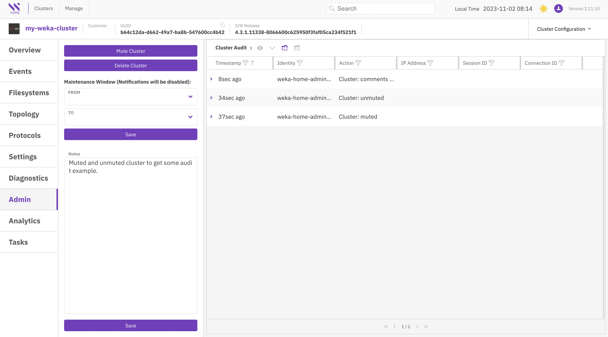
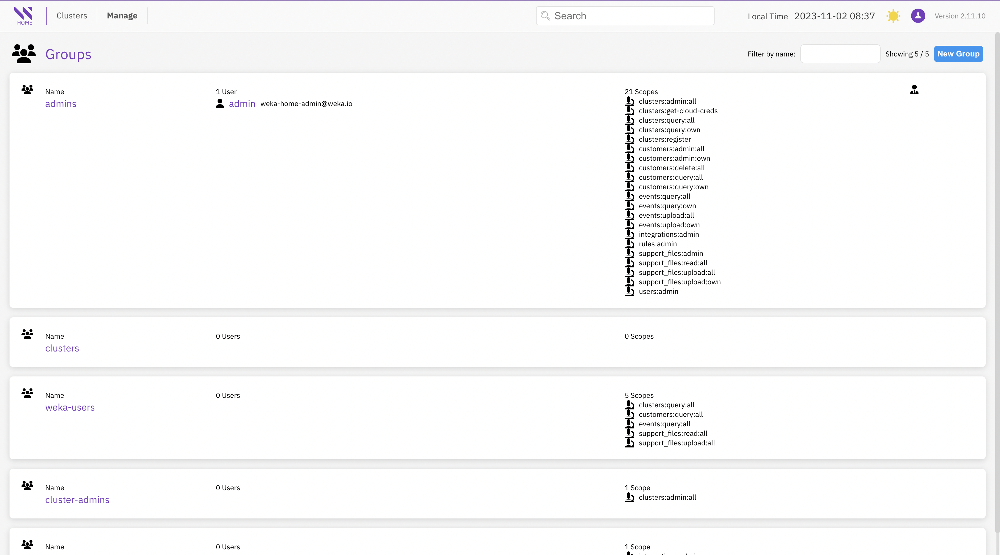
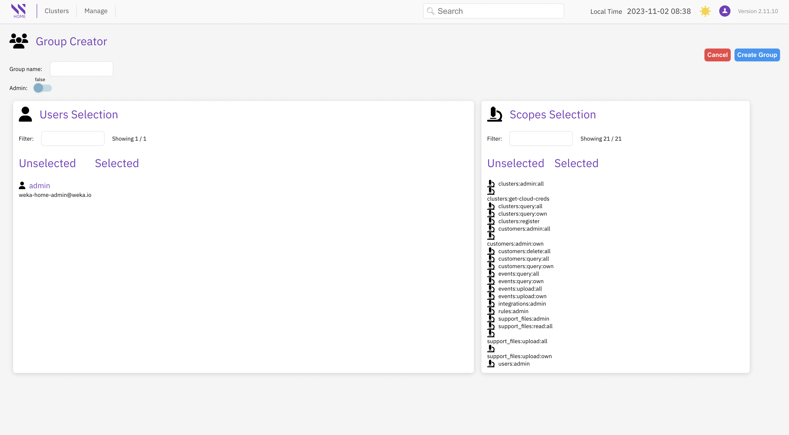

# Enforce security and compliance

## Cluster administration and audit

The Admin page provides a comprehensive set of administrative and audit features, all conveniently located in one place:

**Admin section:**

* **Mute Cluster:** Temporarily prevent the cluster from sending alerts or events to Local WEKA Home. Useful for mitigating alert overload during maintenance activities.
* **Delete Cluster:** Remove a legacy WEKA cluster from Local WEKA Home (without deleting the cluster itself).
* **Maintenance Window:** Set a specific time window when alert and event notifications (including email, SNMP, and PagerDuty alerts) won't be sent.

**Cluster Audit section:**

* **Cluster Audit:** Keep track of audited activities, including cluster muting/unmuting and maintenance window changes. Get a detailed history of when these actions were taken.

<figure><figcaption>
Admin and cluster audit page
</figcaption></figure>

## Users management

The Users page presents the current list of users who have login access to Local WEKA Home and provides the option to add new users. Authentication for access is done using a local username and password.

To open the Users page, from the menu, select **Manage > Users**.

<figure><figcaption>
Users page
</figcaption></figure>

### Modify a user password

Only the administrator can modify the passwords for users.

**Procedure**

1. From the menu, select **Manage > Users**.
2. Select the user to modify.
3. Select **Edit User** and modify the password.

### Delete a user

Only the administrator can delete the users.

**Procedure**

1. From the menu, select **Manage > Users**.
2. Select the user to delete.
3. Select **Delete User**.&#x20;

## Groups management

The Group Management page offers a comprehensive view of all groups, their respective members, and the scopes (roles) associated with each group's access or visibility within the Local WEKA Home.

A user can belong to multiple groups, and in such cases, the highest level of privileges from all groups is granted.

To open the Groups page, from the menu, select **Manage > Groups**.

<figure><figcaption>
Groups page
</figcaption></figure>

### Create a new group

You can create new groups as required and customize role-based access control (RBAC) scoping for each group.

<figure><figcaption>
Group Creator
</figcaption></figure>
