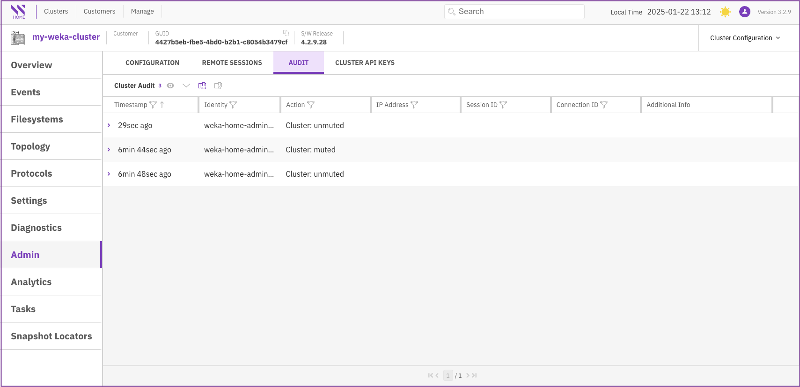
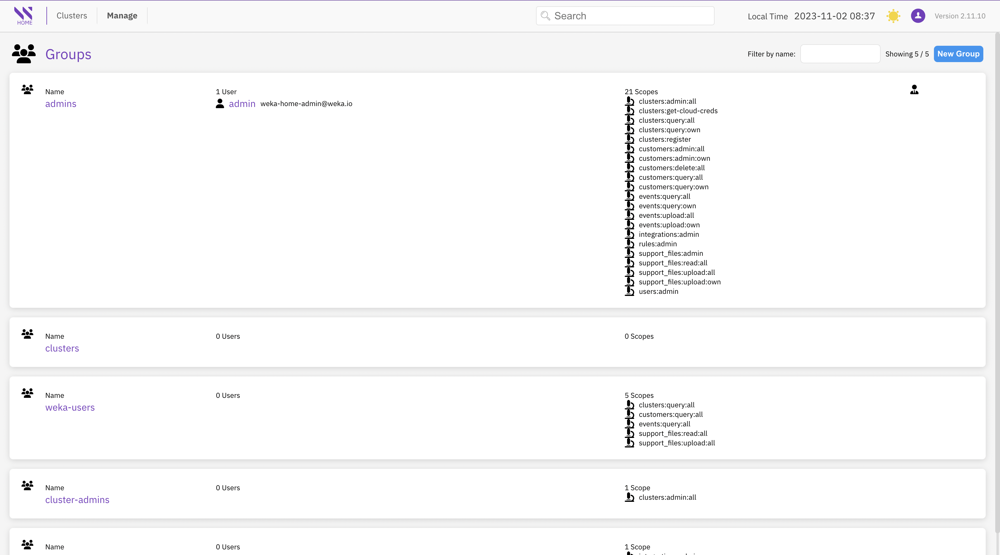
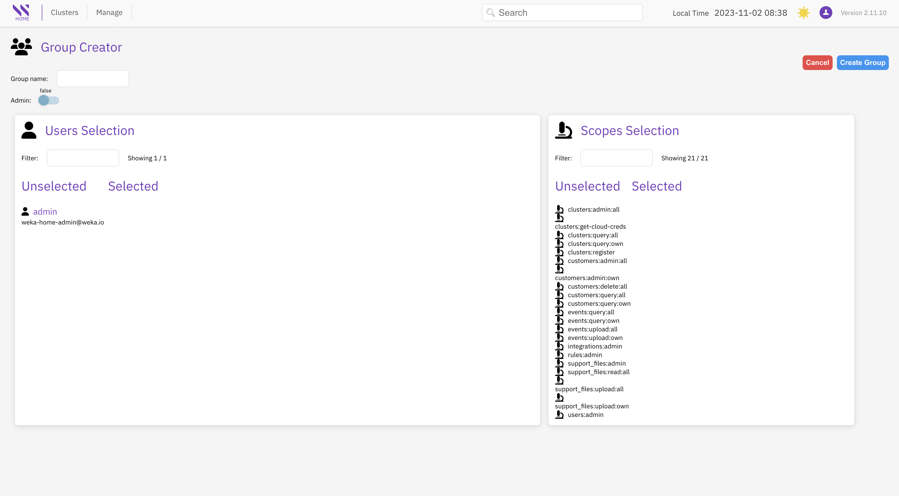

# Enforce security and compliance

## Cluster administration and audit

The Admin page provides a comprehensive set of administrative and audit features, all conveniently located in one place:

**Configuration section:**

* **Mute Cluster:** Temporarily disable alert and event notifications from the cluster to Local WEKA Home. This feature is useful for reducing alert noise during maintenance activities.
* **Delete Cluster:** Remove a legacy WEKA cluster from the Local WEKA Home without affecting the cluster itself.
* **Maintenance Window:** Define a specific time period during which alert and event notifications—such as email, SNMP, and PagerDuty alerts—are suppressed.
* **Freeze Cluster Retention:** Temporarily halt the data retention policy for a specified period.

**Cluster Audit section:**

* **Cluster Audit:** Monitor and maintain a detailed record of audited activities, including actions such as muting or unmuting clusters and modifying maintenance windows. Access a comprehensive history to track when these actions were performed.

<figure><figcaption>
Admin and cluster audit page
</figcaption></figure>

**Cluster API Keys section:**

* **Cluster API Keys**: Enable the creation of cluster-specific API keys to facilitate the use of the statistics export API for a designated cluster.

## Users management

The Users page presents the current list of users who have login access to Local WEKA Home and provides the option to add new users. Authentication for access is done using a local username and password.

To open the Users page, from the menu, select **Manage > Users**.

<figure><figcaption>
Users page
</figcaption></figure>

### Modify a user password

Only the administrator can modify the passwords for users.

**Procedure**

1. From the menu, select **Manage > Users**.
2. Select the user to modify.
3. Select **Edit User** and modify the password.

### Delete a user

Only the administrator can delete the users.

**Procedure**

1. From the menu, select **Manage > Users**.
2. Select the user to delete.
3. Select **Delete User**.&#x20;

## Groups management

The Group Management page offers a comprehensive view of all groups, their respective members, and the scopes (roles) associated with each group's access or visibility within the Local WEKA Home.

A user can belong to multiple groups, and in such cases, the highest level of privileges from all groups is granted.

To open the Groups page, from the menu, select **Manage > Groups**.

<figure><figcaption>
Groups page
</figcaption></figure>

### Create a new group

You can create new groups as required and customize role-based access control (RBAC) scoping for each group.

<figure><figcaption>
Group Creator
</figcaption></figure>
